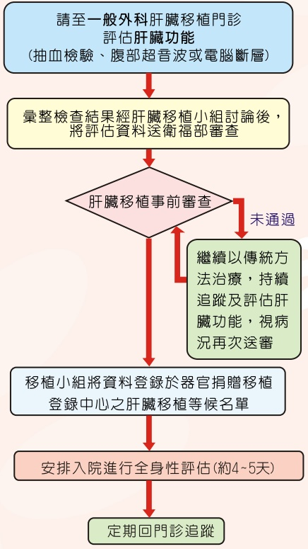

## 3. Explanation of Donation Surgery

The liver has regenerative capabilities. Generally, only 15-20% of a standard liver is needed to meet normal physiological demands. However, during donation surgery, the safety of the living donor must be prioritized, so at least 35% of the donor’s total liver volume must be preserved. The volume of liver donated in living liver donation is determined based on the recipient’s body weight. Typically, the donated volume is 0.8-1% of the recipient’s body weight. The choice of donation site varies depending on whether the recipient is an adult or a child and their body weight. The explanations are as follows:

Left lateral segment of the liver (about 15%)

Left lobe of the liver (about 35%)

## 4. Possible Complications of Liver Donation Surgery

Liver donation is a major surgery. According to literature statistics, the mortality rate for donors is 0.6-1%. Possible complications of this surgery include pleural effusion, intra-abdominal infection and peritonitis, bile leakage, intestinal adhesions, wound infection, etc. The overall incidence of these complications is about 10%. Most complications can be cured with medication, and only a very small number require further invasive treatment.

## 5. Postoperative Recovery and Follow-up

The total hospital stay for liver donation surgery is about 10 days. There will be a brief period of abnormal liver function after surgery, which usually returns to normal in about 2-3 weeks. After six months, the liver can regenerate to 90% of its original volume. Light work can be resumed one month after surgery, and weight-bearing work and vigorous activities can be resumed 3-4 months after surgery. Regular outpatient follow-up is still required after discharge.

## E-Da Hospital

Address: No. 1, Yida Road, Jiaosu Village, Yanchao District, Kaohsiung City

Phone: (07) 615-0011

Extensions: 5855, 5853, 5852

Website: http://www.edah.org.tw

## Living Liver Donor Preoperative Evaluation Process

## Introduction to Living Liver Donor Surgery

The first living liver donor surgery was performed nearly thirty years ago. According to the Ministry of Health and Welfare, the one-year survival rate after liver transplantation reaches 93%, and the five-year survival rate reaches 75%. Liver transplantation is a primary life-saving treatment when the liver suffers irreversible damage, but there is a severe shortage of liver donors. Therefore, living liver donation provides patients with another option.

## Liver Transplant Recipient Preoperative Evaluation Process

## I. Conditions Donors Must Meet

(1) Voluntary donation.

(2) Must be a relative within the fifth degree of kinship.

## (3) Must be at least 18 years old (written consent from a legal guardian is required).

(4) The spouse should have children with the liver donor or have been married for more than 2 years; however, if diagnosed by a physician with transplant indications after one year of marriage, this condition does not apply.

## II. Explanation of Fifth Degree of Kinship

