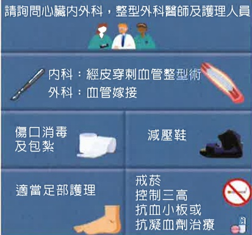
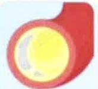

## 5. Surgical Treatment for Peripheral Artery Occlusion in the Lower Limbs

When medication cannot control the condition, doctors may recommend surgery to restore blood vessel patency. Surgery can be divided into two types:

1. Percutaneous Transluminal Angioplasty: (commonly known as balloon angioplasty) In this treatment, the doctor will puncture the skin at the groin or hand to perform the procedure. A catheter is inserted into the blood vessel, passed through the narrowed area, and inflated to expand the vessel, widening it and improving blood flow. The doctor will assess your blood vessel condition to decide whether a stent is needed to support the vessel. This surgery is performed under local anesthesia and has a quick recovery time.

2. Vascular Bypass Surgery: When the blood vessel blockage is too severe, it is necessary to replace the blocked vessel with your own blood vessel or an artificial blood vessel. This is the approach used in such cases.

## References

Peripheral Artery Disease | The Foundation to Advance Vascular Cures.

Peripheral Arterial Disease Treatment in Phoenix, AZ (veinandvascularaz.com).

Volume 149, Issue 24, 11 June 2024; Pages e1313-e1410 Figure 6. Components of Care for CLTI. (2024 American Heart Association Chronic Peripheral Artery Occlusion Treatment Guidelines)

## If you have any questions, please contact us. Wishing you a speedy recovery.

E-Da Hospital

Address: No. 1, Yida Road, Jiaosu Village, Yanchao District, Kaohsiung City

Phone: 07-6150011

E-Da Cancer Treatment Hospital

Address: No. 21, Yida Road, Jiaosu Village, Yanchao District, Kaohsiung City

Phone: 07-6150022

E-Da Dachang Hospital

Address: No. 305, Dachang 1st Road, Sanmin District, Kaohsiung City

Phone: 07-5599123

This work may not be reproduced, reprinted, or resold without the consent of the copyright owner.

Copyright owner: E-Da Medical Foundation

29.7×20cm Printed February 2025 New edition October 2024 HA-9-0129(1)

## Peripheral Artery Occlusive Disease

## 1. What is Peripheral Arterial Occlusive Disease?

Your blood vessels develop arteriosclerosis, causing the vessels to narrow, become blocked, and blood flow to be impeded.

Cross-section of blood vessel

Plaque reduces blood supply

Plaque completely blocks the blood vessel

## 2. What symptoms does Peripheral Arterial Occlusive Disease cause?

Exercise or climbing stairs can cause progressive muscle pain in the buttocks, thighs, or calves. As the disease worsens, symptoms progress from cold feet and numbness to intermittent claudication, and eventually to chronic non-healing wounds and tissue necrosis.

## 3. What tests are needed to determine if you have Peripheral Arterial Occlusive Disease?

1. Doppler blood flow test: Used to check the degree of arterial blood flow in the feet, providing a preliminary assessment of arterial narrowing or blockage.

2. Peripheral vascular ultrasound: An advanced color Doppler vascular ultrasound used to gain a deeper understanding of peripheral vascular conditions and serve as a basis for treatment.

3. Computed tomography angiography (CTA): A diagnostic tool combining X-rays and computer imaging. The examination takes about 15–20 minutes and can precisely display the blood vessels in the area.

4. Magnetic resonance imaging (MRI): A relatively new and accurate test that can clearly show the location of vascular blockages.

## 4. Precautions

1. No smoking (including secondhand smoke): Smoking is the greatest risk factor because nicotine causes arteriosclerosis, accelerates vascular spasms, and inhibits the formation of collateral circulation. Therefore, it must be absolutely avoided.

2. Treat diabetes and keep blood sugar within the ideal range.

3. Improve high blood lipid levels.

4. Control blood pressure.

5. Improve other systemic diseases such as coronary artery heart disease and cerebrovascular disease.

6. If BMI (weight ÷ height in meters squared) exceeds 25, weight loss is necessary.

7. Improve anemia and blood viscosity.

8. Pay attention to foot care, especially for diabetic patients. Wear appropriate shoes to avoid injury or wound infection.

9. Moderate exercise: Can increase collateral circulation.