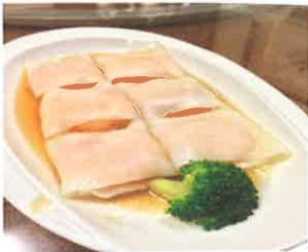
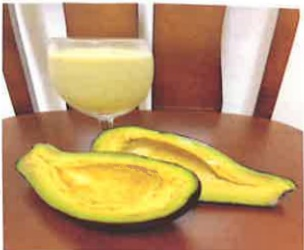
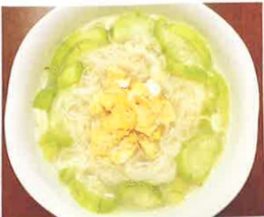

## Basic Information

|  |  |  |
|---|---|---|
| ♦ Name |  |  |
| ♦ Medical Record Number |  |  |
| ♦ Date of Birth | Year  Month  Day |  |
| ♦ Gender | ☐ Male  ☐ Female |  |
| ♦ Diagnosis |  |  |
| ♦ Primary Physician |  |  |
| Oncology Case Management Nurse | Name |  |
|  | Contact Information |  |

## Table of Contents

I. Understanding Chemotherapy and Managing Common Side Effects......1  
II. Introduction to Implantable Injection Ports (Port-A)......10  
III. Use of Fentanyl Transdermal Patch......12  
IV. Cancer Diet......17  
V. Common Side Effects of Chemotherapy Drugs......38  
VI. Personalized Chemotherapy Record......45  
VII. How to Record My Pain......47  
VIII. Understanding Chemotherapy Drug Extravasation......49## I. Understanding Chemotherapy and Common Side Effects Management

## I. Understanding Chemotherapy

## (1) Purpose of Chemotherapy

1. Treat cancer, even curing certain types of cancer.

2. Slow down cancer cell growth.

3. Prevent cancer cell spread.

4. Alleviate symptoms caused by cancer.

5. Improve patients' quality of life.

## (2) Mechanism of Action of Chemotherapy

Normal cells go through a regular life cycle from growth to death. When cells mutate or are exposed to carcinogens and accumulate sufficient genetic changes, they may become "cancer cells." Chemotherapy uses anticancer drugs to inhibit cancer cell division or interfere with their critical physiological processes, thereby eliminating cancer cells.

## (3) Where is Chemotherapy Administered?

1. Chemotherapy is generally administered in a chemotherapy room or ward via intravenous infusion.

2. It can also be taken orally at home or using a portable injection device.## (Four) How long is the chemotherapy regimen?

The duration and frequency of chemotherapy depend primarily on the type of tumor a patient has, as well as the pharmacological effects of the chemotherapeutic drugs and the patient's previous response to such drugs. Treatment may be administered daily, weekly, or monthly, but typically there is a rest period between treatments, allowing the body time to regenerate healthy new cells and regain strength.

## (Five) How effective is chemotherapy?

Various methods are used to assess the effectiveness of chemotherapy on patients, such as physical examinations, blood tests, CT scans, X-ray examinations, bone marrow tests, and biopsies.

## Two. Common side effects of chemotherapy and their management

## (One) Common side effects of chemotherapy

1. Nausea and vomiting  
2. Decreased blood cells and platelets  
3. Oral mucositis  
4. Hair loss  
5. Gastrointestinal symptoms (constipation, diarrhea)  

## (二) Common side effects of chemotherapy and their management

1. Nausea and vomiting

(1) Avoid aspiration; when lying down, adopt a sitting position or elevate the head.

(2) Eat small, frequent meals and chew food slowly. Avoid foods that produce gas, oily foods, or spicy foods to reduce nausea, vomiting, and abdominal discomfort.

(3) Nausea often occurs in the morning. Before getting up, consume some dry snacks such as toast, biscuits, or cereal.

(4) Encourage high-nutrition, high-calorie foods.

(5) Encourage fluid intake to prevent dehydration.

(6) Cool beverages such as juice, sports drinks, or soups can alleviate gastric discomfort and improve appetite.

(7) When experiencing dry mouth or soreness, place ice cubes or mint tablets in the mouth.

(8) After vomiting, rinse the mouth with plain water or lemon water to eliminate oral odor and reduce discomfort.

(9) Shift attention by listening to music, watching TV, or chatting with family members to alleviate nausea.

(10) For severe nausea and vomiting, administer antiemetics as prescribed by the doctor.### 2. Decreased blood cells and platelets

(1) Decreased white blood cells: Increased risk of infection.

A. Avoid consuming raw foods; all foods should be thoroughly cooked. If raw fruits are consumed, peel them first.

B. Use separate cutting boards and knives for raw and cooked foods; do not mix them. After each use, wash them with warm water and detergent.

C. Consume high-calorie, high-protein diets (unless there are dietary restrictions due to other medical conditions).

D. Wash hands frequently, minimize visits to public places, and wear a mask when necessary to reduce infection risk.

E. Maintain the integrity of the patient's skin and mucous membranes to reduce the risk of infection; men are advised to use electric razors when shaving to avoid cuts; avoid enemas, rectal suppositories, or other rectal procedures.

F. Keep the home environment simple; do not keep potted plants or fresh flowers indoors, as stagnant water, soil, and pollen can easily breed bacteria.

G. The doctor will take appropriate measures based on blood cell reports, such as administering granulocyte-stimulating hormone by injection if necessary.

(2) Anemia: Symptoms include fatigue, weakness, cold intolerance, dizziness, etc.

A. Get adequate rest, ensuring that nighttime sleep is not disturbed; short naps during the day are acceptable.

B. Change positions slowly to avoid dizziness.

C. Consume iron-rich foods such as animal organs, beef, egg yolks, dark green vegetables, dried beans, and nuts.

D. The doctor will take appropriate measures based on blood test results, such as blood transfusion if necessary.(3) Thrombocytopenia: May lead to bleeding such as bruising, gingival bleeding, prolonged menstrual periods, and prolonged coagulation time. In severe cases, it may even result in hematuria, bloody stools, or black stools.

A. Use a soft-bristled toothbrush to reduce damage to the gums and prevent bleeding.  
B. After defecation, take a warm sitz bath and gently wipe the perianal area.  
C. Avoid collisions and wear loose-fitting clothing.  
D. Do not take medications arbitrarily, especially aspirin and other pain relievers. Always consult a doctor before taking any medication.  
E. Gently blow your nose and avoid picking your nose. If nasal mucosa becomes dry and uncomfortable due to weather changes, apply a thin layer of petroleum jelly to keep it moist, or wear a mask to maintain moisture.  
F. Avoid any trauma to prevent bleeding that is difficult to stop.  
G. Seek medical attention immediately if there is abnormal bleeding.  
H. The doctor will manage the condition based on blood test results, and may administer platelet transfusion if necessary.

## (4) Oral mucositis

A. Develop the habit of brushing teeth after every meal. If oral ulcers occur, use a non-irritating toothpaste. Use a soft gauze ring around your finger or a cotton swab instead of a toothbrush to gently clean the mouth.  
B. Avoid wearing dentures.  
C. Avoid using irritating or alcohol-containing mouthwashes. It is recommended to rinse with normal saline every 2–4 hours. If oral ulcers are present, rinse every 1–2 hours.D. Drink plenty of water, carry a water bottle with you. If no disease limits it, consume at least 2500 ml of water daily, and maintain a balanced diet, especially supplementing with protein and vitamin C.

E. Avoid dry or coarse foods. When eating, mix food with soup to soften it. If oral ulcers are already present, eat small meals frequently and consume liquid foods. Also avoid acidic and irritating foods such as fried foods, spicy foods, smoking, or drinking alcohol.

F. Apply lip balm to keep lips moist and prevent cracking.

G. If experiencing dry mouth, drink beverages that stimulate saliva production, such as plum juice or lemon juice. Chewing sugar-free chewing gum (avoid if oral ulcers are present) or using saliva-stimulating toothpaste when brushing teeth may also help.

H. When oral ulcers cause pain, the following methods can help relieve discomfort:

$^{*}$ Hold ice cubes to reduce pain.

$^{*}$ Consume cold beverages such as milkshakes, ice cream, or ice pops, which can both relieve pain and provide calories.

$^{*}$ If necessary, use oral pain relief sprays or ask a doctor to prescribe a local anesthetic formulated into a mouthwash. Alternatively, consult a doctor for a topical ointment (Kenalog in orabase) to help alleviate pain.(5) Hair loss

A. Use a mild, non-irritating shampoo.  
B. Avoid chemical hair treatments, as well as excessive washing and blow-drying.  
C. Use a soft-bristled comb and avoid using hair rollers for styling.  
D. People with long hair can trim their hair to make it appear fuller and easier to manage.  
E. Use scarves, hats, or wigs to decorate and keep warm.

## (6) Gastrointestinal symptoms

A. Diarrhea  

(A) Pay attention to fluid and electrolyte replenishment. When experiencing diarrhea, you may appropriately consume sports drinks. In severe cases, intravenous infusion as prescribed by a doctor should be used for supplementation.  
(B) Eat small, frequent meals and choose low-fiber foods to avoid increasing intestinal motility and causing cramps, such as toast, white rice, noodles, fish, and skinless chicken. Avoid oily, spicy, and fried foods. If diarrhea is severe, switch to clear liquid diets, such as rice porridge or sports drinks.  
(C) Avoid foods that produce gas, such as leeks, legumes, dairy products, and dairy-based foods.  
(D) Diarrhea may lead to potassium loss; consume potassium-rich foods as needed, such as bananas, tangerines, oranges, and potatoes.  
(E) Observe the color, consistency, volume, and frequency of bowel movements. If the frequency is too high, it may cause discomfort at the anal opening. Therefore, after each bowel movement, clean with warm water and gently wipe.  
(F) If diarrhea does not improve, seek medical attention.### B. Constipation

(A) Drink at least 2,500 ml of water daily (including soup, juice, etc.) and consume fruits and vegetables.

(B) Consuming plum juice, red date juice, or plum juice can help promote bowel movements.

(C) Eat high-fiber foods such as whole grain bread, mixed grains, citrus fruits, bananas, pomelos, vegetable juice (unfiltered), and sweet potatoes.

(D) Warm sitz baths can be used; if necessary, consult a doctor to take soft laxatives or undergo enema treatment.

(E) Abdominal massage can enhance intestinal peristalsis. The steps are as follows:

Use your palm to perform circular massage in a clockwise direction on the abdomen to increase intestinal motility. Each session should last about 15–20 minutes. Perform this at the same time every day, ideally 30 minutes after breakfast (as shown in Figure 1).

Abdominal massage (Figure 1)(Three) If any of the following conditions occur, seek medical attention promptly:

1. Persistent bleeding or extensive bruising.

2. Appearance of red spots or other allergic reactions on the skin.

3. Fever (ear temperature exceeding 38.5°C), chills, or shivering; do not take fever-reducing medication arbitrarily. If needed, consult a doctor.

4. Ulceration or swelling at the injection site.

5. Any unusual pain.

6. Rapid breathing.

7. Severe diarrhea or constipation.

8. Hematuria or bloody stools.

9. Severe vomiting, unable to eat.

10. Severe oral inflammation or intense pain.

## Two. Introduction and Overview of the Implantable Injection Port (Port-A)

## 1. What is the Implantable Injection Port (Port-A):

Port-A (venous access implantable port, Port-A) is commonly known as an artificial vein. It is a synthetic silicone device composed of two parts: a spherical body and a catheter. It features an injection port and a catheter with a locking mechanism (Figure 1). The catheter is approximately 70 cm long (about 15–20 cm when implanted inside the body), and it runs from the subclavian vein through the superior vena cava to the upper part of the right atrium. The injection site is implanted into the subcutaneous tissue of the chest wall beneath the clavicle, thus not interfering with normal daily activities. It appears as a small bump, roughly the size of a 10-yuan coin (Figure 2).

(Figure 1)

(Figure 2)

## 2. How to Install the Implantable Injection Port (Port-A):

Generally, patients can be scheduled for inpatient or outpatient procedures under local or general anesthesia performed by a surgeon. A small incision of about 4–5 cm is made below the clavicle, through which the catheter is inserted into the central vein from a peripheral vein, and then the injection port is implanted beneath the skin.## Three: Why should a port-A device be implanted and what are its benefits?

Patients receiving long-term chemotherapy may experience vein thrombosis or hardening of the veins and skin, which increases the difficulty of injections and causes physical and psychological discomfort. If chemotherapy drugs leak accidentally, it may lead to local vascular and tissue necrosis.

The port-A device is specifically designed for patients requiring long-term and repeated drug administration. It eliminates the pain of repeated intravenous needle insertions, making it both safe and convenient. It can be used not only for drug injections or continuous infusion, but also for blood draws and laboratory testing. Additionally, blood products, nutrition, or other liquids can be administered through this device.

## Four: Daily self-care for the port-A device:

1. After surgery, a cosmetic adhesive will be applied to the wound and covered with sterile gauze. The cosmetic adhesive does not need to be changed—just let it naturally fall off. However, daily checks should be performed to monitor for signs of redness, swelling, heat, pain, or excessive discharge or bleeding, which may indicate infection. If any of these symptoms occur, the patient should immediately return to see a doctor for evaluation.

2. The doctor will schedule a follow-up appointment on the day of surgery. During the recovery period, bathing should be done using a wiping method. Only after the doctor evaluates and confirms wound healing can a shower be resumed.3. Activities are not restricted, but should avoid overly intense physical activities. For the arm on the same side as the artificial vascular graft, avoid full 360-degree rotation, lifting heavy objects, or direct impacts to prevent displacement of the graft.

4. If the artificial vascular graft is not in use, it is necessary to return for regular follow-up visits every 1 to 2 months or as advised by the doctor; after approval, visit the injection room to flush the catheter once with normal saline containing anticoagulant (heparin) to prevent catheter blockage.

5. Please pay attention to the blood return each time through the artificial vascular graft, as this provides important information for physicians or nurses to assess the function of the graft in the next visit.

## Three: Fentanyl Transdermal Patch

I. Chemical Name: Fentanyl

II. Drug Appearance / Trade Name / Chinese Name

|  |  |  |
|---|---|---|
|  |  |  |
| Durogesic D-Tans | Durogesic D-Trans | Painkyl |
| 12 μg/hr/patch | 25 μg/hr/patch | 200mcg/buccal soluble films |## Three: Function:

Opioid analgesics used to relieve pain caused by cancer and other diseases.

## Four: Usage Method: [Patch]

1. Choose an appropriate area, clean it with clean water, and dry it thoroughly.

2. Remove the Durogesic patch packaging and protective film. Apply the patch and press it firmly with your palm for 30 seconds to ensure it adheres completely to the skin, especially at the edges of the patch (if you are concerned about it falling off, use transparent tape to reinforce the left and right sides).

3. Wash your hands with plain water only; do not use soap or any other cleaning agents. Record the time when the patch is applied.

4. After removing the used Durogesic patch, fold it over and place it back into the original packaging. Record the exact time of removal. When you return for your next appointment, bring the patch along with the record sheet to the pharmacy.

## Fentanyl Transdermal Patch Prescription and Usage Record Form

Patch strength: □ 12μg/h □ 25μg/h □ 50μg/h  
Unit: ___  

Patient name: ___ / Patient ID: ___ / ☐ Male ☐ Female  

Date of birth: ___ / Identity number: ___ / ☐ Home use ☐ Inpatient use (bed number): ___

| 11th Period | Method and Dosage | Intravenous Hemolysis and Chemical Agent Use | Use of Flower Mirror | Concave Wavy Mirror | Side Foot Background | Description |
|-------------|-------------------|---------------------------------------------|----------------------|----------------------|------------------------|-------------|
|             |                   |                                             | Inner Upper Piece 100000 | Operator Quantity | Operator 100000 | Operator Quantity | Operator 100000 | Operator Quantity | Operator 100000 |
| 104         | 2PC ST            | XXX Currency MXXXXXXX                      | 1004 10:00           | XXX XXX              | 1007 10:00            | XXX XXX     | 1004 10:00       | 1007 10:00       | 1004 10:00       |
| 104         | 2PC QOD           | XXX Currency MXXXXXXX                      | 1007 10:00           | XXX XXX              |                        |             | 1004 10:00       | 1007 10:00       | 1004 10:00       |## Five. Precautions when using the patch:

1. The patch should be applied to the upper body (front chest, back, upper arm) or on the thigh in areas with sparse hair and flat surfaces, avoiding wounds, redness, or areas treated with radiation therapy.

2. The application site—must be completely dry.

For individuals with long hair: trim the hair as much as possible using scissors, but avoid shaving.

- If washing is required: wash with plain water only; do not use soap or other cleaning agents.

3. When replacing the patch, the application site must be changed.

4. The patch must not be cut or opened for use.

## [Oral Dissolving Patch]

(1) When using around-the-clock opioid medications to manage chronic pain, if sudden pain occurs (pain score > 4), the patch can be used.

(2) During the dissolution period, avoid moving the patch. It typically dissolves within 15–30 minutes; food can only be consumed after complete dissolution.

(3) Do not cut or tear the patch.

(4) Do not chew or swallow the patch.

(5) If using more than one patch: ◎ Do not stack the patches ◎ The patches can be placed on either side of the mouth.(6) There must be at least a 2-hour interval between doses, after which PAINKYL can be used to treat another episode of acute cancer pain.

(7) Do not open the package unless instructed to do so. Once opened, consume the entire PAINKYL tablet immediately.

(8) You must continue using your around-the-clock opioid analgesic.

## Six. Side Effects:

Dizziness, drowsiness, tremors, spasms of the pharynx and larynx, hypotension, restlessness, anxiety, arrhythmia, cerebellar symptoms, mental depression, hallucinations, nausea, vomiting, respiratory depression, suffocation, muscle rigidity, bradycardia, and other unpleasant conditions—please inform your doctor if any of these occur.

## Seven. Other Precautions:

1. In patients using Durogesic patches, drug absorption increases by approximately one-third when fever occurs; special attention should be paid to the occurrence of Durogesic toxicity.

2. Patients using Durogesic patches can bathe normally, but should avoid soaking in hot baths or exposing the patch directly to heat sources (such as hot water bags or electric blankets).

3. Do not alter the dose or discontinue use of the patch without a doctor's instruction.

4. Store in a dry place at room temperature, and keep out of reach of children.## IV. Cancer Diet

## I. Dietary Principles for Preventing Cancer:

1. Balanced nutrition to maintain a healthy body weight.

2. Adequate and appropriate fluid intake (recommended daily intake for adults: 30 milliliters per kilogram of body weight).

3. Increase consumption of high-fiber foods such as vegetables, fruits, whole grains, and dried beans to promote bowel movements.

4. Consume more foods rich in antioxidants, such as fresh dark green and deep yellow vegetables.

5. Reduce intake of high-fat and fried foods cooked at high temperatures.

6. Prefer fresh and natural foods; limit consumption of pickled, smoked, and grilled foods.

7. Avoid excessively hot or irritating foods.

8. Do not consume spoiled, expired, or foods with unusual odors.

9. Limit alcohol consumption.

10. Maintain a regular daily routine and healthy lifestyle.

## II. Discomfort due to illness or treatment affecting appetite and dietary improvement: Cancer Diet Series: Methods to Improve Appetite and Sample Menus

## (1) Changes in Taste Perception

## ★ Dietary Principles and Improvement Methods:

1. Avoid bitterness and strong flavors; use sweetness and sourness to enhance taste, such as sugar, lemon, or vinegar. Avoid bitter foods like mustard greens.

2. "My strong, your strong": Choose strongly flavored ingredients to season dishes, such as perilla, eight-cornered spice, shiitake mushrooms, onions, and cilantro, to enrich the flavor of food.

3. Cooking Tips: Before cooking meat, marinate it slightly with a little oil, juice, or wine.

4. Vary Cooking Methods: Enhance visual and olfactory stimulation.

## ★ Golden Chicken and Mushroom Stewed Rice

**Ingredients:**

- White rice: 1.5 cups  
- Chestnut pumpkin: 1/4 of a piece  
- Onion: 1/2 of a piece  
- Corn shoot: 5 pieces  
- Chicken leg pieces: 1 box  
- Hongxi mushrooms: 1/2 pack  
- Cheese slices: 1–2 slices  
- Garlic: 3 cloves  
- Salt: 1/4 teaspoon  
- Cold tap water (1): 1.5 cups  
- Cold tap water (2): 1 cup  

**Instructions:**

1. Soak white rice with an equal amount of cold water for 1–2 hours.

2. Cut 1/3 of the chestnut pumpkin into small cubes and 2/3 into thin strips.  
   Cut onion into small cubes, garlic into fine powder, Hongxi mushrooms into small cubes, and corn shoot into thin slices.

3. Heat a large spoon of oil in a pan, sauté the onion and garlic until fragrant, then add the corn shoot and stir-fry.

4. After the onion softens and turns semi-transparent, add the pumpkin and stir-fry.

5. Add the soaked rice along with its soaking water, then add the chicken pieces and Hongxi mushrooms, stir well, and cook slightly until the meat turns white.

6. Add one cup of cold tap water and salt, bring to a boil, then simmer on low heat for 10 minutes. Turn off the heat, add cheese slices and mix well. Let it rest covered for 5–10 minutes before serving.## ★Stewed Beef Soup

## 【Ingredients】

Beef shank 1000g, red radish 1 piece (about 350g), white radish 600g, onion 1 piece (about 400g), garlic 10 cloves, ginger slices 8 pieces, bay leaf 2 pieces, eight-cornered spice 2 pieces, Sichuan pepper 1 teaspoon, green scallions 2 stalks, salt to taste, rice wine 50 ml, water 1.5–2 liters.

## 【Instructions】

1. Wash the beef shank thoroughly. Cut the red and white radishes into large pieces, slice the onion in half, remove the outer skin of the garlic, and wash the green scallions before tying them up.

2. Prepare a pot with cold water (enough to cover the beef shank). Place the beef shank in the pot and boil over medium-high heat until it comes to a boil. Continue boiling for 3 more minutes, then turn off the heat, remove the beef shank, and rinse it under cold water to remove impurities.

3. Let the beef shank cool down until it is no longer hot, then cut it into slices or chunks.

4. Prepare a flavor pouch. Place ginger slices, bay leaf, eight-cornered spice, and Sichuan pepper into the pouch and seal the opening.

5. Place the beef shank, red and white radishes, onion, garlic, flavor pouch, green scallions, rice wine, and water (less water for a richer broth, more water for a lighter broth) into a deep pot. Put the pot into a rice cooker, place two cups of water in the outer pot, turn on the power, and let it cook until the power indicator light turns off. Then, add two more cups of water and continue cooking.

6. Remove the flavor pouch and green scallions before serving. Add salt to taste just before serving to complete the dish.## (二) Nausea and Vomiting

## ★ Dietary Principles and Improvement Methods:

1. Lighter foods, such as sponge cake and clear liquids; cool beverages can alleviate symptoms.

2. Avoid drinking liquid foods 30–60 minutes before meals; drink small amounts through a straw.

3. Eat small, frequent meals and avoid overly sweet or greasy foods.

4. Consume dry foods (such as biscuits or toast) before getting up or before exercise to suppress symptoms.

5. Do not eat immediately after exercise.

6. Avoid eating for 2 hours before receiving chemotherapy or radiotherapy.

7. Pay attention to the balance of water and electrolytes.

## ★ Steamed Sea Bass

【Ingredients】

1 sea bass,适量 ginger slices and scallion slices, a small amount of rice wine, 1/2 teaspoon of salt, 1 tablespoon of oyster sauce.

【Method】

1. Remove the gills and internal organs from the sea bass, wash thoroughly, pat dry with a towel, make two incisions on the fish body, and season with salt.

2. Place the sea bass into a bowl with ginger slices and scallion segments, pour in rice wine and oyster sauce. Place a steaming tray into a wok, add water, and place the sea bass into the wok.

3. Cover the wok with a lid, first turn the heat to medium until the water boils, then reduce to low heat and steam for 10 minutes before serving.## ★Shanghai-style Rice with Greens

## 【Ingredients】

5 stems of Qingjiang greens, 120g lean pork ground meat, 2 cups of white rice, 8 stems of shiitake mushrooms, 4 garlic cloves, 1 piece of ginger, 2 cups of chicken broth,适量 oil,适量 salt, 1 tablespoon soy sauce.

## 【Method】

1. Wash the Qingjiang greens, separate the leaves from the stems and cut into pieces; chop the shiitake stems into small pieces; finely chop the garlic and ginger for later use.

2. Heat a pan over medium heat, add oil and sauté the garlic and ginger until fragrant.

3. Add the ground pork and stir-fry until it changes color and emits a meaty aroma; then add the shiitake stems and stir-fry briefly; add the green stem pieces and stir-fry evenly until well combined. Season with a suitable amount of salt and soy sauce.

4. Add the rinsed and drained white rice and stir-fry thoroughly to mix with the vegetables.

5. Pour in 2 cups of chicken broth, cover the pot and bring to a boil until white steam rises from the edge of the pot. Then reduce the heat and simmer for 15 minutes.

6. Open the lid, gently stir the rice to check its texture (if it's not soft enough, cover and continue cooking briefly). Add the remaining green leaves, stir well, then turn off the heat and cover to let it rest for 2 minutes.## ★ Rice Porridge with Job's Tears, Red Dates, and Carrots

## 【Ingredients】

Job's tears 1/3 cup, stock, hawthorn 10 g, job's tears 20 g, red dates 20 pieces, carrot half a piece.

## 【Method】

1. Rinse the job's tears and soak them in clean water; set aside.  
Grind the job's tears into a powder.

2. Wash the red dates and cut them open with a knife, removing the pits. Place the red dates and hawthorn into the stock and boil together.

3. Add the job's tears to the broth with the red dates and hawthorn, then stir in carrot slices and cook until the job's tears are fully cooked. Mix in the job's tears powder and stir well until evenly distributed. Serve immediately.

## (3) Loss of appetite, weight loss

## ★ Dietary principles and improvement methods:

1. Eat small meals frequently: Prioritize high-nutrient foods or supplements. Main meals should consist of solid foods, and liquid foods should be consumed as snacks.

2. Vary cooking methods: Change the color, aroma, and flavor of dishes every day.

3. Move before meals: Engage in moderate physical activity to stimulate appetite.

4. Nutrition warriors fighting off illness: Supplement nutrition, strive to eat, avoid skipping meals, and eat one bite at a time.

5. Create a pleasant dining environment.

6. Follow medical advice to take appetite-enhancing medications or supplement with appropriate vitamins and minerals.## ★ Herbed Roasted Chicken Thighs

## 【Ingredients】(for 4 people)

2 large chicken thighs.

【Marinade】

A pinch of rosemary, 1 tablespoon soy sauce, a pinch of salt, 1 teaspoon sugar, a little alcohol.

【Method】

1. Wash the large chicken thighs and cut them into pieces. Marinate them with the seasoning for 30 minutes.

2. Place the chicken pieces into a preheated oven and roast at $ 200^{\circ} $ C for 30 minutes.

## ★ Steamed Beef Ball

【Ingredients】

200g ground beef, 50g ground pork, 15g chopped cilantro, 15g chopped green onion, red chili strips (for decoration).

Seasoning A: 1 teaspoon salt, 2 tablespoons granulated sugar, 1/4 teaspoon white pepper powder, 2 tablespoons cornstarch, 100ml water.

Seasoning B: 1 tablespoon sesame oil.

【Method】

1. Mix all ingredients of Seasoning A and set aside.

2. Mix the ground beef until it becomes sticky, then gradually add Seasoning A and mix until all the moisture is absorbed.

3. Add the ground pork, chopped cilantro, chopped green onion, and sesame oil, mix well, and shape into balls.

4. Place the meat balls on a plate. Put half a cup of water in the outer pot of the electric cooker and steam until done. Decorate with red chili strips and serve.## (Four) Dry Mouth

## ★ Dietary Principles and Improvement Methods:

1. Chewing ice cubes, chewing sugar-free gum, drinking diluted tea, lemon juice, or high-calorie beverages.

2. Prepare food in a smoother, more slippery form, such as jellies, meat paste, or pudding. Eating food mixed with meat broth or meat stock can also help with swallowing.

3. Avoid foods with overly strong seasonings, such as excessively salty, concentrated, or spicy foods.

4. Avoid alcoholic beverages.

5. Rinse the mouth regularly, but do not overuse mouthwash to maintain oral moisture, prevent oral infections, and protect teeth.

6. Avoid breathing through the mouth; if necessary, use artificial saliva to reduce the sensation of dry mouth.

## ★ Green Mushroom and Small Fish Porridge

## 【Ingredients】

Spinach 1 bunch, eggs 2, mushrooms 6, small fish 1 box, onion 1/4 box, brown rice 1 cup, stock as needed, water as needed, salt a little, white pepper a little.

【Method】

1. Make the green jade mixture:

(1) Wash the spinach and keep only the leaves. Place the spinach and eggs into a blender and mix them thoroughly using a blending stick.

(2) Pour the spinach-egg mixture into a flat pan and stir continuously during the cooking process to prevent sticking. When the liquid has mostly evaporated, remove from heat.

2. Chop the onion and mushrooms into small pieces.

3. Heat a little oil in a pan, add the chopped onion and stir-fry lightly. Then add the mushrooms and continue stir-frying.

4. When the aroma is released, add the green jade mixture and small fish, and stir-fry briefly.

5. Add brown rice and an appropriate amount of stock or water. Cook until the desired consistency is reached. Season with salt and white pepper, then serve.## ★ Shrimp Roll Baozi

## 【Ingredients】

Baozi dough – 75g in-lai flour, 35g tawu flour, 300g water.

Shrimp and seasoning – 12 shrimp, 1 tsp salt, a pinch of white pepper, 1 tsp sesame oil, 1 egg white.

Sauce – a little light soy sauce, a little dark soy sauce, 1 tsp sesame oil, appropriate amount of water.

## 【Method】

1. Mix the baozi ingredients (in-lai flour, tawu flour, water) thoroughly.

2. Boil a large pot of water, then heat the steaming tray before pouring in 1/4 of the water. Cover the pot and steam for 3 minutes (this recipe serves four portions).

3. While waiting, prepare the sauce by mixing all sauce ingredients evenly.

4. After 3 minutes of steaming, open the lid and you will see a smooth, fully cooked baozi skin.

5. Remove the steaming tray, gently lift the edges with your hands, then carefully peel the baozi skin.

6. Place three shrimp on top and roll it up.

7. Place the steaming tray into a ceramic dish, then cover the pot and steam for about 8 minutes.

8. Remove from heat, pour on the sauce, and sprinkle with chopped green onions. Done.

## ★ Steamed Egg

【Ingredients】

2 eggs, 1 tsp garlic minced, appropriate amount of cold tap water, 1–2 tsp soy sauce.

【Method】

1. Beat two eggs in a bowl and stir them evenly with a spoon.

2. Add garlic and soy sauce, stir thoroughly. Try to avoid bubbles on the surface.

3. Along the rim of the bowl, slowly pour in cold water so that the water flows down the bowl wall into the egg mixture to prevent bubble formation. (The amount of water should be roughly equal to the egg mixture. More water results in a smoother, softer texture; less water makes it firmer. Adjust according to personal preference.)

4. Place the bowl into an electric steamer. Add one cup of water in the outer pot and steam for about 10–15 minutes.## ★ Yogurt Cup

## 【Ingredients】

Chia seeds 10g, mango 1 bowl, dragon fruit 1 bowl, yogurt 120g, fresh milk 50ml, corn cracker chips as needed (optional).

## 【Instructions】

1. Soak chia seeds in milk until they swell, then set aside.

2. Wash and peel the mango and dragon fruit, then mash them into smooth paste and set aside.

3. Choose a cup of appropriate size, and layer the ingredients in order: chia seeds → dragon fruit paste → yogurt → mango paste.

4. Sprinkle corn cracker chips according to personal preference and tolerance, and serve.

## (5) Oral Ulcers

## ★ Dietary Principles and Improvement Methods:

1. Avoid stimulating foods such as alcoholic beverages, carbonated drinks, lemon juice, heavily seasoned spices (e.g., chili powder, black pepper, curry powder), pickled foods, and rough or hard foods (e.g., fried chicken, raw salad).

2. Choose soft and tender foods or chop and finely slice food to facilitate swallowing.

3. Use thickening agents or mix food with meat juice or meat broth to aid swallowing.

4. Use a juicer to blend fruits into a smooth paste for easier swallowing.

5. Rinse the mouth frequently to remove food residue and bacteria, maintaining hygiene to promote wound healing.

6. Eat through a straw to avoid touching the ulcer.

7. Consume high-calorie, protein-rich foods to support wound healing.

8. Choose soft, finely textured foods to assist chewing and swallowing,  
such as fruit milk, cheese, yogurt, and commercially available nutritional products.## ★ Avocado Milk

## 【Ingredients】

1 avocado, 200 ml fresh milk, 1 pudding.

【Method】

1. Peel the avocado and cut it into small pieces for later use.

2. Place the avocado pieces and the other ingredients into a blender and blend for about 10 seconds, then pause, and continue blending for another 20 seconds.

## ★ Nutritional Ice Brick

【Ingredients】

1 can of commercial nutritional supplement (choose appropriately based on individual health conditions).

【Method】

1. Pour the nutritional supplement into an ice tray.

2. Place it in the freezer and freeze until completely solid, then it's ready.

## (Six) Dysphagia

★ Dietary principles and improvement methods:

1. Choose soft, finely chopped foods, and cook them with a thickening agent. Eating them alongside meat juice or meat broth can also help with swallowing.

2. Prepare meals using materials that increase food viscosity. For example: tapioca flour, sweet potato flour, or commercially available thickening agents.

3. Use liquid nutritional supplements or desserts such as pudding, brown rice milk, or noodle tea.

## ★ Rice Noodle Porridge

【Ingredients】

Red rice noodles 100g, shrimp paste 5g,  
soy sauce 25–30g, black vinegar 20g,  
salt to taste, dried kelp 1 large handful,  
red onion paste 2–2.5 spoons, water/stock 1000ml,  
sugar 1–1.5 spoons, white pepper powder to taste,  
tapioca water as needed.

【Seasonings】  
coriander to taste, garlic paste to taste, black vinegar to taste, salad oil 2 tablespoons.

## 【Preparation Method】

1. Boil a pot of hot water, add the red rice noodles and briefly blanch them to remove any off-flavors attached to the noodles. After removing them, drain the noodles and cut them into pieces (about 10 cm long) using scissors or a knife. Set them aside for later use.

2. Soak the shrimp paste in water and drain it. In a flat pan, heat oil, then sauté garlic and shrimp paste. Add water/stock.

3. Add soy sauce, black vinegar, white pepper powder, salt, red onion paste, and crushed dried kelp to the pan. Once the mixture boils, add tapioca water gradually to thicken (add in portions to avoid making it too thick accidentally).

4. Then pour in the blanched and cut red rice noodles (about 10 cm long) previously prepared. Stir gently at this stage to prevent the noodles from sticking to the pan.

5. When the porridge is ready, top it with coriander, minced garlic, and a drizzle of black vinegar. Serve immediately.## ★Caramel Pudding

## 【Ingredients】

Caramel: 10g + 20g water, 50g granulated sugar  
Pudding liquid: 100g granulated sugar, 1000ml fresh milk, 5 eggs.

## 【Method】

1. Prepare caramel: Add a small amount of water to granulated sugar,  

  

cook over low heat until the sugar forms a golden-brown color around the edges. Then, gently stir from the outside toward the center using a spoon to evenly distribute the color. Afterward, carefully add a small amount of water, mix well, and quickly pour it into the pudding molds.

Note: (1) Avoid excessive stirring during cooking.  
(2) When adding water twice during caramel preparation, pour it gently to avoid splashing.

2. Mix eggs thoroughly and add granulated sugar (A).

3. Heat the fresh milk over low heat until it is warm but not hot, then slowly pour it into (A) and mix well.

4. Pour into baking molds: Sieve (3) to remove impurities, then pour it into molds already containing caramel until about 9/10 full. Bake in a water bath at 150°C for approximately 50 minutes.

## (7) Stomach Burning Sensation

## ★Dietary Principles and Improvement Methods:

1. Avoid heavily seasoned, fried, and greasy foods.  
2. Eat small meals frequently.  
3. Drink a small amount of milk (about one cup), which can help alleviate symptoms.  
4. Take antacid medication as prescribed by a doctor.## ★ Pineapple Yogurt Fruit Salad

【Ingredients】

Yogurt 50 g, Pineapple 20 g, Apple 40 g, Banana 30 g, Small tomatoes 30 g.

【Method】

Wash and peel all fruits, remove seeds, slice them, and serve with a drizzle of hard yogurt.

## ★ Dried Tuna Tofu

【Ingredients】

Packaged tofu 100 g, Dried tuna flakes 2 g, Soy sauce paste 15 g, Chopped green onions 3 g.

【Method】

Place the tofu in an inverted position on a plate, pour soy sauce paste over it, then sprinkle with dried tuna flakes and chopped green onions.

## (Eight) Abdominal pain, abdominal cramps

## ★ Dietary principles and improvement methods:

1. Avoid eating coarse, high-fiber, gas-producing foods such as beans, onions, bok choy, leeks, broccoli, beer, milk, and carbonated drinks.

2. Avoid eating spicy foods or seasonings.

3. Eat small meals frequently; food temperature should not be too hot or too cold.

## ★ Egg and loofah noodle dish

## 【Ingredients】

Luffa 1 piece, noodle 1 bundle, ginger slices 1 tablespoon, eggs 2, salad oil 1 tablespoon, salt 1 teaspoon, sesame oil a little.

## 【Preparation method】

1. Peel the luffa and cut into pieces; slice the ginger; beat the eggs and set aside.

2. Heat a wok with 1 tablespoon of oil, pour in the egg mixture, and quickly stir-fry into small curdled egg pieces. Transfer them to a plate and set aside.

3. In the same wok, without adding more oil, add the luffa, pour in water to cover the luffa, add the egg curds from step 2, cover the wok, and steam for 3 minutes.

4. After the water has boiled, add the noodles and cook for about 2–3 minutes until the noodles are cooked through; add a little salt and ginger slices, mix well, then turn off the heat, and finally drizzle with a few drops of sesame oil.## ★ Sweet Potato Porridge

【Ingredients】

Sweet potato 50 g, white rice 60 g.

【Method】

1. Wash the sweet potato, peel it, and grate it.

2. Rinse the white rice, add water and sweet potato strands, then put them into a rice cooker and cook until done.

## (9) Diarrhea

★ Dietary principles and improvement methods:

1. Use low-fiber foods to reduce stool volume; elemental diet may be necessary if required.

2. Pay attention to fluid and electrolyte replenishment (sports drinks).

3. Choose foods high in potassium (clear meat broth, orange juice, tomato juice, bananas, potatoes).

4. Eat small, frequent meals.

5. If milk and dairy products worsen diarrhea, switch to lactose-free products.

6. Avoid excessive intake of fats, fried foods, or overly sweet foods.## ★Potato Pancake

## 【Ingredients】

Potato 320g, salad oil as needed, black pepper powder as needed, salt as needed.

## 【Method】

1. Peel the potato and grate it into thin strips. Soak the potato strips in cold water for 20 minutes.

2. Drain the water, then squeeze out the excess moisture from the potato strips by hand.

3. Heat a pan with a suitable amount of oil. When the oil is hot, add the potato strips and cook over medium-low heat for 12 minutes, then flip them over and cook for another 12 minutes until golden brown on both sides. Finally, season with salt and black pepper powder, and serve.

## (10) Bloating

## ★Dietary Principles and Improvement Methods:

Avoid foods that produce gas, coarse, and high-fiber foods, including:

1. Milk, legumes, or legume products.

2. Beverages, snacks, carbonated drinks, cola, chewing gum, mint, and mint products.

3. Vegetables and fruits: banana, leek, cauliflower, cabbage, lychee.

4. Nuts: peanut, almond, sesame seeds, cashew nuts, etc.

5. Onion, potato, milk, carbonated beverages, etc.

6. Eat small, frequent meals and engage in light physical activity or walking.

7. Avoid drinking large amounts of soup or beverages during meals. You may drink them 30–60 minutes before meals.

8. Chew food slowly and thoroughly during meals, and avoid talking to prevent swallowing excessive air.

9. Avoid smoking, alcohol, tea, coffee, spicy, cold, hard, brittle, overly sour or sweet, and fried foods.## ★ Stir-fried Chicken with Green Peppers

## 【Ingredients】

Chicken breast 350g, green pepper 100g, ginger paste 1/2 tsp, soy paste 1 tbsp, rice wine 1 tsp, cornstarch 1 tbsp, white pepper powder a pinch, salt to taste, salad oil as needed.

## 【Method】

1. Cut the chicken into large cubes and mix with ginger paste, rice wine, and soy paste.

2. Add 1 tbsp cornstarch and mix well.

3. Heat oil in a pan and sear the chicken on both sides until browned.

4. Add green peppers cut into julienne strips, pour in 1–2 tbsp water, cover and steam for about 3–5 minutes. (The softness of the green peppers will vary depending on the steaming time; adjust according to preference).

5. After steaming, season with a little salt and white pepper, and serve immediately.

## ★ Pumpkin Pancakes

## 【Ingredients】

Pumpkin 1 piece, carrot 2 pieces, eggs 3, green onions 2 stalks, all-purpose flour 1/4 cup, sweet potato flour 1 tsp, salt 1 tsp, white pepper powder 1 tsp, salad oil as needed.

## 【Method】

1. Peel and shred the pumpkin and carrots, set aside.

2. Add chopped green onions and eggs.

3. Season with 1 tsp salt and 1 tsp white pepper powder.

4. Add all-purpose flour and sweet potato flour, mix thoroughly. Set aside the prepared vegetable mixture.

5. Heat a non-stick pan and lightly coat it with oil. Use a spoon to pour the prepared vegetable mixture into the pan, and spread it evenly with a spatula.

6. Cook until golden brown on one side, flip over and continue cooking until the pancake is fully cooked. Serve when ready.## (Eleven) Constipation

## ★ Dietary Principles and Improvement Methods:

1. Choose high-fiber foods such as vegetables, fruits, and whole grains.

2. Drink sufficient water or liquid foods.

3. Keep a relaxed mindset, engage in moderate physical activity, and develop a good bowel habit.

## ★ Fermented Tofu Skin with Fresh Vegetables Roll

## 【Ingredients】

Tofu skin: 3 pieces, Green beans: 9–12 pieces, Carrot: half a root, Tapioca starch: a little, Salt: a little, Soy sauce: as needed, Salad oil: as needed.

## 【Preparation Method】

1. Cut the carrot into strips; stir-fry the carrot with a little oil, then season with a little salt.

2. Cut the green beans into appropriate lengths, blanch them, then remove and set aside.

3. One piece of tofu skin can wrap four rolls. Spread the tofu skin flat, place three green beans and a little carrot inside, roll it up (half of the tofu skin after cutting horizontally), and seal the edge with a little tapioca starch.

4. Heat a little oil, place the sealed edge down toward the bottom of the pan, and fry until slightly golden. Add an appropriate amount of soy sauce and water, bring to a boil, and cook until fully cooked.## ★ Comprehensive Juice

【Ingredients】

Banana 1 piece, small papaya half a piece,  
kiwi fruit 2 pieces, water 600ml  
(adjust according to personal preference).

## 【Method】

1. Wash all fruits, remove skins, and cut into pieces for later use.  
2. Place all fruits and water into a juicer and blend evenly. Done.

## (12) Anemia and Vitamin Deficiency

## ★ Dietary Principles and Improvement Methods:

Consume the following foods to achieve balanced nutrition:

1. High biological value proteins: fish, meat, eggs, dairy, and soy products (such as tofu, soybean paste).  
2. Iron-rich foods: beef, pork, black dates, raisins, salmon, liver, shellfish.  
3. Foods high in vitamin C: spinach, tomatoes, citrus fruits, lemons, pineapple, strawberries.  
4. Vitamin B12 sources: liver, meat, eggs, shellfish, cheese, etc.

5. Avoid tea and coffee as beverages, as they interfere with iron absorption.  
6. Recommend replacing them with fresh juice to enhance iron absorption.## ★ Red Bean and Purple Rice Porridge

## 【Ingredients】

Red beans: 1.5 cups, Purple rice: 1.5 cups, Brown sugar or black sugar: 70g.

## 【Method】

1. Wash the red beans thoroughly and add water to a pot. Bring to a boil, then turn off the heat.

2. Drain the hot water and immediately place the red beans in the refrigerator to cool.

3. Wash the purple rice and add it to the chilled red beans. Add approximately 9 cups of water to the pot (purple rice ×3 times, red beans ×3 times). If you prefer a more liquid consistency, use this ratio: purple rice ×4 times, red beans ×4 times.

4. Place 2 cups of water in the outer pot of an electric cooker. After cooking, let it sit covered for about 15 minutes.

5. Add brown sugar or black sugar to adjust the sweetness. Then add 1 cup of water to the electric cooker and continue cooking. After cooking, let it sit covered for another 15 minutes, and it's ready.

## ★ Spicy Oyster Stew with Tofu

## 【Ingredients】

Fresh oysters: 600g, Tofu: 1 box, Green onions: 3 pieces, Garlic: 4–5 cloves, Chili: 1 piece, Sugar: 1 tsp, Rice wine: 1 tbsp, Soy sauce: 2 tbsp, Salad oil: as needed.

## 【Method】

1. Clean the oysters thoroughly (if you're concerned about fishy smell, soak them in rice wine, soy sauce, and egg white for a while beforehand). Cut green onions into small pieces, cut tofu into small cubes, and chop garlic into fine powder.

2. Boil a pot of water until it reaches a boil, then turn off the heat. Add the fresh oysters and soak them for about one minute. Remove them and drain the water for later use.

3. Heat oil in a pan, add the white part of green onions, garlic powder, and chili to stir-fry until fragrant. Then add soy sauce and tofu, and cook over low heat until the flavors are well absorbed.

4. Finally, add the fresh oysters, rice wine, and green onion segments, stir-fry and mix evenly until thoroughly combined. Done.# V. Common Side Effects of Chemotherapy Drugs

| Generic Name | Brand Name / Chinese Name | Side Effects |
|-------------|---------------------------|-------------|
| Abiraterone | Zytiga 澤珂錠 | Abdominal distension, muscle discomfort, edema, hot flushes, diarrhea |
| Afatinib | Giotrif 妥復克膜衣錠 | Diarrhea, oral mucositis, rash, acne-like dermatitis, itching |
| Albumin-Bound Paclitaxel | Abraxane 亞伯杉注射劑 | Hair loss, bone marrow suppression, peripheral neuropathy, nausea, vomiting, ECG abnormalities, diarrhea, decreased appetite, liver function abnormalities |
| Alectinib | Alecensa 安立適膠囊 | Fatigue, constipation, edema, nausea, cough, rash |
| Anastrozole | Anazo 安納柔膜衣錠 | Gastrointestinal discomfort, hot flushes, weakness, headache, and other symptoms |
| Arsenic trioxide | Asadin 伸定注射劑 | Fatigue, nausea, vomiting, tachycardia, cough, shortness of breath |
| Asparaginase | Leunase 樂拿舒注射劑 | Rash, thrombocytopenia, fatty liver, anorexia, nausea, vomiting |
| Atezolizumab | Tecentriq 癌自禦 | Fatigue, decreased appetite, respiratory difficulty, cough, nausea |
| Axitinib | Inlyta 抑癌特膜衣錠 | Diarrhea, hypertension, fatigue, decreased appetite, nausea |
| Azacitidine | Vidaza 委丹札注射劑 | Nausea, vomiting, anemia, thrombocytopenia, leukopenia |
| Bendamustine | Innomustine 普癌汰 | Bone marrow suppression, infection, nausea, vomiting, infusion reaction |
| Bevacizumab | Avastin 癌思停注射劑 | Hypertension, hair loss, fatigue, nausea, vomiting, proteinuria, bone marrow suppression |
| Bicalutamide | Bicalutamide 必可多膜衣錠 | Nausea, vomiting, diarrhea, itching, hot flushes |
| Bleomycin | Bleocin 撲類惡 | Gastritis, oral mucositis, pigmentation, skin keratosis, interstitial pneumonia, pulmonary fibrosis |
V. Common Side Effects of Chemotherapy Drugs (Part II)

| Chemical Name | Brand Name / Chinese Name | Side Effects |
|--------------|---------------------------|-------------|
| Bortezomib | Velcade (Wanke Injection) | Loss of appetite, nausea, vomiting, joint pain, muscle pain |
| Capecitabine | Xeloda (Jie Tong Da Membrane-Coated Tablet) | Diarrhea, hand-foot syndrome, redness, oral mucositis, fatigue |
| Carboplatin | Kemocarb (Er Ding Kang Injection) | Hair loss, abdominal pain, ototoxicity, vomiting, nausea, pain, bone marrow suppression, electrolyte loss (sodium, potassium, calcium, magnesium) |
| Ceritinib | Zykadia (Likuai Cancer Capsule) | Fatigue, nausea, vomiting, diarrhea, anemia, hepatotoxicity, skin rash |
| Cetuximab | Erbitux (Erbidex Injection) | Fatigue, peripheral neuropathy, skin peeling, rash, skin rash, nausea, vomiting, gastrointestinal discomfort |
| Chlorambucil | Leukeran (Tumor Ning Tablet) | May cause gastrointestinal discomfort and oral ulcers |
| Cisplatin | Kemoplat (Ke Mo Anti-Cancer Injection) | Kidney damage, tinnitus, high-frequency hearing loss, peripheral neuropathy |
| Crizotinib | Xalkori (Jie Ke Tong Capsule) | Visual disorders, vomiting, nausea, diarrhea, constipation |
| Cyclophosphamide | Endoxan (Kan De Xing) | Hair loss, menopause, hemorrhagic cystitis, bone marrow suppression, diarrhea, vomiting, nausea |
| Cyproterone | Androcur (An De Ka Tablet) | Anemia, hepatotoxicity, breast swelling, fatigue, weight changes |
| Cytarabine | Cytosar (Sai Desa Injection) | Bone marrow suppression, skin rash, hyperuricemia, hair loss, mucositis, anemia, decreased liver function, fever |
| Dacarbazine | Dacarbazine (Da Ka Ba Ren Injection) | Pain and burning at injection site, loss of appetite, nausea, vomiting, diarrhea, anemia, bone marrow suppression, hepatotoxicity, flu-like symptoms |
| Dasatinib | Sprycel (Bai Lei Membrane-Coated Tablet) | Abdominal pain, diarrhea, nausea, vomiting, bone marrow suppression, fluid retention, muscle pain |# Five: Common Side Effects of Chemotherapy Drugs (Part II)

| Generic Name       | Brand Name / Chinese Name           | Side Effects                                                                 |
|--------------------|-------------------------------------|------------------------------------------------------------------------------|
| Docetaxel          | Nolbaxol Huikai Injection          | Hair loss, neurotoxicity, fluid retention, gastritis, diarrhea, nausea, vomiting |
| Doxorubicin (Crystal) | Adriblastina Aihui Suan Injection | Cardiac toxicity, hair loss, fluid discoloration, rash, sensory disturbance, hyperuricemia |
| Enzalutamide       | Xtandi Ankatan Soft Capsule        | Fatigue, hot flashes, back pain, constipation, diarrhea                   |
| Epirubicin         | Pharmorubicin Fan Aihui           | Cardiac toxicity, hair loss, bone marrow suppression, hot flashes, nausea, vomiting |
| Erlotinib          | Tarceva Deshuan Tablet            | Rash, diarrhea, loss of appetite, nausea, vomiting                        |
| Estramustine       | Estracyt Yikai Capsule            | Nausea, vomiting, edema, respiratory difficulty, fluid retention           |
| Etoposide          | Fytosid Anketo Intravenous Injection | Bone marrow suppression, vomiting, nausea, hair loss, leukopenia           |
| Etoposide          | Vepesid Mibitong Soft Capsule     | Bone marrow suppression, vomiting, nausea, hair loss, leukopenia           |
| Everolimus         | Afinitor Anfu Tuo Tablet          | Gastritis, infection, weakness, fatigue, cough, diarrhea                   |
| Exemestane         | Aromasin Nuomansu Coated Tablet   | Hot flashes, nausea, vomiting, decreased appetite                         |
| Fludarabine        | Fludara Fuda Le Intravenous Cryo Injection | Infection, leukopenia, cough, nausea, vomiting, fever, fatigue             |
| Fluorouracil       | 5-FU Haofu Injection              | Hair loss, nail loss, hand-foot syndrome, rash, pruritus, photosensitivity, diarrhea, decreased appetite, nausea, vomiting, oral mucositis, headache |
| Gefitinib          | Iressa Ailisha Coated Tablet      | Diarrhea, rash, skin dryness and facial flushing                          |
V. Common Side Effects of Chemotherapy Drugs (Part III)

| Chemical Name | Brand Name / Chinese Name | Side Effects |
|--------------|---------------------------|-------------|
| Gemcitabine | Gemmis Jian Shi Injection | Bone marrow suppression, nausea, vomiting, proteinuria, liver function abnormalities |
| Hydroxyurea | Hydrea Ai Zhi Capsules | Fever, decreased blood cell counts, gastrointestinal discomfort, rash, fatigue, drowsiness |
| Idarubicin | Zavedos Ai Da Hui Su Injection, Ai Da Hui Su Capsules | Bone marrow suppression, cardiotoxicity, hepatotoxicity, gastritis, nausea, vomiting |
| Ifosfamide | Holoxan Hao Ke Ai Injection | Bone marrow suppression, hair loss, nausea, vomiting, hematuria |
| Imatinib | Leevk Li Fu Anti-coating Tablets | Headache, gastrointestinal discomfort, edema, fatigue |
| Ipilimumab | Yervoy Yi Fu Injection | Fatigue, diarrhea, itching, rash, colitis |
| Irinotecan | Innocan An Ke Yi | Bone marrow suppression, diarrhea, nausea, vomiting, abdominal cramps, hair loss, mucositis |
| Lapatinib | Tykerb Tai Jia Tablets | Diarrhea, nausea, vomiting, liver function abnormalities, hand-foot syndrome |
| Lenalidomide | Revlimid Rui Fu Mei Capsules | Thrombocytopenia, neutropenia, diarrhea, fatigue, itching |
| Letrozole | Femara Fu Lu Na Tablets | Hot flashes, nausea, fatigue, headache, dizziness |
| Megestrol | Megejohn Mei Ya Xiang Tablets | Weight gain, nausea, vomiting, rash |
| Melphalan | Alkeran Wei Ke Wan Tablets | Leukopenia, thrombocytopenia, nausea, vomiting |
| Mercaptopurine (6-MP) | Merkaptopurine Mei Ke Duo Neng Tablets | Bone marrow suppression, nausea, vomiting, hyperuricemia, hepatotoxicity |
V. Common Side Effects of Chemotherapy Drugs (Part Four)

| Generic Name           | Brand Name / Chinese Name                                 | Side Effects                                                                 |
|------------------------|-----------------------------------------------------------|------------------------------------------------------------------------------|
| Methotrexate           | Methotrexate Yingshou Qudeng Injection, Zhi Shan Tablet  | Oral and pharyngeal inflammation, diarrhea, nausea, vomiting, elevated liver enzymes, bone marrow suppression, rash, renal damage |
| Mitomycin-C            | Mitomycin-C Paimo Cancer Injection                       | Bone marrow suppression, petechiae, loss of appetite, nausea, vomiting       |
| Mitoxantrone           | Mitoxantrone Shuang Shang Chong You Kun Injection        | Bone marrow suppression, infection, fever, pain, fatigue, headache, hair loss, nausea, vomiting, diarrhea, loss of appetite |
| Nilotinib              | Tasigna Tai Xi An Capsule                                | Skin rash, itching, headache, nausea, dizziness                          |
| Nivolumab              | Opdivo Ba Ji Fu                                         | Fatigue, decreased appetite, low sodium, respiratory difficulty, skeletal muscle pain, electrolyte abnormalities, diarrhea |
| Oxaliplatin            | Oxalip Oulip Injection                                  | Peripheral neuropathy, fatigue, bone marrow suppression, nausea, vomiting, diarrhea, hepatotoxicity |
| Paclitaxel             | Anzatax An Sha Des                                    | Peripheral neuropathy, ECG abnormalities, bone marrow suppression, hair loss, nausea, vomiting, diarrhea, joint pain |
| Palbociclib            | Ibrance Ai Lai Shi Capsule                              | Bone marrow suppression, infection, fatigue, nausea, vomiting, diarrhea, rash |
| Panitumumab            | Vectibix Wei Bi Shi Injection                          | Diarrhea, nausea, fatigue, rash, cutaneous inflammation                   |
| Pazopanib              | Votrient Fu Tui Cancer Film Capsule                     | Diarrhea, hypertension, hair color change, nausea, loss of appetite        |
| Pegylated liposomal doxorubicin | Lipo-Dox Li De Microsomal Injection               | Hand-foot syndrome, rash, nausea, gastritis, bone marrow suppression       |
| Pembrolizumab          | Keytruda Ji Shu Da Frozen Injection                    | Fatigue, hyperglycemia, anemia, lymphocyte reduction                      |
| Pemetrexed             | Alimta Ai Ning Da Injection                            | Constipation, diarrhea, decreased appetite, nausea, vomiting, oral and pharyngeal inflammation, bone marrow suppression, fatigue, rash |# Five: Common Side Effects of Chemotherapy Drugs (Part Five)

| Generic Name | Brand Name / Chinese Name | Side Effects |
|-------------|---------------------------|-------------|
| Pertuzumab | Perjeta 贺疾妥注射液 | Diarrhea, hair loss, neutropenia, nausea, vomiting |
| Polysaccharide-K | Krestin 克速鎮粉劑 | Diarrhea, nausea, vomiting, flatulence, loss of appetite |
| Pomalidomide | Pomalyst 鉑美特膠囊 | Fatigue, leukopenia, anemia, upper respiratory infection, nausea |
| Ramucirumab | Cyramza 欣銳擇注射劑 | Hypertension, proteinuria, infusion reaction, diarrhea, anemia |
| Regorafenib | Stivarga 癌瑞格膜衣錠 | Fatigue, decreased appetite, hand-foot skin reactions, diarrhea, hypertension |
| Rituximab | Mabthera 莫須瘤注射劑 | Peripheral edema, fatigue, chills, neuropathy, rash, hypertension |
| Sorafenib | Nexavar 蕾莎瓦膜衣錠 | Skin toxicity (numbness, tingling, pain, painless swelling, rash/peeling), diarrhea, nausea, fatigue, respiratory difficulty |
| Sunitinib | Sutent 紓癌特 | Nausea, vomiting, diarrhea, constipation, fatigue, fever, mucositis/oral mucositis, hypertension, rash, hand-foot syndrome, taste alteration, joint pain |
| Tamoxifen | Nolvadex 諾瓦得士錠 | Hot flashes, vaginal bleeding, itching of the vulva, gastrointestinal discomfort, dizziness, headache, fluid retention, hair loss |
| Tegafur+uracil | Ufur 友復膠囊 | Loss of appetite, nausea, vomiting, stomatitis, diarrhea, bone marrow suppression, hair loss, dizziness, hyperuricemia |
| Temozolomide | Temodal 帝盟多膠囊 | Fatigue, constipation, headache, loss of appetite, diarrhea, nausea, vomiting, rash, fever, weakness, drowsiness |
| Temsirolimus | Torisel 特癌適濃縮注射劑 | Muscle weakness, edema, mucositis, infection, respiratory difficulty, rash, weakness, nausea, taste alteration, bone marrow suppression, increased blood glucose, increased total cholesterol |# Five: Common Side Effects of Chemotherapy Drugs (Part VI)

| Generic Name | Brand Name / Chinese Name | Side Effects |
|-------------|---------------------------|-------------|
| Thalidomide | Thado塞得膠囊 | Peripheral neuropathy, drowsiness, dizziness, postural hypotension, rash, teratogenicity, numbness in hands and feet, neutropenia, skin toxicity |
| Topotecan | Topotecan托普迪肯 | Bone marrow suppression, nausea, vomiting, loss of appetite, diarrhea, hair loss, fatigue |
| Trastuzumab | Herceptin賀癌平凍晶注射劑 | Fever, nausea, vomiting, diarrhea, respiratory difficulty, cough, infection, rash, headache, fatigue, neutropenia, muscle pain |
| Trastuzumab emtansine | Kadcyla賀癌寧凍晶注射劑 | Nausea, fatigue, skeletal muscle pain, thrombocytopenia, edema, bone pain, liver function abnormalities, peripheral neuropathy |
| Tretinoin | Vesanoid凡善能軟膠囊 | Skin dryness, mucosal dryness, hoarseness, conjunctivitis |
| Tegafur and gimeracil and oteracil | TS-1愛斯萬膠囊 | Leukopenia, neutropenia, anemia, loss of appetite, nausea, rash, fatigue |
| Vinblastine | Vinblastine敏畢瘤凍晶注射劑 | Leukocyte infection, hair loss, constipation, hypertension, neuromuscular sensory abnormalities, nausea, vomiting, dizziness, mandibular pain, bone pain, tumor pain |
| Vincristine | Vincristine敏克瘤注射液 | Neuropathy, hair loss, constipation, leukopenia, sensory abnormalities, difficulty walking, motor dysfunction |
| Vinorelbine | Navelbine溫諾平軟膠囊 | Infection, bone marrow suppression, insomnia, sensory neuropathy, nausea, granulocytopenia, fatigue, weight loss, joint pain, hair loss |

**Note:** The side effects listed are those occurring in more than 10% of patients. Data sources include drug package inserts, Micromedex, and UpToDate. Brand names and Chinese names are based on hospital website listings.

For more comprehensive information, please consult a pharmacist for detailed details.## VI. Personal Chemotherapy Record

Plan drug name: ___

Number of treatments: ___

Record as follows:

| No. | Date | Drug | Dose | Side Effects | Notes |
|-----|------|------|------|--------------|-------|
| 1 | | | | | |
| 2 | | | | | |
| 3 | | | | | |
| 4 | | | | | |
| 5 | | | | | |
| 6 | | | | | |
| 7 | | | | | |
| 8 | | | | | |
| 9 | | | | | |
| 10 | | | | | |## VI. Personal Chemotherapy Record

- Drug name: ____

· Number of treatments: ____

· Record as follows:

| No. | Date | Drug | Dose | Side Effects | Notes |
|-----|------|------|------|--------------|-------|
| 11  |      |      |      |              |       |
| 12  |      |      |      |              |       |
| 13  |      |      |      |              |       |
| 14  |      |      |      |              |       |
| 15  |      |      |      |              |       |
| 16  |      |      |      |              |       |
| 17  |      |      |      |              |       |
| 18  |      |      |      |              |       |
| 19  |      |      |      |              |       |
| 20  |      |      |      |              |       |## VII. How to Record My Pain

To help medical and nursing staff better understand the changes in your pain, so that your pain can be better managed, please use the "Pain Assessment Record" in this handbook to carefully document your daily pain levels, serving as a reference for medical and nursing staff.

The "Pain Assessment Record" is filled out in two steps:

Step 1: Pain Location

Refer to the pain location diagram (Figure 1) to mark the location of your pain.

Step 2: Pain Score, Frequency, and Occurrence of Side Effects.

Record the intensity of pain (Figure 2), medication usage, and whether any side effects occurred (Table 1).

Figure 2: Pain Scale

| 0 | 1 | 2 | 3 | 4 | 5 | 6 | 7 | 8 | 9 | 10 |
|---|---|---|---|---|---|---|---|---|---|---|
| No pain | Slight pain | Uncomfortable | Disturbing | Severe | Severe | Intense pain |  |  |  |  |

## Table 1: Pain Intensity, Medication Usage, and Occurrence of Side Effects

| Date | Time | Pain Location | Pain Intensity (0–10) | Pain Medication Used | Side Effects |
|------|------|---------------|------------------------|------------------------|--------------|
|      |      |               |                        | ☐ Yes ☐ No            |              |
|      |      |               |                        | ☐ Yes ☐ No            |              |
|      |      |               |                        | ☐ Yes ☐ No            |              |
|      |      |               |                        | ☐ Yes ☐ No            |              |
| *Side effect codes: 1. Difficulty breathing, 2. Dizziness, 3. Nausea, 4. Vomiting, 5. Night sweats, 6. Constipation, 7. Euphoria, 8. Dry mouth, 9. Skin rash, 10. Other (please specify)* | | | | | |## VIII. Understanding Chemotherapy Drug Extravasation

## I. What is Chemotherapy Drug Extravasation

It refers to the leakage of chemotherapy drugs from the intravenous injection site or intravenous catheter into the surrounding subcutaneous tissues, leading to tissue infiltration, blister formation, and local muscle tissue necrosis.

## II. Signs of Chemotherapy Drug Extravasation

Please immediately inform the medical or nursing staff if any of the following signs occur:

1. Pain, prickling sensation, or burning sensation at the injection site.

2. Redness or erythema at the injection site.

3. Leakage, swelling, or hard nodules at the injection site.

4. Absence of blood return or reduced flow rate in the infusion line.

## III. Skin Manifestations of Chemotherapy Extravasation

The skin manifestations of extravasation range from redness, heat, pain, and blisters to further skin ulceration and necrosis, potentially resulting in complications such as nerve damage, tissue contracture, and joint stiffness involving nerves and tendons.

Normal appearance of peripheral blood vessels

Normal appearance of intravenous injection site

Normal appearance of intravenous injection siteIV. Management of Extravasation (Must be carried out as prescribed by a physician)

1. Administer analgesics as prescribed by the physician.

2. Elevate the affected limb. Apply cold or warm compresses as instructed by medical personnel (depending on the type of medication), for 20 minutes each time, four times daily, for one to two days.

## V. Preventive Measures for Extravasation

1. Carefully select the injection site and confirm that the intravenous site or peripheral catheter has good blood return before administering chemotherapeutic drugs.

2. When administering chemotherapeutic drugs via peripheral veins, choose large vessels in the forearm, avoiding the dorsal hand, wrist inner side, wrist joint, and anterior elbow fossa.

3. For patients requiring multiple courses of chemotherapy, it is recommended to implant a peripheral venous access device (must be evaluated by a physician).

4. Enhance patient education regarding extravasation, including symptoms and warning signs. Patient involvement in the prevention of extravasation enables early detection and reduces the incidence of extravasation.

5. During chemotherapy treatment, if movement is required, patients should move within the hospital room and avoid going outside. Avoid any pulling or tugging actions.