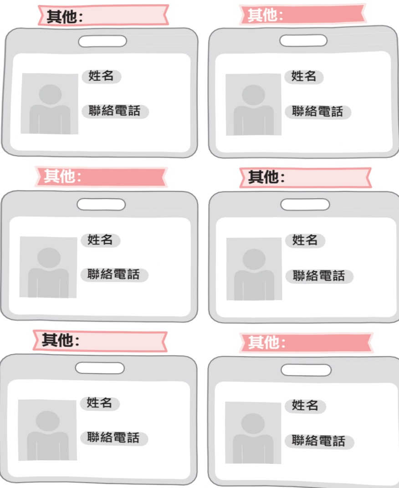
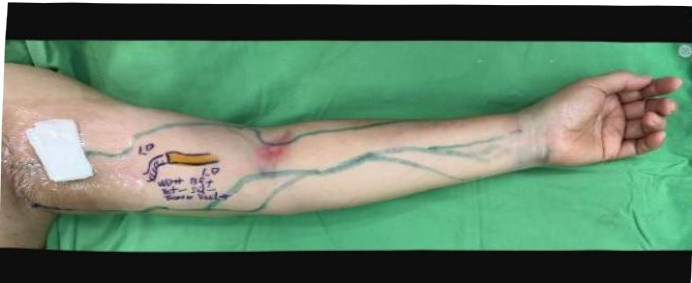
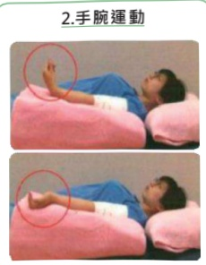
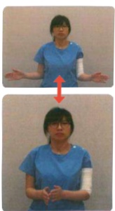

Yi Da Hospital:  
Address: No. 1, Yida Road, Jiaosu Village, Yancheng District, Kaohsiung City  
Phone: (07) 615-0011  

Yi Da Cancer Treatment Hospital  
Address: No. 21, Yida Road, Jiaosu Village, Yancheng District, Kaohsiung City  
Phone: (07) 615-0022  

Yi Da Da Chang Hospital  
Address: No. 305, Da Chang Road, Sancheng District, Kaohsiung City  
Phone: (07) 559-9123  

Pink Eye Care  
FREAST CANCER  
Breast Cancer Care Handbook## Table of Contents

Breast Cancer Team Introduction  
My Contact Folder  
Basic Information  
Breast Cancer Data  
My Type  
My Treatment Type  
Plastic Surgery for Breast Reconstruction  
Post-Operative Wound Care  
Chemotherapy  
Hormonal Therapy  
Targeted Therapy  
Radiation Therapy  
Rehabilitation Exercises  
Integrative Anti-Edema Therapy  
Follow-Up Records  
Traditional Chinese Medicine Treatment for Breast Cancer  
TCM Nutritional Recipes  
TCM Acupoint Recommendations  
Nutritional Education  
Psychological Adjustment  
Follow-Up Records  
Cancer Resource Center  
Insurance Benefits  
Related Resource Links  
Blood Test Records  
Other Examinations  
Notes# Pink Passport

## Usage Instructions

When you pick up the Pink Care Handbook, please don't feel alone or confused. Give yourself some time to browse slowly—don't feel pressured to absorb all the information at once.

This is not just a reference book; it's a friend who will accompany you through difficult times. Every page carries care and attention for you. As you read, remember that many people are walking the same path alongside you.

Each suggestion in this handbook has been provided by professional healthcare staff, with the goal of helping you feel at ease and supported. If you have any uncertainties or questions while reading, please don't hesitate to raise them with the medical and nursing team. Your feelings and needs are most important. This handbook will help you navigate every step, deepen your understanding, and better cope with this journey. With courage, you can face challenges and look forward to the future with hope.

Most importantly, please remember that you are strong—you have the strength to overcome everything. And we will be by your side, offering solid support and gentle guidance.## Breast Cancer Team Introduction

Our hospital established the breast cancer medical team in 2016. The team comprises specialists from tumor surgery, tumor internal medicine, rehabilitation, psychiatry, radiation oncology, imaging diagnosis, pathology, as well as tumor individual management specialists, nutritionists, rehabilitation therapists, psychologists, and social workers. Through multidisciplinary collaboration, we provide patient-centered services and smart healthcare environments. We develop the most suitable treatment plans to ensure patients receive comprehensive medical care.

Huang Chao-ming## Pink Passport

## My名片 is cool $ ^{③} $ 

## ④ My Business Card Pair

## Pink Passport

Basic Information

| Name | Emergency Contact | Relationship | Diagnosis Date | Biopsy Report Date |
|------|-------------------|--------------|----------------|---------------------|
| Emergency Contact: Name: Phone: | | | Year Month Day | Year Month Day |
| Tumor Site | Left / Right | Tumor Size | cm |
| Tumor Type | ☐ IDC (Invasive Ductal Carcinoma) ☐ DCIS (Ductal Carcinoma In Situ) ☐ ILC (Invasive Lobular Carcinoma) ☐ Other: | | |
| Lymph Node Metastasis | ☐ None ☐ Present: Surgery removed _____ lymph nodes, _____ lymph nodes with infection | | |
| Organ Metastasis | ☐ None ☐ Present, Site: | | |
| Cell Differentiation Grade | ☐ Low-grade, well-differentiated ☐ Moderate-grade, moderately differentiated ☐ High-grade, poorly differentiated | | |
| Ki-67 (Cell Proliferation Index, MIB-1) | ____% ☐ Low ☐ High | | |
| Hormone Receptors | ER (Estrogen Receptor) ☐ Positive ____% ☐ Negative | PR (Progesterone Receptor) ☐ Positive ____% ☐ Negative | HER-2 (Human Epidermal Growth Factor Receptor 2) ☐ Positive ☐ Negative | |
| Lymphatic Vascular Invasion | ☐ None ☐ Present | | |
| Cancer Stage | ☐ In situ ☐ Stage I ☐ Stage II ☐ Stage III ☐ Stage IV | | |
| Chronic Medical History | ☐ Heart Disease ☐ Diabetes ☐ Hypertension ☐ Kidney Disease ☐ Hepatitis/Hepatopathy ☐ Other: | | |## 6 Breast Cancer Data## Initial Red Passport

## My Type $ ^{7} $

| Breast Cancer Subtype (subtype) | Definition | Post-surgical Treatment Strategy |
|----------------------------------|-----------|-----------------------------------|
| ☐ Luminal A type | ER-positive and/or PR-positive, HER-2-negative, low Ki-67 | Hormonal therapy ± chemotherapy ± radiotherapy |
| ☐ Luminal B1 type | ER-positive and/or PR-positive, HER-2-negative, high Ki-67 | Chemotherapy → hormonal therapy ± radiotherapy |
| ☐ Luminal B2 type | ER-positive and/or PR-positive, HER-2-positive | Chemotherapy ± anti-HER-2 monoclonal or bispecific therapy → hormonal therapy ± radiotherapy |
| ☐ HER-2 positive | ER-negative and PR-negative, HER-2-positive | Chemotherapy ± anti-HER-2 monoclonal or bispecific therapy ± radiotherapy |
| ☐ Triple-negative | ER, PR, and HER-2 all negative | Chemotherapy ± radiotherapy ± immunotherapy ± targeted therapy |## My Treatment Options

|  |  |
|---|---|
| ☐ Adjuvant therapy | Systemic treatment (chemotherapy +/- targeted or immunotherapy) → surgery → additional treatment with curative intent |
| ☐ Neoadjuvant therapy | Surgery → systemic treatment (chemotherapy +/- targeted or immunotherapy) → additional treatment with curative intent |
| ☐ Palliative therapy | For advanced patients, surgery is not the priority. The main goals are disease control, prolonging life, and maintaining quality of life. |## Pink Passport

## Plastic Surgery Breast Reconstruction

Breasts are one of the most important secondary sexual characteristics for women. Breast cancer patients not only face the physical and psychological impact of the disease, but also endure the sudden and drastic change caused by breast removal, which brings immense psychological shock and suffering.

Research shows that breast reconstruction following mastectomy can significantly improve patients' need for a complete body image, helping them recover quickly from the pain of cancer treatment, regain confidence and freedom, and maintain their quality of life after cancer diagnosis.

Role distribution between breast surgery and plastic surgery in breast cancer treatment:

## Breast Surgery

The choice of reconstruction method often depends on the amount of skin and tissue that can be preserved post-surgery, and the most suitable method is selected after comprehensive consideration.## 10 Breast Reconstruction Surgery in Plastic Surgery

## Special Features of Plastic Surgery Breast Reconstruction at the Cancer Treatment Hospital of Taichung

### 1. Latissimus Dorsi Myocutaneous Flap + Silicone Gel Implant Placement

After breast tissue removal, insufficient soft tissue often leads to capsule contracture when implants are placed, resulting in asymmetry between the two breasts in height or shape. The Plastic Surgery Department at the Cancer Treatment Hospital of Taichung has developed a technique using the latissimus dorsi muscle to supplement the deficient soft tissue of the breast, followed by placing the implant within the soft tissue envelope to achieve a soft, balanced, and symmetrical reconstructed breast.

Photo: https://taiwanformosas.com/self-tissue transplantation
## Pink Passport

## Plastic Surgery Breast Reconstruction $^{11}$

## Plastic Surgery Breast Reconstruction Specialty at the Cancer Treatment Hospital

### 2. Transverse Rectus Abdominis Myocutaneous Flap (TRAM) Procedure

The TRAM procedure utilizes excess abdominal fat and abdominal wall tissue from the lower abdomen to reconstruct the breast, creating a natural-looking breast appearance. Compared to implant-based reconstruction, the TRAM procedure offers the advantage of providing sufficient soft tissue coverage for the chest.

Image: https://www.lipsg.com/breast/reconstruction/tram-flap/

### 3. Deltoid Muscle Flap Breast Reconstruction

The deltoid muscle is transferred from the back to the site of breast defect, suitable for patients with smaller breasts.

Image: https://sukruyazar.com/en/mastectomy
## Breast Reconstruction Surgery in Plastic Surgery

## Preoperative Lymphatic-Venous Anastomosis in Breast Cancer Surgery

A study published in 2017 in the *Annals of Surgical Oncology* reported that over a 10-year follow-up of 1,794 patients, the overall incidence of lymphedema following breast cancer surgery within five years was 9.1%. Among patients who underwent sentinel lymph node biopsy, the incidence of lymphedema was 5.3%, whereas among those who underwent axillary lymph node dissection, it reached 15.9%. When radiotherapy was also administered, the risk increased by a factor of two.

With the advancement of surgical and medical techniques, breast cancer is becoming more prevalent among younger patients, yet cure rates remain high. Consequently, the number of patients developing lymphedema is also increasing.

In 2014, Dr. Boccardo from Italy published a study in an international journal, tracking 74 patients who underwent LYMPHA surgery during breast cancer treatment for four years. The incidence of lymphedema was reduced to 4.05%. In 2019, a study by Johnson and colleagues from Harvard Medical School compared the incidence of lymphedema across different stages with and without intraoperative LYMPHA:

a. Mastectomy + axillary lymph node dissection: lymphedema incidence of 14.1%.

b. Mastectomy + axillary lymph node dissection + radiotherapy-induced lymphedema: incidence of 33.4%.

c. Mastectomy + axillary lymph node dissection + LYMPHA: lymphedema incidence reduced to 2.1%.

d. Mastectomy + axillary lymph node dissection + radiotherapy + LYMPHA: lymphedema incidence reduced to 10.3%.

Literature confirms that this surgical approach is effective in preventing the occurrence of lymphedema.## Prosthetic Passport

## Surgical Breast Reconstruction $^{13}$

## Intraoperative Preventive Lymphatic-Venous Anastomosis for Breast Cancer

Case 1

Bilateral breast cancer; underwent total mastectomy with breast reconstruction and LYMPHA one year ago; no upper limb lymphedema due to breast cancer has occurred during one-year follow-up.

Case 2

Intraoperative precise fluorescence imaging mapped the lymphatic pathways, confirming lymphatic-venous anastomosis at the site of lymphatic damage.## Breast Reconstruction Surgery in Plastic Surgery

## Lymphatic-venous Anastomosis for Prevention of Lymphedema in Breast Cancer Surgery

Right-sided mastectomy with lymphatic-venous anastomosis; no lymphedema due to breast cancer occurred one year post-surgery.## Pink Passport

## Post-surgical wound care

## Postoperative bras

Patients who undergo breast-conserving surgery can wear bras after surgery. If the incision is at the lower edge of the breast, it is recommended to wear sports bras without underwire. Patients who undergo total mastectomy, due to the presence of drainage tubes, should wear specialized postoperative bras.

For the first week after surgery, avoid pulling or tugging, and refrain from lifting or exerting force. Choose loose-fitting clothing with front closures or zippers.

In the initial phase after surgery, wear postoperative bras for 24 hours a day. Wear them for 3 to 6 months, after which they can be alternated with regular bras as a form of maintenance.

1. After surgery, get up and move around as soon as possible once conscious, but avoid falling or getting injured.

2. After surgery, perform deep breathing and coughing exercises to promote lung expansion and prevent respiratory complications.

3. When lying flat, use a pillow to elevate the affected arm above heart level to promote venous and lymphatic return, reducing swelling in the arm.

4. After suture removal, apply paper tape tightly for 1 to 3 months to enhance wound closure and provide support.

5. During chemotherapy or radiotherapy, the skin is more sensitive; avoid sun exposure. When going out during the day, wear long-sleeved clothing or use an umbrella to block direct sunlight.## Post-surgical wound care

## Things to avoid

1. No treatment on the affected side for 1–2 months, such as blood pressure measurement, blood drawing, or injections.

2. Avoid lifting objects heavier than 5 kilograms or hanging heavy objects on the affected shoulder during the first 1–2 months to prevent injury.

## Precautions

Seek medical attention immediately if any of the following symptoms occur:

1. Large amounts of fresh red drainage

2. Abnormal secretions from the wound

3. Subcutaneous hematoma that is expanding

4. Wound dehiscence

5. Body temperature > 38.5℃## Red Passport

## Post-surgical wound care

## Drainage tube volume recording

Hospital nurses will provide you with a small measuring cup with graduations to record the volume and color of the drainage fluid. Please record the volume and color accurately, and then pour it down the toilet to flush it away. When you return for follow-up, please bring the registration form with you. Your doctor will use your records to decide whether to remove the drainage tube. If the drainage volume gradually decreases, the doctor will remove the drainage tube based on the wound healing condition.

| Drainage tube location | Date | Volume | Color |
|------------------------|------|--------|-------|## 18 Post-surgical wound care

## Introduction to the Implantable Injection Port (Port-A)

## I. What is the Implantable Injection Port (Port-A):

Port-A (venous access implantable port, Port-A) is commonly known as an artificial vein. It is a synthetic silicone device composed of two parts: a spherical section and a catheter. It features an injection port and a catheter with a locking mechanism (Figure 1). The catheter is approximately 70 cm long (about 15–20 cm when implanted inside the body), extending from the subclavian vein through the superior vena cava to the upper part of the right atrium. The injection site is implanted into the subcutaneous tissue of the chest wall beneath the clavicle, thus not interfering with daily life. It appears as a small bump, roughly the size of a 10-yuan coin (Figure 2).

## II. How is the Implantable Injection Port (Port-A) installed:

Generally, patients can be admitted to the hospital or receive outpatient treatment under local or general anesthesia. A small incision of about 4–5 cm is made below the clavicle. The catheter is inserted into the central vein from a peripheral vein, and then the injection port is implanted beneath the skin.

## III. Why is the Implantable Injection Port (Port-A) installed and what are its benefits:

Patients receiving long-term chemotherapy often experience vein thrombosis or vein hardening, which increases the difficulty of injections and causes physical and psychological discomfort. If chemotherapy drugs accidentally leak, it may lead to local tissue and vascular necrosis.

The Port-A is specifically designed for patients requiring long-term and repeated drug administration. It eliminates the pain and inconvenience of repeated intravenous injections, making it both safe and convenient. It can be used for drug injections or continuous infusion, blood draws for laboratory testing, and even for the administration of blood products, nutrition, or other liquids.## Pink Passport

## Post-surgical wound care

Introduction and overview of the implantable injection port (port-A)

Four: Daily self-care for the implantable injection port (port-A):

1. After surgery, a cosmetic adhesive will be applied to the incision site and covered with sterile gauze. The cosmetic adhesive does not need to be changed—just let it naturally fall off. However, daily check for signs of redness, swelling, heat, pain, or excessive discharge or bleeding should be performed; if any of these symptoms occur, it may indicate infection, and you should immediately return to see your doctor for evaluation.

2. On the day of surgery, your doctor will schedule a follow-up appointment. During the time at home, use a wiping method when bathing; only after your doctor evaluates and confirms wound healing can you switch to showering.

3. There are no activity restrictions, but avoid intense physical activities. For the arm on the same side as the artificial vessel, avoid full 360-degree rotation, lifting objects over 4.5 kilograms, direct impacts or pressure on the protruding area, to prevent displacement of the artificial vessel.

4. If the artificial vessel is not in use, it must be regularly reviewed every 1–2 months or as needed; after approval, visit the injection room where the port will be flushed once with normal saline containing anticoagulant (Heparin) to prevent catheter blockage.

5. Pay attention to the backflow of the artificial vessel each time, as this provides important information for your doctor or nurse to assess the function of the artificial vessel in the next visit.

## Chemotherapy Drugs

| Drug Name               | Chinese Name           | Administration Route | Side Effects                                      | Precautions                                                                 |
|-------------------------|------------------------|----------------------|---------------------------------------------------|------------------------------------------------------------------------------|
| Capecitabine (Xeloda; Calveda) | Jie Tong Da           | Oral                 | Diarrhea, oral mucositis, hand-foot syndrome, fatigue. | ① Take twice daily, after meals. ② Increase fluid intake. ③ Enhance hand-foot protection: apply moisturizing lotion, wear gloves when doing household chores, wear closed-toe shoes or breathable soft-soled shoes. |
| Carboplatin (Paraplatin)   | Jia Bi Di·Ka Bi (Second-generation Platinum) | Intravenous injection | Nausea, vomiting, leukopenia, thrombocytopenia, diarrhea, constipation, mild hair loss. | ① Rarely causes renal function damage. ② Avoid infection or injury during treatment. |## Pink Passport

## Chemotherapy Drugs

| Drug Name | Chinese Name | Administration Route | Side Effects | Precautions |
|-----------|--------------|------------------------|-------------|-------------|
| Cisplatin (Kemoplat; CDDP) | Kemo Shun Lead (Platinum) | Intravenous injection | Decreased white blood cell count, renal dysfunction, tinnitus or hearing loss, numbness in hands and feet, nausea, vomiting | ① Avoid infection during treatment. ② Increase fluid intake. ③ Seek medical attention immediately if tinnitus or high-frequency hearing loss occurs. ④ Enhance protection for hands and feet: apply moisturizing lotion, wear gloves when doing household chores, wear head-covering shoes or breathable soft insoles. ⑤ If nausea or vomiting occurs, discuss with your doctor whether to prescribe medication or injections to alleviate discomfort. || 藥名 | 中文名 | 給藥途徑 | 副作用 | 注意事項 |
| --- | --- | --- | --- | --- |
| Doxorubicin (Adriblastina) | 艾黴素 (小紅莓) | 靜脈注射 | 髮、噁心、嘔吐、白血球減少症、血小板減少、口腔黏膜炎、心臟毒性 | ① 心臟功能不全者因謹慎使用。 ② 注射時防藥物外滲，造成血管永久傷害。 ③ 保護頭皮並使用無酒精洗髮精。 ④ 此期間應注意避免感染。 ⑤ 加強手足保護：塗抹保濕乳液、做家事請戴手套、穿著包頭鞋或透氣軟鞋墊。 ⑥ 加強口腔清潔。 |
| Cyclophosphamide (Endoxan) | 則得星 | 口服、靜脈注射 | 髮、噁心、嘔吐、白血球減少症、無月經 | ① 此期間應注意避免感染。 ② 多補充分。 ③ 保護頭皮並使用無酒精洗髮精。 |## Pink Passport

## Chemotherapy Drugs

| Drug Name | Chinese Name | Administration Route | Side Effects | Precautions |
|-----------|--------------|------------------------|-------------|-------------|
| Epirubicin (Pharmo-rubicin, Epicin) | Fan Aitaiyin Yibixin (Second-generation Little Strawberry) | Intravenous injection | Hair loss, nausea, vomiting, leukopenia, thrombocytopenia, oral mucositis, cardiac toxicity, anemia, fever | ① Avoid infection during this period. ② Increase fluid intake. ③ Protect the scalp and use alcohol-free shampoo. ④ If hemoglobin levels are low, consult the medical team to determine whether blood transfusion is needed. |
| Eribulin (Halaven) | Helaowei | Intravenous injection | Hair loss, nausea, vomiting, leukopenia, numbness in hands and feet, anemia, arrhythmia | ① Avoid infection during this period. ② Strengthen hand and foot protection: apply moisturizing lotion, wear gloves when doing household chores, wear closed-toe shoes or breathable soft insoles. ③ If severe symptoms (numbness, prickling, burning sensation) occur, inform the doctor immediately. |
Chemotherapy

| Drug Name | Chinese Name | Administration Route | Side Effects | Precautions |
|-----------|--------------|------------------------|-------------|-------------|
| Fluorouracil (5-Fu, Fluorouracil) | Hao Fu | Intravenous, Oral | Headache, hair loss, nausea, vomiting, diarrhea, rash, itching, photosensitivity, decreased appetite, hand-foot syndrome, oral mucositis | ① Avoid infection during this period. ② Strengthen hand and foot protection: apply moisturizing lotion, wear gloves when doing household chores, wear head-covering shoes or breathable soft insoles. ③ Strengthen oral hygiene. |
| Gemcitabine (Gemzar, Gemmis) | Jian Zhe Jian Shi | Intravenous | Nausea, vomiting, hair loss, anemia, leukopenia, thrombocytopenia, oral mucositis, cardiac toxicity, fever | ① Avoid infection during this period. ② Drink plenty of fluids. ③ Protect the scalp and use alcohol-free shampoo. ④ Assess whether blood transfusion is needed by the medical team if hemoglobin levels are low. |## Pink Passport

## Chemotherapy Drugs

| Drug Name | Chinese Name | Administration Route | Side Effects | Notes |
|----------|--------------|------------------------|-------------|-------|
| Ixabepilone (Ixempra) | Yishaping | Intravenous injection | Nausea, hair loss, low blood cell count, numbness in hands and feet | ① Infection should be avoided during this period. ② Strengthen hand and foot protection: apply moisturizing lotion, wear gloves when doing household chores, wear closed-toe shoes or breathable soft insoles. ③ If severe symptoms (numbness, prickling, burning sensation) occur, inform the doctor immediately. |
| Liposomal (Doxorubicin) (Lipo-dox) | Lide (liposomal small red berry) | Intravenous injection | Hair loss, nausea, hand-foot syndrome, oral mucositis, cardiac toxicity | rowspan="2" ① Infection should be avoided during this period. ② Strengthen hand and foot protection: apply moisturizing lotion, wear gloves when doing household chores, wear closed-toe shoes or breathable soft insoles. ③ If severe symptoms (numbness, prickling, burning sensation) occur, inform the doctor immediately. |
Chemotherapy

| Drug Name | Chinese Name | Administration Route | Side Effects | Precautions |
|-----------|--------------|------------------------|-------------|-------------|
| Methotrexate (MTX) | Amine methyl folic acid injection (Little Yellow Berry) | Intravenous injection, oral, intramuscular injection | Mild nausea, vomiting, diarrhea, leukopenia, thrombocytopenia, oral ulcers, liver and kidney function damage, pigmentation, skin rash | Strengthen sun protection to prevent facial hyperpigmentation and changes in skin and nail color |
| Nab-paclitaxel (Abraxane) | Abraxane (nanoparticle albumin-bound paclitaxel) | Intravenous injection | Nausea, fatigue, blood cell reduction, peripheral neuropathy, hair loss, edema, constipation, rash, abnormal liver function | Pay attention to allergic reactions during injection |## Pink Passport

## Chemotherapy Drugs

| Drug Name | Chinese Name | Administration Route | Side Effects | Precautions |
|-----------|--------------|------------------------|-------------|-------------|
| Paclitaxel (Phyxol, Taxol) | Huikui Yushu Taiseng (Pacific Taxol) | Intravenous injection | Mild nausea, vomiting, anemia, hair loss, edema, allergic reactions, low white blood cells and platelets, peripheral neuropathy (numbness, tingling in hands and feet), muscle pain, arrhythmia | Pre-treatment with anti-allergy medications (steroids, antihistamines, anti-ulcer drugs) |
| Vinorelbine (Navelbine) | Wenno Ping | Intravenous injection, oral | Leukopenia, constipation, hair loss, moderate nausea and vomiting, neurological discomfort (numbness, tingling, weakness), fatigue, oral mucositis | ① Oral capsules must be stored in the refrigerator; if capsules are crushed and liquid is exposed, they should not be taken. ② Prevent drug extravasation during injection to avoid permanent vascular damage |## 28 Chemotherapy

Regimen: total sessions, once per week, start date:

| Date | Drug/Dosage | Side Effect Record / Date of Occurrence | Notes |
|------|-------------|------------------------------------------|-------|
|      |             |                                          |       |
|      |             |                                          |       |
|      |             |                                          |       |
|      |             |                                          |       |
|      |             |                                          |       |
|      |             |                                          |       |
|      |             |                                          |       |## Pink Passport

## Chemotherapy

Regimen: Total of ___ sessions, once every ___ weeks ● Start date:

| Date | Drug/Dosage | Side Effects Record / Date of Occurrence | Notes |
|------|-------------|------------------------------------------|-------|
|      |             |                                          |       |
|      |             |                                          |       |
|      |             |                                          |       |
|      |             |                                          | Weight |
|      |             |                                          |       |
|      |             |                                          | Weight |
|      |             |                                          | Weight |
|      |             |                                          | Weight |
|      |             |                                          | Weight |## Hormonal Drug Therapy

|  | Oral Drug Name | Chinese Name | Side Effects |
|---|---|---|---|
| Before menopause | Tamoxifen (Nolvadex) | Nolvadex (Tamoxifen) | Hot flashes, high blood pressure, edema, weight gain, skin rashes, back pain, vaginal discharge and bleeding, external genital itching, irregular or absent menstruation, endometrial hyperplasia |
| After menopause | Exemestane (Aromasin) | Norplant (Exemestane) | Aromatase inhibitor: hot flashes, sweating, fatigue, joint pain, arthritis, bone pain, osteoporosis, vaginal dryness, nausea, skin rashes |
| After menopause | Letrozole (Femara) | Femara (Letrozole) | Aromatase inhibitor: hot flashes, sweating, fatigue, joint pain, arthritis, bone pain, osteoporosis, vaginal dryness, nausea, skin rashes |## Initial Red Passport

Hormonal drug therapy

| Injection drug name | Chinese name | Route of administration | Side effects |
|--------------------|-------------|-------------------------|-------------|
| Fulvestrant (Faslodex) | Faloed, Foton | Intramuscular injection (every 1 month) | Injection site pain, nausea, weakness, hepatotoxicity. |
| Goserelin (Zoladex) | Zoladex | Subcutaneous injection (every 1 or 3 months) | Injection site pain, hot flushes, night sweats, nausea, insomnia, skin rash, back pain. |
| Leuprorelin (Leuplin) | Leuplin | Subcutaneous injection (every 1 or 3 months) | Injection site pain, hot flushes, night sweats, nausea, insomnia, skin rash, back pain. |
| Triptorelin (Diphereline) | Diphereline (long-acting) | Intramuscular/subcutaneous injection (every 3 months) | Injection site pain, hot flushes, night sweats, nausea, insomnia, skin rash, back pain. |## 32 Hormonal Drug Therapy

Regimen: Total ___ times, once per week Starting date:

| Date | Drug/Dosage | Side Effect Record / Date of Occurrence | Notes |
|------|-------------|------------------------------------------|-------|
|      |             |                                          |       |
|      |             |                                          |       |
|      |             |                                          |       |
|      |             |                                          |       |
|      |             |                                          |       |
|      |             |                                          |       |## Pink Passport

## Hormonal Therapy

Regimen: Total of ___ sessions, once every ___ weeks, starting date:

| Date | Drug/Dosage | Side Effects Record / Date of Occurrence | Notes |
|------|-------------|------------------------------------------|-------|
|      |             |                                          |       |
|      |             |                                          |       |
|      |             |                                          | Weight |
|      |             |                                          |       |
|      |             |                                          |       |
|      |             |                                          | Weight |
|      |             |                                          |       |
|      |             |                                          | Weight |
|      |             |                                          |       |
|      |             |                                          | Weight |
|      |             |                                          |       |## Targeted Drug Therapy

| Condition | Drug Name | Chinese Name | Route of Administration | Side Effects |
|----------|-----------|--------------|-------------------------|-------------|
| ER/PR positive, HER2 negative, CDK4/6 inhibitor | Abemaciclib (Verzenio) | Jiesunming | Oral | Leukopenia, anemia, diarrhea, nausea, vomiting, loss of appetite, infection, fatigue, headache, hair loss. |
| ER/PR positive, HER2 negative, PI3K inhibitor, PIK3CA gene positive | Alpelisib (Piqray) | Aikeli | Oral | Abnormal liver function, diarrhea, nausea, loss of appetite, oral inflammation, hyperglycemia, rash, cardiac dysfunction. |## Pink Passport

## Targeted Drug Therapy

| Condition | Drug Name | Chinese Name | Route of Administration | Side Effects |
|----------|-----------|--------------|--------------------------|--------------|
| Anti-angiogenic agents | Bevacizumab (Avastin; Mvasi) | Afiashicai Zhi | Intravenous | Headache, hypertension, mild proteinuria. |
| TRK inhibitor (NTRK gene fusion: positive) | Entrectinib (Rozlytrek) | Luo Sike | Oral | Fatigue, nausea, reduced blood cell counts, cognitive changes, cardiac-related reactions |
| ER/PR positive, HER2 negative, mTOR inhibitor | Everolimus (Afinitor) | Anfutuo | Oral | Rash, oral mucositis, elevated blood glucose, interstitial pneumonia. |## Targeted Drug Therapy

| Condition | Drug Name | Chinese Name | Administration Route | Side Effects |
|----------|-----------|--------------|------------------------|--------------|
| Small molecule HER2-targeted drug; HER2 positive | Lapatinib (Tykerb) | Tai Jia Tablet | Oral | Diarrhea, hand-foot syndrome, nausea, vomiting, skin rash, fatigue, and anorexia. |
| Small molecule HER2-targeted drug; HER2 positive | Neratinib (Nerlynx) | He Li An | Oral | Severe diarrhea, nausea, abdominal pain, fatigue, oral mucositis. |## Pink Passport

Targeted drug therapy

| Condition | Drug Name | Chinese Name | Route of Administration | Side Effects |
| --- | --- | --- | --- | --- |
| PARP inhibitor: BRCA1/2 mutation, HER2 negative | Olaparib (Lynparza) | Ling Ansa | Oral | Anemia, fatigue, nausea and vomiting, headache, abdominal pain, loss of appetite, musculoskeletal pain, reduced blood cell count, skin rash. |
| CDK4/6 inhibitor: ER/PR positive, HER2 negative | Palbociclib (Ibrance) | Ailu Shì | Oral | Leukopenia, fatigue, headache, nausea and vomiting, diarrhea, oral inflammation, infection. |## Targeted Drug Therapy

| Condition           | Drug Name                        | Chinese Name | Administration Route | Side Effects                                 |
|--------------------|----------------------------------|--------------|------------------------|---------------------------------------------|
| HER2: Negative     | Pertuzumab (Perjeta)            | 賀疾妥        | Intravenous injection  | Mild fever, diarrhea, allergic reactions.  |
| HER2: Positive     | Pertuzumab + Trastuzumab (Phesgo) | 賀雙妥        | Subcutaneous injection | Nausea, hair loss, allergic reactions, cardiac dysfunction. |## Pink Passport

Targeted drug therapy

| Condition | Drug Name | Chinese Name | Route of Administration | Side Effects |
|----------|-----------|--------------|-------------------------|-------------|
| CDK4/6 inhibitor: ER/PR positive, HER2 negative | Ribociclib (Kisqali) | Jia'anli | Oral | Leukopenia, liver function abnormalities, cardiac dysfunction, fatigue, nausea, diarrhea, hair loss, headache. |
| ADC antibody-drug conjugate (targeted + chemotherapy): Triple-negative breast cancer | Govitecan Sacituzumab (Trodelvy) |  | Oral | Nausea, vomiting, fatigue, hair loss, diarrhea, constipation, rash, anemia, leukopenia. |## Targeted Drug Therapy

| Condition | Drug Name | Chinese Name | Administration Route | Side Effects |
|----------|-----------|--------------|------------------------|--------------|
| HER2: Positive | Trastuzumab (Herceptin; Herzuma;) |贺癌平;赫珠玛 | Intravenous, Subcutaneous | Mild fever, headache, allergic reactions, cardiac dysfunction. |
| Next-generation ADC antibody-drug conjugate (targeted + chemotherapy) HER2: Positive | Trastuzumab deruxtecan (Enhertu) |优赫得 | Intravenous | Fatigue, vomiting, hair loss, diarrhea, blood cell reduction, interstitial pneumonia. |## Pink Passport

Targeted drug therapy

| Condition | Drug Name | Chinese Name | Administration Route | Side Effects |
|----------|-----------|--------------|------------------------|--------------|
| ADC antibody-drug conjugate (targeted + chemotherapy), HER2 positive | Trastuzumab Emtansine (Kadcyla) (T-DM1) | Hao'an Ning | Intravenous infusion | Hepatotoxicity, thrombocytopenia, anemia, fever, peripheral neuropathy |

Side effects vary from person to person. A positive mindset and healthy lifestyle can enhance anti-cancer outcomes.

## Targeted Drug Therapy

Regimen: Total ___ times, once per week Start date: 

| Date | Drug Name/Quantity | Side Effects Record / Date of Occurrence | Notes |
|------|-------------------|------------------------------------------|-------|
|     |                   |                                          |       |
|     |                   |                                          |       |
|     |                   |                                          | Weight |
|     |                   |                                          |       |
|     |                   |                                          | Weight |
|     |                   |                                          | Weight |
|     |                   |                                          | Weight |
|     |                   |                                          | Weight |## Pink Passport

## Targeted Drug Therapy

Regimen: Total of ___ sessions, once every ___ weeks ● Start date:

| Date | Drug/Dosage | Side Effects Record / Date of Occurrence | Notes |
|------|-------------|------------------------------------------|-------|
|      |             |                                          |       |
|      |             |                                          |       |
|      |             |                                          | Weight |
|      |             |                                          |       |
|      |             |                                          | Weight |
|      |             |                                          | Weight |
|      |             |                                          | Weight |
|      |             |                                          | Weight |## Radiation Therapy

## Care Guidelines for Radiation Therapy in Breast Cancer

Radiation therapy is an essential component of adjuvant treatment following breast cancer surgery. The principle of radiation therapy is to use high-energy X-rays or particle beams to destroy cancer cells, thereby reducing the risk of recurrence in the affected breast. Radiation therapy is typically administered once per day, five days a week, with each session lasting about five to ten minutes. The treatment course usually ranges from three to four weeks for shorter regimens, and up to five to six weeks for longer ones. Although there is no pain, warmth, or electric shock sensation during each treatment session, and the body does not retain any residual radioactivity, the skin in the treated area may gradually develop varying degrees of skin reactions known as radiation dermatitis.

## Generally, it is divided into four grades:

Grade 1: Mild localized redness and dry peeling.

Grade 2: Wider redness and small areas of moist peeling limited to skin folds.

Grade 3: Large areas of moist peeling appear outside the skin folds, possibly accompanied by bleeding.

Grade 4: Skin necrosis and ulceration, spontaneous bleeding, and potentially life-threatening complications.

Starting from the second or third week after treatment, the skin may gradually darken and become slightly red, similar to the changes caused by prolonged sun exposure. The acute skin inflammation caused by radiation is temporary and will gradually resolve within two to four weeks after the completion of therapy. Most skin reactions are mild, such as localized redness and peeling, while only a few patients experience more severe reactions.

Prevention is better than treatment, so how to alleviate radiation dermatitis is a key focus in radiation therapy. The primary principles of skin care during radiation therapy are to maintain cleanliness, preserve skin integrity, and promote comfort.# Pink Passport

## Radiation Therapy

## Principles of Care to Prevent Radiation Dermatitis

## (1) Maintain Skin Cleanliness

Keep the irradiated skin area clean and dry as much as possible. Avoid bathing, swimming, or soaking in hot springs. A shower with water below 40°C is sufficient. Use a soap or body wash specifically formulated for sensitive skin with a weakly acidic pH (4–6) and free from fragrances. Gently clean the irradiated skin area and pat it dry with a towel using light pressure, avoiding rubbing.

## (2) Maintain Skin Integrity

Avoid massaging the irradiated skin area or any rubbing, scratching, or rubbing motions. Do not apply adhesive bandages to the irradiated area.

Wear loose, soft clothing and avoid wearing bras to reduce skin friction. Avoid carrying bags on the affected side; instead, cross your arms over your chest to reduce friction in the armpit area.

Cover the treated area with clothing to prevent direct exposure to sunlight.

Avoid using razors to shave the area directly. Instead, use an electric shaver.

## (3) Promote Comfort

Reduce sweating to avoid skin irritation from sweat.

Avoid using baby powder or cornstarch in skin creases.

Avoid using skin products containing irritating ingredients such as alcohol, fragrances, or alpha-hydroxy acids (AHAs).

Oily products such as petroleum jelly, baby oil, or sheep oil are difficult to clean and should be avoided during irradiation.

Antiperspirants containing or not containing metal components may be used if necessary.## (Four) Other Preventive Measures

(Four) Other preventive measures

Topical application of moderate to weak potency corticosteroids (betamethasone and mometasone) has been shown in current studies to reduce the incidence of severe radiation dermatitis and may be used temporarily under a doctor's prescription. Alternatively, silicone-based gel dressings may be considered. After natural drying, they form a transparent, resilient protective layer, and small-scale studies have demonstrated their ability to reduce the occurrence of radiation dermatitis.

Aloe vera may worsen the severity of radiation dermatitis and is therefore advised against use.

Other skincare products currently lack sufficient evidence from evidence-based medicine to demonstrate preventive effects against radiation dermatitis. If use is desired, consultation with a physician is recommended.

## References

1. Chang L, Zhou X, Qiu W, Xie J, Li J, Hong M, Jiang M, Xie C, Cai Y (2015). Guidelines for the prevention and care of radiation-induced dermatitis. *Journal of Oncology Nursing*, (15), 81–98. https://doi.org/10.3966/168395442015121503006

2. https://www.uptodate.com/contents/radiation-dermatitis

3. MASCC clinical practice guidelines for the prevention and management of acute radiation dermatitis: part 1) systematic review. Behroozian T, et al. *EClinicalMedicine*. 2023 Mar 27;58:101886. doi:10.1016/j.eclinm.2023.101886. eCollection 2023 Apr.

4. Multinational Association of Supportive Care in Cancer (MASCC) clinical practice guidelines for the prevention and management of acute radiation dermatitis: international Delphi consensus-based recommendations. Behroozian T, et al. *The Lancet Oncology*. 2023 Apr;24(4):e172-e185. doi: 10.1016/S1470-2045(23)00067-0## Redacted Radiation Therapy

## Radiation Therapy

| Start-End Date | Site | Treatment Course / Weight Record |
|---------------|------|-----------------------------------|
|               |      | 1 | 2 | 3 | 4 | 5 | 6 | 7 | 8 |
|               |      |   |   |   |   |   |   |   |   |
|               |      | 9 | 10 | 11 | 12 | 13 | 14 | 15 | 16 |
|               |      |   |   |   |   |   |   |   |   |
|               |      | 17 | 18 | 19 | 20 | 21 | 22 | 23 | 24 |
|               |      |   |   |   |   |   |   |   |   |
|               |      | 25 | 26 | 27 | 28 | 29 | 30 | 31 | 32 |
|               |      |   |   |   |   |   |   |   |   |
|               |      | 33 | 34 | 35 | 36 | 37 | 38 | 39 | 40 |
|               |      |   |   |   |   |   |   |   |   |
| Total Dose | Side Effects Record |  |  |  |  |  |  |  |  |
|               |  |  |  |  |  |  |  |  |  |
|               |  |  |  |  |  |  |  |  |  |## Postoperative Phase One Rehabilitation

● Applicable timing: First week after surgery

Objective: Promote lymphatic return in the arm, reduce swelling.

Prevent postoperative lymphedema and restricted movement, which may affect daily life.

1 Fist clench and open

2. Wrist movements

3. Elbow movements

## Postoperative Phase One Rehabilitation

Applicable timing: First week after surgery

Objective: Prevent restricted shoulder and arm movement.

Notes: Avoid excessive pulling on the wound.

Follow the video and move along

Shoulder flexion and abduction ≤ 90 degrees.

1 Rowing exercise

2. Light patting hand exercise

3. Forward elevation exercise

4. Lateral elevation exercise

Elbow should not be raised above shoulder level  
Way above the shoulder!!!## Postoperative Passport

## Rehabilitation Exercises

## Second Phase of Postoperative Rehabilitation

☑ Applicable Timing: Week 2 after surgery, can be gradually progressed to week 4.

☑ Purpose: Prevent restricted shoulder and arm movement, aiming to return to pre-surgical range of motion.

1. Wall Climbing Exercise (Front View)

Shoulder Movement

2. Wall Climbing Exercise (Side View)

Follow the video and move along

3. Chest Expansion Exercise

4. Upper Back Stretching Exercise

5. Lower Back Scratching Exercise

Third Phase of Postoperative Rehabilitation

Applicable Timing: After surgical wound healing

Purpose: Gradually enhance muscle strength to return to daily life or work.

## AWS Arm Web Syndrome

Cause: Adhesion or obstruction of lymphatic vessels after surgery.

☑ Symptoms:

1. A cord-like or branched structure begins at the armpit and extends along the inner arm, reaching from the elbow to the base of the thumb.

2. Restricted upper limb movement and pain.

3. Prone to lymphedema.

## Physical Therapy:

1. Transcutaneous electrical nerve stimulation (TENS) to alleviate pain.

2. Fascial release to loosen adhesions.

3. Lymphatic drainage to reduce edema.

4. Scar massage to prevent adhesion.

5. Patient education on home-based self-stretching and mobilization exercises, including shoulder joint movements.

## Pink Passport

## Rehabilitation Exercises

## Post-surgical lymphedema

Causes:  
1. Damage or dysfunction of lymphatic vessels or lymph nodes, leading to impaired transport capacity.  
2. Protein deposition in interstitial tissues, increasing tissue osmotic pressure, which makes water easily retained in the interstitial spaces.

Incidence: The incidence of lymphedema in the arm is 8.4%–21.4%.

## International Lymphatic Society Staging

| Stage | Symptoms | Management |
|-------|----------|------------|
| Stage 0 | Reduced transport capacity. | — |
| Stage I | Pitting edema present but reversible. | Elevate the limb, edema will subside |
| Stage IV | Elevating the limb is ineffective, with tissue fibrosis, skin thickening and hardening. | Comprehensive decongestive therapy |
| Stage III | Tissue inflammatory response, elephantiasis, decreased immunity, fungal infections between fingernails. | Surgery may be required |## Skin Care

## What to do

1. Protect the skin and prevent dryness  
2. Wear elastic gloves when flying  
3. Wear loose-fitting clothing  
4. Elevate the affected limb and perform pump exercises  
5. Stay hydrated and reduce sodium intake  

## What not to do

1. Avoid skin breaks and infection  
2. Avoid blood draws, injections, and blood pressure measurements on the affected limb  
3. Avoid hot environments (steam baths, hot springs, sunbathing)  
4. Avoid local heat packs and deep massage  
5. Avoid pressure points (wearing jewelry, vertical sleeve sleeves)## Pink Passport

## Integrated De-swelling Therapy

## Manual Lymphatic Drainage

Purpose of manual lymphatic drainage:

Softens subcutaneous tissue, reduces protein deposition, improves subcutaneous fibrosis, promotes lateral lymphatic branching, and redirects stagnant lymph to normal, undamaged lymphatic territories.

Manual lymphatic drainage must be performed by a professionally trained therapist. Therefore, when lymphedema occurs, it is recommended to visit the rehabilitation department for evaluation by a physician, after which a physical therapist will carry out lymphatic drainage.

Assessment of lymphatic obstruction area by a physical therapist

Performing manual lymphatic drainage to re-establish lymphatic drainage pathways

After returning home, follow the therapist's instructions to perform self-manual lymphatic drainage## Pressure Therapy

## 1 Circulatory Pump

◦ Also known as intermittent pneumatic compression

● Makes the interstitial pressure > lymphatic and venous pressure

At this point, interstitial fluid flows into the venous or lymphatic circulation

## Pressure Settings

→ Should not exceed diastolic pressure to avoid blocking blood flow  
→ Upper limb: 40–60 mmHg

## 2 Compression Bandaging

Low-tension elastic bandage

Purpose: To control and prevent edema

Recommendation: Bandage for more than 20 hours daily, only removing during bathing

## prost compression garment

## Integrated edema treatment

## 3-pressure sleeve

☑ Also known as compression garment

Purpose: Control and prevent edema

Recommendation: Wear for more than 22 hours daily; remove only during bathing and for one hour after washing

☑ Suitable for stable phase (maintenance phase) wear

## Edema-reducing exercises

Exercises performed while wearing compression bandages or compression sleeves are most effective.

☐ Purpose:

1. Muscle pump effect

2. Increased heart rate (arterial pulsation pulls deep lymphatic vessels)

3. Muscle tissue congestion, increasing oxygen supply to tissues

4. Lung contraction, intrathoracic pressure, accelerating lymph flow into the right and left venous angles

5. Through diaphragmatic breathing, causing passive contraction and expansion of the thoracic duct

Types of edema-reducing exercises

Diaphragmatic breathing to open deep lymphatic vessels

Massage of the clavicular, axillary, and inguinal lymph nodes to open lymph nodes

Upper limb edema-reducing exercises – supine or seated positions

Upper limb elastic band exercises – muscle strength training

## Pink Passport

## Traditional Chinese Medicine Treatment for Breast Cancer

## Application of Traditional Chinese Medicine in Cancer Chemotherapy

In cancer treatment, chemotherapy drugs can directly inhibit or kill cancer cells. However, many chemotherapy drugs lack selectivity and cause damage to the body, leading to side effects such as those affecting the hematopoietic system, immune system, digestive system, and nervous system. Some drugs also exhibit delayed toxicities. According to the traditional Chinese medical principle of "strengthening the body's defenses and eliminating pathogenic factors," using herbal medicine to regulate the body can enhance therapeutic efficacy and reduce side effects.

## Dietary and Nutritional Guidance Principles for Cancer Patients in Traditional Chinese Medicine

Cancer patients should consume food that is easy to digest, nutritious, and light, avoiding excessive intake of rich or greasy foods. Breast cancer patients should avoid high-fat (especially animal fats) and high-animal-protein foods.

## Avoid Consuming Foods Containing Carcinogens

1. Unfresh or long-stored foods, as well as foods containing nitrites  
2. Moldy foods containing mycotoxins, such as grains and their processed products  
3. Smoked or barbecued foods  
4. Foods containing artificial food additives  
5. Crops grown with heavy pesticide use during cultivation

## Pay Attention to Protecting Spleen and Stomach Function

1. Surgery, chemotherapy, and radiotherapy can all damage the spleen and stomach  
2. Overeating or undereating can harm the spleen and stomach  
3. Large doses of prolonged use of bitter-cold traditional Chinese herbal medicines can also damage the spleen and stomach  

*For cancer patients, if spleen and stomach function decline (i.e., "stomach qi" weakens), it indicates significant treatment challenges. It is recommended to receive customized traditional Chinese medicine-based supportive care after treatment, which can help improve quality of life and treatment outcomes.*## 58 Traditional Chinese Medicine Treatment for Breast Cancer

## Emphasis on Combining Strengthening the Body's Vital Energy with Eliminating Pathogenic Factors

1. When undergoing surgical, radiotherapy, or chemotherapy—treatments aimed at attacking cancerous factors—supplementary traditional Chinese herbal medicine to strengthen the body's vital energy is essential. In addition, nutritional support is also important. For example, mushrooms contain lentinan, which can enhance the immune function of cancer patients. Carrots, tomatoes, and pumpkins contain beta-carotene, vitamin C, and trace elements such as zinc, manganese, and copper, all of which have antioxidant properties. Green vegetables are rich in vitamin C. Garlic and onions have strong antibacterial and anticancer effects.

2. Choose vegetables and herbs that are both food and have anticancer properties, such as horse radish, golden needle flowers, yam, walnuts, nori, seaweed, water caltrop, lotus seeds, taro, and lotus root.

## Pay Attention to the Nature and Functions of Foods—Apply Food Therapy According to Individual Constitution

*The Golden Chamber of Medical Essentials*: "The types of food consumed may either be suitable for the illness or harmful to the body. If appropriate, they benefit the body; if not, they cause illness." Moldy foods that contain mycotoxins should be avoided.

1. Individuals with excessive yang heat should avoid foods such as longan, lychee, and lamb, which are warming in nature. Instead, they should consume cooling foods.

2. People with a deficient and cold constitution should avoid cold and cooling foods such as watermelon, mung beans, and cucumbers. Instead, they should consume warming foods.

3. Individuals with yin deficiency should avoid spicy foods such as chili, garlic, and ginger. Instead, they should consume nourishing yin foods such as black fungus, black beans, black dates, black mulberry seeds, snow ear, watermelon (feng shui type), lotus root, and yam.

4. Consult a traditional Chinese medicine practitioner to determine your constitution and identify suitable foods. Regular follow-ups are recommended to adjust dietary choices appropriately.## Initial Red Passport

## Traditional Chinese Health-Enhancing Medicinal Foods

## Dietary Restrictions (Abstaining from Certain Foods)

1. Cancer patients do not have strict dietary restrictions, but it is not recommended to consume "trigger foods."

2. What are "trigger foods"?

Refers to spicy, dry, hot, stimulating, rich, greasy, and heavy foods, as well as certain sea products.

Fowl, pig's head meat, lamb, shrimp, crab, mussels, tobacco, and alcohol can stimulate wind and heat, triggering chronic diseases, residual phlegm, sores, swellings, and epilepsy.

Shrimp, crab, and fish without scales are prone to causing allergic reactions.

3. Dietary restrictions should not be overly strict, and the diet should not be too narrow. It should be adjusted according to the strength of the spleen and stomach's digestive and absorptive functions, as well as the nature of the illness—whether it is cold, heat, deficiency, or excess—by providing appropriate food supplementation and dietary therapy.

## Dietary Recommendations

1. Reduce intake of animal saturated fats and omega-6 fatty acids (corn oil, soybean oil, and sunflower oil), and replace them with omega-3 fatty acids (fish oil and canola oil) and omega-9 fatty acids (olive oil, canola oil, bitter tea oil, and peanut oil).

2. Reduce consumption of red meat and prefer deep-sea fish instead.

3. Limit intake of full-fat dairy products and switch to low-fat or fat-free dairy products.

4. Increase consumption of vegetables, fruits, whole grains, and nuts to enhance intake of dietary fiber, vitamins A, C, E, and carotenoids—antioxidants (dietary fiber helps eliminate female hormones in the body, reducing the concentration of female hormones in the blood).

5. Limit alcohol consumption.

6. Maintain regular sleep patterns and engage in regular physical activity.## Chemotherapy Patients - Nutritional Medicinal Foods

Chemotherapy patients often experience weakened immune function, gastrointestinal disturbances, suppression of hematopoietic function, and other physiological imbalances. In the concept of Traditional Chinese Medicine (TCM) health care, seeking medicinal dietary supplements to improve patients' quality of life is an essential component of complementary therapies in both traditional and Western medicine.

During chemotherapy, patients commonly experience gastrointestinal reactions (such as nausea, vomiting, and loss of appetite) and bone marrow suppression (such as reduced white blood cells and anemia). In dietary management, it is important to focus on stimulating appetite and consuming nutrient-rich foods.

It is recommended to consume foods that strengthen the spleen and stomach and nourish bones and marrow, such as: yam, job's tears, hawthorn, malt, citrus fruits, lion's mane mushroom, shiitake mushrooms, radish, eggs, and black fungus.

Additionally, foods that tonify qi and blood should be included, such as: red tea, goji berries, red beans, walnuts, lotus seeds, spinach, and longan meat. Avoid foods with strong fishy or pungent flavors.

## Characteristics of Chemotherapy Medicinal Foods

Combining food with medicinal herbs can promote physical health and also have preventive and therapeutic effects. Therefore, chemotherapy medicinal foods are also known as anti-cancer medicinal foods. The ingredients of chemotherapy medicinal foods consist of both food and traditional Chinese herbal medicines. Beyond improving taste, these components complement each other and enhance therapeutic efficacy.## Pink Passport

## Traditional Chinese Acupressure Recommendations

## Dietary Medicine for Loss of Appetite: Malt and Qingpi Decoction

**Ingredients:** Malt 30g, Qingpi 10g.

**Preparation:** Wash the above two ingredients, place them in a pot, add an appropriate amount of water, boil over high heat until boiling, then reduce the heat and simmer for 5 minutes. Strain to remove the residue and drink the juice.

**Effects:** Promotes liver qi flow, regulates qi, and aids digestion. Suitable for cases of liver qi stagnation in various tumors, pain and distension in the flanks, loss of appetite, and lack of taste in food.

## Dietary Medicine for Nausea and Vomiting: Fresh Ginger and Wu Mei Decoction

**Ingredients:** Wu Mei meat, fresh ginger, each 10g, and a suitable amount of rock sugar.

**Preparation:** Add the ingredients to 200ml of water and boil.

**Effects:** Harmonizes the stomach to stop vomiting, and generates body fluids to quench thirst.

## Dietary Medicine for Dry Mouth: Shan Yao and Licorice Juice Drink

**Ingredients:** Shan Yao 50g, 30g of licorice juice, 18g of pomegranate juice.

**Preparation:** Peel and wash the Shan Yao, cut into small pieces, place in a pot, add an appropriate amount of water, bring to a boil over high heat, then simmer over low heat for 30 minutes. Strain to obtain the juice, mix with licorice juice and pomegranate juice, and serve in a cup.

**Effects:** Tones the body, moistens the lungs, stops coughing, and generates body fluids. Suitable for patients with lung cancer or after radiation therapy who suffer from persistent dry cough and dry mouth and throat.## Acupuncture Recommendations in Traditional Chinese Medicine

<Treatment for nausea, vomiting, and poor appetite>

Nausea, vomiting, and loss of appetite may occur due to various treatments. These acupuncture points can be used if there are no contraindications.

## Zusanli, Shangjuxu, Xiaojuxu

**Location**: Three cun below the outer knee eye. Zusanli is one cun lateral to the outer edge of the tibia. Shangjuxu is three cun below Zusanli, and Xiaojuxu is three cun below Shangjuxu.

**Indications**: Constipation, diarrhea, digestive disorders, nausea, vomiting, abdominal distension.

**Procedure**: Press and stimulate the acupuncture points.

## Neiguan

**Location**: Two cun above the transverse wrist crease on the inner side of the forearm, between the two central tendons.

**Indications**: Gastric pain, vomiting, palpitations, chest pain, insomnia.

**Procedure**: Press and stimulate the acupuncture points.

## Acupuncture Points for Chemotherapy Patients with Sleep Disorders

Chemotherapy patients often experience sleep disturbances due to psychological factors or medication side effects. The following two points can help calm the mind and improve sleep. They can be used by pressing the points, suitable for home care.

## Sanyinjiao

**Location**: Three cun above the inner ankle, in the depression along the posterior edge of the tibia.

**Indications**: Poor sleep, gynecological disorders, spleen and stomach deficiency.

**Procedure**: Press and stimulate the acupuncture points.

# Pink Passport

## Traditional Chinese Medicine Acupoint Recommendations

## Sleep-Inducing Point

【Location】Go 5 cun posterior to the posterior edge of the ear, forming the first sleep point; go another 5 cun posterior to that point for the second sleep point.

【Indications】Insomnia, mental tension, excitement.

【Method】Press and stimulate the acupoints.

## Contraindications for Acupressure in Chemotherapy Patients

1. Acupressure should not be performed when the patient is excessively hungry, overly full, or has recently consumed alcohol.

2. Acupressure is contraindicated after radiotherapy or chemotherapy when white blood cell counts drop, increasing the risk of infection.

3. Acupressure is contraindicated after radiotherapy or chemotherapy when platelet counts decrease, leading to abnormal bleeding.

4. Acupressure should not be applied to the arm on the side of a surgical incision.

5. Acupressure is contraindicated in patients with diabetes who have elevated blood glucose levels.

6. Patients with cardiac disease who have implanted pacemakers should not have acupressure applied with excessive pressure.

## Nutritional Education

## Diet Before Treatment

Maintain a normal body weight and preserve physical strength

Increase daily calorie intake by 200~300 kcal

Eat five or more different types of vegetables and fruits each day

Balance nutrient intake and avoid picky eating

● Choose natural grains and avoid as much processing as possible  
● Limit consumption of high-fat and processed meats

Fleast adheres to

Nutrition and Health Education $ ^{65} $ 

## Dietary Guidelines During Treatment

## Caloric Requirements

☑ Underweight individuals (BMI < 18.5): 35–40 kcal per kilogram of body weight  
Normal weight individuals (18.5 ≤ BMI < 24): 35 kcal per kilogram of body weight  
Overweight individuals (BMI ≥ 24): 30 kcal per kilogram of body weight  

$ ^{*} $ BMI calculation = weight (kg) ÷ height $ ^{2} $ (m)

【Example Explanation】

A woman who is 158 cm tall and weighs 55 kg has a BMI of 55 ÷ (1.58) $ ^{2} $ = 22, which falls within the normal weight range. Therefore, her daily caloric requirement is: 55 × 35 = 1925 kcal.

Try calculating it yourself

My height: ___ meters · My weight: ___ kg  

My BMI is ___ = ___ kg / ___ m², so I am classified as a(n) ___ weight individual.  

I need ___ kcal per kilogram of body weight.  

My daily caloric requirement is: weight × ___ = ___ kcal## 66 Nutrition Education

|  | 1500 kcal | 1800 kcal | 2000 kcal | 2200 kcal |
| :--- | :--- | :--- | :--- | :--- |
| Whole grains and starchy foods (serving) | 9 | 12 | 14 | 15 |
| Soy, fish, egg, and meat group (serving) | 5 | 6 | 6 | 7 |
| Dairy products (cup) | 1 | 1 | 1 | 1 |
| Vegetables (serving) | 3 | 3 | 3 | 3 |
| Fruits (serving) | 2 | 2 | 2 | 2 |
| Oils and nuts/seeds (serving) | 5 | 6 | 6 | 7 |

**Food substitution quantities for the six major food groups**

|  | Whole grains and starchy foods (provides 70 kcal, 2 g protein) |  |  |  |
| :--- | :--- | :--- | :--- | :--- |
| Each serving | = 1/4 bowl of rice = 1/2 bowl of porridge, noodles, or sweet potato = 1/4 of a bun = 1/2 slice of thin toast = 3 sheets of dumpling skin = 3 tablespoons of oatmeal |  |  |  |
|  | Soy, fish, egg, and meat group (provides 75 kcal, 7 g protein) |  |  |  |
|  | = 1 egg = 100 g of fish or meat = 1/2 stick of chicken leg = 1/2 tail of fish = 1/2 block of tofu = 1/3 block of black bean paste |  |  |  |
|  | Dairy products (provides 120 kcal, 8 g protein) |  |  |  |
|  | = 3 tablespoons of milk powder = 240 ml of milk = 2 slices of cheese = 180 g of sugar-free yogurt = 200 ml of sugar-free kefir |  |  |  |
|  | Vegetables (provides 25 kcal, 1 g protein) |  |  |  |
|  | = 100 g of raw vegetables = 1/2 bowl of cooked vegetables |  |  |  |
|  | Fruits (provides 60 kcal, 0 g protein) |  |  |  |
|  | = edible weight approximately 100 g (80–120 g) = one apple or a small lemon, fist-sized = 13 grapes = 1 banana |  |  |  |
|  | Oils and nuts/seeds (provides 45 kcal, 0 g protein) |  |  |  |
|  | = 1/3 tablespoon of plant oil = 5 almonds = 5 shelled peanuts = 2 walnuts = 1 tablespoon of almond powder |  |  |  |

*Quantitative tools: bowl - diameter 10 cm, spoon - dishwasher-safe spoon*## prost dietary guidance

## Nutrition education

## Carbohydrates

1. Account for approximately 55%~60% of total caloric intake.

2. Provide sufficient energy to reduce protein consumption and muscle loss.

3. Choose unrefined whole grains such as brown rice, mixed grain rice, corn, yam, and potatoes.

## Lipids

1. Intake should not exceed 30% of total calories.

2. Provide essential fatty acids and energy.

3. Choose plant oils with lower saturation, such as olive oil, walnut oil, and flaxseed oil.

4. Avoid foods high in cholesterol, such as organ meats and fatty meats.

5. Supplement with no more than 2g of fish oil daily, which helps delay inflammation.## Nutritional Education

## Protein

1. Helps in the growth and repair of body tissues.  
2. Maintains a healthy immune system.  
3. Daily requirement: 1.2–2.0 g per kilogram of body weight/day.  
4. Consume deep-sea fish rich in omega-3 polyunsaturated fatty acids, such as salmon, sardines, and sardines.  
5. Consume high biological value proteins, such as beans, fish, eggs, and meat.  
6. Avoid high-fat protein foods and processed products, such as fatty meats, pork belly, bonito, sausages, and hot dogs.

## Vitamins and Minerals

1. Regulate physiological functions.  
2. Promote effective utilization of proteins and calories.  
3. Vitamins and minerals currently believed to have anticancer effects include:  
Vitamin A, Vitamin C, Vitamin E, beta-carotene, lycopene, folic acid, and minerals zinc and selenium.## Profit Complex

## Nutritional Health Education

## Water

1. Under normal circumstances, daily fluid intake should be approximately 1500~1800 c.c.

2. When using medication or chemotherapy, daily fluid intake should be increased to 2000~3000 c.c.

3. If there is edema, please consult your doctor to determine whether fluid intake needs to be restricted. Personalized advice will be provided based on your condition.

## Post-Treatment Diet

Balanced diet  
Appropriate exercise  
Maintain ideal body weight  
Avoid smoking

1. After treatment, most diet-related side effects will gradually disappear. However, symptoms such as loss of appetite, dry mouth, altered taste and smell, difficulty swallowing, or weight loss may persist for a period of time.

2. Gradually return to a normal dietary pattern, which is no different from the healthy lifestyle of the general population.## Nutritional Health Education

## Management of Treatment Side Effects and Improvement Strategies

## Neutropenia

1. Maintain oral hygiene after meals to reduce the risk of infection.  
2. Prefer cooked foods and avoid raw fish, raw vegetables (such as in salad), raw eggs, and pickled foods (such as candied fruits).  
3. Choose fruits with skin removed whenever possible; if skin cannot be removed, rinse thoroughly with drinking water before consumption.  
4. Avoid drinking commercially available beverages containing ice (such as shake drinks).  
5. Use separate cutting boards and knives for raw and cooked foods.  
6. Maintain a balanced diet, including high-calorie and high-protein foods (such as beans, fish, eggs, and meat), as well as vegetables and fruits rich in phytochemicals, such as mushrooms, green broccoli, carrots, eggplants, apples, kiwi, papaya, and dragon fruit.

## Anemia

1. Consume iron-rich foods such as red meat, salmon, egg yolks, whole grains, dark green leafy vegetables, or seaweed.  
2. Increase intake of protein-rich foods such as dairy products, legumes, fish, eggs, and meat.  
3. Eat vitamin C-rich foods (which enhance iron absorption), such as dark green and yellow-red vegetables and fruits.  
4. Vitamin B12 is one of the key elements in red blood cell production. Vitamin B12 is primarily found in animal-based foods; plant-based sources include seaweed and kelp.## Superman Passport

## Nutrition Education $ ^{71} $ 

## Nausea and Vomiting

1. Clear, cold beverages or foods with stronger acidity or saltiness can help alleviate symptoms.

2. Eat small, frequent meals to avoid hunger, bloating, and foods that are too sweet or oily.

3. Avoid consuming cold and hot foods simultaneously, as this may trigger symptoms.

4. Liquid foods should ideally be consumed 30–60 minutes before meals.

5. Avoid eating within two hours before receiving radiation or chemotherapy to prevent vomiting.

6. Pay attention to fluid and electrolyte balance.

7. Take a moderate rest after meals; avoid intense physical activity or lying flat.

## Loss of Appetite and Weight Loss

1. Eat small, frequent meals; provide high-calorie, high-protein foods, snacks, drinks, or nutritional supplements.

2. Frequently vary cooking methods and forms, paying attention to color, aroma, and flavor to stimulate appetite.

3. Engage in light physical activity or consume a small amount of appetizers before meals.

4. During meals, start with solid foods before drinking liquid soups or drinks.

## Constipation

1. Choose more high-fiber foods such as vegetables, fruits, and whole grains.

2. Drink sufficient fluids or liquid foods.

3. Stay relaxed, engage in moderate physical activity, and develop a regular bowel habit.## Nutritional Health Education

## Diarrhea

1. Choose low-fiber foods to reduce stool volume.

2. Pay attention to fluid and electrolyte replacement (e.g., sports drinks).

3. Select foods high in potassium (e.g., clear meat broth, oranges, tomato juice, bananas, potatoes).

4. Eat small, frequent meals.

5. If milk and dairy products worsen diarrhea, switch to lactose-free products.

6. Avoid fried foods or overly sweet foods.

## Bloating

1. Avoid foods that produce gas (e.g., shellfish beans, onions, potatoes), rough fiber foods (e.g., bamboo shoots, celery stalks), and carbonated beverages (e.g., cola, soda).

2. Light physical activity or walking can alleviate bloating.

3. Reduce intake of sweet and rich foods.

4. Do not talk while eating to avoid swallowing excessive air.

## Osteoporosis

1. Increase calcium intake

(1) Consume milk and dairy products (1.5–2 cups per day, each cup 240 ml).

(2) Eat calcium-rich foods: sardines, small fish dried, tofu, bean curd, black sesame seeds, kelp, bok choy, amaranth.

(3) Take calcium supplements.

2. Supplement with vitamin D and get adequate sun exposure.

3. Maintain regular exercise habits.## Initial Red Passport

## Nutritional Health Education $ ^{73} $ 

## Oral Mucositis

1. Choose soft, tender, and finely chopped foods to aid chewing and swallowing (e.g., soy milk, pudding, fruit puree, steamed egg, tofu).

2. Change food preparation methods: chop food into small pieces, cook it until soft, use thickening agents or add broth, or use a blender or food processor to grind food into fine pieces or liquid form.

3. Supplement with L-glutamine; preventive supplementation is not recommended. Consider supplementation only when symptoms appear.

## Debunking Dietary Myths

## Which foods should be avoided?

Cancer patients should consume a balanced and sufficient diet, rather than restricting their food intake. Excessive dietary restrictions may lead to malnutrition, interrupting treatment, impairing the body's ability to self-repair, or causing difficulties in drug efficacy.

## Duck meat and shellfish are more toxic; cancer patients should not eat them

Duck meat, seafood, and meats such as beef, mutton, pork, chicken, fish, and eggs all belong to the "bean, fish, egg, meat" category and are all protein-rich foods that help wound healing and boost immunity. It is recommended to choose lean cuts of meat without skin, and to avoid processed meats (such as sausages and ham).## 74 Nutrition Education

## Can soy and soy products be consumed?

Studies in Asian countries have found that consuming soy products can reduce the incidence and recurrence rates of breast cancer. It is safe to consume moderate amounts of natural foods (such as soy milk and tofu). High-dose soy isoflavone supplements are not recommended.

## Does eating too little nutrition cause tumors to grow faster?

Trying to control cancer cells by eating less nutritious food instead results in starving oneself. Not only do cancer cells survive, but the individual also becomes progressively underweight, weakening their immunity and allowing cancer cells to spread more rapidly.

## Is raw food diet better?

Most raw food diets emphasize raw foods (with high bacterial counts). During treatment, when white blood cell counts are low and immunity is weakened, individuals are more prone to diarrhea and infections. Raw food diets should be avoided during treatment.

## Cancer cells love sugar — avoid starch?

Natural foods contain "carbohydrates," which break down into glucose and fructose in the digestive system. These are the energy source for all cells in the body. Moderate intake of carbohydrate-rich foods, including whole grains, dairy, and fruits, is recommended. Avoid excessive intake of "refined sugars," which are added sugars used during food or beverage processing.## Follow-up Record $ ^{75} $

Date

Date

Date

Date

Date

Date

Date

Nutrition Department## Psychological Adaptation

Facing cancer brings a significant threat to life, posing a major impact on both the body and mind. In the early stages of diagnosis, unfamiliarity with the disease, fear and anxiety, and the invasive treatments during diagnosis and therapy can lead to feelings of anxiety and suffering. However, since the situation is life-threatening, many considerations must be made, and each person's circumstances differ.

## Initial Psychological Reactions to Cancer Diagnosis

## Denial

A cancer diagnosis, which is unexpected, brings life closer to the unknown and death. This often makes patients and their family and friends unable to accept it at first, and some may even question whether they truly have cancer. Some may insist on returning to their previous lives and avoid treatment altogether.

## Anger

When a diagnosis is confirmed, treatment options are chosen, and treatment begins, feelings of anger may emerge. This is often accompanied by emotions such as fear, loneliness, and sadness. Due to cultural taboos, these emotions—especially anger—are suppressed, making it difficult to relieve them.

## Bargaining

Whether or not one has religious beliefs, people may often plead with heaven, asking if this entire situation could just be a bad dream.## Psychological Adjustment

## Despair

During this phase, patients may feel completely unmotivated about life and unable to perceive the meaning of life. However, such a state helps patients temporarily isolate themselves from external stimuli during difficult moments in life, until their mindset improves and they find turning points within their struggles and gradually move out of this phase.

## Acceptance

This refers to patients acknowledging the real losses they have experienced as a result of this life-altering event. It requires genuine self-reflection, as no one knows better than oneself what extent of acceptance is possible. "Acceptance" itself is not a definable endpoint, but can also be a spiritual state.

By understanding the five stages of cancer-related psychological responses, the goal is not to label patients' emotional states, but rather to provide a somewhat structured model that helps us recognize where we currently are in the process. Recognizing that many others have gone through similar experiences and feelings may allow us to approach our own situation with a calmer mindset, to assess our own resources, and to begin thinking about what we can do for ourselves. This requires us to choose courage and wisdom, to reflect thoughtfully upon our current circumstances.

When you turn inward, you might, for a brief moment, see a real and unfamiliar version of yourself within the surgical wound. The things flowing through your blood are no longer just chemical agents—they may become the courage to face life and death.

You are not becoming fearful; you are simply becoming more aware of the preciousness of life. Others may no longer understand you, but you have the opportunity to know yourself better.## Mood Thermometer

I have been diagnosed with cancer. I feel unexpected anxiety, sadness, depression, disturbed sleep, and difficulty falling or staying asleep. My physical appearance has changed. Will society accept me? Will my relationships with family and close friends change? I have many worries and don't know how to bring them up.

A simple self-assessment test is provided. Scoring instructions:

<table border=1 style='margin: auto; width: max-content;'>
<tr>
<td style='text-align: center;'> </td>
<td style='text-align: center;'>No</td>
<td style='text-align: center;'>Mild</td>
<td style='text-align: center;'>Moderate</td>
<td style='text-align: center;'>Severe</td>
<td style='text-align: center;'>Very Severe</td>
</tr>
<tr>
<td style='text-align: center;'>1. Difficulty sleeping, such as trouble falling asleep, waking up easily, or waking up too early</td>
<td style='text-align: center;'>0</td>
<td style='text-align: center;'>1</td>
<td style='text-align: center;'>2</td>
<td style='text-align: center;'>3</td>
<td style='text-align: center;'>4</td>
</tr>
<tr>
<td style='text-align: center;'>2. Feeling tense or anxious</td>
<td style='text-align: center;'>0</td>
<td style='text-align: center;'>1</td>
<td style='text-align: center;'>2</td>
<td style='text-align: center;'>3</td>
<td style='text-align: center;'>4</td>
</tr>
<tr>
<td style='text-align: center;'>3. Feeling easily upset or angry</td>
<td style='text-align: center;'>0</td>
<td style='text-align: center;'>1</td>
<td style='text-align: center;'>2</td>
<td style='text-align: center;'>3</td>
<td style='text-align: center;'>4</td>
</tr>
<tr>
<td style='text-align: center;'>4. Feeling depressed or low in mood</td>
<td style='text-align: center;'>0</td>
<td style='text-align: center;'>1</td>
<td style='text-align: center;'>2</td>
<td style='text-align: center;'>3</td>
<td style='text-align: center;'>4</td>
</tr>
<tr>
<td style='text-align: center;'>5. Feeling inferior to others</td>
<td style='text-align: center;'>0</td>
<td style='text-align: center;'>1</td>
<td style='text-align: center;'>2</td>
<td style='text-align: center;'>3</td>
<td style='text-align: center;'>4</td>
</tr>
<tr>
<td style='text-align: center;'>★ Suicidal thoughts</td>
<td style='text-align: center;'>0</td>
<td style='text-align: center;'>1</td>
<td style='text-align: center;'>2</td>
<td style='text-align: center;'>3</td>
<td style='text-align: center;'>4</td>
</tr>
<tr>
<td colspan="6">Please fill in the test results. Total score: ____ points. Suicidal thoughts: ____ points</td>
</tr>
</table>

1. Circle the level of distress for each item over the past week (including today).

2. Total score for questions 1 to 5:  
A. 0–5: Good mental and physical health.  
B. 6–9: Mild disturbance. Suggest talking with family or friends to express emotions.  
C. 10–14: Moderate emotional disturbance. Recommend seeking professional psychological counseling.  
D. 15 or above: Severe emotional disturbance. Recommend referral to psychiatric treatment.

3. ★ Additional question on suicidal tendencies: If the total score of the first five questions is less than 6, but this item is 2 or above, please seek immediate psychiatric evaluation.## Pink Passport

## Psychological Adaptation

## Cancer-Related Fatigue

## What is Cancer-Related Fatigue?

A subjective state of persistent, unrelenting exhaustion that affects the body, mind, and spirit, which cannot be recovered through rest. It often persists even after treatment ends.

## Difference from Ordinary Fatigue

Cancer-related fatigue is an abnormal or excessive state of generalized tiredness that cannot be relieved by sleep. Fatigue may be acute (lasting one month or less) or chronic (lasting one to six months or more). Regardless of duration, such fatigue often impacts patients' daily work and quality of life.

## Has Cancer-Related Fatigue Struck You?

Approximately 80% of cancer patients experience fatigue symptoms, especially those undergoing treatment. The causes of fatigue are complex and may involve biological, psychological, or behavioral factors.

If you have any of the following sensations, you may be experiencing cancer-related fatigue: tiredness, exhaustion, lack of strength, inability to move, lack of energy, weakness, drowsiness, depression, slowness of movement, and a feeling of physical heaviness.

## Psychological Adaptation

## Factors Affecting "Cancer-Related Fatigue"

Cancer treatment: Chemotherapy, Radiotherapy, Biologic therapy, Surgery

● Anemia

Nutritional status

Physical function

☑ Medication use

Sleep status

☑ Comorbidities

Emotional factors

## Taiwan Version of the Brief Fatigue Scale Test

Simply think about the following three questions:

1. Do you currently feel tired or fatigued?

2. If yes, select a score from 0 to 10 (0 means completely not tired, 10 means the most fatigued state imaginable) to describe your daily fatigue level.

3. Does this fatigue affect your daily functioning (e.g., work, household chores)?

You can use the "Taiwan Version of the Brief Fatigue Scale Test" to help yourself understand the current status and impact of cancer-related fatigue.

|  |  |  |  |  |  |  |  |  |  |  |
|---|---|---|---|---|---|---|---|---|---|---|
| We most people experience extreme fatigue or tiredness at some point in life. Have you felt unusual fatigue or tiredness in the past week? ☐ Yes ☐ No |  |  |  |  |  |  |  |  |  |  |
| 1. Please circle a value that best represents your current level of fatigue (fatigue, tiredness) |  |  |  |  |  |  |  |  |  |  |
| 1 | 2 | 3 | 4 | 5 | 6 | 7 | 8 | 9 | 10 |  |
| 2. Please circle a value that best represents your general level of fatigue in the past 24 hours (fatigue, tiredness) |  |  |  |  |  |  |  |  |  |  |
| 1 | 2 | 3 | 4 | 5 | 6 | 7 | 8 | 9 | 10 |  |# Pink Passport

Psychological adaptation

|  |  |  |  |  |  |  |  |  |  |  |  
|---|---|---|---|---|---|---|---|---|---|---|  
| 3. Please circle one value that most appropriately represents your level of fatigue (fatigue, exhaustion) over the past 24 hours |  |  |  |  |  |  |  |  |  |  |  
| 1 | 2 | 3 | 4 | 5 | 6 | 7 | 8 | 9 | 10 |  |  
| 4. Please circle one value that most appropriately represents the impact of fatigue on the following areas over the past 24 hours: |  |  |  |  |  |  |  |  |  |  |  
| A. General activity |  |  |  |  |  |  |  |  |  |  |  
| 1 | 2 | 3 | 4 | 5 | 6 | 7 | 8 | 9 | 10 |  |  
| B. Mood |  |  |  |  |  |  |  |  |  |  |  
| 1 | 2 | 3 | 4 | 5 | 6 | 7 | 8 | 9 | 10 |  |  
| C. Walking ability |  |  |  |  |  |  |  |  |  |  |  
| 1 | 2 | 3 | 4 | 5 | 6 | 7 | 8 | 9 | 10 |  |  
| D. Normal work (including outdoor work and household chores) |  |  |  |  |  |  |  |  |  |  |  
| 1 | 2 | 3 | 4 | 5 | 6 | 7 | 8 | 9 | 10 |  |  
| E. Relationships with others |  |  |  |  |  |  |  |  |  |  |  
| 1 | 2 | 3 | 4 | 5 | 6 | 7 | 8 | 9 | 10 |  |  
| F. Enjoyment of life |  |  |  |  |  |  |  |  |  |  |## 82 Visit Record

## Cancer Passport

## Psychological Adaptation

## How to Improve Cancer Fatigue

According to the *Clinical Treatment Guidelines for Cancer-Related Fatigue*, the following five solutions are provided:

## Exercise

Set exercise content and intensity based on the patient's condition and preferences. Warm-up and cool-down exercises of 5 minutes each before and after exercise are essential.

## Psychological and Social Interventions and Cognitive Behavioral Therapy

Psychological education and counseling can enhance patients' abilities to manage anxiety, depression, and psychological distress, thereby improving fatigue.

## Improve Sleep

Sleep therapy often requires medication assistance. Patients can request medication from healthcare providers based on their sleep conditions.

## Nutritional Management

Track one's nutritional status and discuss it with a dietitian as needed to supplement nutrition and prevent body supply-demand imbalance leading to fatigue.

## Complementary Therapies

Therapies such as massage and acupuncture can alleviate discomfort caused by fatigue. However, it is recommended to consult a doctor before using them.84

## Psychological Adaptation

The National Comprehensive Cancer Network (NCCN) provides seven recommendations for cancer patients to begin improving their fatigue issues by adjusting their lifestyle.

Try to remain physically active; walking is particularly suitable for cancer patients, and it's even better if you can develop a habit.

Take timely breaks, but avoid overdoing it—for example, a nap of less than 30 minutes is a good option.

Conserve energy and ensure that the most important daily tasks are prioritized.

1

2

3

7 secrets to overcoming "hysterical warts syndrome"

If needed, don't forget that family and friends are always ready to offer support.

4

If fatigue does not improve, communicate your concerns to your treatment team. Use relaxation techniques, counseling, and stress management training to combat stress.

Adopt a healthy diet and drink plenty of water.

7

...

6

5

## Pink Passport

## Psychological Adaptation

## Relaxation – Diaphragmatic Breathing Technique

How to self-soothe your emotions and body – learn a simple relaxation technique:

Place one hand on your abdomen and the other on your chest.

Inhale through your nose. Ensure that your abdomen expands as you breathe in.

Hold your breath for a moment.

Then, exhale slowly through your mouth.

Cancer patients feel bitter

Remember that "experiencing negative emotions is completely normal!" It's important to adjust yourself and listen to your inner thoughts at appropriate times. If you have any related emotional support needs, please consult a psychologist or a psychosomatic medicine doctor.## Cancer Resource Center

Patients of all types and with any level of concern can directly consult with a case manager at the Cancer Resource Center.

The Cancer Resource Center provides patients and their families with necessary information, support, and resources, helping them obtain comprehensive care information, alleviate anxiety and stress, maintain a good quality of life, and navigate through difficult periods in life!

● Obtain scarves/hats  
● Borrow wigs  

● Obtain rehabilitation supplies  

☑ Consultation on civil emergency assistance  

## Wig Borrowing Records

| Borrow Date | Return Date | Notes |
|-------------|-------------|-------|
|             |             |       |
|             |             |       |

## Consultation Hotline

Yi Da Hospital  
Cancer Treatment Hospital  
(07)615-0011 Ext. 5209  
(07)615-0022 Ext. 6130  

## Consultation Location

Yi Da Hospital  
Cancer Treatment Hospital  
On the 2nd floor, Hematology and Oncology Clinic, Building C  

At the right side of the main entrance on the 1st floor## Pink Passport

## Insurance-related Benefits

## National Health Insurance - Major Illness Certificate

As long as it is confirmed that one has cancer (with histopathological reports confirming malignant tumors), and after assistance from the hospital to obtain a major illness card, the card will be directly recorded on the health insurance IC card.

To alleviate the medical expenses burden for patients with serious illnesses, Article 48 of the National Health Insurance Act stipulates that insured individuals will be exempt from out-of-pocket costs for emergency and outpatient visits when receiving treatment due to major illnesses.

If you have any questions regarding major illness certification, you may inquire at the hospital where you are receiving treatment or at local health insurance service offices. For information on application and renewal procedures, please refer to:

## Workers' Compensation - Disability Benefits

When workers suffer occupational injuries or develop occupational diseases, and after treatment, their symptoms become fixed and further treatment fails to improve the treatment outcomes, and such conditions are diagnosed as permanent disability by a designated hospital or clinic under the National Health Insurance system, they may qualify for workers' compensation disability benefits.

Since there are various types of disability benefits under the Workers' Compensation Insurance, please refer to the "Workers' Compensation - Benefits - Disability Services" section on the Labor Insurance Bureau's official website. For inquiries, call (02) 2396-1266, extension 2250, or ask your treating physician whether you meet the eligibility criteria.

## Insurance-related rights

## Ministry of Education - Emergency Relief for Students and Kindergarten Children

Applicable objects:

Students and kindergarten children in all levels of schools.

Students aged 25 years or older are not eligible for applications.

Families of students or children whose total household income, based on the previous year's comprehensive income, exceeds New Taiwan Dollars (NTD) 1 million, or whose total real estate value exceeds NTD 10 million, will not be granted assistance.

Each family is eligible for only one application per incident. Applications must be submitted within three months of the event. For inquiries, please call the free welfare consultation hotline at 1957.

## Private Insurance - Medical Insurance, Cancer Insurance

● Do you understand your insurance policy? What are the coverage details?

Is reimbursement available for out-of-pocket expenses?

What is the maximum payout for direct payment claims?

You can find out which items are eligible under your policy, or ask your insurance agent. If you have any questions, the "Taiwan Cancer Resource Network" offers free insurance consultation. Reservation hotline: 0809-010580

## Pink Passport

## Related Resource Links

## Government Agencies

Central Health Insurance Administration

Labor Insurance Bureau

Ministry of Health and Welfare, National Health Agency

National Health Research Institutes, Cancer Research Center

## Private Organizations

Cancer Hope Foundation

Breast Cancer Prevention Foundation

Taiwan Cancer Foundation

Breast Cancer Patient Association## Related Resource Links

## Hope Kitchen - Feng Shu Serving

## Hope Foundation - HOPETV

## Hope Foundation - Tong Gan Dong Fang

## Yong Yuan Fu Da Breast Cancer Foundation

## Hope Foundation - Friendly Beauty

## Hope Foundation - Skin Care

## Hope Foundation - Breast Cancer Guide

## Taiwan Breast Reconstruction Association

## Initial Passport

Blood test record

91

| Item | Normal Value | Test Result | Test Result | Test Result | Test Result |
| --- | --- | --- | --- | --- | --- |
| WBC / White Blood Cell | 3.5–11.0 ×10³/μL |  |  |  |  |
| RBC / Red Blood Cell Count | 4.0–5.2 ×10³/μL |  |  |  |  |
| ANC / Neutrophil Count | >1500/μL |  |  |  |  |
| Hb / Hemoglobin | 12.0–16.0 g/dL |  |  |  |  |
| Platelet / Platelet Count | 150–400 ×10³/μL |  |  |  |  |
| BUN / Kidney Function | 6–20 mg/dL |  |  |  |  |
| Cr / Kidney Function | <1.1 μg/L |  |  |  |  |
| AST (GOT) | 8–38 U/L |  |  |  |  |
| ALT (GPT) | 4–44 U/L |  |  |  |  |## Blood Test Report Record

| Item | Normal Value | Test Result | Test Result | Test Result | Test Result | Test Result |
|------|--------------|-------------|-------------|-------------|-------------|-------------|
| CA153 | ≤31.3 U/mL | | | | | |
| BNP | <100 pg/mL | | | | | |
| Trop-I | <0.026 ng/mL | | | | | |
| CEA | ≤5 ng/mL | | | | | |
| ALK-P | <73 U/L | | | | | |## Initial Red Passport

## Blood Test Records

| Item | Normal Value | Test Result | Test Result | Test Result | Test Result |
|------|--------------|-------------|-------------|-------------|-------------|
| WBC / White Blood Cell | 3.5–11.0 ×10³/μL |  |  |  |  |
| RBC / Red Blood Cell Count | 4.0–5.2 ×10³/μL |  |  |  |  |
| ANC / Neutrophil Count | >1500/μL |  |  |  |  |
| Hb / Hemoglobin | 12.0–16.0 g/dL |  |  |  |  |
| Platelet / Platelet Count | 150–400 ×10³/μL |  |  |  |  |
| BUN / Kidney Function | 6–20 mg/dL |  |  |  |  |
| Cr / Kidney Function | <1.1 μg/L |  |  |  |  |
| AST (GOT) | 8–38 U/L |  |  |  |  |
| ALT (GPT) | 4–44 U/L |  |  |  |  |## Blood Test Report Record

| Item | Normal Value | Test Result | Test Result | Test Result | Test Result | Test Result |
|------|--------------|-------------|-------------|-------------|-------------|-------------|
| CA153 | ≤31.3 U/mL | | | | | |
| BNP | <100 pg/mL | | | | | |
| Trop-I | <0.026 ng/mL | | | | | |
| CEA | ≤5 ng/mL | | | | | |
| ALK-P | <73 U/L | | | | | |## Initial Red Passport

## Blood Test Records

| Item | Normal Value | Test Result | Test Result | Test Result | Test Result |
|------|--------------|-------------|-------------|-------------|-------------|
| WBC / White Blood Cell | 3.5–11.0 ×10³/μL |  |  |  |  |
| RBC / Red Blood Cell Count | 4.0–5.2 ×10³/μL |  |  |  |  |
| ANC / Neutrophil Count | >1500/μL |  |  |  |  |
| Hb / Hemoglobin | 12.0–16.0 g/dL |  |  |  |  |
| Platelet / Platelet Count | 150–400 ×10³/μL |  |  |  |  |
| BUN / Kidney Function | 6–20 mg/dL |  |  |  |  |
| Cr / Kidney Function | <1.1 μg/L |  |  |  |  |
| AST (GOT) | 8–38 U/L |  |  |  |  |
| ALT (GPT) | 4–44 U/L |  |  |  |  |## Blood Test Report Record

| Item       | Normal Value | Test Result | Test Result | Test Result | Test Result | Test Result |
|------------|--------------|-------------|-------------|-------------|-------------|-------------|
| CA153      | ≤31.3 U/mL   |             |             |             |             |             |
| BNP        | <100 pg/mL   |             |             |             |             |             |
| Trop-I     | <0.026 ng/mL |             |             |             |             |             |
| CEA        | ≤5 ng/mL     |             |             |             |             |             |
| ALK-P      | <73 U/L      |             |             |             |             |             |
|            |              |             |             |             |             |             |
|            |              |             |             |             |             |             |
|            |              |             |             |             |             |             |## Initial Red Passport

## Blood Test Records

| Item | Normal Value | Test Result | Test Result | Test Result | Test Result |
|------|--------------|-------------|-------------|-------------|-------------|
| WBC / White Blood Cell | 3.5–11.0 ×10³/μL |  |  |  |  |
| RBC / Red Blood Cell Count | 4.0–5.2 ×10³/μL |  |  |  |  |
| ANC / Neutrophil Count | >1500/μL |  |  |  |  |
| Hb / Hemoglobin | 12.0–16.0 g/dL |  |  |  |  |
| Platelet / Platelet Count | 150–400 ×10³/μL |  |  |  |  |
| BUN / Kidney Function | 6–20 mg/dL |  |  |  |  |
| Cr / Kidney Function | <1.1 μg/L |  |  |  |  |
| AST (GOT) | 8–38 U/L |  |  |  |  |
| ALT (GPT) | 4–44 U/L |  |  |  |  |## Blood Test Report Record

| Item       | Normal Value | Test Result | Test Result | Test Result | Test Result | Test Result |
|------------|--------------|-------------|-------------|-------------|-------------|-------------|
| CA153      | ≤31.3 U/mL   |             |             |             |             |             |
| BNP        | <100 pg/mL   |             |             |             |             |             |
| Trop-I     | <0.026 ng/mL |             |             |             |             |             |
| CEA        | ≤5 ng/mL     |             |             |             |             |             |
| ALK-P      | <73 U/L      |             |             |             |             |             |
|            |              |             |             |             |             |             |
|            |              |             |             |             |             |             |
|            |              |             |             |             |             |             |## Initial Red Passport

## Blood Test Records

| Item | Normal Value | Test Result | Test Result | Test Result | Test Result |
|------|--------------|-------------|-------------|-------------|-------------|
| WBC / White Blood Cell | 3.5–11.0 ×10³/μL | | | | |
| RBC / Red Blood Cell Count | 4.0–5.2 ×10³/μL | | | | |
| ANC / Neutrophil | >1500/μL | | | | |
| Hb / Hemoglobin | 12.0–16.0 g/dL | | | | |
| Platelet / Platelet Count | 150–400 ×10³/μL | | | | |
| BUN / Kidney Function | 6–20 mg/dL | | | | |
| Cr / Kidney Function | <1.1 μg/L | | | | |
| AST (GOT) | 8–38 U/L | | | | |
| ALT (GPT) | 4–44 U/L | | | | |## Blood Test Report Record

| Item | Normal Value | Test Result | Test Result | Test Result | Test Result | Test Result |
|------|--------------|-------------|-------------|-------------|-------------|-------------|
| CA153 | ≤31.3 U/mL | | | | | |
| BNP | <100 pg/mL | | | | | |
| Trop-I | <0.026 ng/mL | | | | | |
| CEA | ≤5 ng/mL | | | | | |
| ALK-P | <73 U/L | | | | | |## Initial Red Passport

## Blood Test Records

| Item | Normal Value | Test Result | Test Result | Test Result | Test Result |
|------|--------------|-------------|-------------|-------------|-------------|
| WBC / White Blood Cell | 3.5–11.0 ×10³/μL |  |  |  |  |
| RBC / Red Blood Cell Count | 4.0–5.2 ×10³/μL |  |  |  |  |
| ANC / Neutrophil Count | >1500/μL |  |  |  |  |
| Hb / Hemoglobin | 12.0–16.0 g/dL |  |  |  |  |
| Platelet / Platelet Count | 150–400 ×10³/μL |  |  |  |  |
| BUN / Kidney Function | 6–20 mg/dL |  |  |  |  |
| Cr / Kidney Function | <1.1 μg/L |  |  |  |  |
| AST (GOT) | 8–38 U/L |  |  |  |  |
| ALT (GPT) | 4–44 U/L |  |  |  |  |## Blood Test Report Record

| Item | Normal Value | Test Result | Test Result | Test Result | Test Result | Test Result |
|------|--------------|-------------|-------------|-------------|-------------|-------------|
| CA153 | ≤31.3 U/mL | | | | | |
| BNP | <100 pg/mL | | | | | |
| Trop-I | <0.026 ng/mL | | | | | |
| CEA | ≤5 ng/mL | | | | | |
| ALK-P | <73 U/L | | | | | |## Initial Red Passport

## Blood Test Records

| Item | Normal Value | Test Result | Test Result | Test Result | Test Result |
|------|--------------|-------------|-------------|-------------|-------------|
| WBC / White Blood Cell | 3.5–11.0 ×10³/μL | | | | |
| RBC / Red Blood Cell Count | 4.0–5.2 ×10³/μL | | | | |
| ANC / Neutrophil | >1500/μL | | | | |
| Hb / Hemoglobin | 12.0–16.0 g/dL | | | | |
| Platelet / Platelet Count | 150–400 ×10³/μL | | | | |
| BUN / Kidney Function | 6–20 mg/dL | | | | |
| Cr / Kidney Function | <1.1 μg/L | | | | |
| AST (GOT) | 8–38 U/L | | | | |
| ALT (GPT) | 4–44 U/L | | | | |## Blood Test Report Record

| Item | Normal Value | Test Result | Test Result | Test Result | Test Result | Test Result |
|------|--------------|-------------|-------------|-------------|-------------|-------------|
| CA153 | ≤31.3 U/mL | | | | | |
| BNP | <100 pg/mL | | | | | |
| Trop-I | <0.026 ng/mL | | | | | |
| CEA | ≤5 ng/mL | | | | | |
| ALK-P | <73 U/L | | | | | |## Initial Red Passport

## Blood Test Records

| Item | Normal Value | Test Result | Test Result | Test Result | Test Result |
|------|--------------|-------------|-------------|-------------|-------------|
| WBC / White Blood Cell | 3.5–11.0 ×10³/μL | | | | |
| RBC / Red Blood Cell Count | 4.0–5.2 ×10³/μL | | | | |
| ANC / Neutrophil | >1500/μL | | | | |
| Hb / Hemoglobin | 12.0–16.0 g/dL | | | | |
| Platelet / Platelet Count | 150–400 ×10³/μL | | | | |
| BUN / Kidney Function | 6–20 mg/dL | | | | |
| Cr / Kidney Function | <1.1 μg/L | | | | |
| AST (GOT) | 8–38 U/L | | | | |
| ALT (GPT) | 4–44 U/L | | | | |## Blood Test Report Record

| Item       | Normal Value | Test Result | Test Result | Test Result | Test Result | Test Result |
|------------|--------------|-------------|-------------|-------------|-------------|-------------|
| CA153      | ≤31.3 U/mL   |             |             |             |             |             |
| BNP        | <100 pg/mL   |             |             |             |             |             |
| Trop-I     | <0.026 ng/mL |             |             |             |             |             |
| CEA        | ≤5 ng/mL     |             |             |             |             |             |
| ALK-P      | <73 U/L      |             |             |             |             |             |
|            |              |             |             |             |             |             |
|            |              |             |             |             |             |             |
|            |              |             |             |             |             |             |## Initial Red Passport

## Blood Test Records

| Item | Normal Value | Test Result | Test Result | Test Result | Test Result |
|------|--------------|-------------|-------------|-------------|-------------|
| WBC / White Blood Cell | 3.5–11.0 ×10³/μL | | | | |
| RBC / Red Blood Cell Count | 4.0–5.2 ×10³/μL | | | | |
| ANC / Neutrophil | >1500/μL | | | | |
| Hb / Hemoglobin | 12.0–16.0 g/dL | | | | |
| Platelet / Platelet Count | 150–400 ×10³/μL | | | | |
| BUN / Kidney Function | 6–20 mg/dL | | | | |
| Cr / Kidney Function | <1.1 μg/L | | | | |
| AST (GOT) | 8–38 U/L | | | | |
| ALT (GPT) | 4–44 U/L | | | | |## Blood Test Report Record

| Item | Normal Value | Test Result | Test Result | Test Result | Test Result | Test Result |
| --- | --- | --- | --- | --- | --- | --- |
| CA153 | ≤31.3 U/mL |  |  |  |  |  |
| BNP | <100 pg/mL |  |  |  |  |  |
| Trop-I | <0.026 ng/mL |  |  |  |  |  |
| CEA | ≤5 ng/mL |  |  |  |  |  |
| ALK-P | <73 U/L |  |  |  |  |  |## Initial Red Passport

## Blood Test Records

| Item | Normal Value | Test Result | Test Result | Test Result | Test Result |
|------|--------------|-------------|-------------|-------------|-------------|
| WBC / White Blood Cell | 3.5–11.0 ×10³/μL |  |  |  |  |
| RBC / Red Blood Cell Count | 4.0–5.2 ×10³/μL |  |  |  |  |
| ANC / Neutrophil Count | >1500/μL |  |  |  |  |
| Hb / Hemoglobin | 12.0–16.0 g/dL |  |  |  |  |
| Platelet / Platelet Count | 150–400 ×10³/μL |  |  |  |  |
| BUN / Kidney Function | 6–20 mg/dL |  |  |  |  |
| Cr / Kidney Function | <1.1 μg/L |  |  |  |  |
| AST (GOT) | 8–38 U/L |  |  |  |  |
| ALT (GPT) | 4–44 U/L |  |  |  |  |## 110 Blood Test Report Record

| Item       | Normal Value | Test Result | Test Result | Test Result | Test Result | Test Result |
|------------|--------------|-------------|-------------|-------------|-------------|-------------|
| CA153      | ≤31.3 U/mL   |             |             |             |             |             |
| BNP        | <100 pg/mL   |             |             |             |             |             |
| Trop-I     | <0.026 ng/mL |             |             |             |             |             |
| CEA        | ≤5 ng/mL     |             |             |             |             |             |
| ALK-P      | <73 U/L      |             |             |             |             |             |
|            |              |             |             |             |             |             |
|            |              |             |             |             |             |             |
|            |              |             |             |             |             |             |## The Story of Shōzō

## Other Checks $ ^{111} $

| Item                  | Date | Date | Date | Date | Date |
|-----------------------|------|------|------|------|------|
| Chest X-ray           |      |      |      |      |      |
| Mammography           |      |      |      |      |      |
| Breast Ultrasound     |      |      |      |      |      |
| CT Scan               |      |      |      |      |      |
| Bone Scan             |      |      |      |      |      |
| Echocardiogram        |      |      |      |      |      |
| Abdominal Ultrasound  |      |      |      |      |      |
| Other:                |      |      |      |      |      |
| Other:                |      |      |      |      |      |
| Other:                |      |      |      |      |      |## 112 Other Examinations

| Item                  | Date  | Date  | Date  | Date  | Date  |
|-----------------------|-------|-------|-------|-------|-------|
| Chest X-ray           |       |       |       |       |       |
| Mammography           |       |       |       |       |       |
| Breast Ultrasound     |       |       |       |       |       |
| CT Scan               |       |       |       |       |       |
| Bone Scan             |       |       |       |       |       |
| Echocardiogram        |       |       |       |       |       |
| Abdominal Ultrasound  |       |       |       |       |       |
| Other:                |       |       |       |       |       |
| Other:                |       |       |       |       |       |
| Other:                |       |       |       |       |       |## The Story of Shōzō

## Other Checks $ ^{113} $

| Item                  | Date | Date | Date | Date | Date |
|-----------------------|------|------|------|------|------|
| Chest X-ray           |      |      |      |      |      |
| Mammography           |      |      |      |      |      |
| Breast Ultrasound     |      |      |      |      |      |
| CT Scan               |      |      |      |      |      |
| Bone Scan             |      |      |      |      |      |
| Echocardiogram        |      |      |      |      |      |
| Abdominal Ultrasound  |      |      |      |      |      |
| Other:                |      |      |      |      |      |
| Other:                |      |      |      |      |      |
| Other:                |      |      |      |      |      |## 114 Other Examinations

| Item                  | Date  | Date  | Date  | Date  | Date  |
|-----------------------|-------|-------|-------|-------|-------|
| Chest X-ray           |       |       |       |       |       |
| Mammography           |       |       |       |       |       |
| Breast Ultrasound     |       |       |       |       |       |
| CT Scan               |       |       |       |       |       |
| Bone Scan             |       |       |       |       |       |
| Echocardiogram        |       |       |       |       |       |
| Abdominal Ultrasound  |       |       |       |       |       |
| Other:                |       |       |       |       |       |
| Other:                |       |       |       |       |       |
| Other:                |       |       |       |       |       |## Passport to Extreme Fantasy

## Other Checks $ ^{115} $

| Item                  | Date | Date | Date | Date | Date |
|-----------------------|------|------|------|------|------|
| Chest X-ray           |      |      |      |      |      |
| Mammography           |      |      |      |      |      |
| Breast Ultrasound     |      |      |      |      |      |
| CT Scan               |      |      |      |      |      |
| Bone Scan             |      |      |      |      |      |
| Echocardiogram        |      |      |      |      |      |
| Abdominal Ultrasound  |      |      |      |      |      |
| Other:                |      |      |      |      |      |
| Other:                |      |      |      |      |      |
| Other:                |      |      |      |      |      |## 116 Other Examinations

| Item                  | Date  | Date  | Date  | Date  | Date  |
|-----------------------|-------|-------|-------|-------|-------|
| Chest X-ray           |       |       |       |       |       |
| Mammography           |       |       |       |       |       |
| Breast Ultrasound     |       |       |       |       |       |
| CT Scan               |       |       |       |       |       |
| Bone Scan             |       |       |       |       |       |
| Echocardiogram        |       |       |       |       |       |
| Abdominal Ultrasound  |       |       |       |       |       |
| Other:                |       |       |       |       |       |
| Other:                |       |       |       |       |       |
| Other:                |       |       |       |       |       |## The Story of Shōzō

## Other Checks $ ^{117} $

| Item                  | Date | Date | Date | Date | Date |
|-----------------------|------|------|------|------|------|
| Chest X-ray           |      |      |      |      |      |
| Mammography           |      |      |      |      |      |
| Breast Ultrasound     |      |      |      |      |      |
| CT Scan               |      |      |      |      |      |
| Bone Scan             |      |      |      |      |      |
| Echocardiogram        |      |      |      |      |      |
| Abdominal Ultrasound  |      |      |      |      |      |
| Other:                |      |      |      |      |      |
| Other:                |      |      |      |      |      |
| Other:                |      |      |      |      |      |## 118 Other Examinations

| Item                  | Date  | Date  | Date  | Date  | Date  |
|-----------------------|-------|-------|-------|-------|-------|
| Chest X-ray           |       |       |       |       |       |
| Mammography           |       |       |       |       |       |
| Breast Ultrasound     |       |       |       |       |       |
| CT Scan               |       |       |       |       |       |
| Bone Scan             |       |       |       |       |       |
| Echocardiogram        |       |       |       |       |       |
| Abdominal Ultrasound  |       |       |       |       |       |
| Other:                |       |       |       |       |       |
| Other:                |       |       |       |       |       |
| Other:                |       |       |       |       |       |## Fan Photo

## Other Checks $ ^{119} $ 

| Item                  | Date | Date | Date | Date | Date |
|-----------------------|------|------|------|------|------|
| Chest X-ray           |      |      |      |      |      |
| Mammography           |      |      |      |      |      |
| Breast Ultrasound     |      |      |      |      |      |
| CT Scan               |      |      |      |      |      |
| Bone Scan             |      |      |      |      |      |
| Echocardiogram        |      |      |      |      |      |
| Abdominal Ultrasound  |      |      |      |      |      |
| Other:                |      |      |      |      |      |
| Other:                |      |      |      |      |      |
| Other:                |      |      |      |      |      |## 120 Other Examinations

| Item                  | Date  | Date  | Date  | Date  | Date  |
|-----------------------|-------|-------|-------|-------|-------|
| Chest X-ray           |       |       |       |       |       |
| Mammography           |       |       |       |       |       |
| Breast Ultrasound     |       |       |       |       |       |
| CT Scan               |       |       |       |       |       |
| Bone Scan             |       |       |       |       |       |
| Echocardiogram        |       |       |       |       |       |
| Abdominal Ultrasound  |       |       |       |       |       |
| Other:                |       |       |       |       |       |
| Other:                |       |       |       |       |       |
| Other:                |       |       |       |       |       |## Initial Red Passport

Note $^{121}$