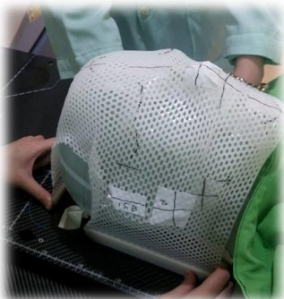

## CT Localization Process

CT localization machines can scan three-dimensional anatomical structures of the human body, providing imaging required for radiation therapy. In the CT room, body molds are also made to assist with daily posture fixation during radiation therapy. Before undergoing CT localization, please remove all metallic objects from your body. Patients who require contrast injection should fast for four hours prior to injection. Before the localization procedure, the nurse will first insert a venous catheter. After the catheter is in place, please wait in the waiting area.

After entering the CT localization room, the radiographer will guide you through the CT localization procedure. If you experience any discomfort (such as pain or coughing), please immediately inform the radiographer.

Depending on the treatment site, different treatment positions are required, and the position must remain consistent each time. Therefore, if you feel any discomfort when the radiographer positions you, please immediately inform them so that the position can be adjusted.

When making the fixation mold, it will feel wet and warm with a certain level of tightness. This level of tightness is necessary to help maintain your position during each treatment (example image shows a head fixation mold; molds of different types will be made depending on the treatment site).After the fixed mold has cooled down, before the CT scan, the nursing staff will inject a contrast agent. The contrast agent itself is warm, so it is normal to feel a warm sensation after it is injected into the body. Once positioning is complete, if there is no discomfort in the body, you can ask the nursing staff to remove the needle (the needle site is where the injection was made). If there are no other fasting requirements for the examination, drinking more water will help eliminate the contrast agent from your body. Your subsequent treatment schedule will be notified by phone.

## Notes

The radiographer will draw black lines and marks on your body, which are used for positioning and posture correction before radiation therapy, not for the actual treatment site. Please be careful when bathing! You can rinse with plain water, but do not use soap or scrub vigorously. If the black lines disappear, do not draw them yourself; instead, wait until your treatment session and have the radiographer handle it.

Yi Da Medical Foundation: Caring for Your Health

Consultation hotline:

Yi Da Hospital: (07) 615-0011  
Yi Da Cancer Treatment Hospital: (07) 615-0022, extension 6813 or 6787  
Yi Da Da Chang Hospital: (07) 559-9123  

Revision date: March 2017  
Form number: HA-12-0008(1)