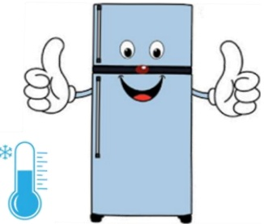

# Sputum Testing Collection Instruction Sheet

One. Testing items: Xpert MTB (Rapid molecular detection for tuberculosis), Mycobacterium culture and acid-fast staining, Routine sputum examination + aerobic bacterial culture, Gram staining of sputum

## Two. Pre-collection precautions:

1. ☐ Xpert MTB: After receiving the collection container, try to cough up sputum within the hospital premises and submit it promptly to facilitate early diagnosis. When coughing up sputum indoors, please go to less crowded areas to avoid cross-infection.

2. The optimal time to collect sputum specimen is the first morning sputum.

3. Before coughing, please rinse your mouth with clean water to avoid oral substances affecting the test results.

## Three. Collection procedure:

1. Cough forcefully from deep in the respiratory tract to expel sputum, not saliva (spit), and spit into a 50 mL sterile centrifuge tube. Immediately close and securely lock the collection container. Do not open it again to avoid contamination and affect the test results.

2. Label the container with the collection date and package it in a double-layer zip-lock bag.

3. If multiple specimens are required, collect specimens daily according to the above method, and mark the date on each container. Collect for three consecutive days and submit all specimens on the third day.

## Four. Post-collection precautions:

1. Deliver the specimen as soon as possible to the receiving window, or store it in refrigeration (place ice blocks outside the zip-lock bag) and complete the delivery within three days.

2. When delivering to the laboratory receiving window, confirm with the receiving staff that the information and date are correct.

3. If three specimens are required, you may refrigerate the first two specimens and deliver them together with the third specimen on the third day. The specimen must be delivered within three days after collection. For example, if collection occurs on a Monday, delivery must be completed by Wednesday at the latest.

Package in a double-layer zip-lock bag and store in refrigeration

Place ice blocks or ice packs outside the specimen bag during transportation to maintain a low temperature environment.

## 4. Receiving hours:

|  | Monday to Friday | Saturday | Contact Phone |
|---|---|---|---|
| Yida Hospital | 07:00–21:30 | 07:00–12:00 | 07-6150011 ext. 2803 |
| Yida Cancer Treatment Hospital | 07:00–17:00 | 07:00–12:00 | 07-6150022 ext. 6285 |
| Yida Dachang Hospital | 07:00–21:30 | 07:00–12:00 | 07-5599123 ext. 7216 |

Source references: EDCP-SOP-T-0301, EDCP-SOP-M-0204, Tsai Wen-cheng (2021). Practical Clinical Microbiological Diagnosis (12th edition). Taipei: Jiuzhou Book.

|  |  |  |
|---|---|---|
| Yida Hospital Address: No. 1, Yida Road, Jiaoshu Village, Yancheng District, Kaohsiung City. Phone: 07-6150011 | Yida Cancer Treatment Hospital Address: No. 21, Yida Road, Jiaoshu Village, Yancheng District, Kaohsiung City. Phone: 07-6150022 | Yida Dachang Hospital Address: No. 305, Dachang Road, Sanmin District, Kaohsiung City. Phone: 07-5599123 |

Yida Medical Foundation, 21×29.7 cm, printed in April 2025