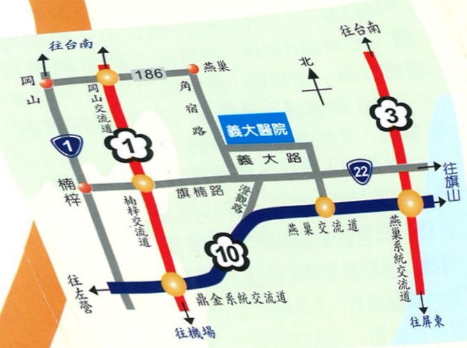

# Newborn Out-of-pocket Health Check-up: Preventing Depression and Anxiety from an Early Age

Address: No. 1, Yida Road, Jiaosu Village, Yanchao District, Kaohsiung City, 824

Phone: 07-6150011

Website: edah@edah.org.tw

This copyright is not allowed to be reproduced, reprinted, or resold without the consent of the copyright holder.

Copyright Holder: Department of Pediatric Medicine

Copyright Owner: Edah Hospital

Form Number: HA-9-0027(1)

Edah Hospital, 21×29.7cm, printed in March 2012, revised in October 2011

## II. Hearing Screening for Toddlers

## Introduction

Every baby's birth brings joy and anticipation to every family—hope that their child will be the best, the top of the class. Yet, behind the desire for children to become outstanding, the most important question is: how much do you truly understand about your child?

Children are a vital asset to society. A child's health is a lifelong concern for parents. To ensure your child builds a solid foundation of health, their growth must be carefully nurtured. Let us save hope for your child—do not let them become a lagging sheep. Participate in and value children's growth and development to cultivate healthy and high-quality future generations. A small tree needs a strong root to grow vigorously. Begin with children's health check-ups.

Self-paid health check-up items for newborns: (applicable from age 0)

## I. Umbilical Cord Blood Allergy Index Test

Does your child suffer from eczema, hives, or diarrhea, which may affect their learning and growth, or even lead to asthma threatening their life? To identify early whether your child belongs to a high-risk group for allergic diseases, it is recommended that pregnant mothers undergo allergy susceptibility screening. Studies show that mothers with allergic tendencies who are exposed to allergens during pregnancy may cause the fetus to develop allergic tendencies, thereby increasing the likelihood of newborns developing allergic conditions. Therefore, prevention and control of allergic diseases should begin during pregnancy!

According to statistics from the American Academy of Audiology, the incidence of moderate to severe hearing loss in young children ranges from 1 to 2 out of every 2,000 infants (i.e., 0.1% to 0.2%). However, in the early stages—especially during the first six months—it is difficult to detect hearing problems in infants through behavioral observation of auditory responses. If hearing loss is only discovered at ages 2 to 3, language development is often already affected, and communication difficulties may arise.

Hearing is a crucial pathway through which humans interact with the external environment. It is extremely important for acquiring knowledge and for physical and mental development. Language acquisition is closely linked to hearing development. Some children who exhibit delayed language development may actually suffer from hearing impairments. Especially during the first two years of life, when learning ability is at its peak, missing this critical period of development can lead to serious consequences. If hearing impairment can be detected within six months of birth and appropriate intervention provided, significant improvements in language, social, and cognitive abilities can be achieved in children with hearing loss.

## III. Pediatric Echocardiogram

According to literature statistics, the incidence of congenital heart disease in children ranges from 0.8% to 1.2%. Some heart conditions may present with physical signs such as heart murmurs, symptoms like rapid breathing, poor growth, or cyanosis. However, others may show no symptoms at all at birth, and even no detectable heart murmurs. If a child is only discovered to have a heart condition when they fail to grow properly, the critical window for growth and treatment may have already passed. Therefore, a pediatric echocardiogram can be used to screen for any congenital structural abnormalities in the baby. We will perform this echocardiogram simultaneously during the baby's first month follow-up visit when the vaccination is administered.

Overview of Newborn Self-Paid Health Check-Up Items

| Check Item                     | Check Fee |
|-------------------------------|-----------|
| Newborn Hearing Screening     | 1,200 NT$ |
| Echocardiogram                | 1,500 NT$ (charged on the day of examination) |
| Umbilical Cord Blood Allergy Index Test | 500 NT$ |

Note: The test reports will be kept by the hospital and stored together with the child's medical records. If you wish to insure your child, please contact the relevant insurance sales representative for details.

For any inquiries, please contact the Pediatric Department consultation line: (07) 6150950