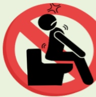
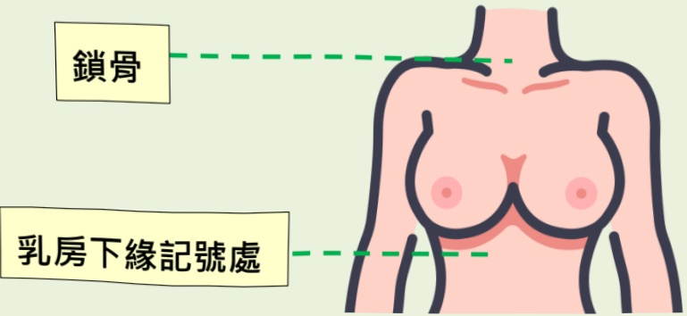

## Radiation Therapy Patient Education Manual

Yi Da Medical Center

Department of Radiation Oncology

Table of Contents  
I. Introduction to Radiation Therapy......1  
II. Indications for Radiation Therapy......2  
III. Radiation Therapy Process......3  
IV. Radiation Therapy Care Guidelines......5  
V. Radiation Therapy Record Card......17## One: Introduction to Radiation Therapy

Radiation therapy is a method of treating cancer and can also be used to treat certain benign conditions. In Taiwan, radiation therapy is commonly abbreviated as "electrotherapy" or "radiotherapy," which may be confused with physical therapy using electrical stimulation in rehabilitation or electrocoagulation therapy for liver tumors. In fact, due to the term "electric light" being used in Hokkien (a variant of Taiwanese dialect) to refer to X-rays, the phrase "treatment by electric light" (in Hokkien) is commonly shortened to "electrotherapy."

In recent years, beyond the conventional X-ray therapy widely recognized by the public, Taiwan's medical community has introduced advanced forms of particle radiation, such as proton and heavy particle therapy. Regardless of the specific treatment method or the source of radiation, patients undergoing radiation therapy do not experience any sensation—such as pain, vision, taste, or touch—similar to undergoing diagnostic imaging procedures in the radiology department.

In an era emphasizing personalized medicine, radiation therapy has long adopted patient-specific treatment strategies. Modern radiation therapy uses medical tomographic imaging to precisely map the location of each patient's tumor and the shape of surrounding normal organs, enabling effective concentration of radiation dose on the target area while minimizing impact on healthy tissues. Radiation therapy can be used independently for curative treatment or combined with other cancer therapies—for example, to enhance treatment efficacy through concurrent chemoradiation or to synergize with immunotherapy to trigger a systemic immune response. For early-stage cancer patients who are not suitable for surgery or who personally refuse surgical intervention, stereotactic radiation therapy is also a viable alternative option.## II. Indications for Radiotherapy

| Treatment Type | Purpose |
|---------------|---------|
| Curative radiotherapy | Nasopharyngeal cancer, early laryngeal cancer, prostate cancer; patients with early-stage cancers who are not suitable for surgery can also achieve curative outcomes using stereotactic radiotherapy. |
| Preoperative radiotherapy | To reduce tumor invasion extent: for example, esophageal cancer and colorectal cancer. |
| Postoperative radiotherapy | To reduce the risk of local recurrence: for example, breast cancer, head and neck cancers, and high-risk groups after surgery for pelvic or abdominal tumors. |
| Cancer with metastasis (few metastatic sites/locations)/Stage IV cancer patients who experience occasional deterioration at specific sites after receiving systemic chemotherapy or immunotherapy targeting therapy | Local radiotherapy can be used to manage these deteriorating lesions, thereby improving the patient's quality of life or survival rate. |
| Palliative care | To alleviate symptoms caused by tumors, such as bone pain, airway compression, venous compression leading to edema in upper or lower extremities, or neurological symptoms caused by brain or spinal cord tumors, thus improving the patient's quality of life. |## Three. Radiation Therapy Process (1/2)

## Three. Radiotherapy Process (2/2)

Note 1: Through outpatient visits or consultation pathways, physicians will analyze the patient's condition to determine whether radiotherapy is needed and what treatment approach should be adopted.

Note 2: To ensure consistent treatment quality, a custom treatment positioning mold will be fabricated in the simulation room prior to treatment. A CT scan will be performed under the treatment posture, allowing physicians and medical physicists to plan the subsequent treatment protocol. For special treatment methods, additional time will be required to verify suitability.

Note 3: The treatment plan design consists of two steps:

(1) The physician selects the treatment area and critical organs on imaging and plans the radiation dosage.

(2) The medical physicist designs one or multiple treatment plans based on the physician's requirements using the treatment planning system, allowing the physician to choose the most favorable option for the patient. Due to individual variations in treatment positions or repeated irradiation cases, this step requires more time.

Note 4: After the treatment plan is finalized, the nursing staff in this department will notify the patient or family that treatment can begin. Treatment duration varies from several minutes to half an hour, depending on the number of treatment sites or the complexity of the treatment method. Please patiently wait for your turn in the waiting area while other patients are undergoing treatment.

## IV. Radiation Therapy Care Guidelines

Different treatment sites require different cognitive and behavioral care approaches. Below, we provide separate care guidance based on various treatment areas. You may select the relevant content according to your specific radiation therapy site.

1. Radiation Therapy Care Guidelines for the Brain...6  
2. Care Guidelines for Radiation-Induced Skin Inflammation in Head and Neck Cancers...8  
3. Oral Mucosal Care Guidelines for Radiation Therapy in Head and Neck Cancers...9  
4. Radiation Therapy Care Guidelines for Esophageal Cancer...10  
5. Radiation Therapy Care Guidelines for Breast Cancer...11  
6. Radiation Therapy Care Guidelines for Colorectal Cancer...13  
7. Radiation Therapy Care Guidelines for Gynecological Cancers...14  
8. Radiation Therapy Care Guidelines for Prostate Cancer...15### 1. Brain Radiation Therapy Care Guidelines

## (1) Definitions

Brain radiation therapy uses high-energy X-rays to irradiate tumors, causing them to shrink, and is considered a localized treatment.

## (2) Applicable Population

When a brain tumor grows in a location or reaches a size that cannot be completely removed through surgery, and after evaluation by a physician, radiation therapy may be arranged post-surgery as an adjunctive treatment.

## (3) Common Side Effects and Causes

| Side Effect | Cause |
|-----------|-------|
| Headache, dizziness, nausea, vomiting | Temporary increase in intracranial pressure during treatment. |
| Skin redness and itching | Skin inflammation reactions may occur in the scalp, ears, external auditory canal, and posterior neck area during treatment. |
| Hair loss | Hair follicles are damaged due to radiation exposure to the scalp within the treatment area. |
| Epilepsy | Patients with brain tumors are more prone to developing epilepsy. |

## (4) Care Methods and Precautions

Maintain regular sleep patterns and avoid staying up late. Diet should avoid stimulating foods such as coffee and strong tea, and opt for light meals to maintain a stable body weight.| 副作用 | 照護方法及注意事項 |
| --- | --- |
| 頭痛、頭暈、噁心、嘔吐 | 治療期間，須維持良好的排便習慣，避免用力解便造成腦壓升高的風險，若解便不順，可請醫師開立軟便藥物使用。 |
| 皮膚發紅搔癢 | 洗髮時，可用溫水輕輕清洗，暫勿使用清潔用品，醫師也會視情況開立藥物使用。 |
| 掉髮 | 待治療結束後頭髮會慢慢長回來。 |
| 癲癇 | 規律服用抗癲癇藥物，避免操作危險性機械，如：汽機車等。 |

開始治療後，每周至少一次需至門診給醫師評估治療狀況，若有不適，醫師也可依照病人情況予開藥減緩不適情形。

  

  

  

  

### 2. Care Guidelines for Radiation Dermatitis in Head and Neck Cancer Patients

## (1) Definitions

Radiation dermatitis: Skin damage and inflammatory reactions caused by radiation therapy.

## (2) Applicable Population

Patients with head and neck cancer undergoing radiation therapy.

## (3) Care Methods and Precautions

Head and neck cancer patients typically begin to experience skin reactions resembling sunburn about 2–3 weeks after starting radiation therapy. The skin in the irradiated area will gradually become red, more sensitive, drier, and more fragile. In severe cases, peeling, oozing, pain, or ulceration may occur. These are normal responses to radiation therapy and will gradually improve after treatment cessation, with the skin eventually returning to its normal state. During radiation therapy, skin care in the treatment area should follow the following guidelines:

Radiation Dermatitis Care Area

1. After daily bathing with warm water, gently pat the skin dry with a soft towel using a pressing motion; avoid rubbing or vigorously wiping the skin.

2. Enhance skin moisturization in the treated area.

3. Do not use razor blades, shaving creams, or depilatory agents, as these may cause skin damage.

4. Avoid massaging, scratching, or rubbing the irradiated skin, and do not apply adhesive tapes—including pain patches—or use cold or hot compresses directly on the irradiated area.

5. Do not apply any lotions, creams, powders, or skincare products to the irradiated area except those prescribed by a doctor.

## Important Reminders:

During radiation therapy, if you experience pain or discomfort due to radiation dermatitis, please visit the radiation oncology department immediately for evaluation by a doctor. The doctor will prescribe appropriate medications or provide suitable treatments based on your symptoms.### 3. Oral Mucositis Care Guidelines for Head and Neck Cancer Patients Under Radiotherapy

## (1) Definitions

Radiation-induced oral mucositis: Head and neck cancer patients undergoing radiotherapy will begin to experience symptoms such as inflammation, redness, swelling, pain, and even ulceration in the oral mucosa approximately 2 to 3 weeks after treatment starts.

## (2) Applicable Population

Patients with head and neck cancer receiving radiotherapy.

## (3) Care Methods and Precautions

a. During treatment, patients should rinse their mouth with warm boiled water every hour or frequently during the day to maintain oral hygiene.

b. After meals, patients should brush their teeth immediately with a soft-bristled toothbrush or rinse their mouth with warm boiled water to maintain oral cleanliness and prevent bacterial growth.

c. Smoking, alcohol consumption, and chewing betel nut are strictly prohibited.

d. If severe inflammation or ulcers in the mouth lead to an inability to eat during radiotherapy, medical support such as nasogastric tube placement may be required after evaluation by a physician. Patients and their families must fully cooperate to ensure adequate nutritional intake.### 4. Radiation Therapy Care Guidelines for Esophageal Cancer

## (1) Definitions

a. Esophageal cancer is cancer occurring in the esophagus. The esophagus is a tube that transports food from the mouth to the stomach.

b. Radiation therapy: A method that uses high-energy radiation to eliminate tumors; also known as radiotherapy.

## (2) Applicable Population

Patients with esophageal cancer undergoing radiation therapy.

## (3) Care Methods and Precautions

|  |  |  |
|---|---|---|
| Choose soft, comfortable clothing and avoid garments with collars. |  |  |
| When securing dressings, use bandages or gauze; avoid direct adhesive tape application on the body. |  |  |
| Dietary intake should include high-calorie, high-protein foods to prevent weight loss. |  |  |
|  |  | ↓ |

### 5. Breast Cancer Radiation Therapy Care Guidelines

## (1) Definitions

Breast cancer radiation therapy involves using high-energy X-rays to irradiate the breast tumor, causing it to shrink, and is considered a localized treatment.

## (2) Applicable Population

After partial or complete surgical removal of the breast tumor, patients who undergo radiation therapy following evaluation have a higher probability of local control, reduced recurrence risk, and prolonged survival.

## (3) Care and Precautions Before and After Treatment

Skin reactions are the most common side effects, typically appearing from the third week of treatment. The skin may appear slightly red and swollen, similar to sunburn, and the pores on the skin may become more visible. Therefore, self-care of the skin is particularly important.

### a. Self-Care of Skin Before Treatment

| Item | Details |
|------|--------|
| Moisturizing | Choose a suitable moisturizer without added fragrances or essential oils. |
| Moisturizer Application Range (as shown in Figure A): | Apply from the clavicle to the lower edge of the breast, and extend to the areas under the armpit and to the reach of the hand. |
| Frequency of Moisturizer Application | Apply 2 to 3 times daily; no need to wash off; allow to air dry naturally. |
| Recommendation | Avoid applying any products two hours before treatment. |
| Reduce Friction | After starting treatment, avoid wearing bras to prevent skin irritation from underwire or elastic bands. |
| Clothing Choice | Wear cotton and breathable clothing; avoid garments with collars or lace, which have excessive stitching. |
| Backpack Use | Avoid carrying a backpack on the affected side. When walking, keep the affected arm across your chest to reduce friction on the underarm skin. |
| Bathing | Bathe once a day; avoid using cleaning products on the treatment area. Simply rinse with plain water and pat dry with a towel. |

Figure A. Moisturizer Application Area

### b. Post-treatment Precautions

After starting treatment, patients must visit the outpatient clinic at least once per week for the doctor to assess the treatment status. If discomfort occurs, the doctor may prescribe medication based on the patient's condition to alleviate the symptoms.

| Medication Application | If more than two creams are used, they should be applied after waiting 15 minutes. |
|------------------------|----------------------------------------------------------------------------------|
|                        | If the skin becomes red, cracked, or develops blisters, the doctor will prescribe a burn cream. Since burn cream is difficult to clean, it does not need to be completely washed off during bathing. Even if some cream remains, a new layer can be directly applied. |
|                        | The burn cream should be applied thickly enough to fully cover the skin so that it is no longer visible. After application, a gauze can be used to cover the area to prevent it from coming into contact with clothes. However, absolutely no adhesive tape should be used to stick to the skin, as removing the tape may cause the skin to be pulled off and result in skin damage. |### 6. Radiation Therapy Care Guidelines for Colorectal Cancer

## (1) Definitions

### a. Colorectal Cancer

The lowest part of the digestive system is called the colon. The final 6 inches of the colon is known as the rectum. After food digestion, waste passes through the colon and rectum (commonly referred to as the large intestine) and is expelled from the body. Cancer that develops in this area is called colorectal cancer (also known as colon or rectal cancer).

### b. Radiation Therapy

Patients with colorectal cancer undergoing concurrent radiation therapy will receive approximately one session per day, five times per week, for a total of about five weeks. The purpose is to prevent local recurrence and possible metastasis; or to shrink the tumor size, allowing for subsequent surgical removal.

## (2) Applicable Population

Patients with colorectal cancer receiving radiation therapy.

## (3) Dietary Care During Treatment

## (4) Precautions

a. If symptoms such as urgency or diarrhea occur, the doctor will prescribe anti-diarrheal and anti-inflammatory pain-relieving medications to alleviate the symptoms.

b. After rinsing the anal area with warm water, use a towel to absorb the moisture.### 7. Care Guidelines for Radiation Therapy in Women with Gynecological Cancers

## (1) Definitions

a. Gynecological cancer: includes malignant tumors of the cervix, uterus, and ovaries.

b. Radiation therapy: a method that uses high-energy radiation to eliminate tumors; also known as radiotherapy.

## (2) Applicable Population

Women undergoing radiation therapy for cervical cancer, uterine cancer, or ovarian cancer.

(3) Care Methods and Precautions

|  |  |  |
|---|---|---|
| Choose soft, comfortable clothing; avoid tight or constricting garments. |  |  |
| Use plain water for bathing; avoid excessive use of bathing products. |  |  |
| Maintain a balanced diet; avoid excessive intake of vegetables and fruits. |  |  |### 8. Prostate Cancer Radiation Therapy Care Guidelines

## (1) Definitions

Prostate cancer radiation therapy involves using high-energy X-rays to irradiate the tumor, causing it to shrink, and is considered a local treatment.

## (2) Applicable Population

Patients with prostate cancer who have been evaluated by a physician and require radiation therapy.

## (3) Side Effects and Care Methods

Organs adjacent to the prostate are the intestines and bladder. Therefore, prostate cancer patients most commonly experience side effects from radiation therapy, primarily gastrointestinal and urinary reactions. These symptoms are all within normal ranges.

| Gastrointestinal | If diarrhea or anal inflammation occurs, clean the anus with clean water after defecation, and avoid using toilet paper as much as possible to reduce anal irritation and skin breakdown. |
|------------------|----------------------------------------------------------------------------------------|
|                  | During defecation, patients may experience a sensation of incomplete evacuation (feeling the urge to go even after defecation), and the doctor will prescribe an anal ointment based on the patient's condition. |
|                  | In severe diarrhea, increase fluid intake and consume easily digestible foods while avoiding spicy and irritating foods. |
| Urinary System   | If frequent urination occurs during treatment, in addition to the requirement of holding urine for 30 minutes during treatment, maintain adequate fluid intake during daily life and avoid holding urine. |## E-DA HEALTHCARE GROUP

## (4) Notes

a. During each treatment session, the bladder must be inflated for at least 30 minutes, and patients should develop a daily bowel habit to reduce side effects on the nearby bladder and rectum.

b. Avoid activities such as soaking in hot springs or warm baths during treatment, as heat sources may exacerbate inflammation.

C. Avoid prolonged sitting or cycling during treatment, as these activities may cause skin irritation or pressure.

d. After starting treatment, patients must visit the outpatient clinic at least once per week for a physician's evaluation of the treatment status. If discomfort occurs, the physician may prescribe medication based on the patient's condition to alleviate symptoms.

e. Application method of rectal ointment: apply a small amount of ointment around the outside of the anus, then attach the tube and insert it into the anus to squeeze a small amount of ointment inside, which can help reduce discomfort (as shown in Figure A below).

Figure A. Application method of rectal ointment
## Five. Radiation Therapy Record Card

## Name of the Attending Physician:

## Estimated Number of Sessions/Dose:

Site: 

|   |   |   |   |   |   |   |   |   |   |
|---|---|---|---|---|---|---|---|---|---|
| 1 | 2 | 3 | 4 | 5 | 6 | 7 | 8 | 9 | 10 |
|   |   |   |   |   |   |   |   |   |   |
| 11| 12| 13| 14| 15| 16| 17| 18| 19| 20|
|   |   |   |   |   |   |   |   |   |   |
| 21| 22| 23| 24| 25| 26| 27| 28| 29| 30|
|   |   |   |   |   |   |   |   |   |   |
| 31| 32| 33| 34| 35| 36| 37| 38| 39| 40|## Name of the attending physician:

## Estimated number of sessions/dose:

Site:  

|   | 2 | 3 | 4 | 5 | 6 | 7 | 8 | 9 | 10 |
|---|---|---|---|---|---|---|---|---|---|
|   |   |   |   |   |   |   |   |   |   |
| 11 | 12 | 13 | 14 | 15 | 16 | 17 | 18 | 19 | 20 |
|   |   |   |   |   |   |   |   |   |   |
| 21 | 22 | 23 | 24 | 25 | 26 | 27 | 28 | 29 | 30 |
|   |   |   |   |   |   |   |   |   |   |
| 31 | 32 | 33 | 34 | 35 | 36 | 37 | 38 | 39 | 40 |None provided.## Contact Information

## ➢ Yida Hospital

Address: No. 1, Yida Road, Jiaosu Village, Yancheng District, Kaohsiung City

Phone: 07-6150011-2205

## ➢ Yida Cancer Treatment Hospital

Address: No. 21, Yida Road, Jiaosu Village, Yancheng District, Kaohsiung City

Phone: 07-6150022-6787

This copyright holder shall not be allowed to reproduce, reprint, or resell without the consent of the copyright holder.

Copyright Holder: Yida Medical Foundation

A neighbor genuinely caring about your health

Yida Medical Foundation 14.8x21cm Printed in December 2023