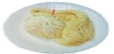
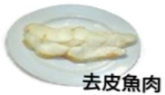
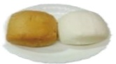
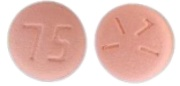
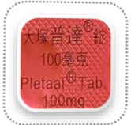
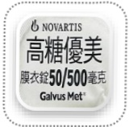

## Pre-examination Diet and Preparation for Gastroscopy with Fulisay (Fuli Hong)

## Dear Guest:

To better understand your health status, please scan the QR code three days prior to your health check-up to complete the relevant assessment questionnaire. If you have acute fever (axillary temperature exceeding 38°C or tympanic temperature exceeding 37.5°C), respiratory symptoms, cough, or other discomforts, please seek medical attention promptly and reschedule your examination.

Health Check-Up

Kindly arrive at the Health Screening Center, 6th floor of Yida Hospital, between  
Year Month  
to complete the assessment questionnaire.

## Items to Bring

- Identity card  
- Health Insurance card  
- Stool specimen box  
- Regular medications  

## Items to Avoid Bringing

- Earrings  
- Necklaces  
- Rings  
- Contact lenses  

## Remove Nail Polishes

- Nail polish on the "index finger" of both hands  
- UV-cured acrylic nails  

## Transportation

Patients receiving anesthesia must not drive or ride a bicycle to the hospital on their own.

## Examination Guide QR Code

Gastrointestinal Examination Guide

Anesthesia and Pain Relief Guide

Coronary Artery CT Scan Guide

Magnetic Resonance Imaging (MRI) Guide

## Precautions for Imaging Examinations

For examinations including coronary angiography (with contrast agent) and abdominal or head CT scans (with contrast agent), please discontinue the use of diabetes medications (metformin) two days before and two days after the examination.

## Precautions for Gastrointestinal Endoscopy

Patients on long-term chronic medications (such as for hypertension, cardiovascular diseases, or thyroid disorders) may continue taking their medications as instructed by their physicians. However, diabetes medications should be temporarily withheld on the morning of the examination and carried with you to the health screening center. For those selecting gastrointestinal examination, if you wish to add a Helicobacter pylori test, it will be an additional self-paid service.

For patients undergoing nasal high-flow humidified oxygen therapy: those with BMI ≥ 35 who are deemed suitable for painless endoscopy by an anesthesiologist must use this service at an additional cost to enhance respiratory safety during anesthesia. For patients with BMI between 30 and 34, it is recommended to use this service.  

Precautions before Gastroscopy

Fluid intake

More than 2000 c.c. per day

## Low-residue diet

## Two days before the examination

Rice porridge

Noodles

Skinless fish meat

Sports drink

## Meal replacement

## [Easy-to-brew meal sets]

One packet for breakfast, lunch, and dinner

Add one packet to 500 c.c. hot water and stir evenly

Fluid intake

Can be consumed after standing still for 10 minutes

## Use of bowel preparation solution

Meat broth

Bowel preparation health education animation (Mandarin)

One day before the examination

Toast

During the week before the examination, drink at least 2000 c.c. of fluids daily

Avoid eating vegetables, fruits, dairy products, and fried foods

Please confirm whether the stool sample has been collected before health check-up

Interval of 1 hour

Fluid intake: 2000 c.c.

Fasting

First bottle + 250 c.c. water diluted

Steamed egg

Manduan (steamed bun)

Bowel preparation health education animation (Taiwanese)

Heat directly in microwave or heat in water bath

#### More than 2000 c.c. per day

Breakfast: one manduan

Lunch: two packets / Dinner: one packet

Medication reminder app (Android)

Medication reminder (iOS)

On the day of examination

05:00 Fasting

Interval of 30 minutes

Try to sit on the toilet to promote bowel movement; use a stool pad to raise the toilet seat for easier defecation

Second dose + 250 c.c. water diluted

Fluid intake: 750 c.c.

Walk around and massage your abdomen; use warm water to wash the anal area to stimulate bowel movements. During the process, you may have several bowel movements. Use warm water to clean to reduce wiping the anal opening.

## Warm reminders

The laxative starts working after drinking; continuously observe the state of the stool fluid [as shown in the left image]. Please take a photo of your last bowel movement using your smartphone to help the nursing staff evaluate.

## Aspirin (Bokey)

## Clopidogrel (Plavix) 75mg/tab

## Shutuan Ning membrane-coated tablet

## Cilostazol (Pletaal)

## Dipyridamole

## 25 mg/tab

## Anti-hyperglycemic drugs

## Warfarin (Cofarin) (Mafarin)

## Dapagliflozin and Metformin (Xigduo XR)

Metformin 1000mg/tab

## Glimepiride and Metformin (Glimet)

Li Kongtang membrane-coated tablet

## Metformin (Ankomin)

## Sitagliptin and Metformin (Janumet)

+ Metformin 500mg/tab

## Vildagliptin and Metformin (Galvus Met)

## Long-term medications should be continued as prescribed by your doctor and should not be stopped; however, for diabetes medications, please refrain from taking them on the morning of the examination day, and carry your medication with you to the health check-up center.

Patients taking antiplatelet, anticoagulant drugs, ginkgo biloba, natto, fish oil, Q10, and other medications should consult with their doctor to evaluate the feasibility of discontinuing these medications for 7 days to reduce the risk of post-polypectomy surgical bleeding.## ☕ ☐

## 01 Natural Disasters

In the event of natural disasters such as typhoons, if the Kaohsiung and Hsinchu areas announce a closure of operations on the day of the health check-up, for safety reasons, all health check-up services will be temporarily suspended. Subsequent scheduling will be arranged by dedicated personnel. Enterprise clients are advised to contact the designated officer for further arrangements!

## 03 Fecal Sample

Collect the sample according to the collection instructions. After collection, place the sample in a green plastic bag and store it in a cool place.

##  $ ^{*} $ This notice is for reference only.

## 02 Menstrual Period

It is not recommended to perform estrogen metabolism, fecal, urine, or smear tests during menstruation. Please reschedule your examination 7 days after the end of your period. If you have confirmed pregnancy or are currently planning or possibly pregnant, these tests are not suitable and should be postponed!

## 04 Parking Exemption Voucher

The parking lot is located next to the "Yi Da Hospital Emergency Department." You can obtain a parking exemption voucher at the health check-up center. Please do not park in private, commercial parking lots.

Yi Da Medical Foundation, Yi Da Hospital, Health Check-up Center

Free parking: ___ hours

Valid period: ___ year ___ month ___ day

Issuing unit: Health Management Center

※ This voucher is valid only on the day of issue

## 05 Fasting

Start fasting after 12:00 PM the day before the health check-up (including chewing gum, sour plums, betel nut), and refrain from drinking water (except for the laxative taken on the morning of the day of the check-up).

Yi Da Medical Foundation, Yi Da Hospital, Health Check-up Center

## 06 Return Visit VIP Discount

Thank you for your continued support and care. If you bring the "health check-up gown" provided by our health check-up center, you may choose one of the blood tests as a complimentary gift. For details on the promotion, please consult the counter staff on the day of your health check-up.

Address: No. 1, Yida Road, Jiaoshu Village, Yancheng District, Kaohsiung City

Consultation phone: (07) 615-0011 ext. 5705, 5707, 5713, 5691

Health check-up service hours: Monday to Friday: 08:00–17:00  
Saturday: 08:00–12:00 (closed on holidays)

Outside regular working hours, night, and holidays

Medication consultation phone: (07) 615-0011 ext. 2000

## References:

fibre diet does not improve colonoscopy preparation results compared