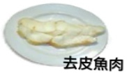
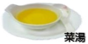
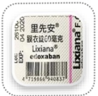
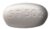
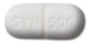

Gastrointestinal Endoscopy Preparation: Diet and Cleansing Agent Niflec Powder (Nafeil Powder) Usage Instructions

Dear Guest:

To better understand your health status, please scan the QR code three days prior to your health check-up to complete the relevant assessment questionnaire. If you have acute fever (axillary temperature exceeding 38°C or tympanic temperature exceeding 37.5°C), respiratory symptoms, cough, or taste disturbances, please seek medical attention promptly and reschedule your appointment.

Health Check-Up

Assessment Questionnaire

Kindly arrive at the Health Screening Center, 6th floor of Yida Hospital on

Year Month Day

at [Time] 

Bring the following items:

- Identity card  
- Health Insurance card  
- Stool specimen box  
- Regular medications  

## Do Not Bring

- Necklaces  
- Rings  
- Contact lenses  

## Remove Nail Polishes

- Nail polish on the "index finger" of both hands  
- UV-cured artificial nails  

## Transportation

Patients receiving anesthesia must **not** drive or ride a bicycle to the hospital on their own.

## Endoscopy Information QR Code

Gastrointestinal Examination Guide  

Anesthesia and Pain Relief Guide  

Coronary Artery CT Scan Guide  

Magnetic Resonance Imaging (MRI) Guide  

## Imaging Examination Precautions

For imaging examinations including coronary angiography (with contrast agent) and abdominal or head CT scans (with contrast agent), stop taking diabetes medications (metformin) two days before and two days after the examination.

## Pre-Endoscopy Instructions

Patients on long-term chronic medications (such as hypertension, cardiovascular diseases, or thyroid medications) may continue taking them as instructed by their physician. No medication should be discontinued. However, diabetes medications should be temporarily withheld on the morning of the examination, and patients should carry their medications with them to the health screening center. For those selecting gastrointestinal examination, if a Helicobacter pylori test is to be added, it will require an additional out-of-pocket fee.

For patients undergoing nasal high-flow humidified oxygen therapy: those with BMI ≥ 35 who are deemed suitable for painless endoscopy by an anesthesiologist must use this service at an additional cost to enhance respiratory safety during anesthesia. For patients with BMI between 30 and 34, it is recommended to use this service.  

Precautions before gastroscopy examination

Fluid intake

More than 2000 c.c. per day

## Low-residue diet

## Two days before the examination

Rice porridge

Noodles

Skinless fish meat

Sports drink

## [Easy-to-prepare meal sets]

Fluid intake

One packet can be consumed for breakfast, lunch, and dinner

Bone broth

Add one packet to 500 c.c. hot water and stir evenly

Allow to stand for 10 minutes before consumption

## Use of bowel preparation solution

Bowel preparation educational animation (Mandarin version)

One day before the examination

>

Interval of 1 hour

Fasting

Take the entire packet plus 2000 c.c. of water, mix well, and take 1000 c.c. first

Hydration: 2000 c.c. per day

Drink at least 2000 c.c. of water daily during the week before the examination

Toast

Avoid eating vegetables, fruits, dairy products, and fried foods

Confirm whether stool sample has been collected prior to health check

Try to sit on the toilet to promote bowel movement; use a stool pad to elevate the toilet seat to facilitate defecation

Mandarin bun

Steamed egg

#### More than 2000 c.c. per day

Breakfast: one mandarin bun

Heat directly in microwave or water bath

Bowel preparation educational animation (Taiwanese version)

Medication reminder app (Android)

Medication reminder (iOS)

On the day of the examination

05:00 Fasting

Drink the remaining 1000 c.c. of the solution

No additional hydration needed

Move around and massage your abdomen; use warm water to wash the anal area to stimulate bowel movements. You may have several bowel movements during this period. Use warm water to clean the anal area to reduce wiping.

## Warm reminders

The bowel preparation solution starts working after drinking it. Please continuously observe the state of the stool (as shown in the left image). Take a photo of your last bowel movement using your smartphone to help the medical staff evaluate your condition.

## Anti-hyperglycemic drugs

## Cilostazol (Pletaal)

## Clopidogrel (Plavix) 75mg/tab

## Shutuan Ning coated tablet

## Dipyridamole

## 25 mg/tab

## Dapagliflozin and Metformin (Xigduo XR)

Metformin 1000mg/tab

## Warfarin (Cofarin) (Mafarin)

## Glimepiride and Metformin (Glimet)

Likongtang coated tablet

## Metformin (Ankomin)

## Sitagliptin and Metformin (Janumet)

+ Metformin 500mg/tab

## Vildagliptin and Metformin (Galvus Met)

## For long-term medications, please continue taking them as instructed by your doctor and do not stop taking them. However, for diabetes medications, please refrain from taking them on the morning of the examination day, and carry your medication with you to the health check-up center.

For patients taking antiplatelet, anticoagulant drugs, ginkgo biloba, natto, fish oil, Q10, and other medications, please consult your doctor to evaluate the feasibility of discontinuing these medications for 7 days to reduce the risk of post-surgical bleeding during polypectomy.## ☕ ☐

## 01 Natural Disasters

In the event of natural disasters such as typhoons, if the Kaohsiung and Hsinchu areas announce a closure of operations on the day of the health check-up, for safety reasons, all health check-up services will be temporarily suspended. Subsequent scheduling will be arranged by dedicated personnel. Enterprise clients are advised to contact the designated officer for further arrangements!

## 03 Fecal Sample

Collect the sample according to the collection instructions. After collection, place it in a green plastic bag and store it in a cool, shaded area.

##  $ x^{2}+y^{2}=r^{2} $ 

## 02 Menstrual Period

It is not recommended to perform estrogen metabolism, stool, urine, or smear tests during menstruation. Please reschedule your check-up for 7 days after the end of your period. If you have confirmed pregnancy or are currently planning or possibly pregnant, these tests are not suitable and should be postponed!

## 04 Parking Exemption Voucher

The parking lot is located next to the "Yi Da Hospital Emergency Department." You can obtain a parking exemption voucher at the health check-up center. Please do not park in private, commercial parking lots.

Yi Da Medical Free Parking Voucher

Free parking: ___ hours

Valid period: ___ year ___ month ___ day

Issuing unit: Health Check-up Center

※ This voucher is valid only on the day of issue.

## 05 Fasting

Begin fasting the night before the health check-up (after 12:00 a.m.), including chewing gum, sour plums, and betel nuts. Water is also restricted (except for the laxative taken in the morning on the day of betel nut consumption).

## 06 Recheck VIP Discount

Thank you for your continued support and patronage. If you bring the health check-up center's "health check-up gown," you may choose one of the blood tests as a complimentary gift. For details, please consult the service staff on the day of your check-up.

Yi Da Medical Foundation, Yi Da Hospital Health Check-up Center

Address: 6F, Yida Road 1, Jiaosu Village, Yanchao District, Kaohsiung City

Consultation phone: (07) 615-0011 ext. 5705, 5707, 5713, 5691

Health check-up service hours: Monday to Friday: 08:00–17:00  
Saturday: 08:00–12:00 (closed on holidays)

Outside regular business hours, night shifts, and holidays  
Medication consultation phone: (07) 615-0011 ext. 2000

## References:

Machlab, S., Martínez-Bauer, E., López, P., Piqué, N., Puig-Diví, V., Junquera, F., … & Campo, R. (2021). Comparable quality of bowel preparation with single-day versus three-day low-residue diet: Randomized controlled trial. Digestive and Gastroenterology 33(5): 707-806.