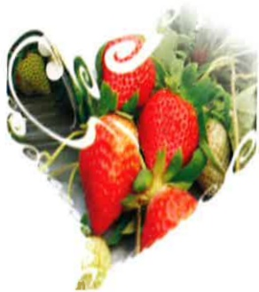
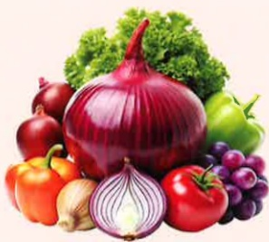
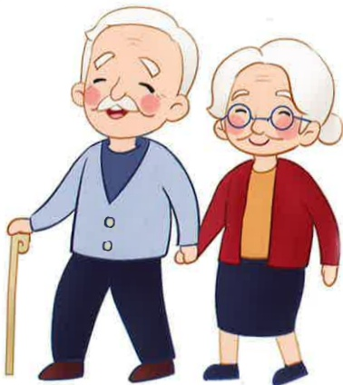
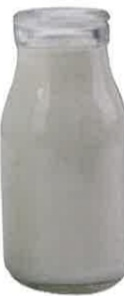
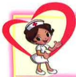
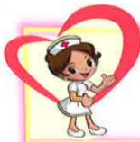
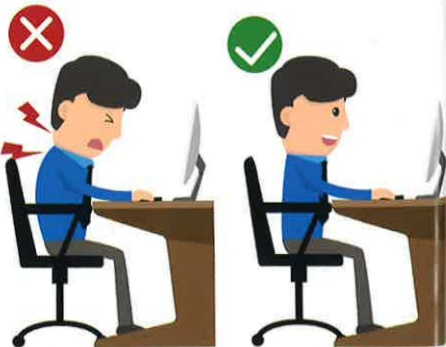

## Health Check Center Health Education Handbook

## B

## Health Education Handbook for Health Check Center

## Table of Contents

1. Diabetes Education......3  
2. Diabetes Diet......5  
3. High Lipid Diet......11  
4. Low Purine Diet (for Hyperuricemia/Gout Diet)......14  
5. Hypertension......17  
6. Duodenal Ulcer......20  
7. What is a Gallstone......22  
8. Understanding Hemorrhoids and Precautions......24## B

## Diabetes Education Handbook

## Table of Contents

9. Urinary Tract Infection...... 26  
10. Prostate Health...... 28  
11. Understanding Herniated Disc...... 30  
12. Understanding Osteoarthritis...... 32  
13. Osteoporosis...... 34  
14. Understanding Bone Density Testing...... 36  
15. How Harmful Is Smoking...... 41

16. References...... 43

## Diabetes Education

## I. What is Diabetes?

Diabetes is a systemic metabolic disorder, primarily caused by insufficient secretion or poor action of insulin in the body, leading to abnormal metabolism of carbohydrates, proteins, and fats. This results in excessive glucose in the blood, which is excreted through the kidneys and appears in urine.

## II. What are the symptoms of diabetes?

Main symptoms include the commonly mentioned "three more": eating more, drinking more, and urinating more. Other typical symptoms include weight loss and fatigue. Additional symptoms may include skin itching, slow wound healing, numbness, tingling, or pain in the feet, and blurred vision.

## III. Who is at risk of developing diabetes?

Individuals with a family history of diabetes, those who are overweight, middle-aged and older adults, people who are physically inactive, individuals with high blood pressure or high cholesterol.

## IV. What types of diabetes are there?

## 1. Type 1 Diabetes:

This is an insulin-dependent type, typically occurring in children and individuals under the age of 30. Due to the pancreas being unable to produce insulin, most patients require lifelong insulin injections.

## 2. Type 2 Diabetes:

This is a non-insulin-dependent type, usually affecting adults over the age of 40, although it is now also affecting younger individuals. This type results from the dysfunction of beta cells ($\beta$ cell) and reduced insulin sensitivity in body cells. Type 2 diabetes often has a familial genetic background, and factors such as obesity, unhealthy lifestyle, and environmental risks further contribute to its development.## V. Diagnosis of Diabetes

The diagnosis of diabetes is primarily based on blood glucose levels. According to the diagnostic criteria published by the American Diabetes Association in 2011, the following apply:

1. HbA1C ≥ 6.5%.

2. Fasting blood glucose ≥ 126 mg/dL after an 8-hour fast, or 2-hour postprandial glucose ≥ 200 mg/dL following an oral glucose tolerance test.

3. Presence of typical symptoms of hyperglycemia or hyperglycemic crisis, with a random blood glucose level ≥ 200 mg/dL, which can be used to diagnose diabetes.

## VI. Treatment of Diabetes

1. Patients with Type 1 diabetes:

The current treatment involves lifelong insulin therapy to control blood glucose levels.

2. Patients with Type 2 diabetes:

The first step in treatment is healthy dietary habits and appropriate physical activity. If blood glucose levels still fail to reach the target, oral hypoglycemic agents may be initiated.

## VII. Symptoms of Hypoglycemia

Hypoglycemia refers to blood glucose levels below 70 mg/dL. It is typically accompanied by symptoms such as hunger, dizziness, cold sweats, tachycardia, and weakness. If a patient becomes aware of hypoglycemia and is conscious, they should immediately consume half a cup (120–180 c.c.) of fruit juice, one tablespoon of honey, or 3–4 pieces of sugar. If symptoms do not subside after 15 minutes, the treatment should be repeated. If symptoms persist without improvement, medical help should be sought immediately.

## Diabetes Diet

1. Eat at regular intervals and in fixed portions: to maintain stable blood glucose levels.

2. Maintain an ideal body weight: obesity increases insulin resistance.

3. Balanced intake of the six major food groups:

   a. Dairy: low-fat milk, skim milk, cheese, etc.

   b. Staple foods: rice, buns, noodles, sweet potatoes, corn, red beans, green beans, etc.

   c. Meat, fish, beans, and eggs: chicken, duck, beef, lamb, pork, tofu, eggs, etc.

   d. Vegetables: dark green, light green vegetables, leafy greens, gourds, mushrooms, etc.

   e. Fruits: various fresh fruits such as oranges, bananas, papaya, and pomelos, etc.

   f. Fats: cooking oils, nuts such as peanuts, cashews, and sunflower seeds, etc.

4. Increase dietary fiber intake:

   a. Fiber:

      (1) Prevents rapid postprandial blood glucose spikes.

      (2) Increases satiety.

      (3) Prevents constipation.

   b. Sources: vegetables, tomatoes, whole grains, etc.

   c. Prevents rapid postprandial blood glucose spikes.

5. Use low-fat cooking methods: prefer steaming, boiling, braising, stewing, roasting, or stir-frying.

6. Reduce total fat intake:

   a. Avoid animal skin: fatty meat, pork skin, duck skin, chicken skin, fish skin, etc.

   b. Avoid fatty meats, five-layer pork, chicken wings, etc.

   c. Avoid fried, pan-fried, deep-fried, or oil-based dishes such as oiled dishes, thick soups, etc.

   d. Avoid nuts such as peanuts, cashews, sunflower seeds, and almonds.

   e. Strictly avoid alcohol.

## VIII. Reduce intake of high-cholesterol foods:

For example, brain, liver, internal organs, testes, crab roe, shrimp roe, fish roe, and egg yolks, etc.## 8. Avoid excessive salt intake:

Avoid overly salty, pickled, and canned processed foods; reduce the use of seasonings to prevent conditions such as high blood pressure and cardiovascular diseases.

## 9. Limit intake of refined sugars:

Such as sugary drinks, boxed fruit juices, sweets, snacks, and alcoholic beverages. Individuals who enjoy sweet foods can choose low-calorie sweeteners (artificial sweeteners), such as aspartame, saccharin, or potassium acetate.

## 10. Foods you can freely choose:

Boiled vegetables, large tomatoes, konjac, herbal jelly and *aiyu* (a traditional Chinese dessert) with artificial sweeteners, various artificial sweetener candies, artificial sweetener sodas (e.g., Diet Coca), and beverages with artificial sweeteners (such as green tea, black tea, and black coffee).

## 11. Exercise:

Engage in physical activity according to your personal physical condition and preferences, with appropriate intensity and frequency.

| | | Name: | | | | | | |
|---|---|---|---|---|---|---|---|---|
| Date: | Year | Month | | | | | | |
| Total calories: | | kcal/day | | | | | | |
| Carbohydrates: | | grams | | | | | | |
| Fats: | | grams | | | | | | |
| Proteins: | | grams | | | | | | |
| Meal category | Portions | Breakfast | Breakfast snack | Lunch | Lunch snack | Dinner | Dinner snack | |
| Whole grains and coarse cereals | | | | | | | | |
| Legumes, fish, eggs, meat | | | | | | | | |
| Dairy products | | | | | | | | |
| Vegetables | | | | | | | | |
| Fruits | | | | | | | | |
| Oils and nuts/seeds | | | | | | | | |## Food Substitution Chart

## Whole Grains 1 serving (grams)

70 kcal = cooked rice 1/4 bowl (50 g) = mochi 1/2 piece (50 g)  
= noodles (cooked) 1/2 bowl (60 g) = sweet and sour pork (70 g)  
= buns 1/3 piece (medium) (30 g) = potato 1/2 piece (medium) (90 g)  
= porridge 1/2 bowl (125 g) = yam 1/5 piece (medium) (55 g)  
= hamburger bread 1½ = rice cake 1/2 bowl (125 g)  
= job's tears 1½ tablespoons (20 g) = red beans, green beans, or soybeans 2 tablespoons (dry) (25 g)  

70 kcal = emperor beans (65 g) = corn or corn kernels 2/3 piece (85 g)  
= small sandwich bread 1 piece (25 g) = muesli 3 tablespoons (20 g)  
= pumpkin (85 g) = sweet potato 1/2 piece (small) (55 g)  

70 kcal = dumpling skin 3–7 sheets (30 g) $ \frac{1}{2} $ sheet = 1 $ \frac{1}{2} $ sheets (30 g) = water dumpling skin 3 sheets (30 g)  
= soda bread 3 pieces (20 g) = toast 1/2–1/3 piece (30 g)  

70 kcal = lotus root cake 1 piece (35 g) $ (6 \times 8 \times 1.5 \text{ cm}) $ = egg pancake skin, scallion oil pancake skin (frozen) (35 g)  
= pancake 1/4 piece $ (+1/2 \text{ tsp oil}) $ = fried dough $ (+3 \text{ tsp oil}) $ 2/3 piece (40 g)  
= dried winter noodles 1/2 handful (15 g) = wet rice flour noodles 1/2 bowl (40 g) = lotus root flour 3 tablespoons (20 g)  
= lotus seed with husk 8 pieces (60 g) = chestnut (dry) 3 large pieces (60 g)  
= milk pastry $ (+1 \text{ tsp oil}) $ 1/3 small piece (30 g) = pineapple bread $ (+1 \text{ tsp oil}) $ 1/3 small piece (30 g)  

## ☆ Meat 1 serving (edible raw weight) (grams)

55 kcal = common fish (35 g) = lean meat 1/2 catty (35 g) = chicken breast (30 g)  
= sea cucumber (100 g) = shrimp (50 g) = fish balls (no meat content) (10 g carbohydrates) (55 g)  
= pork blood (110 g) = ham (+5 g carbohydrates) (45 g)  
= dried beef (+5 g carbohydrates) (20 g) = dried pork (+5 g carbohydrates) (15 g)  
= small eel (salted) (35 g) = squid (60 g) = egg 1 piece  

= oyster (65 g) = chicken leg (40 g) = small dried fish (10 g)  
= mussels (160 g) = pork large muscle (35 g)  

75 kcal = sea bream, black fish, salmon (35 g) = cod (50 g) = squid balls, sea bream balls (+7 g carbohydrates) (60 g)  
= pork jerky (+5 g carbohydrates) (20 g) = tuna balls, fish balls (with meat) (+7 g carbohydrates) (60 g)  
= chicken wing/chicken cutlet (40 g) = chicken feet (30 g)  

120 kcal = autumnal fish (35 g) = beef strip (40 g)  

## ☆ Soy-based products 1 serving (edible raw weight) (grams)

55 kcal = soybeans 1/2 bowl (50 g) (+10 g carbohydrates) = yellow beans (20 g) (+5 g carbohydrates)  
= steamed bean bun 2/3 piece (30 g) = dried tofu (40 g) = sausage (35 g) = unsweetened soy milk (190 ml)  

75 kcal = bok choy (50 g) = oil (55 g) = dried yellow beans (70 g) = traditional tofu (80 g) = soft tofu 1/2 box (140 g)  

120 kcal = vegetable chicken (40 g) = vegetable fish (35 g) = bok choy tofu (70 g) = wheat gluten (15 g)  

## ☆ Dairy products 1 serving (milliliters)

80 kcal = skim milk powder 2.5 tablespoons (25 g) = skim milk (240 ml)  

120 kcal = low-fat milk powder 3 tablespoons (25 g) = low-fat milk 1 cup (240 ml) = low-glycemic yogurt 1 cup (240 ml) = unsweetened yogurt (210 g)  

150 kcal = whole milk powder 4 tablespoons (30 g) = whole milk 1 cup (240 ml) = cheese slice 2 pieces (45 g)  

## ☆ Oils and nuts/seeds 1 serving (grams)

45 kcal = melon seeds, pumpkin seeds (about 30 pieces) (10 g) = peanuts (about 50 pieces) (15 g)  
= black (white) sesame 2 teaspoons (10 g) = avocado 1/6 piece (40 g)  
= sesame oil 1 teaspoon (5 g) = cashew nuts 15 pieces (10 g)  
= salad dressing 2 teaspoons (10 g) = almond 5 pieces (7 g) = walnut 2 pieces (7 g)  
= vegetable oil 1 teaspoon (5 g) = peanut pieces 10 pieces (13 g)  
= peanut flour 1 tablespoon (8 g) = macadamia nut 5 pieces (8 g)  
= egg mayonnaise 1 teaspoon (8 g) = bacon slice (25 × 3.5 × 0.1 cm) (15 g)  

## ☆ Vegetables 1 serving (100 grams)

25 kcal = various dark and light vegetables: including leafy greens, gourds, mushrooms, bamboo shoots, radish, etc.  

##  $ ^{*} $ Fruit portion (purchase weight: grams)

60 kcal = 3/4 of grapefruit (245 g) = 1/3 of papaya (165 g)  
= 1 slice of watermelon (320 g) = 1 small banana (95 g) = 1/2 of a large banana  
= 23 cherry tomatoes (220 g) = 3/4 of water pear (210 g)  
= 1/4 of honeydew melon (300 g) = 2/3 of monto melon (245 g)  
= 1 small apple (125 g) = 9 cherries (85 g)  
= 16 strawberries (small) (170 g) = 13 lychees (130 g)  
= 13 grapes (105 g) = 3/4 of osmanthus (180 g)  
= 1 tao banana (155 g) = 1/10 of pineapple (205 g)  
= 1 slice of golden mango (140 g) = 2 passion fruits (140 g)  
= 1/4 of durian (130 g) = 9 lychees (185 g)  
= 1.5 kiwis (125 g) = 2 dates (140 g)  
= 1 lotus root (170 g) = 1 orange (150 g)  
= 2 long pepper (180 g) = 1 dragon fruit (110 g)  
= 1 small water peach (150 g) = 1/2 of a rambutan (105 g)

= 1 slice of golden mango (140 g) = 2 passion fruits (140 g)  
= 1/4 of durian (130 g) = 9 lychees (185 g)  
= 1.5 kiwis (125 g) = 2 dates (140 g)  
= 1 lotus root (170 g) = 1 orange (150 g)  
= 2 long pepper (180 g) = 1 dragon fruit (110 g)  
= 1 small water peach (150 g) = 1/2 of a rambutan (105 g)

## Diet for Hyperlipidemia

Hyperlipidemia refers to increased cholesterol and triglycerides in the blood. Abnormal lipid levels (hypercholesterolemia, hypertriglyceridemia, or both) are the primary cause of atherosclerosis, increasing the risk of coronary artery disease and cerebrovascular diseases.

【Standard lipid levels for adults】

| Lipid Type                  | Standard Range       | Borderline High Level | High Level         |
|----------------------------|----------------------|------------------------|--------------------|
| Total cholesterol (non-fasting) | < 200 mg/dL         | 200–239 mg/dL          | ≥ 240 mg/dL        |
| LDL cholesterol (fasting 12 hours) | < 140 mg/dL         | 140–159 mg/dL          | ≥ 160 mg/dL        |
| Triglycerides (fasting 12 hours) | < 150 mg/dL         | 150–400 mg/dL          | > 400 mg/dL        |

## Part I: Diet for Hypercholesterolemia

## 1. Maintain an ideal body weight.

2. Limit intake of foods high in cholesterol, such as internal organs (brain, liver, kidneys), crab roe, shrimp roe, fish roe, etc. If blood cholesterol is elevated, limit egg yolks to no more than 2–3 per week.

3. Reduce intake of foods high in saturated fat. Animal-based foods: fatty meats, full-fat dairy, butter, lard, tallow, etc. Plant-based foods: roasted coconut oil, palm oil, palm kernel oil, etc.

4. Use plant oils rich in monounsaturated fatty acids for cooking, such as peanut oil, rapeseed oil, olive oil, etc.

5. Adopt low-fat cooking methods, such as steaming, boiling, roasting, stewing, pickling, braising, stir-frying, or cold-dressing. Reduce consumption of meat skin (pork skin, duck skin, chicken skin, fish skin), to minimize fat intake.

6. Choose fiber-rich foods, such as various vegetables and fruits, unprocessed legumes, whole grains, etc.

7. Moderately consume foods rich in natural antioxidants (such as polyphenols, vitamin C, carotenoids, isoflavones), such as fruits and vegetables, green tea, to enhance vascular antioxidant function.

8. Adjust lifestyle habits: quit smoking, limit alcohol consumption, engage in moderate physical activity, and manage stress.## Two. Dietary Guidelines for Triglycerides

1. Maintaining a healthy weight helps reduce triglyceride levels.

2. Avoid high-fat and high-sugar foods such as fried chicken, french fries, oil cakes, cashews, peanuts, sunflower seeds, cakes, Chinese pastries, chocolate, and ice cream.

3. Limit consumption of refined sweets, fruit juices, soft drinks, various candies or pastries, and other sugar-added products. Reduce intake of polysaccharide-rich foods such as grains and root vegetables.

4. Increase intake of fish rich in omega-3 fatty acids, such as salmon, cod, and sardines.

5. Other recommendations can be found in the dietary guidelines for high cholesterol.

## Cholesterol Content in Foods

(per 100 grams of edible portion)

| Food Name       | Cholesterol (mg) | Food Name       | Cholesterol (mg) | Food Name       | Cholesterol (mg) | Food Name       | Cholesterol (mg) |
|----------------|------------------|----------------|------------------|----------------|------------------|----------------|------------------|
| Fresh milk     | 10               | Yellow fish    | 66.4             | Clams           | 454              | Chicken liver   | 358.5            |
| Whole milk     | 14               | Snapper        | 120              | Fish products   | 40               | Chicken liver   | 195              |
| Skim milk      | 2                | Eel            | 189              | Dried fish      | 80               | Turkey liver    | 599              |
| Sweetened whole milk | 8         | Sardines       | 140              | Chicken breast (native chicken) | 58.8 | Chicken heart   | 143.2            |
| Whole milk powder | 109           | White fish     | 69               | Chicken breast (commercial chicken) | 56.8 | Pork stomach and intestines | 68 |
| Skim milk powder | 22             | Sea bass       | 50               | Chicken leg meat | 91               | Pig kidney      | 266.5            |
| Egg            | 504              | Shark          | --               | Whole chicken   | 60–90            | Pig brain       | 2074.7           |
| Egg white      | 0                | Golden thread fish | 63.5          | Turkey breast meat | 77              | Pig, cow, sheep heart | 274       |
| Duck egg       | 560              | Sea fan        | 53               | Turkey leg meat | 101              | Pig, cow, sheep pancreas | 466 |
| Goose egg      | 564              | Crab           | 80               | Beef lean meat  | 91               | Grains          | 0                |
| Fish roe        | 360              | Shrimp          | 200              | Young beef      | 90               | Vegetables      | 0                |
| Soy products    | 0                | Grass shrimp    | 157              | Pork lean meat  | 88               | Fruits          | 0                |
| Salmon         | 35               | Lobster         | 85               | Three-layer pork | 65.9            | Angel cake      | 0                |
| Cod            | 55               | Sea cucumber    | 85               | Pig hind leg meat | 67.8            | Fruit cake      | 45               |
| General sea fish | 50–60          | Abalone         | 145              | Sheep lean meat | 100              | Chocolate cake  | 47               |
| General freshwater fish | 60–80 | Octopus         | 182.7            | Sheep hind leg meat | 70             | Chocolate ice cream | 40         |
| Tuna           | 65               | Cuttlefish      | 180              | Rabbit meat      | 91               | Vanilla ice cream | 50         |
| Grass carp      | 85               | Abalone (dried) | 615              | Ham             | 32.9             |                  |                  |
| Carp           | 90               | Scallop (dried) | 615              | Sausage         | 65               |                  |                  |

Cholesterol Content in Foods

(per 100 grams of edible portion)

| Food Name       | Cholesterol (mg) | Food Name       | Cholesterol (mg) | Food Name       | Cholesterol (mg) | Food Name       | Cholesterol (mg) |
|----------------|------------------|----------------|------------------|----------------|------------------|----------------|------------------|
| Egg yolk        | 1482             | Clams, oysters | 50               | Turkey breast meat | 77              | Pig, cow, sheep liver | 438       |
| Duck egg        | 560              | Sea fan        | 53               | Turkey leg meat | 101              | Pig, cow, sheep pancreas | 466 |
| Goose egg       | 564              | Crab           | 80               | Beef lean meat  | 91               | Grains          | 0                |
| Fish roe        | 360              | Shrimp          | 200              | Young beef      | 90               | Vegetables      | 0                |
| Soy products    | 0                | Grass shrimp    | 157              | Pork lean meat  | 88               | Fruits          | 0                |
| Salmon          | 35               | Lobster         | 85               | Three-layer pork | 65.9            | Angel cake      | 0                |
| Cod             | 55               | Sea cucumber    | 85               | Pig hind leg meat | 67.8            | Fruit cake      | 45               |
| General sea fish | 50–60           | Abalone         | 145              | Sheep lean meat | 100              | Chocolate cake  | 47               |
| General freshwater fish | 60–80 | Octopus         | 182.7            | Sheep hind leg meat | 70             | Chocolate ice cream | 40         |
| Tuna            | 65               | Cuttlefish      | 180              | Rabbit meat      | 91               | Vanilla ice cream | 50         |
| Grass carp      | 85               | Abalone (dried) | 182              | Ham             | 32.9             |                  |                  |
| Carp            | 90               | Scallop (dried) | 615              | Sausage         | 65               |                  |                  |

## Low purine diet (diet for hyperuricemia/gout)

## I. Dietary principles

1. Proteins in food are broken down into "purines" during digestion. Purines are then metabolized by the liver into "uric acid," which is finally excreted from the body through the kidneys. Approximately 85% of uric acid in the human body is produced internally. Therefore, in addition to maintaining a balanced intake of the six major food groups and limiting high-purine foods, patients should also receive medication for control and maintain an ideal body weight.

2. Maintain an ideal body weight. When overweight, weight loss should be gradual, with a recommended loss of 1–2 kilograms per month. Avoid extreme dieting, as rapid tissue breakdown can produce large amounts of uric acid and ketone bodies, triggering gout attacks. Weight loss is not recommended during acute attacks.

3. To prevent excessive uric acid production, protein intake should be controlled. The recommended intake is 1 gram of protein per kilogram of body weight per day.

4. During acute attacks, protein should ideally come solely from egg, milk, or dairy products, and should be selected from low-purine foods. Please refer to the food selection table (Table 1).

5. High-fat diets inhibit uric acid excretion. Therefore, cooking fats should be used in moderation, and fried or pan-fried foods should be avoided. Cooking methods such as steaming, boiling, roasting, pickling, cold-pressed, and microwave cooking are recommended.

6. When appetite is poor, small amounts of sugary liquids (such as honey or fruit juice) may be provided to prevent insufficient caloric intake, which could lead to accelerated fat breakdown and reduced uric acid excretion. (Diabetic patients should not use this.)

7. Even outside of acute attacks, high-purine foods should be limited. Moderate intake of medium-purine foods is acceptable, and dried beans should be consumed as little as possible. Daily intake should primarily consist of low-purine foods.

8. High-fat diets inhibit uric acid excretion. Therefore, cooking fats should be used in moderation, and fried or pan-fried foods should be avoided. Fat intake should be less than 30% of total energy intake.

9. Alcohol and high-fructose beverages: Alcohol and beverages containing high-fructose corn syrup are metabolized into lactic acid in the body, which affects uric acid excretion and accelerates uric acid formation.

## 10. Avoid overeating.

11. Patients should drink plenty of water to aid uric acid excretion. It is recommended to consume at least 3,000 milliliters of liquid daily.

12. The metabolic byproducts of cocoa, coffee, and tea do not accumulate in body tissues. Moderate consumption can increase fluid intake and accelerate uric acid excretion.

13. Moderate consumption of tofu has been shown to alter plasma protein concentration and increase uric acid clearance and excretion.

## E-DA HEALTHCARE GROUP

Section Two: Food Selection Chart (Table One)

| Food Category | (High purine content) 100–1000 mg purine/100g food | (Moderate purine content) 9–100 mg purine/100g food | (Low purine content) 0–9 mg purine/100g food |
|--------------|--------------------------------------------------|--------------------------------------------------|---------------------------------------------|
| Dairy and dairy products | | | Various dairy and dairy products |
| Meat and egg products | Goose meat, gull, pork, beef, pork brain, pork kidney, pork, beef heart, pork tongue, beef, sheep pancreas, pork and beef shoulder meat, beef leg meat, chicken wing, chicken leg, chicken breast, chicken liver, chicken gizzard, Italian sausage | Duck meat, beef, lamb (most meats, except those listed under high purine content) | Egg, duck egg, preserved egg |
| Fish and fish products | Sardines, anchovies, sardine, mackerel, bamboo shrimp, katsuobushi, skipjack, tuna, flying fish, snapper, flounder, smoked fish, salmon, carp, small dried fish, clams, sea fan, fish roe, crab, mussels, oysters, clams, crab roe, dried squid, scallops, lobster, shrimp, prawn, octopus | Eel, fish paste, bamboo round, fish cake, king crab, sea fan, fish, shellfish (most fish, except those listed under high purine content) | Salted salmon roe |
| Food Category | (High purine content) 100–1000 mg purine/100g food | (Moderate purine content) 9–100 mg purine/100g food | (Low purine content) 0–9 mg purine/100g food |
| Starchy roots and grains | | | Brown rice, germinated rice, white rice, glutinous rice, rice flour, wheat, oats, oatmeal, flour, noodles, pasta, corn, millet, sorghum, potato, sweet potato, yam, winter noodles, tapioca, cassava flour, lotus root flour |
| Main food and its products | Natto | Tofu, soybeans, miso, soybeans with hair | |
| Vegetables | Dried shiitake mushrooms | Asparagus, dried legumes, broad beans, mushrooms, peas, spinach, white mustard, cauliflower, enoki mushrooms, black fungus | Most vegetables (except those listed under moderate purine content) |
| Fruits | | | Various fruits |
| Oils | | | Various plant oils, animal fats, nuts |
| Others | Meat broth, concentrated meat broth, chicken flavoring, yeast powder | Dried kelp, peanuts, soy sauce | Ice cream, cake, cookies, carbonated drinks, chocolate, coffee, tea, herbal plants, olives, pickled foods, popcorn, pudding, salt, sugar, vinegar, white sauce |

## Hypertension

## ★ What is hypertension?

Blood pressure refers to the pressure exerted on the walls of blood vessels when blood is pumped from the heart and flows through the vessels. Blood pressure can be expressed in two ways:

## Section One: Systolic pressure (commonly known as high blood pressure):

The pressure formed when the heart contracts and blood is ejected from the ventricles, impacting the arterial walls (normal: <120 mmHg).

## Section Two: Diastolic pressure (commonly known as low blood pressure):

The pressure formed when the heart relaxes and blood flows through the arterial system (normal: <80 mmHg).

## Section Three: How to determine "hypertension"?

Measure blood pressure in a calm state, with at least three readings over two consecutive weeks, all exceeding 140/90 mmHg.

## Section Four: What are the symptoms of hypertension?

In the early stages, there are often no noticeable symptoms. Most patients are unaware they have hypertension, which is why hypertension is known as the "silent killer." Symptoms mainly depend on the extent of organ damage:

1. **Cerebrovascular obstruction**: Symptoms include headache, dizziness, head pressure, memory loss, difficulty concentrating, and insomnia. In severe cases, ischemic or hemorrhagic stroke may occur, leading to various complications.

2. **Cardiac issues**: Palpitations, heart failure (difficulty breathing, lower limb edema), coronary artery hardening (chest tightness, angina).

3. **Renal insufficiency**: Proteinuria, oliguria, lower limb edema.

4. **Retinal vascular changes**: Vision loss, retinal bleeding.

5. **Peripheral vascular hardening**: Intermittent claudication, numbness in the limbs (due to arterial hardening causing reduced or interrupted blood flow to the lower limbs).## V. Who is prone to hypertension?

1. Obese individuals.  
2. Those over 40 years of age.  
3. Individuals with long-term excessive mental stress.  
4. Those with excessive sodium intake.  
5. Individuals affected by genetic factors.

## VI. Precautions for hypertension patients

1. Ensure adequate sleep and rest, and avoid overexertion.  
2. Do not bathe or soak in water that is too hot or too cold.  
3. Adjust clothing according to weather changes and pay attention to warmth.  
4. Take medication as prescribed by a doctor; do not stop taking medication on your own or use unproven remedies.  
5. When blood pressure is unstable, measure and record it daily for reference by a physician.  
6. Adopt a low-sodium diet.  
7. Maintain a healthy body weight.  
8. Quit smoking and limit alcohol consumption.  
9. Maintain smooth bowel movements.  
10. Engage in appropriate physical activity. The ideal exercise should be moderate, such as walking, fitness exercises, swimming, or stretching limbs while lying in bed before waking up.

## VII. Precautions for exercise

1. Avoid exercising within one hour after meals.  
2. Exercise daily for 20–30 minutes each time.  
3. When blood pressure is fully controlled, gradually increase the intensity of exercise.  
4. If any discomfort occurs during exercise, stop immediately and measure blood pressure.  
5. If symptoms do not improve after rest, seek medical attention.

## VIII. Maintain emotional stability

## IX. Dietary restrictions and recommendations for hypertension patients

1. Consume more high-fiber foods such as fresh fruits and vegetables to prevent constipation.  
2. Limit intake of high-sodium foods such as salt, soy sauce, monosodium glutamate (MSG), and preserved foods (e.g., pickles, fermented tofu, pickled vegetables, dried meats).  
3. Avoid high-cholesterol foods such as animal offal, fatty meats, lard, shrimp, crab, oysters, fish roe, cake, and egg yolks.  
4. Use seasonings such as scallions, ginger, eight-spice, cinnamon, garlic, and five-spice powder to enhance flavor. Use plant-based oils such as sunflower oil or olive oil.  
5. Eat meals at fixed times and in fixed portions to maintain an ideal body weight. Avoid eating out to prevent excessive intake of salt and MSG.  
6. Adjust lifestyle habits such as quitting smoking and engaging in appropriate physical activity.

## Chapter Twelve: Duodenal Ulcer

## I. Definition

Ulceration of the duodenal bulb and second part due to erosion by gastric acid is known as "duodenal ulcer."

## II. Symptoms

1. Pain occurs in the upper central area of the abdomen.

2. The typical pain of duodenal ulcer occurs 3 to 5 hours after eating, when the stomach is empty—this is known as "hunger pain."

3. When there is sudden massive bleeding, vomiting blood may occur.

## III. Complications: Consider surgical treatment if any of the following complications are present.

1. Perforation of the ulcer.

2. Massive upper gastrointestinal bleeding.

3. Persistent pain.

4. Pyloric stenosis or outlet obstruction.

## IV. Prevention and Health Care Methods:

1. Avoid smoking, alcohol, and stimulating foods such as tea, coffee, chili, or overly acidic or sweet foods.

2. Eat meals at regular times and in fixed quantities, and consume more meat or fish.

3. Avoid staying up late; try to go to bed before 10:30 p.m. If you must stay up late, eat an extra meal.

4. Avoid liquid foods unless there is bleeding.

5. Maintain a relaxed mood and reduce stress.

6. Take antacids as prescribed by a doctor.

7. If there is Helicobacter pylori infection, additional antibiotic treatment is required.

## V. Dietary Principles

Food selection for peptic ulcers is divided into three stages depending on the severity of the ulcer:

First stage: From the time of bleeding to after hemostasis (1–3 days). Milk or cold liquid foods should be consumed.

Second stage: From 1–3 days after hemostasis to the recovery period. Soft foods or mild diets are recommended.

Third stage: During the recovery period. A normal diet can be adopted, and it is best to consume a variety of food types.

## What are gallstones?

## I. Introduction:

Gallstones are a common disease and can become a serious health concern.

## II. Classification:

The exact cause of gallstone formation is still unclear. Gallstones are generally classified into two types: pigment stones and cholesterol stones. In Taiwan, most gallstones are pigment stones, accounting for over 60%.

## III. Causes of cholesterol gallstones:

1. Genetics: The incidence varies among different ethnic groups. For example, up to 80% of adult Peruvian Indian women have cholesterol gallstones, which is significantly higher than in Eastern populations.

2. Gender: Adult women have a higher incidence than men of the same age group.

3. Age: The incidence increases with age.

4. Pregnancy: During pregnancy, the saturation of bile increases, and the physiological effects of female hormones make gallstone formation more likely.

5. Medications: Long-term use of oral contraceptives and postmenopausal hormone therapy significantly increase the risk of gallstone formation.

6. Obesity: Obese patients have higher cholesterol concentrations and increased secretion in bile, as well as higher cholesterol synthesis, making them more prone to gallstone formation.

7. Diabetes: Diabetic patients are more likely to develop gallstones, often due to excessive cholesterol secretion and impaired gallbladder motility.

8. Pancreatic disease: This results from poor digestion and absorption of bile salts.

9. Post-gastrointestinal surgery: Certain congenital malabsorption disorders and inflammatory bowel diseases, such as Crohn's disease, may lead to impaired bile salt reabsorption after surgical resection, thereby increasing the risk of gallstone formation.

10. Dietary habits: Diets high in calories and fatty foods are more likely to cause cholesterol gallstones.

## IV. Complications:

Obstruction of the cystic duct can lead to biliary colic, acute cholecystitis, cholangitis, gallbladder rupture, peritonitis, sepsis, and intestinal obstruction due to gallstones. Biliary obstructive jaundice, cholangitis, cholelithiasis-induced pancreatitis, biliary stricture, sepsis, and the possibility of cholangiocarcinoma arising from chronic cholecystitis have also been reported.

## V. Diagnosis:

In addition to clinical symptoms, abdominal ultrasound is the most convenient and highly accurate (over 95%) diagnostic tool. CT scans or retrograde cholangiopancreatography (ERCP) may be used as needed for further diagnosis.

## VI. Treatment:

1. Pain relief: This is the primary consideration. Smooth muscle relaxants, non-steroidal anti-inflammatory drugs (NSAIDs), and opioid analgesics are effective; however, morphine is not recommended, as it can cause spasm of the Oddi sphincter, increasing biliary pressure and worsening pain.

2. Cholecystectomy is the most effective treatment for gallstones in the gallbladder.

3. Litholysis therapy is an alternative method for treating cholesterol gallstones.

## Recognizing Hemorrhoids and Important Precautions

## I. Definition:

Pathological changes in the venous plexus at the terminal part of the rectum and around the anus, resulting in blood clots, are known as hemorrhoids. They can be classified into internal hemorrhoids, external hemorrhoids, and mixed hemorrhoids.

## II. Causes:

1. Prolonged excessive pressure on the anus during defecation, such as constipation.  
2. Poor venous return from the anus, such as during pregnancy, liver cirrhosis, or heart failure.  
3. Congenital absence of valves in the hemorrhoidal venous plexus.

## III. Symptoms:

1. Pain at the anus: swelling in the external hemorrhoid or pain caused by thrombosis.  
2. Bleeding: due to congestion of blood vessels within the hemorrhoidal tissue, and repeated prolapse leading to mucosal rupture and bleeding.  
3. Itching at the anus: dysfunction of the "anal cushion tissue" causing leakage of liquid feces, which irritates the skin and leads to itching.  

4. Prolapse: due to destruction of supporting tissues, causing the hemorrhoidal tissue to protrude outside the anus.

## IV. Diagnosis:

1. External hemorrhoids can be diagnosed through visual inspection.  
2. Internal hemorrhoids require diagnosis based on medical history, digital examination, and observation using an anoscope.

## V. Medical Treatment:

1. Medication therapy.  
2. Dietary therapy.  
3. Pain management.

## VI. Surgical Treatment:

1. Surgical excision: removal of the hemorrhoid, requiring anesthesia, with a high success rate.  
2. Rubber band ligation: the doctor inserts an anoscope and applies a rubber band to ligate the hemorrhoid. After 8–10 days, the hemorrhoidal tissue dies and falls off. This method does not require hospitalization and has gradually become the primary treatment for internal hemorrhoids.

## VII. Postoperative Precautions:

1. After surgery, due to anesthesia, pain, surgical site, or the use of anal dressings, some patients may experience difficulty in urination. Try listening to the sound of running water or take a warm sitz bath to stimulate urination. If necessary, nursing staff will perform single-time catheterization or indwelling catheterization.  
2. If there is no dizziness or discomfort, encourage the patient to get out of bed and move around.  
3. Maintain smooth bowel movements, establish regular defecation habits, and maintain good bowel health.  
4. Warm water cleansing or sitz bath:  

   (a) Purpose: Clean the surgical site, improve local blood circulation, and promote wound healing.  

   (b) Method:  
   1. Start time: the day after surgery  
   2. Water temperature: approximately 40.5–43.3°C (slightly warmer than body temperature is sufficient).  
   3. Frequency: 3–4 times per day and after each bowel movement.  
   4. Cleansing: use a clean washcloth each time.  
   5. Sitz bath: use a sitz bath basin, soaking for 5–10 minutes each time.  
   6. Local care after cleansing or sitz bath: dry the area, and apply ointment to the wound if needed, then cover with gauze (or cotton ball).  
   7. If dizziness, cold sweat, or palpitations occur during sitz bathing, it may be due to poor air conditioning or positional hypotension. Stop the sitz bath immediately, rest, and the symptoms should improve. Avoid excessively hot water or gradually extending the duration of sitz baths to reduce the occurrence of such discomfort.

## VIII. Daily Care:

1. Develop good bowel habits and avoid prolonged sitting on the toilet.  
2. Avoid constipation or diarrhea.  
3. Eat more high-fiber foods such as vegetables and fruits daily, and avoid alcohol, fried foods, and spicy foods.  
4. Maintain a regular lifestyle, engage in appropriate physical activity and rest, and avoid staying up late.  
5. Avoid maintaining the same posture for long periods while sitting or standing. For those who sit for long hours, it is recommended to move around for 3–4 minutes every hour.  
6. Avoid self-purchasing and using enemas or laxatives, as these may lead to habitual urinary retention.  
7. If any abnormal symptoms occur—such as blood in the stool or a lump at the anus—seek immediate consultation with a colorectal surgeon. Do not believe in unproven remedies or advertisements, as this may lead to worsening of the condition.

## Urinary Tract Infection

## I. Function of the Urinary System

The urinary system refers to all organs including the kidneys, ureters, bladder, and urethra. In addition to excreting metabolic waste, it plays a crucial role in maintaining electrolyte balance, hematopoiesis, bone metabolism, endocrine regulation, blood pressure control, and water balance.

## II. Why Do Urinary Tract Infections Occur?

In a healthy urinary system, urine is sterile. However, since the urethral opening is one of the body's natural external openings, bacteria or other microorganisms can enter the urinary tract through this opening. Because the urethral opening is close to the anus, bacteria such as *E. coli* from the gut can easily travel backward into the bladder and cause bacterial infection of the urinary system. Just like the common cold, everyone may get it, so urinary tract infections are not a shameful or stigmatized condition. Additionally, catheterization or prolonged placement of a catheter within the urinary system can lead to cystitis or urethritis. Bacteria can also enter the kidneys via the bloodstream. In summary, bacterial infections in the urinary system primarily originate from ascending infections from the urethral opening, although there are other possible infection pathways as well.

## III. Recognizing the Seriousness of Urinary Tract Infections

For healthy adults, urinary tract infections may not be a serious illness. However, symptoms such as frequent urination, urgent need to urinate, and painful urination often cause significant inconvenience in daily life. Urinary incontinence and enuresis caused by urinary tract infections can be extremely embarrassing. In children or elderly patients, active treatment is essential, as untreated infections may lead to kidney inflammation. For example, repeated episodes of acute pyelonephritis due to vesicoureteral reflux in children may result in kidney scarring, affecting kidney development or leading to hypertension in adolescence.

## IV. Who Is at Higher Risk of Developing Urinary Tract Infections?

Women, children, the elderly, long-term bedridden patients, and individuals with congenital urinary or nervous system disorders, urinary stones, kidney disease, or diabetes are all at higher risk of urinary tract infections. People whose work prevents them from being able to urinate frequently—such as drivers, stock market traders, teachers, nurses, and retail sales staff—are also at higher risk. Individuals who suffer from chronic constipation are also at increased risk. Proper management of constipation can also help prevent urinary tract infections.

## V. Poor Lifestyle Habits Increase the Risk of Urinary Tract Infections

Poor lifestyle habits—such as frequently holding in urine due to excessive concern about toilet cleanliness, constipation, or drinking insufficient water—make individuals more susceptible to urinary tract infections. Women are more prone to urinary tract infections due to their anatomical structure: their urethra is short, and the distance between the urethral opening and the anus is very close. Therefore, daily hygiene should be performed from the urethral opening toward the anus to avoid transferring bacteria from the anal area to the urethra, which could lead to infection.

## VI. Developing a Proper Attitude Toward Medical Care

Due to the high recurrence rate of urinary tract infections, ignoring the discomfort or being embarrassed about seeking medical help can lead to worsening symptoms and potentially trigger urethritis, cystitis, prostatitis, urinary tract stones, urinary difficulty, or even kidney inflammation. Therefore, daily care and maintenance of the urinary system are extremely important.

## VII. Prevention Methods

First, ensure adequate fluid intake. Adjust water consumption according to individual work conditions, environment, and sweat loss. Aim for about 1500–2000 ml of water per day, or at least 1500 ml of urine output daily. Second, avoid holding urine for long periods. Reduce the time urine remains in the bladder and allow urination to flush out bacteria from the urinary tract, thereby lowering the risk of infection. Holding urine for long periods causes urine to remain in the bladder for extended periods, creating a favorable environment for bacterial growth.

## Prostate Health

## I. What is the Prostate?

The prostate is an organ in the male reproductive system, located below the bladder and at the end of the urethra. It secretes prostate fluid, which is part of semen.

## II. Enlarged Prostate?

Men typically begin to show signs of an enlarged prostate between the ages of 35 and 45. The exact cause remains a mystery, but generally, it is one of the phenomena that occur as human organs age.

## III. How to Detect Prostate Problems?

If you experience any of the following six symptoms, you should suspect that your prostate may be having problems:

1. A weak, thin urine stream during urination, sometimes with interruptions.
2. After finishing urination, there is still a dripping of urine that cannot be fully emptied.
3. Frequent urges to urinate, resulting in incontinence.
4. A feeling that the bladder is not fully emptied, even after urination, and a persistent urge to urinate.
5. Increased frequency of urination, especially needing to get up several times at night to urinate.

## IV. How to Maintain Prostate Health?

Men cannot prevent the onset of an enlarged prostate, as it is inevitable in middle and older age. However, they can prevent its worsening and avoid developing urinary problems.

1. Avoid staying in the same position—sitting, standing, or squatting—for more than 30 minutes. Prolonged posture with the feet below the hips can cause congestion in the pelvic and lower limb areas, leading to prostate enlargement and urethral narrowing, making urination more difficult.

2. Sexual activity does not worsen an enlarged prostate; in fact, regular sexual activity can help slow the progression of prostate enlargement.

3. Men with prostate enlargement should empty their bladder before sexual activity.  
After ejaculation, the bladder neck constricts, which can make urination difficult.

4. Men with prostate enlargement should avoid taking antihistamine medications, such as motion sickness pills, allergy medications, cold remedies, and anti-diarrheal drugs. These medications affect nerve function, causing the urethra to constrict. If this leads to inability to urinate, one must seek hospital treatment immediately and have a catheter inserted for urination.

5. Avoid holding urine for long periods. Limit intake of beverages such as coffee, tea, or beer. Try to avoid drinking large amounts of water at night.

6. Men over the age of 50 should undergo regular health check-ups to monitor their prostate health, enabling early detection and timely treatment.

7. In daily diet, follow the principle of light and nutritious food. Recommended supplements include pumpkin seeds and seed-based foods, vitamin E, and zinc supplements.

## Understanding Herniated Disc

## I. Location of the Intervertebral Disc:

The intervertebral disc is located between every two vertebrae. It is composed of cartilage, with a soft nucleus pulposus in the center and a strong, resilient annulus fibrosus surrounding it. The intervertebral disc functions to absorb and buffer pressure.

## II. What is a Herniated Disc?

When the intervertebral disc is subjected to sudden force or prolonged pressure, the surrounding ligaments may become damaged or weakened, causing the nucleus pulposus to protrude through the ligament and compress or push against spinal nerves. This condition is known as a herniated disc.

## III. Causes:

1. Age: Before the age of 30, herniated discs are often caused by sports injuries or carrying heavy loads. After the age of 40, the elasticity of the disc decreases and its function deteriorates.

2. Trauma: Falls or collisions.

3. Obesity: Excess body weight increases pressure on the lumbar spine.

4. Poor posture.

5. Lifting heavy objects.

## IV. Symptoms:

1. Lower back pain that may radiate to the back of the thigh.

2. Sciatica or cervical radiculopathy.

3. Spasms of the muscles in the upper and lower limbs, which worsen during activities such as coughing, defecation, bending, or lifting.

4. Diminished deep tendon reflexes.

5. Sensory numbness or tingling in the body regions under the nerve distribution of the affected area.

## V. Treatment:

1. Conservative therapy:

(a) Absolute bed rest for two to three weeks until pain subsides.

(b) Medication treatment.

(c) Physical therapy.

2. Surgical treatment:

(a) Microdiscectomy: Removal of the herniated disc fragment under a microscope.

(b) Lamectomy: Partial removal of the lamina via surgery to remove the ruptured nucleus pulposus and relieve pressure on the spinal cord.

(c) Spinal fusion: Bone grafts are taken from a bone bank or from the patient's iliac crest and placed into the intervertebral space during surgery to fuse two vertebrae together, achieving stabilization.

## VI. Postoperative Precautions:

1. The duration of bed rest after surgery varies depending on the procedure. Generally, it is: 1 day after microdiscectomy, 2 days after laminectomy, and 3 days after spinal fusion.

2. During bed rest, assistance from others should be used to turn over using a round roll and to perform daily activities to reduce the need for back muscle exertion.

3. After the catheter is removed, patients should get up and move around as soon as possible, unless otherwise instructed.

4. Some patients may need to wear a back brace as prescribed by the doctor before getting up and leaving the bed.

5. Except for bed rest, patients should wear a back brace at all times to maintain proper posture. For three months, avoid lifting heavy objects or riding a bicycle. For one year, avoid excessive strain on the neck, waist, or back.

## VII. Daily Life Recommendations:

1. Continue wearing the back brace for 2–3 months and wear it correctly.

2. Keep the bedsheet flat and sleep on a firmer mattress or a firm spring mattress.

3. Maintain proper posture when getting on and off the bed.

4. When picking up objects from the ground, bend down instead of bending forward.

5. Attend regular outpatient follow-up appointments as instructed by the doctor.

6. Return to the hospital immediately if any of the following occur:

(a) Signs of infection at the wound, such as redness, swelling, heat, or pain.

(b) A new back injury or impact.

(c) Recurrence of pre-surgical symptoms.

## Understanding Osteoarthritis

## I. What is Osteoarthritis?

Osteoarthritis is a joint disease caused by mechanical damage to the joints, leading to degeneration of the synovial joints, resulting in pain and joint deformity.

## II. Causes:

1. Joints injured by external force.  
2. Related to genetics, race, obesity, occupation, age, aging, and osteoporosis.  
3. Normal cartilage is damaged due to long-term, repetitive joint movements and improper pressure.  
4. Congenital defects in cartilage.

## III. Symptoms:

1. Pain.  
2. Joint stiffness.  
3. Limited joint mobility.  
4. A "cracking" sound when moving the joint.  
5. Joint deformity.  
6. Joint swelling.

## IV. Diagnosis and Examinations:

1. X-ray examination: The most commonly used method, but it cannot detect early or mild cases.  
2. Magnetic Resonance Imaging (MRI): Particularly effective for early diagnosis of cartilage integrity.  
3. Physical examination: Can assess whether the joint is deformed or unstable.  
4. Arthroscopic surgery examination.

## V. Treatment Methods:

1. Apply ice during acute episodes to reduce swelling and relieve pain.  
2. Use heat therapy for chronic joint pain to help relieve discomfort.  
3. Isotonic and isometric exercises can improve circulation and muscle tension, preventing limited movement in the future.  
   (a) Isometric exercises refer to various muscle training.  
   (b) Isotonic exercises, such as jogging, swimming, cycling, or aerobic dance; however, hiking is not suitable for patients with osteoarthritis.  
4. Take medications as prescribed by a doctor, such as pain relievers, non-steroidal anti-inflammatory drugs (NSAIDs), corticosteroids, or joint cavity injections.  
5. When medications and rehabilitation are ineffective, surgery may be considered.  
6. Maintain a healthy body weight: Obese individuals have greater load on their knee joints, leading to more severe joint wear and thus a higher incidence of the disease.

## VI. Daily Care:

1. Maintain good posture whether sitting or standing, and avoid spinal twisting.  
2. Allow joints adequate rest and avoid overuse.  
3. Avoid sudden or rapid joint movements.  
4. Prefer using large joints rather than small ones to reduce load.  
5. When performing heavy and light tasks, alternate between them and do not complete all heavy tasks at once.  
6. Use appropriate supportive devices, such as knee braces, etc.

## Osteoporosis

## I. What is "osteoporosis"?

After birth, bone density increases and reaches its peak around ages 20 to 30. After that, bone density gradually decreases. In women, the rate of bone loss accelerates after menopause. If bone loss becomes excessive, the originally dense bones develop numerous pores, resulting in a hollow and porous condition—this is known as "osteoporosis."

## II. Clinical Symptoms of Osteoporosis?

Due to bone thinning and fragility, bones become prone to fractures, especially in the forearm, femur, and vertebrae. A noticeable symptom is vertebral compression fractures, which cause back pain, reduced height, and a hunched posture. Patients typically seek medical help due to sudden, severe pain from fractures. In more severe cases, multiple vertebral fractures lead to further height reduction, a pronounced hunched back, and widespread chronic back pain. If the spine becomes severely curved, breathing difficulties may occur.

## III. Risk Factors for Osteoporosis

Risk factors can be divided into two categories: "uncontrollable factors" and "controllable factors."

## 1. Uncontrollable Factors

(1) Female gender  
(2) Menopause or cessation of menstruation  
(3) Age over 70 years  
(4) Family history of osteoporosis  
(5) Short stature and small body frame

## 2. Controllable Factors

(1) Inadequate calcium intake  
(2) Smoking  
(3) Excessive alcohol consumption  
(4) Lack of physical activity  
(5) Consuming large amounts of coffee

## IV. Prevention Methods for Osteoporosis

## 1. Increase Calcium Intake

Once bone loss has occurred, it is very difficult to fully recover. Therefore, early prevention to build strong bones is essential. Effective methods include increasing calcium intake. Sources of calcium:

(1) Milk and dairy products: Milk is rich in calcium and easily absorbed by the human body. Other dairy products such as cheese and yogurt also contain high levels of calcium.

(2) Other calcium-rich foods: Small fish, fish jerky, shrimp, and oysters. Additionally, when making bone broth, adding vinegar helps release calcium from bones.

(3) Calcium supplements: Calcium is best obtained from food. If it is impossible to obtain sufficient calcium through diet, calcium supplements can be taken. However, the following points should be noted:

1. Do not exceed 500–600 mg per dose, and do not exceed 1500 mg per day.

2. Take vitamin D simultaneously or consume a small amount of milk to enhance calcium absorption.

3. If calcium supplements cause gas or constipation, drink more water before taking them or take them with meals.

4. Do not take calcium supplements within 1–2 hours of taking other medications.

## 2. Appropriate Exercise

Moderate outdoor activities are essential because sunlight helps the body produce vitamin D, which enhances intestinal calcium absorption. Consistent and moderate exercise can prevent osteoporosis, improve sleep, and maintain vitality. Choose suitable exercises and avoid activities involving collisions or sudden movements to reduce the risk of falling.

## 3. Prevent Falls

Patients diagnosed with osteoporosis must take measures to prevent falls to avoid fractures. 

## Understanding Bone Density Testing

## I. The Relationship Between Bone Density and Osteoporosis

1. In our human skeletal tissue, there are two important types of cells: osteoblasts (which are like construction workers) and osteoclasts (which are like demolition workers). In youth, osteoblast activity exceeds that of osteoclasts (construction workers work more and faster than demolition workers), resulting in higher bone density and healthier bones.

2. However, after the age of 40, osteoblasts decline faster than osteoclasts (demolition workers work more and faster than construction workers), leading to a gradual decrease in bone content and lower bone density.

3. Understanding bone density testing methods

## (a) Common Bone Density Testing Instruments:

Due to differences in the body parts being examined, the most commonly used bone density testing methods today are primarily divided into the following two:

(b) X-ray examination: While general X-ray examinations have clinical diagnostic reference value, they only show abnormalities when bone loss reaches over 30%. Therefore, X-ray testing is not suitable for early diagnosis of osteoporosis.

  

|  | Initial Screening | Further Testing |
|---|---|---|
| Testing Instrument Name | Peripheral Quantitative Ultrasound (QUS) | Central (or Semi-axis) Dual-energy X-ray Absorptiometry (DXA) |
| Examination Site | Heel, finger, radius, tibia | Spine, hip, forearm, femoral neck, whole body |
| Advantages | 1. Can measure bone density, microstructural integrity, and elasticity.   2. No radiation, shorter testing time.   3. Affordable and portable. | 1. Low radiation exposure.   2. Small error margin and high accuracy.   3. The current standard method for bone density testing. |
| Disadvantages | 1. Cannot measure spinal or hip bones.   2. Results may vary depending on the testing site and angle, so it can only serve as an initial screening tool. If abnormalities are detected, further confirmation via dual-energy X-ray absorptiometry (DXA) is required. | May be affected by skeletal diseases such as lumbar bone spurs, aortic calcification, or compression fractures. |

(c) The clinical diagnosis of osteoporosis currently follows the T-score (T-value) standard established by the World Health Organization (WHO) in 1994.

(d) What is the T-score (T-value)? It refers to the calculation obtained by subtracting the average bone density of young adults from the measured bone density of the subject, then dividing by the standard deviation of bone density in young adults. The resulting T-value indicates the degree of bone loss as shown in the following table.

| Bone Density Test Result | Degree of Bone Loss | Recommended Actions |
|---|---|---|
| T-value ≥ -1 (normal standard value) | Normal bone density | Congratulations! Your "bone strength" is normal. Please continue to consume calcium and maintain healthy lifestyle and exercise habits! |
| -1 > T-value ≥ -2.5 | Insufficient bone density | Increase intake of calcium-rich foods, take calcium supplements, and engage in moderate physical activity. |
| T-value < -2.5 | Osteoporosis | Avoid unhealthy lifestyle habits, prevent falls or external impacts to avoid fractures. Also, discuss with a doctor whether medication treatment is necessary. |
| T-value < -2.5 and has previously experienced hip or spinal fractures | Severe osteoporosis | |

Example: A 55-year-old Asian woman has a T-value below -2.5, indicating that she is diagnosed with osteoporosis.

(e) BQI (Bone Quality Index): During ultrasound testing, the bone quality index is calculated based on the speed of sound wave transmission and the attenuation value. This value represents bone density (the higher the bone density, the faster the sound wave speed).A 1-minute osteoporosis risk assessment with 19 simple questions to help you better understand your bone health (Source: The Osteoporosis Society of the Republic of China)

$^{*}$ Note 1: Body Mass Index (BMI) calculation method = (weight in kilograms) / (height in meters × height in meters)

| Question | Yes | No |
|---------|-----|----|
| **Family History** | | |
| 1 | Parents have been diagnosed with osteoporosis or have fractured after a minor fall? | |
| 2 | One parent has a hunched back (kyphosis)? | |
| **Personal Factors** (inborn and unchangeable factors) Understanding these risk factors is important to reduce the occurrence of bone loss!) | | |
| 3 | Are you over 40 years old? | |
| 4 | Have you ever fractured due to a fall after adulthood? | |
| 5 | Do you frequently fall (more than once in the past year), or are you worried about falling due to weakness? | |
| 6 | Has your height decreased by more than 3 cm since your 40s? | |
| 7 | Are you underweight? (BMI less than 19) [Note 1] | |
| 8 | Have you taken steroid medications (e.g., prednisone, dexamethasone) continuously for more than 3 months? (Prednisone is commonly used to treat asthma, rheumatoid arthritis, and certain inflammatory conditions) | |
| 9 | Do you have rheumatoid arthritis? | |
| 10 | Have you been diagnosed with hyperthyroidism or hyperparathyroidism? | |
| **Women, please continue answering the following questions** | | |
| 11 | Have you experienced menopause before age 45? | |
| 12 | Have you stopped menstruating for more than 12 months, apart from pregnancy, menopause, or removal of the uterus? | |
| 13 | Have you had your ovaries removed before age 50 without hormone replacement therapy? | |
| **Men, please continue answering the following questions** | | |
| 14 | Have you experienced symptoms of low testosterone such as erectile dysfunction or loss of libido? | |
| **Lifestyle Factors** (You can modify your lifestyle to reduce risks associated with diet and lifestyle) | | |
| 15 | Do you consume more than two standard alcoholic drinks per day? [Note 2] | |
| 16 | Do you have a long-term smoking habit, or have you ever smoked? | |
| 17 | Do you engage in less than 30 minutes of physical activity daily (including household chores, walking, running, etc.)? | |
| 18 | Do you avoid dairy products and do not take calcium supplements? | |
| 19 | Do you spend less than 10 minutes outdoors daily and do not take vitamin D supplements? | |
| If you answered "yes" to any of the above questions, it does not mean you have osteoporosis. It only indicates that you have more risk factors for osteoporosis, and thus a higher risk of developing the condition. We recommend discussing this questionnaire with a specialist doctor and undergoing further bone density testing at a hospital. |

| Obesity | Overweight | Normal | Underweight |
|--------|------------|--------|-------------|
| Over 30 | 25–29.9 | 18.5–24.9 | Below 18.5 |

## Part II: Store Your Bone Health Early—Prevention Is Key. Maintain a Balanced Diet and Exercise Routine to Build Strong Bones and Live Healthily into Old Age

1. Before the age of 20, it is the golden period for building and storing "bone stock." Develop good habits—exercise regularly, avoid smoking and drinking alcohol, and limit excessive consumption of caffeine-containing beverages such as coffee, soda, and strong tea. This helps strengthen bones and build up your "bone stock."

2. During middle age, especially after menopause in women, increase intake of calcium-rich foods such as fish, shrimp, milk, soy products, and green vegetables. Reduce consumption of overly sweet foods, and limit intake of high-salt and high-protein foods. If necessary, follow your doctor’s advice to take calcium supplements.

3. Establish a regular exercise routine. Exposure to sunlight helps the body produce vitamin D, which enhances calcium absorption. For older adults, regular and moderate activities such as walking, light jogging, or cycling are more suitable.

4. Middle-aged and older adults are at high risk for osteoporosis. If diagnosed with osteoporosis, do not panic or self-medicate with unverified over-the-counter remedies. Instead, work closely with your doctor for proper treatment to ensure bone health.

5. Improve home safety by enhancing indoor lighting, installing handrails on stairs, and ensuring slip-resistant flooring in bathrooms and kitchens to prevent falls and fractures.## Reference, Q & A

Q1: Doctor, I am 45 years old. I had a bone density test, and the result said my bones are like those of a 70-year-old. Does this mean I have osteoporosis?

A1: This statement is not accurate. Even if a 45-year-old woman has bone density similar to that of a 70-year-old, her physical activity and muscle strength are better than those of a 70-year-old, so her risk of fracture is still much lower than that of a 70-year-old. Therefore, there is no need to be overly concerned. Early prevention and intervention are sufficient.

Q2: I am 48 years old. I went to the hospital for a bone density test using dual-energy X-ray absorptiometry (DXA), and my T-value is less than -2.5. Does this mean I have osteoporosis?

A2: For men under the age of 50, unless there are other risk factors for fractures or secondary causes of low bone density (such as taking steroids for more than three months, hypogonadism, or hyperparathyroidism), clinicians should be more conservative in interpreting the results. A diagnosis of osteoporosis should not be made solely based on bone density test results.

## How Harmful Is Smoking?

## Part I: The Health Hazards of Smoking

Tobacco contains over 7,000 chemicals, including more than 90 known carcinogens. Smoking is responsible for 30% of all cancer deaths. The primary carcinogens in tobacco come from tar, which can directly lead to cancers such as lung cancer, oral cancer, pharyngeal cancer, bladder cancer, esophageal cancer, and many other health issues, including respiratory diseases, cardiovascular diseases, gingival recession, tooth loss, infertility, erectile dysfunction, memory decline, osteoporosis, duodenal ulcers, gastric ulcers, and respiratory problems in infants and young children.

## Part II: What Is "Thirdhand Smoke"?

Thirdhand smoke refers to pollutants left behind in the environment (such as curtains, sofas, and clothes) after tobacco combustion. These pollutants include hydrogen cyanide (used in chemical weapons), butane (in lighters), toluene (in paint thinners), arsenic, lead, carbon monoxide, and even highly radioactive carcinogens like polonium-210. There are 11 highly carcinogenic compounds in thirdhand smoke.

## Part III: Is It Harmful to Be in a Room Where Someone Has Smoked?

Yes, thirdhand smoke is also harmful to health.

## IV. How to Reduce "Thirdhand Smoke"?

1. Most first-year students and some adults understand that secondhand smoke is harmful to health, but awareness of thirdhand smoke is limited. Many smokers open windows or use fans to disperse smoke odor, or smoke outdoors or wait until the smoke smell on their bodies has dissipated before going home. However, they are unaware that harmful substances from tobacco have already remained on their clothes.

2. Since exposure to tobacco smoke has no safe level, for the sake of one's own and family's health, smokers should quit smoking as soon as possible to effectively protect family members from the dangers of secondhand and thirdhand smoke.

## V. Individuals who wish to quit smoking can seek relevant smoking cessation services through the following methods:

1. Second-generation smoking cessation contracted institutions can provide smoking cessation treatment or health education and counseling services.

2. Health and Welfare Bureau's National Health Agency Smoking Cessation Hotline: 0800-63-63-63

3. Smoking cessation classes organized by local health bureaus (offices)

4. Participating in the "Smoking Cessation Win" activities.

## VI. What is Second-Generation Smoking Cessation Service?

1. Currently, there are over 300 second-generation smoking cessation contracted institutions in the city. These institutions provide professional medical and nursing staff to offer smoking cessation aids such as nicotine patches, chewing tablets, and smoking cessation medications, helping individuals quit smoking easily.

2. Second-generation smoking cessation services offer two treatment cycles per year, each lasting 8 weeks, completing the treatment within 90 days.

3. The cost of smoking cessation is charged according to the national health insurance rate, with the individual responsible for up to NT$200 per session for medication.

## References

Wang Zhiyuan (2022). Core Textbook of Diabetes Care (Text Version).  
Chung Hua Diabetes Association.

Ministry of Health and Welfare, National Health Agency (July 17, 2020).  
"Methods for Measuring and Interpreting Adult Waist Circumference."  
https://www.hpa.gov.tw/Pages/Detail.aspx?nodeid=1125&pid=1697

Ministry of Health and Welfare, National Health Agency (January 17, 2024).  
Metabolic Syndrome.  
https://www.hpa.gov.tw/Pages/List.aspx?nodeid=221

Ou Jiamei, Shang Zhongjing, Liu Jianhua, Zhang Yuejuan, Shi Guangzhong, Hu Lixia (2022). Endocrine System Diseases and Nursing.  
Wang Guiyun, Liu Xue'e, Feng Rongfen, General Editors. Revised Textbook of Internal and Surgical Nursing, Volume II. (Sixth Edition, pp. 13-80 to pp. 13-125). Yongda.

## E-DA HEALTHCARE GROUP

E-DA Hospital

Address: No. 1, Yida Road, Jiaosu Village, Yancheng District, Kaohsiung City

Phone: (07) 615-1111

---

E-DA Da Chang Hospital

Address: No. 305, Dachang 1st Road, Simei District, Kaohsiung City

Consultation Service Phone: (07) 559-9123

---

This copyright is protected and may not be reproduced, copied, or resold without the written consent of the copyright holder.

Copyright Holder: E-DA Healthcare Foundation

Printed in September 2024. Revised in May 2024. HA-90073(2)