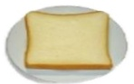
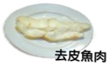
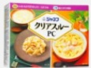
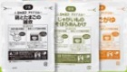
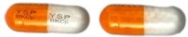
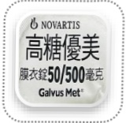

Gastrointestinal Endoscopy Pre-Examination Diet and Bowklean Powder (Bao Ke Jing) Administration Guidelines

Dear Guest:

To better understand your health status, please scan the QR code three days prior to your health check-up to complete the relevant assessment questionnaire. If you have acute fever (axillary temperature exceeding 38°C or tympanic temperature exceeding 37.5°C), respiratory symptoms, cough, taste disturbances, or other physical discomforts, please seek medical attention promptly and reschedule your health examination.

Assessment Questionnaire

Kindly visit the Health Examination Center on the 6th floor of Yida Hospital between  
[Time]  

## Items to Bring

- Identity card  
- Health Insurance Card  
- Stool specimen box  
- Regular medications  

## Items to Avoid Bringing

- Earrings  
- Necklaces  
- Rings  
- Contact lenses  

- Remove nail polish  

- Nail polish on the "index finger" of both hands  
- Crystal nail enhancements  

- Transportation  

- Patients undergoing anesthesia must not drive or ride a bike to the hospital on their own  

## Examination Guidelines QR Code

- Gastrointestinal examination guidelines  

- Sedation and pain relief guidelines  

- Coronary artery CT guidelines  

- MRI guidelines  

## Imaging Examination Precautions

For imaging examinations including coronary artery angiography (with contrast agent) and abdominal or head CT (with contrast agent), stop taking metformin (a diabetes medication) two days before and two days after the examination.

## Pre-Examination Guidelines for Gastrointestinal Endoscopy

Patients on long-term chronic medication (such as for hypertension, cardiovascular diseases, or thyroid disorders) may continue taking their medications as prescribed by their physician. However, diabetes medications should be temporarily withheld on the morning of the examination and carried with you to the health examination center. For those selecting gastrointestinal examination, if you wish to add a Helicobacter pylori test, it will be an additional self-paid service.

For patients receiving high-flow humidified oxygen therapy: those with BMI ≥ 35 who are deemed suitable for painless endoscopy by an anesthesiology specialist must use this service at an additional cost to enhance respiratory safety during anesthesia (for those with BMI between 30–34, it is recommended to use it).  

## Do not swallow powder directly to avoid esophageal burns

## Meal replacement diet

Precautions before gastrointestinal endoscopy

Fluid intake

More than 2000 c.c. per day

## Low-residue diet

Rice porridge

## Two days before the examination

Noodles

Skinless fish meat

Sports drink

Broth

Fluid intake

Toast

## [Easy-to-brew meal options]

One packet per breakfast, lunch, and dinner

Add one packet to 500 c.c. hot water and stir evenly

Allow to stand for 10 minutes before consumption

## Bowel preparation

Bowel preparation educational animation (Mandarin version)

One day before the examination

Confirm that stool specimen has been collected prior to health check

Avoid eating vegetables, fruits, dairy products, and fried foods

Drink at least 2000 c.c. of water daily during the week before examination

#### More than 2000 c.c. per day

Steamed egg

Breakfast: one bun

Bun

Lunch: two packets / Dinner: one packet

Heat directly in microwave or water bath

Bowel preparation educational animation (Taiwanese version)

Medication reminder app (Android)

Medication reminder (iOS)

Fasting

On the day of examination

Interval of 1 hour

05:00 Fasting

Interval of 30 minutes

First dose + 150 c.c. water diluted

Hydration: 2000 c.c.

Second dose + 150 c.c. water diluted

Hydration: 750 c.c.

## Warm reminders

Try to sit on the toilet to promote bowel movement; use a stool pad to elevate the toilet seat for easier defecation

Move around and massage your abdomen regularly; use warm water to rinse the anal area to stimulate bowel movements, which may result in several bowel movements during the process; use warm water to clean the area

Reduce wiping around the anal opening

The laxative starts working after drinking it; continuously observe the stool condition [as shown in the left image]

Take a photo of your last bowel movement using your smartphone to help healthcare staff evaluate the situation

## Anti-hyperglycemic drugs

## Cilostazol (Pletaal)

## Clopidogrel (Plavix) 75mg/tab

## Shutuan Ning coated tablet

## Dipyridamole

## Soleti

## 25 mg/tab

Metformin 1000mg/tab

## Dapagliflozin and Metformin (Xigduo XR)

## Warfarin (Cofarin) (Mafarin)

## Glimepiride and Metformin (Glimet)

Likongtang coated tablet

## Metformin (Ankomin)

500mg/tab

## Sitagliptin and Metformin (Janumet)

+ Metformin 500mg/tab

## Vildagliptin and Metformin (Galvus Met)

## For long-term medications, please continue taking them as instructed by your doctor and do not stop taking them; however, for diabetes medications, please avoid taking them on the morning of the examination day, and carry your medication with you to the health check center.

For patients taking antiplatelet, anticoagulant drugs, ginkgo biloba, natto, fish oil, Q10, and other medications, please consult your doctor to evaluate the feasibility of discontinuing these medications for 7 days to reduce the risk of post-polypectomy surgical bleeding.## 01 Natural Disasters

In response to natural disasters such as typhoons, if the high and Keelung areas announce a closure of operations on the day of the health check-up, services related to health examinations will be temporarily suspended for safety reasons. Subsequent rescheduling will be arranged by dedicated personnel. Enterprise clients are advised to contact the designated officer for further arrangements!

## 03 Fecal Sample

Collect the sample according to the collection instructions. After collection, place it in a green plastic bag and store it in a cool, shaded area.

## 02 Menstrual Period

It is not recommended to perform tests on estrogen metabolism, feces, urine, or smear tests. Please schedule a follow-up examination at least 7 days after the end of menstruation. If you have confirmed pregnancy or are currently planning or possibly pregnant, these tests are not suitable and should be postponed!

## The quick brown fox jumps over the lazy dog

## 04 Parking Exemption Voucher

Free parking voucher from Yida Medical

Free parking: ___ hours

Valid period: ___ year ___ month ___ day

Issuing unit: Health Management Center

※This voucher is valid only on the day of issue.

The parking lot is located beside the Yida Hospital Emergency Department. Please obtain the parking exemption voucher at the health check-up center. Do not park in private commercial parking lots.

## 05 Fasting

Begin fasting the night before the health check (including chewing gum, sour plums, betel nut), and also refrain from drinking water (except for the laxative taken on the morning of the day of the check-up).

## ☕ ∅

## 06 Re-examination VIP Discount

Yida Medical Foundation, Yida Hospital Health Examination Center

Thank you for your continued support and care. If you bring the "health check-up gown" provided by our health examination center, you may choose one of the blood tests as a gift. Please inquire about the details at the counter on the day of your examination.

Address: No. 1, Yida Road, Jiaosu Village, Yanchao District, Kaohsiung City

Consultation phone: (07) 615-0011 ext. 5705, 5707, 5713, 5691

Health examination service hours: Monday to Friday: 08:00–17:00  
Saturday: 08:00–12:00 (closed on holidays)

24-hour medication consultation hotline: 0800-060-689  
Mobile phone users should call the paid line: 0905-217-086 (09:00–18:00)  
0910-060-376 (18:00–09:00)

## References:

Jia Zi Han, Li Yue Lin, Yan Hui, Fang Guan Jie (2022). Preparations for colonoscopy. Clinical Medicine Daily, 80(2), 183–19