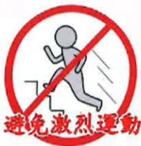

# Notes on Acute Myocardial Infarction

## Table of Contents

One. What is acute myocardial infarction...01  
Two. Common symptoms of myocardial infarction...01  
Three. Risk factors...02  
Four. Types and methods of treatment:...04  
1. Coronary angioplasty...04  
2. Thrombectomy surgery...04  
3. Coronary stent placement...04  
4. Surgical treatment--coronary artery bypass grafting...05  
5. Medication therapy...05  
Five. Precautions during catheterization...06  
Six. Guidelines and precautions for cardiac pulmonary rehabilitation...12  
Seven. Medication information for acute myocardial infarction...16  
Eight. Nutritional care guidelines...20  
Nine. Post-discharge care and lifestyle modifications...25  
Ten. Blood pressure, heart rate, and blood glucose recording sheet...27  
Eleven. Blood test report recording sheet...29## One. What is acute myocardial infarction?

When the blood vessels supplying the heart become narrowed or blocked, the heart muscle cannot receive sufficient oxygen and nutrients. This leads to myocardial necrosis and hypoxia, affecting heart function and cardiac cells. In severe cases, it can endanger a patient's life. Therefore, when a myocardial infarction occurs, it is essential to act as quickly as possible to restore blood flow and minimize the damage caused by myocardial hypoxia.

## Two. Common symptoms of myocardial infarction:

1. A pressing, constricting pain in the lower part of the sternum, with a heavy, burning, or otherwise indescribable discomfort. If the pain persists, it may last for 30 minutes or longer and is typically not relieved by rest or nitroglycerin (NTG). There is no specific time of occurrence; in severe cases, patients may experience shortness of breath, loss of consciousness, arrhythmias, hypotension, or even shock.

2. The pain may radiate to the arms, shoulders, neck, jaw, or back, often accompanied by weakness, sweating, nausea, vomiting, dizziness, digestive discomfort, and abdominal bloating.

3. Fever may appear 24–48 hours after the onset of myocardial infarction.

## Three. Risk factors:

### 1. Age:

As age increases, the incidence of ischemic heart disease also increases.

### 2. Gender:

Men—The incidence of ischemic heart disease increases rapidly after age 45.

Women—The incidence gradually increases after age 55 or after menopause.

### 3. Family history:

If either parent has had a myocardial infarction, the child's risk of developing myocardial infarction increases.

### 4. High cholesterol:

The more cholesterol present in the blood, the thicker the deposits on the vessel walls become, leading to plaque formation, arterial hardening, narrowing of the vessel lumen, and increased risk of vessel occlusion. The incidence of ischemic heart disease is directly proportional to low-density lipoprotein cholesterol (LDL) concentration and inversely proportional to high-density lipoprotein cholesterol (HDL) concentration.### 5. Hypertension:

Elevated blood pressure makes it easier to damage the stability of endothelial cells within blood vessels, allowing cholesterol to enter the vessel walls and form atherosclerotic plaques that block blood flow.

### 6. Diabetes:

It increases oxidative stress in coronary arteries and insulin resistance. Under high glucose conditions, plaques are more likely to accumulate within blood vessels. People with diabetes have a two-fold increased risk of developing ischemic heart disease.

### 7. Overweight or obesity:

Being overweight or obese can lead to elevated blood pressure, high lipid levels, and diabetes, all of which can trigger ischemic heart disease.

### 8. Lack of physical activity (sedentary lifestyle):

Lack of physical activity increases the risk of ischemic heart disease by about two times, and also worsens other risk factors.

### 9. Unbalanced diet:

If dietary intake primarily consists of foods high in saturated fats, trans fats, and cholesterol, it easily leads to ischemic heart disease.

## Four. Types and Methods of Treatment:

### 1. Coronary Angioplasty:

Using catheters, a catheter is inserted through the femoral artery (or the radial artery in the upper limb). A catheter with a wire is then guided to the narrowed portion of the coronary artery, where the balloon is inflated to apply pressure and expand the blocked area, thereby increasing blood flow. Alternatively, a coronary artery stent can be delivered via catheter to the narrowed region of the coronary artery, achieving better results.

### 2. Thrombectomy:

During emergency catheterization, if a large amount of thrombus is detected, a "thrombectomy" procedure can be performed to remove the clot. The purpose is to prevent embolization of small distal vessels and the resulting inadequate perfusion of myocardial cells in the vascular supply zones, and to further reduce the area of myocardial cell necrosis.

### 3. Coronary Stent Placement:

During coronary angioplasty, the physician may choose to place a stent—a balloon catheter carrying a metallic stent—at the site of vascular narrowing in the patient, to prevent the vessel from re-blocking. Stents are divided into conventional metallic stents and drug-coated stents.

### 4. Surgical Treatment -- Coronary Artery Bypass Grafting (CABG):

When the severity of coronary artery blockage makes balloon angioplasty or stent placement unsuitable, surgical intervention in the form of coronary artery bypass grafting (CABG) is required to address myocardial ischemia and prevent sudden death due to myocardial infarction.

### 5. Medication Therapy:

Medication therapy can improve cardiac function, reduce episodes, and alleviate symptoms; however, it cannot restore the original diameter of narrowed vessels. Currently, several medications are available to increase oxygen supply or reduce oxygen demand, such as nitrates, beta-blockers, calcium channel blockers, angiotensin-converting enzyme (ACE) inhibitors, and antiplatelet drugs.

## Five. Precautions for Catheterization Procedures

1. Before catheterization:

(1) Physiological assessment:

Blood draw, electrocardiogram (ECG),  
X-ray examination.

(2) Informed consent:

Must include consent and signature from both the patient and family members.

(3) Skin preparation:

To reduce the risk of surgical site infection, it is generally recommended to shave the upper 3/4 of the arm, upper thigh, and both inguinal regions during the procedure.  
(Common catheterization sites include the wrist or inguinal area)

(4) Fasting:

Fasting is not required for emergency procedures. For procedures scheduled the next day, patients should fast after midnight (including water and food). For procedures scheduled in the afternoon of the following day, breakfast may be consumed before 7 AM, and fasting (including water and food) should begin after breakfast.(5) Check that you remove all metal jewelry and removable dentures on the day of the examination. If you have applied nail polish or lipstick, please wipe it off thoroughly. Wear the patient gown on the day of the examination and do not wear undergarments.

(6) Medical history:

Please inform the doctor in advance if you have a history of allergies (such as reaction to contrast agents) or conditions like uncontrolled bleeding.

(7) Pulse check:

The nursing staff will check your blood pressure and pulse, and mark the pulse points on both feet to facilitate comparison of pulse strength before and after the procedure.

(8) Empty your bladder before the examination.

### 2. During catheterization examination:

(1) Local disinfection and anesthesia will be performed. A special catheter will be inserted through a blood vessel in the arm or groin, and guided to the heart along the vessel.

(2) You will remain conscious throughout the procedure. During the process, you may be asked to cough forcefully to promote coronary artery blood flow.

(3) When the contrast agent is injected, you may feel a sensation of whole-body warmth, nausea, or vomiting. Please do not worry—this sensation will quickly subside.

(4) If you experience any discomfort such as chest tightness, chills, fever, palpitations, or shortness of breath during the procedure, please inform the medical or nursing staff.

### 3. After catheterization:

(1) After returning to the ward, monitor blood pressure and heart rate every 15 minutes for 1 hour, then every 30 minutes for 3 hours.

(2) If the catheterization site is the wrist, medical staff will apply a tourniquet or gauze with a wide band around the puncture site. The band will be gradually removed over 4 hours, and completely removed the next morning. The wound will be re-dressed with waterproof adhesive film. Avoid using the affected limb, and do not lift heavy objects for one week after the procedure.

(3) If the catheterization site is in the groin, and the catheter has already been removed in the catheterization room, the medical staff will directly apply pressure for 30 minutes using a pressure device at the puncture site to stop bleeding. Then, a sandbag weighing approximately 2 kg will be placed for 4 hours of compression. The puncture site should not be bent and the sandbag should remain in place. After removing the sandbag, the patient should lie flat for 4–6 hours without turning over to prevent bleeding. After the sandbag is removed, the patient may sit semi-upright, but should monitor the wound for any signs of bleeding.

(4) For femoral artery catheterization in the groin with the catheter still in place, the patient must lie flat before catheter removal. After catheter removal, continue with 4 hours of sandbag compression and remain flat for another 6 hours. The buttocks may be moved left and right, but the affected limb joints must remain straight and not bent to avoid forceful movements. The ankle may be freely moved, and the limb will remain fixed for the duration of the evaluation of vital signs and blood circulation and temperature of both upper and lower limbs.

(5) After returning to the ward, lie completely flat for 4 hours. If urination is needed, use a commode or urinal. If no urination occurs after 6 hours, inform the nursing staff. If the wound is in the groin area and there is difficulty with bowel movements, inform the medical staff immediately to prevent bleeding from the wound.

(6) If any of the following symptoms occur—nausea, vomiting, palpitations, shortness of breath, chest pain, fever, coldness, pallor, numbness, tingling, pain, or abnormal swelling, bruising, or wet and hot dressing at the wound site—inform the medical staff immediately.(7) If there are no special contraindications, normal diet can be resumed after returning to the ward.

(8) On the day of the check-up in the morning, the dressing will be removed by nursing staff, and the wound will be disinfected, then covered with gauze and waterproof film. If no discomfort is experienced, the gauze can be removed the next day, and the nurse will check for bruising around the wound and inform the physician. The skin bruising will gradually fade over approximately two to three weeks.

General Ward

## Six. Guidelines and Precautions for Cardiopulmonary Rehabilitation

## Phase One: Rehabilitation in the ICU and General Ward

1. On the first day after catheterization: deep breathing exercises, progressive head elevation and sitting, and limb movements (non-resistive) can be performed under the supervision and protection of medical staff.

2. On the second day and thereafter after catheterization: continue the exercises from the first day, and under the supervision and protection of medical staff, patients can stand up, walk in place, and perform light resistance limb exercises.

1. Day One:

If there are no chest pain or discomfort symptoms, patients can slowly walk, gradually increasing to ten minutes, three times a day.

2. Day Two:

If there are no chest pain or discomfort symptoms, patients can climb half a floor and descend one floor.

3. From Day Three and onwards:

If there are no chest pain or discomfort symptoms, patients can climb and descend one floor.

During this phase, patients can perform other static activities such as sitting up to eat, bathe, change clothes, and reading independently.## Stage Two: Outpatient Rehabilitation in the Department of Physical Medicine and Rehabilitation

It is recommended that patients undergo at least six weeks of rehabilitation training, three times per week, after discharge. The physical therapist will develop a rehabilitation plan based on the patient's specific training goals, which includes:

1. Warm-up exercises

- Light resistance training  
- Limb mobility  
- Perceived exertion score < 8

2. Cardiopulmonary rehabilitation exercises

- Treadmill walking, cycling, hand-pedaling, or other prescribed activities  
- Perceived exertion score ≤ 13

3. Mild exercises

- Light mild exercises  
- Flexibility exercises  
- Perceived exertion score < 8

| Score | Perceived Exertion Level |
|-------|--------------------------|
| 6     | No exertion at all       |
| 7     | Extremely light          |
| 8     | Very light (row span 2)  |
| 9     | Very light (row span 2)  |
| 10    | Light                    |
| 11    | Can still sing during exercise |
| 12    | Slightly difficult       |
| 13    | Can still talk, cannot sing |
| 14    | Difficult                |
| 15    | Speaking becomes wheezing during exercise |
| 16    | Very difficult           |
| 17    | Speaking becomes difficult during exercise |
| 18    | Extremely difficult (row span 2) |
| 19    | Extremely difficult (row span 2) |
| 20    | Already giving maximum effort |

The physical therapist will continuously monitor vital signs throughout the process to ensure patient safety. Patients are not allowed to participate in rehabilitation exercises if their resting blood pressure is <90/50 mmHg or >160/90 mmHg, or if their heart rate is <50 or >100 bpm.

During this stage, patients may perform light household activities such as sweeping, mopping, and cooking, and may engage in sexual activity with the physician's approval.

## Six: Important Notes and Precautions for Cardiopulmonary Rehabilitation

## Stage Two: Outpatient Rehabilitation in the Department of Physical Medicine and Rehabilitation

## Process for Accepting Outpatient Rehabilitation:

After discharge, patients should return to the cardiology clinic for follow-up. If the physician determines that the patient is suitable for rehabilitation, they will be referred to the Department of Physical Medicine and Rehabilitation. The rehabilitation physician will conduct an assessment, provide health education, and issue medical instructions. The physical therapist will then implement the cardiopulmonary rehabilitation program and provide related health education.

## Stage Three: Community and Home-Based Rehabilitation

Patients should, in the absence of chest pain or discomfort, develop regular exercise habits at home or in nearby community centers, schools, or gyms, such as brisk walking, jogging, cycling, swimming, dancing, or Tai Chi. The frequency should be at least three times per week, with each session lasting over 30 minutes.

  

## Outpatient Rehabilitation Precautions:

1. Eat normally before rehabilitation exercises; avoid exercising on an empty stomach. Avoid rehabilitation exercises within one hour after eating.

2. Wear appropriate, light, comfortable clothing: sports attire, sports shoes, and a towel.

3. After rehabilitation exercises, appropriately replenish fluids. In response to environmental protection, please bring your own reusable water bottle.

4. Please avoid wearing nail polish or heavy makeup, as this may affect the assessment of vital signs and instrument monitoring.

5. If you are taking medication to control blood pressure, heart rate, or if you have not taken your medication as prescribed by your doctor on the day of the session, please inform the therapist proactively.

6. If you experience discomfort such as chest tightness, chest pain, dizziness, cold sweat, or feeling cold during rehabilitation exercises, please inform the therapist immediately.

7. If you experience difficulty breathing during rehabilitation exercises and perceive your effort level reaching 13 points (as shown in the figure below):

## 7. Medication Information for Acute Myocardial Infarction

After an acute myocardial infarction, your doctor will prescribe the following medications to help prevent recurrence. Please take the medication as instructed by your doctor, and avoid stopping or altering the dosage without medical advice.

### 1. Antiplatelet Medications:

(1) Purpose: Prevent vascular occlusion.

(2) Be aware of potential bleeding side effects (such as unexplained bruising, hematuria, or black stools). If you experience any of these symptoms, seek medical attention immediately.

(3) If you are scheduled for surgery, tooth extraction, endoscopy, or any other procedure that may cause bleeding, please inform your doctor that you are currently taking these types of medications.

| Component       | Aspirin         | Clopidogrel       | Ticagrelor        | Prasugrel        |
|----------------|------------------|--------------------|--------------------|-------------------|
| Brand Name     | Bokey® (Bekyi)   | Plavix® (Bao Shu Tong) | Clopidogrel (Shu Shu Ning) | Brilinta® (Bai Wu Ning) | Efient® (Yi Ning An) |
| Dosage         | 100 mg/capsule   | 75 mg/tablet       | 75 mg/tablet       | 90 mg/tablet      | 3.75 mg/tablet    |
| Appearance     |                  |                    |                    |                   |                   |### 2. Lipid-lowering drugs:

(1) Common medications:

Atorvastatin, Rosuvastatin,  
Atorvastatin/Ezetimibe  
Alirocumab (PCSK9 inhibitor injection)

(2) Indication: Lower cholesterol.

(3) Must be combined with dietary control and appropriate exercise.

(4) Side effects: Gastrointestinal discomfort, muscle pain or weakness, elevated liver function tests.

### 3. Beta-blockers

(1) Common medications:

Bisoprolol, Carvedilol

(2) Indication: Slow heart rate, reduce cardiac burden.

(3) Blood pressure and heart rate should be measured regularly during treatment.

(4) Side effects: Dizziness, headache, cold hands and feet, bradycardia.

(5) Dizziness may occur when suddenly changing posture; slow down movements to reduce dizziness.

### 4. Angiotensin-converting enzyme inhibitors / Angiotensin receptor blockers:

(1) Common medications:

Captopril, Enalapril, Valsartan,  
Olmesartan, Irbesartan

(2) Indication: Cause vasodilation, reduce vascular resistance.

(3) Blood pressure and heart rate should be measured regularly during treatment.

(4) Side effects: Dry cough, dizziness, headache.

(5) Dizziness may occur when suddenly changing posture; slow down movements to reduce dizziness.

### 5. Second-generation sodium-glucose cotransporter-2 inhibitors (SGLT2 inhibitors):

(1) Common medications: Dapagliflozin, Empagliflozin

(2) Indication: Management of diabetes comorbidities, treatment for heart failure.

(3) Note: Supplement fluids to prevent dehydration.

(4) Side effects: Increased risk of urinary tract infections.In addition to the above medications, your doctor will prescribe other blood pressure medications, blood sugar-lowering medications, heart failure treatment medications, sublingual nitroglycerin (NTG) tablets, or smoking cessation medications based on your condition. If you have any concerns or questions about your medications during use, please consult your doctor or contact the pharmacist during your follow-up visit:

Yi Da Hospital Medication Consultation  
Phone: (07)615-0011, extension 2000  

Yi Da Cancer Treatment Hospital Medication Consultation  
Phone: (07)615-0022, extension 6200  

Yi Da Da Chang Hospital Medication Consultation  
Phone: (07)559-9123, extension 7200  

## Eight. Nutrition Care Guidelines

1. Choose fresh ingredients; avoid canned and various preserved or processed foods, and avoid soup broths and brine sauces.

2. Pay attention to foods with high sodium content but not easily noticeable, such as noodles, sweet pastes, and biscuits. If food contains alkaline substances, baking soda, baking powder, or salt, reduce their usage.

3. It is recommended to cook meals at home and reduce the frequency of eating out. Use natural aromatic seasonings such as vinegar, scallions, ginger, garlic, eight-cornered spices, and lemon juice to replace processed seasonings such as soy sauce paste, tomato sauce, and monosodium glutamate (MSG).

4. Limit intake of high-cholesterol foods such as organs, crab roe, and fish eggs. Individuals with high triglycerides should avoid high-fat and high-sugar foods such as French fries, oil cakes, cakes, Chinese pastries, chocolate, and ice cream.

5. It is recommended to choose whole grains and coarse grains, increasing the intake of unrefined foods such as sweet potatoes, brown rice, and pumpkin, and replacing white rice. Avoid refined sugar intake, such as fruit juice, beverages, candies, or pastries.6. Prioritize unprocessed soy products (such as soy milk, tofu, and bean curd), fish, and egg-based proteins, and reduce intake of red meat; consume deep-sea fish 1–2 times per week, such as salmon, sardines, and cod, which are rich in omega-3 fatty acids and help enhance vascular anti-inflammatory capacity.

7. Consume two bowls of fresh vegetables and two bowls of fruit daily to supplement natural antioxidant foods (such as polyphenols, vitamins, isoflavones, and carotenoids), thereby strengthening vascular antioxidant capacity.

8. Avoid fried foods; when making pickled meat or stewed soups, remove the top layer of fat after refrigerating before consumption.

9. Use plant-based oils for cooking, such as kukui nut oil, soybean salad oil, and olive oil; avoid artificially produced oils or animal fats.

10. Quit smoking and drinking alcohol.

| Category | Recommended | Avoid |
|---------|-------------|-------|
| Dairy and its products | Fresh milk and its products. | Condensed milk, flavored milk, ice cream, cheese, cream, etc. |
| Whole grains and coarse grains | Rice, buns, toast, bread, rice noodles, winter noodles, dumpling skin, jiaozi skin, spring roll skin, sweet potato, potato, taro, etc. | Fried rice/vermicelli, instant noodles: various oily products such as pancakes, oil cakes, pan-fried buns, potstickers, sweet/salty bread, etc. High-sodium foods such as rice noodles, oily noodles, Italian crispy pies, etc. |
| Soy products | Tofu, bean curd, bean skin, dried soy threads, soy sticks, soy milk, etc. | Pickled, canned, or salted products such as flavored bean curd, bamboo shoot and soy, soybean paste, etc. |
| Vegetables | Fresh vegetables and homemade vegetable juice. | Pickled vegetables and processed vegetable canned goods. || 类别 | 可食 | 忌食 |
|------|------|------|
| 鱼蛋肉类 | 家畜：牛肉（瘦）、羊肉（瘦）、猪大里肌、后腿瘦猪肉、前腿瘦猪肉、猪大排等。家禽：去皮家禽，如鸡胸肉、鸡腿、鹅肉、鸭肉等。水产品：土魠、旗鱼、吴郭鱼、鲫鱼、虱目鱼、鲤鱼、红目鲫、白带鱼、乌贼、螃蟹、蟳、虾、干贝、牡蛎、海参等。蛋类：鸡蛋、鸭蛋等。 | 家畜：肥肉、五花肉、蹄膀、猪皮、猪脚、牛腩等。家禽：鸭皮、鸡皮、鸡鸭翅等。水产品：鱼卵、包馅鱼丸、鱼饺、蟹黄、虾卵或罐头食品等。加工食品：肉燥、肉酱、猪肉干、肉松、肉脯、中式火腿、香肠、培根、热狗、肉丸、甜不辣等。速食品：炸鸡、汉堡、肉鱼丸等。 |
| 水果类 | 新鲜水果及自制果汁 | 干果类（蜜饯）及水果罐头等。 |
| 调味品 | 葱、姜、蒜、白糖、白醋、五香、八角、胡椒、咖喱粉等。（刺激性食品少食用） | 沙拉酱、芝麻酱、花生酱、辣椒酱、沙茶酱、豆瓣酱、甜面酱、味精、蒜盐、番茄酱、乌醋等。 |
| 其他 | 太白粉、淡茶。 | 奶精、油炸粉、炸蚕豆、爆玉米花、洋芋片、椰子粉、花生粉、牛奶糖、巧克力等。人参饮、鸡精、海苔酱、速食汤等。 |

## IX. Home Care Guidelines and Lifestyle Modifications

Remove risk factors such as controlling high cholesterol, high blood pressure, diabetes, quitting smoking, and weight loss. Additionally, appropriate physical activity is the most cost-effective and effective method for preventing such cardiovascular diseases.

1. For the first week after discharge, avoid intense physical activities and excessive flexion of the hip or knee joints, such as climbing hills, rapidly going up or down stairs, or lifting heavy objects.

2. If, after discharge, you experience pain, swelling, persistent bleeding, or bruising at the wound site, return to the hospital immediately for follow-up.

3. Take medications regularly. The primary function of these medications is to prevent re-occlusion or spasm of blood vessels. If you experience any adverse effects from the medication, discuss it with your doctor and adjust the treatment accordingly—do not stop taking the medication on your own.

4. Attend regular follow-up appointments, as some patients may experience recurrence of chest pain, which could indicate re-occlusion of blood vessels. Such re-occlusion often occurs within six months after surgery.

5. If you experience any discomfort during this period—especially chest tightness, shortness of breath, or palpitations—inform your doctor during your follow-up visit. In case of severe symptoms, seek medical attention earlier than scheduled.

## References

1. Internal Journal of Cardiology. Volume 209, 15 Apr 2016, pages 103–113  
2. Acute Coronary Syndrome in Taiwan – A study based on analysis of the National Health Institute Research Database (NHIRD). Taiwan Society of Internal Medicine  
3. Jernberg T et al. Eur Heart J 2015;36:1163–1170  
4. European Heart Journal, 42(14), 1289–1367. https://doi.org/10.1093/eurheartj/ehaa575  
5. Implementation of a telephone-based secondary preventive intervention after acute coronary syndrome (ACS). doi:10.1186/s13063-016-1203-x  
6. Circulation, 140(19), 1578–1589# Blood Pressure, Heart Rate and Blood Sugar Record Sheet

| | | | | | | |
|---|---|---|---|---|---|---|
| Date | Blood Pressure | | | Heart Rate (beats/min) | | Weekly Weight |
| | Systolic | Diastolic | | | Pre-meal | Post-meal | |Eleven. Blood Test Report Record Sheet

|  |  |  |  |  |
|---|---|---|---|---|
| Date Item |  |  |  |  |
| TG |  |  |  |  |
| CHOL |  |  |  |  |
| LDL |  |  |  |  |
| HbA1C |  |  |  |  |
|  |  |  |  |  |
|  |  |  |  |  |
|  |  |  |  |  |
|  |  |  |  |  |
|  |  |  |  |  |
|  |  |  |  |  |
|  |  |  |  |  |
|  |  |  |  |  |
|  |  |  |  |  |
|  |  |  |  |  |

|  |  |  |  |  |
|---|---|---|---|---|
| Date Item |  |  |  |  |
| TG |  |  |  |  |
| CHOL |  |  |  |  |
| LDL |  |  |  |  |
| HbA1C |  |  |  |  |
|  |  |  |  |  |
|  |  |  |  |  |
|  |  |  |  |  |
|  |  |  |  |  |
|  |  |  |  |  |
|  |  |  |  |  |
|  |  |  |  |  |
|  |  |  |  |  |
|  |  |  |  |  |## MemoirThis information is for reference only. For your actual medical condition, please discuss with your doctor. If you have any questions, please contact:

Yi Da Hospital  
Address: No. 1, Yida Road, Jiaosu Village, Yancheng District, Kaohsiung City  
Phone: 07-6150011  

Yi Da Cancer Treatment Hospital  
Address: No. 21, Yida Road, Jiaosu Village, Yancheng District, Kaohsiung City  
Phone: 07-6150022  

Yi Da Da Chang Hospital  
Address: No. 305, Da Chang Road, Sancheng District, Kaohsiung City  
Phone: 07-5599123  

We are committed to serving you wholeheartedly!  
Yi Da Medical Foundation cares about your health!

This copyright is not to be reproduced, duplicated, or resold without the consent of the copyright holder.

Copyright Holder: Yi Da Medical Foundation  
Form Number: HA-9-0100(2)  
Yi Da Medical Foundation, 21X14.8cm, printed in 2025.02, revised in 2024.10