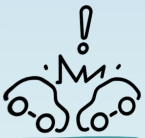
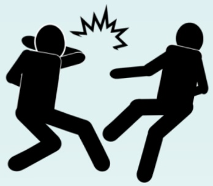
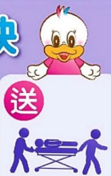
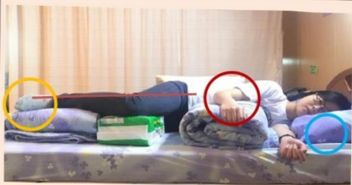
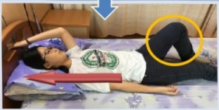
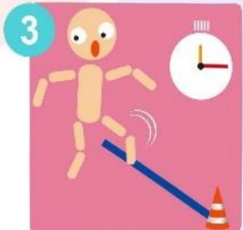
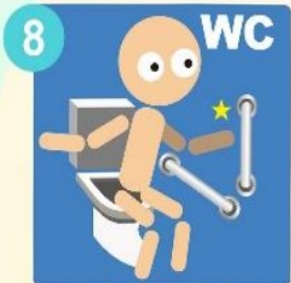

## Traumatic Brain Injury Patient Education Handbook

🌸🌸🌸## Table of Contents

I. Definition...... 1  
II. Classification...... 2  
III. Categories...... 3  
IV. Examination...... 7  
V. Assessment...... 9  
VI. Treatment...... 11  
VII. Symptoms...... 15  
VIII. Anti-seizure Medication Guidance...... 18  
IX. Care...... 21  
X. Rehabilitation and Physical Therapy...... 25  
XI. Home Care Precautions...... 30  
XII. Situations Requiring Immediate Medical Attention...... 32## One. Definition

Traumatic brain injury refers to damage to brain tissue caused by external trauma. It is classified into diffuse brain injury and focal brain injury based on the extent of brain tissue damage.

## ◆ Common Factors

Car accident

Falling

Falling from height

Physical assault

Heavy object falling## II. Grading

Head injuries can be classified according to the Glasgow Coma Scale (GCS) score, which helps to understand the progression and severity of the disease:

## Mild head injury: GCS score 14–15

- Commonly seen in patients with minor intracranial bleeding or simple concussion. Symptoms may include confusion, visual disturbances, or balance issues. Some patients may experience persistent headaches, dizziness, memory loss, or emotional instability. These symptoms usually gradually improve and resolve over time.

## Moderate head injury: GCS score 9–13

• Requires hospitalization; some cases may require surgical intervention.

## Severe head injury: GCS score ≤8

• The condition is serious and requires surgical treatment, with a risk of death and a higher likelihood of postoperative complications.## Three. Classification

## Possible Brain Injuries

## (1) Widespread Brain Injury

## One. Concussion

• Temporary impairment of physiological function, with normal brain CT scans showing no substantive or structural damage; it is a reversible neurological functional traumatic paralysis.

- Symptoms: memory loss after trauma, headache, dizziness, nausea and vomiting, unsteady gait, impaired memory, personality and emotional changes.

## Two. Widespread Neuroaxonal Injury

- Involves widespread rupture of brain axons, leading to failure of neural signal transmission and causing severe neurological dysfunction.

- Symptoms: deep coma, disruption of autonomic nervous functions (e.g., hyperthermia, hypertension, night sweats).## (二) Local brain injury

## One. Brain contusion

• There is substantive damage to brain tissue near the impact site, with multiple punctate hemorrhages and cerebral edema appearing at the impacted area, which gradually absorb over time.

- Symptoms: In addition to the symptoms of concussion, symptoms such as drowsiness, unconsciousness, seizures, limb weakness, behavioral or personality changes, and rapid breathing may occur depending on the severity of the brain contusion.

## Two. Epidural hematoma

- Blood accumulates between the skull and the dura mater, often resulting from fracture of the skull causing vascular rupture and separation of the dura mater, thereby compressing brain tissue.

- Symptoms: About one-third of patients have no symptoms or mild symptoms; some may exhibit changes in consciousness within hours after injury.## (二) Local brain injury (continued)

## Three. Traumatic intracranial hemorrhage

- Brain tissue damage due to trauma causes blood vessel rupture and bleeding, resulting in hematoma formation. If no intracranial hemorrhage is detected initially, but intracranial hemorrhage is found on CT scan after several hours to two weeks, it is referred to as delayed intracranial hemorrhage.

• Symptoms: Edema around the hematoma leads to increased intracranial pressure, causing severe headache, drowsiness or confusion, nausea and vomiting, and seizures.

## Four. Subdural hemorrhage

- Blood accumulates in the space between the dura mater and arachnoid mater, often occurring in conjunction with intracranial hemorrhage.## ◆ Subdural Hematoma

Blood accumulates in the space between the dura mater and arachnoid mater,

Often coexists with intracerebral hemorrhage.

According to the time of symptom onset, it can be divided into:

## Acute Subdural Hematoma

- Symptoms occur within 2 days of trauma.

- Commonly seen in patients with severe head trauma and skull fractures; hematoma causes rapid increase in intracranial pressure.

## Subacute Subdural Hematoma

· Symptoms appear between 2 days and 2 weeks after trauma.

- Initial symptoms are mild, but due to increased intracranial pressure from hematoma compression, symptoms such as headache, vomiting, altered consciousness, and seizures may develop.

## Chronic Subdural Hematoma

- Predominantly occurs in infants and the elderly, with symptoms appearing more than 2 weeks after trauma.

- Symptoms include headache, cognitive impairment, gait instability, language disorders, altered consciousness, and drowsiness.## IV. Examination

Cranial X-ray: Can assess the integrity of the skull

CT scan of the brain: Can check whether there is edema or rebleeding at the site of intracranial hemorrhage

MRI of the brain: Can examine the condition of intracranial blood vessels and serves as an important reference for surgical treatment

## IV. Examination (continued)

Clinical neurology examination: can assess the physiological functions of the central nervous system, peripheral nerves, and muscles

Vascular imaging examination: can detect abnormalities within blood vessels (such as stenosis, occlusion, rupture, etc.), showing the relationship between lesions and blood vessels in terms of anatomical location

Electroencephalography (EEG): used to determine whether there are problems with brain function or abnormal electrical discharges; it is also an important basis for diagnosing epilepsy## Five. Assessment

## (1) Glasgow Coma Scale (GCS)

A score is assigned based on the degree of response to different stimuli—eye opening, verbal response, and motor response—observed in the patient. The total score ranges from 15 points.

|  | 4 points | 3 points | 2 points | 1 point |  |  |
| :--- | :--- | :--- | :--- | :--- | :--- | :--- |
| Eye Response (E) | Opens eyes spontaneously to external stimuli | Opens eyes to verbal stimuli | Opens eyes to pain | No eye opening |  |  |
|  |  |  |  |  |  |  |
|  | 5 points | 4 points | 3 points | 2 points | 1 point |  |
| Verbal Response (V) | Speaks coherently | Inappropriate words | Utters single words | Makes sounds only | No verbal response |  |
|  |  |  |  |  |  |  |
|  | 6 points | 5 points | 4 points | 3 points | 2 points | 1 point |
| Motor Response (M) | Obeys commands | Localizes to pain | Withdraws from pain (flexion) | Flexion | Extension | No movement |## Five. Assessment (continued)

## (2) Light Reflex

The pupils are generally assessed for shape, size, and reactivity; when exposed to bright light, the pupils constrict. However, when one eye is illuminated, the other eye will also exhibit a pupillary constriction reflex.

The light reflex test evaluates the optic nerve and oculomotor nerve. Head trauma often leads to visual dysfunction, and another key aspect is assessing the oculomotor nerve function. If there is an intracranial lesion with expansion, oculomotor nerve function serves as a valuable indicator.## Six. Treatment

The purpose of brain injury treatment is to prevent secondary brain injuries, which mostly arise from intracranial hemorrhage, cerebral ischemia, increased intracranial pressure, brain herniation, and brain infection. The treatment methods are as follows:

## (1) Surgical Treatment

Emergency evacuation of acute intracranial hematoma

Based on the principle of removing the hematoma and rapidly reducing intracranial pressure.

Cranial bone removal surgery

• Improves cerebral blood flow and effectively reduces intracranial pressure.

Intracranial pressure monitoring system placement and ventricular drainage surgery

- Establishes an intracranial pressure monitoring system and performs ventricular drainage as needed to reduce or maintain normal intracranial pressure.

## Preoperative Preparation (except for emergency surgery)

Shaving the head

Fasting for 8 hours before surgery

Practice deep breathing and coughing

Relax the mind and emotions## Six. Treatment (Continued)

## Postoperative Precautions

- Begin eating only as instructed by the doctor. Before eating, drink a small amount of water to confirm there is no vomiting.

- Turn the patient every two hours and assist with chest percussion to help expel sputum and prevent skin pressure injuries leading to pressure sores.

- Avoid forceful coughing or defecation. Take soft stool medications as prescribed by the doctor to reduce increased intracranial pressure and cerebral edema.

- Do not touch the wound or the dressing with your hands to prevent infection.

- Pay attention to the wound drainage tube and avoid pulling on it.

- Patients must wait until their condition stabilizes and receive permission from the doctor before getting up from bed. They must be assisted by someone to get up, to prevent falls.

- For patients who have undergone cranial bone removal, avoid pressing on the affected side. Typically, after evaluation by the doctor and stabilization of the condition within three months, the cranial bone will be repositioned.## Six. Treatment (Continued)

## (2) Non-surgical Treatment

- Closely monitor the patient's level of consciousness, vital signs, and observe for signs of increased intracranial pressure.

- Maintain a patent airway, ensure adequate oxygenation to prevent cerebral hypoxia, and consider intubation if necessary.

• Limit fluid and nutritional intake: fluid restriction helps reduce cerebral edema, while malnutrition can lead to persistent cerebral edema.

- Provide a safe and quiet environment, minimize stimuli, and administer analgesics, sedatives, and muscle relaxants as needed based on the patient's condition.

• Monitor body temperature and control it, as literature indicates that a 1°C rise in body temperature increases cerebral metabolic demand by 10–13%.

• Correct electrolyte and coagulation abnormalities.

• Prevent complications such as seizures and infections## Six. Treatment (Continued)

## (Three) Pharmacological Treatment

## Drugs for Reducing Intracranial Pressure:

• Osmotic diuretics: Monitor urine output and blood pressure changes.

- Sedative analgesics: Reduce cerebral metabolism, alleviate headache and head fullness, and lower the risk of increased intracranial pressure.

## Antiepileptic Drugs:

Prevent and treat epilepsy caused by trauma. Common drugs include phenytoin, phenobarbital, carbamazepine, valproate, and levetiracetam.## Seven. Symptoms

"Intracranial pressure" (ICP) refers to the pressure within the cranial cavity. Severe head injuries often lead to increased intracranial pressure. When intracranial pressure rises, blood flow into the brain is restricted, and brain tissue will quickly suffer ischemia and die.

## Signs of Increased Intracranial Pressure

Headache, dizziness  
Nausea and vomiting  
Altered consciousness  
Restlessness and agitation  
Elevated blood pressure  
Decreased pulse  
Irregular breathing  
Dilated pupils  
Seizures

## Factors that May Trigger Increased Intracranial Pressure

• Increased intrathoracic and intra-abdominal pressure: such as forceful coughing or defecation  
- Changes in body position: higher intracranial pressure when lying flat; improper head positioning affecting cerebral blood flow circulation  
Environmental stimuli: overly bright light or noisy environments may trigger increased intracranial pressure## VII. Symptoms (continued)

Seizures are common complications of moderate to severe traumatic brain injury. They are caused by abnormal electrical discharges in the brain, resulting in involuntary movements and can be divided into two major types: generalized seizures and partial seizures.

## (1) Generalized Seizures

## ◆ Generalized Tonic-Clonic Seizure

Generalized tonic-clonic seizure: A more severe and widespread seizure, during which stiffness and convulsive movements occur in all four limbs.

## Absence Seizure

A milder and smaller type of seizure, characterized by brief loss of consciousness, caused by sudden abnormal electrical discharges throughout the brain.

## ☑ Atonic Seizure

A sudden loss of muscle tone, causing the person to fall suddenly, often resulting in injuries or fractures.

## ◆ Myoclonic Seizure:

Brief and rapid shaking of the body or limbs, similar to being startled.## Seven. Symptoms (continued)

## (2) Partial Seizures

When a discharge starts in one part of the brain and consciousness remains intact, it is called a "simple partial seizure." As the discharge gradually spreads to other parts of the brain and eventually involves the entire brain, resulting in loss of consciousness, it is known as a "complex partial seizure." If the discharge continues to spread, it may lead to a grand mal seizure.

During the complex partial seizure phase, patients often appear dazed for about 1 to 2 minutes. At this time, they may exhibit strange, aimless movements, such as biting the lips, licking the lips, grabbing at fingers, touching things randomly, removing their clothes, talking, walking in circles, crying, or laughing.## Eight. Medication Guidance for Anti-Epileptic Drugs

## Common drugs include two types

1. Levetiracetam

☑ Clinical use: Control epilepsy or seizures

## ☑ Possible side effects and contraindications

(1) It may cause drowsiness. It is recommended to avoid driving or operating machinery or any other tasks requiring high alertness during treatment.

(2) If you are pregnant, planning to become pregnant, breastfeeding, have kidney disease, are currently taking other medications, or have previously experienced adverse drug reactions, please inform your doctor in advance.## Eight. Medication Guidance for Anti-Epileptic Drugs (Continued)

2. Valproic Acid (Valproate)

☑ Clinical Uses: Control epilepsy or seizures

☑ Possible Side Effects and Contraindications

(1) It may cause drowsiness; therefore, patients are advised not to operate vehicles or machinery or perform other tasks requiring high alertness while taking this medication.

(2) It may pose a risk during pregnancy or in women planning to become pregnant, as the drug has teratogenic properties. Patients should inform their physician and discuss alternative medications.

(3) Valproate is metabolized by the liver. Patients with liver disease, or those taking other antiepileptic drugs or antibiotics, should inform their physician beforehand to avoid changes in drug concentration—either too high or too low—which could affect seizure control.

(4) This medication may prolong bleeding time. Patients should inform their physician before surgery (including dental procedures) that they are taking this drug, so that blood tests can be evaluated if necessary.## VIII. Medication Guidance for Anti-Epileptic Drugs (Continued)

## Dosage and Administration

- Take as prescribed by your doctor. Do not stop taking the medication or change your dosage without consulting your doctor.

## What to do if you forget to take your medication

• Take it as soon as you remember

- If it is close to the time for your next dose, skip the missed dose and take the next dose at your regular time. Do not take a double dose.

## Precautions

• If your seizures are still not well controlled after taking the medication, please visit your doctor promptly.

- Take the medication regularly. Suddenly stopping the medication may trigger a seizure or increase the frequency of seizures.

• Avoid consuming alcoholic beverages while taking this medication.## Nine. Care

## Initial Care Guidelines After Injury

(1) Rest in bed with the head of the bed elevated 30–45 degrees.

(2) Closely monitor changes in consciousness within the first 3 days; avoid excessive mental activity or staring at TV or smartphone screens. Avoid intense physical activity for one week.

(3) Avoid stimulating foods such as spicy foods, coffee, alcohol, and smoking.

(4) Prevent constipation and follow the doctor's instructions for using stool softeners to prevent increased intracranial pressure due to straining during bowel movements. If the patient has not had a bowel movement for three days, inform the doctor.

(5) Do not self-administer sedatives, sleeping pills, or other medications without medical advice, as this may lead to misjudgment of the condition. If taking anticoagulants such as aspirin, inform the doctor to assess whether to temporarily discontinue use.## IX. Care (continued)

(6) If there is a laceration on the head, apply bandaging and pressure to stop bleeding, and seek emergency medical treatment; after suturing, observe for signs of inflammation or infection such as redness, swelling, heat, and pain at the wound site.

(7) If clear or bloody fluid flows from the ear or nose, do not forcefully blow the nose or use cotton swabs to clean the ear. Immediately rest in bed and notify medical staff.

(8) If there is difficulty in movement or dizziness after injury, use walking aids or have someone assist when walking to avoid dizziness and falling again. Also monitor for any local neurological symptoms.## IX. Care (continued)

## Seizure Management

## ✓ Prevent injury to the patient:

(1) Stay calm and remain by the patient's side to protect them from accidental injuries.

(2) Remove nearby sharp objects; if soft cushions or clothing are available, place them under the patient's head. When moving the patient, avoid pulling their arms—instead, push the body gently to prevent shoulder dislocation.

(3) If food or dentures are present in the mouth at the onset of the seizure, remove them. However, if the seizure has lasted for some time, do not forcibly open the mouth.

✓ Do not press on the patient: Do not move or forcibly restrain the patient's limbs, as this may cause muscle strains, fractures, or dislocations. Do not squeeze, slap, or shake the patient, as the patient will naturally regain consciousness after the convulsions subside.

✓ Stay with the patient: Do not leave the patient to seek help. The patient will feel much more reassured knowing someone is present during recovery.## IX. Care (continued)

✓ Absolutely do not force any object into the patient's mouth: If the patient is in a rigid state and cannot open their mouth, or if their jaw is clenched, do not insert your hand into the patient's mouth or force any object into their mouth for them to bite.

√ Assist the patient's breathing: After the seizure has ended, if the patient is lying on their back, turn them onto their side. The tongue may fall forward and block the airway. Turning the head to one side helps prevent saliva or vomit from blocking the airway and causing aspiration.

The Taiwan Epilepsy Medical Society, in collaboration with "Ibi Duck Duck," promotes and advocates a simple mnemonic to help epileptic patients perform optimal first aid.

Simple Mnemonic for Epilepsy Seizure Management

Remove sharp objects from around the patient. If soft cushions or clothing are available, place them under the patient's head. Do not forcibly restrain the patient's limbs, and do not insert foreign objects such as pens or towels into the patient's mouth to prevent biting the tongue.

Turn the patient's face to the side to allow saliva and secretions to drain out, preventing blockage of the airway.

Stay with the patient until they regain consciousness and inform them about the seizure.

If the patient has continuous convulsions lasting more than five minutes, or if consciousness does not return after repeated seizures, the patient should be taken to a medical facility for treatment.## Ten. Rehabilitation Exercise Therapy

# ◆ Positioning Precautions for Patients with Unilateral Weakness

### Purpose: 1. Prevent adverse postures such as pressure sores and joint contractures.

## Lying on Side ~ Affected Side Up ~

<table border=1 style='margin: auto; width: max-content;'>
<tr>
<td style='text-align: center;'>1. Head and neck: Use a pillow to elevate 2. Affected hand: Place it in front of the body     Elevate the hand with a pillow or blanket below     Elbow slightly bent, wrist extended, palm down 3. Affected leg: Flex forward     Place soft padding (e.g., blanket) under hip, knee, and ankle</td>
<td style='text-align: center;'></td>
</tr>
<tr>
<td colspan="2">Lying on Side ~ Affected Side Down ~</td>
</tr>
<tr>
<td style='text-align: center;'>1. Head and neck: Use a pillow to elevate 2. Trunk: Support behind the back and buttocks, body slightly reclined backward 3. Affected side: Hand placed in front of the body     Slightly pull the scapula forward, palm upward 4. Healthy leg: Flex forward     Place soft padding (e.g., blanket) under hip, knee, and ankle</td>
<td style='text-align: center;'></td>
</tr>
</table>

## Notes:

(1) Change position every two hours and check for pressure sores on the pressure-bearing side.

(2) If there is hydrocephalus, head surgery, or fracture site, adjust the position according to medical instructions.

(3) For patients using a respirator or urinary catheter, ensure that pulling does not occur.## Ten. Rehabilitation Exercise Therapy (Continued)

◆ Positioning precautions for patients with unilateral weakness – Benefits of sitting posture on bed: reduced pressure sores, sensory stimulation, impact on lung capacity

Make full use of the healthy side limb,  
to assist body movement!

Use the better hand to grasp the head of the bed or rail, and the better foot to press against the bed's back.  
Apply force simultaneously with both hands and feet to lift the body until the head touches the headboard.

O: Place a pillow under the affected side's elbow and forearm, palm down.  
☐: Place a cotton blanket or similar between the feet and the bed's tail.

☐: Press both feet against a rolled cotton blanket at the bed's tail.  
Keep both knees straight and the bed tail aligned to prevent the buttocks from sliding down.  

Method two:  
☐: Press both feet against a rolled cotton blanket at the bed's tail, then raise the bed tail to prevent the buttocks from sliding down.## Ten. Rehabilitation Exercise Therapy (Continued)

Brain injury patients often experience difficulty with movements on one side of the body, which affects their ability to perform daily living activities, thereby impacting their self-confidence and self-esteem. By engaging in rehabilitation therapy together with family members and applying these skills in real-life situations, daily living participation can be improved, reducing dependence on others and restoring autonomy and confidence.

## ◆ Dressing Activities Training for Patients with Hemiplegia

## Basic Principles

(1) One must sit steadily to dress properly.  
(A sturdy and safe chair, with both feet placed on a stable surface)

(2) Wear the affected side first, then the unaffected side; remove the unaffected side first, then the affected side. (Mnemonic: "Put on the bad side, take off the good side")

(3) Start with larger-sized clothing; front-buttoned garments are easier to manage.

## Dressing Method for Front-Buttoned Garments

(1) Place the garment over both legs, with the inside facing outward and the collar near the body. Use the unaffected hand to put the affected arm into the sleeve and pull the sleeve up.

(2) Lean slightly forward, use the unaffected hand to pull the unaffected arm into the sleeve. The collar will go around the back and be brought to the unaffected side.

(3) Put the unaffected hand into the sleeve, raise the arm, and push the sleeve over the shoulder. Finally, adjust the garment and fasten the buttons.## Ten. Rehabilitation Exercise Therapy (Continued) ◆ Transfer Techniques for Patients with Unilateral Weakness

## Pre-transfer Preparation

Step 1: Angle the wheelchair and bed at approximately 30 degrees.

Mnemonic: The stronger limb should be closer to the destination.

Step 2: Engage the wheelchair brakes and ensure IV lines are not pulled.

Raise both footrests or externally rotate them,  
secure the urine bag and hang it on the patient.

Step 3: Move the patient's buttocks forward,

bend both knees to about 90 degrees,  
place both feet flat on the floor.

## Safety First! Seek assistance if necessary!

| Step 4: Transfer Method 1 | Transfer Method 2 |
|--------------------------|-------------------|
| For patients with one weak leg, the caregiver places one foot between the patient's two knees (front arch, back arrow). | Applicable to patients with one or both legs weak; the caregiver places both feet on the front edge of the patient's weak-side knees. |
|  Mnemonic:  If the patient's right leg is strong, the caregiver's right foot is in the middle |   |## Ten. Rehabilitation Exercise Therapy (Continued)

## ◆ Transfer Techniques for Patients with Unilateral Weakness

Step 5: Have the patient grasp the family member with their stronger hand.

Step 6: The caregiver grasps the patient's waistband or wraps both arms around the patient's armpits.

Step 7: The caregiver shifts their center of gravity backward to lift the patient (the patient leans forward / the caregiver slightly bends their knees, keeping the back straight).

(Method 1)

(Method 2)

The caregiver must continuously hold the patient's knees with both feet.

Step 8: Before sitting down, the patient should slightly lean forward to prevent falling backward.## Eleven. Precautions for Home Care

• After discharge, patients may still experience symptoms such as headache, difficulty concentrating, dizziness, tinnitus, and general weakness, which may persist for several months. It is recommended to regularly follow up with outpatient visits.

- Post-traumatic epilepsy is a common complication and attention should be paid to any signs of limb convulsions.

- If the condition has not improved significantly or if the patient is unable to fully concentrate, driving or operating machinery should be avoided.

- For patients with unsteady gait or limb weakness, comprehensive exercises including balance training, resistance exercises, walking, and weight shifting are recommended after discharge. Additionally, improving the safety of the home environment can help reduce the risk of falls.# Prevention of Falls Awareness

Stay Healthy and Fall-Free

Follow Medication Guidelines to Avoid Dizziness

Medications Related to Falls

Master Two-Step Operation Techniques

General Wheelchair Use

3M Walk Test for Fall Risk Assessment

Four-Limb Movements Are Essential

Bedside Rehabilitation Exercises

Five-Point Contact Keeps You Young

Bedside Rehabilitation Exercises

Six-Character Rule to Remember

Proper Use of Assistive Devices

Be Safe in All Directions – No Falls

Fall Prevention Environment Introduction

Have Sufficient Strength for Smooth Movement

Transferring Between Bed and Chair

Nine Key Points to Avoid Worry

Risks Associated with Falls

## Twelve. Conditions Requiring Immediate Medical Attention

The first 72 hours after injury are the most critical observation period. If any of the following local neurological symptoms occur at the time of injury or after discharge, emergency medical care should be sought immediately:

- Drowsiness, even unresponsive to calls; altered consciousness; behavior changes different from that at discharge

- Severe headache, dizziness, and persistent vomiting

- Seizures or convulsions in the limbs

- Sudden weakness or abnormal sensation on one side of the body, slurred speech

- Discharge or bleeding from the ears or nose

- Blurred vision, diplopia (seeing double, with overlapping images)## References

1. Carney, N., Totten, A. M., O'Reilly, C., Ullman, J. S., Hawryluk, G. W., Bell, M. J., Bratton, S. L., Chesnut, R., Harris, O. A., Kissoon, N., Rubiano, A. M., Shutter, L., Tasker, R. C., Vavilala, M. S., Wilberger, J., Wright, D. W., & Ghajar, J. (2017). Guidelines for the Management of Severe Traumatic Brain Injury, Fourth Edition. *Neurosurgery*, 80(1), 6–15. https://doi.org/10.1227/NEU.0000000000001432

2. Taiwan Neurosurgical Society – Taiwan Version – Treatment Guidelines for Severe Head Trauma: Emergency Management.  
https://www.neurosurgery.org.tw/nsr/tbi/main.htm

3. Feng, R. F. (2021). Nursing Care of Neurological Disorders. In Liu, X. E. (Ed.), *Adult Internal and External Medicine Nursing (8th ed., pp. 62–93)*. Hua Xing.

4. Kong, J. J., Tong, C. M., Pan, Y. X., Tsai, X. T., & Shih, G. Z. (2016). Enhancing the Completeness of Nursing Staff Guidance on External Ventricular Drainage Care. *Taiwan Journal of Specialized Nursing*, 2(1), 46–56.

5. Chen, L. Q. (2017). Medical Management and Nursing of Trauma Patients. In Wu, M. L. (Ed.), *Emergency and Critical Care Nursing (1st ed., pp. 602–626)*. Hua Xing.

6. Ministry of Health and Welfare, Central Health Insurance Administration – Head Trauma.  
https://www.nhi.gov.tw/Content_List.aspx?n=375003E91D8BCA66&topn=5FE8C9FEAE863B46

7. Taiwan Epilepsy Society | Taiwan Epilepsy Society (epilepsy.org.tw)

8. Pedretti's Occupational Therapy: Practice Skills for Physical Dysfunction (7th edition)## Contact Information

Yi Da Hospital  
Address: No. 1, Yida Road, Jiaosu Village, Yancheng District, Kaohsiung City  
Phone: 07-6150011  

Yi Da Cancer Treatment Hospital  
Address: No. 21, Yida Road, Jiaosu Village, Yancheng District, Kaohsiung City  
Phone: 07-6150022  

Yi Da Da Chang Hospital  
Address: No. 305, Da Chang Road, Simei District, Kaohsiung City  
Phone: 07-5599123  

This copyright holder shall not be allowed to reproduce, reprint, or resell without the consent of the copyright holder.  
Copyright Holder: Yi Da Medical Foundation  

