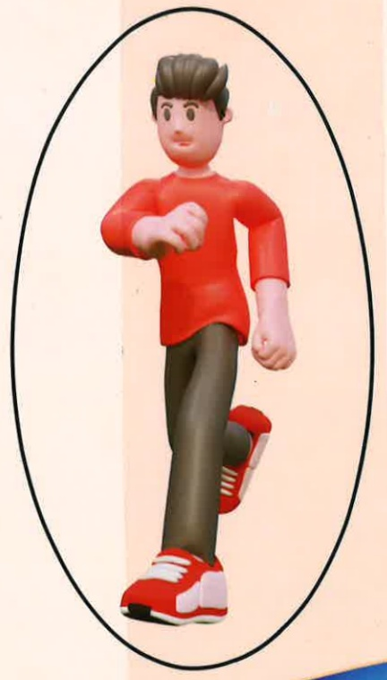
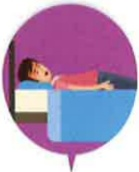

## My "Complete Fatigue" Manual

~Defeat Cancer Fatigue~Basic Information

Name: ___

Date of Birth

Primary Physician

Year Month Day

Paralysis Case Manager

Name: ___

Contact Phone: 

## Table of Contents

~Preface~  
Self-Monitoring of Fatigue Level  
The Fatigue Process  
Fatigue Diary  
Perceived Effort Coefficient  
Conclusion## Preface

Cancer has held the top spot among Taiwan's top ten causes of death for over a year. This disease and its treatments often bring physical discomfort, psychological stress, and even disrupt family life. Among these, "cancer-related fatigue" is particularly troubling to patients. Therefore, the team has specially prepared this handbook to assist patients in monitoring their fatigue levels at home and learning methods to alleviate fatigue, thereby improving their quality of life.

## How Fatigued Are You?

## What Is Cancer-Related Fatigue?

It is a significant feeling of fatigue caused by cancer or cancer treatment, which reduces activity levels and interest in daily activities, increases psychological stress, and causes sleep disturbances, ultimately affecting quality of life. 

Cancer-related fatigue can occur with any treatment method, medication, or stage of cancer.

## Quickly Assess Your Fatigue Level Using the Fatigue Scale

Reference: Clinical Guidelines for the Treatment of Cancer-Related Fatigue## Self-monitoring of fatigue levels

Fatigue scale

Please indicate the corresponding fatigue score based on your current fatigue level. 0 points means no fatigue, and 10 points represents the most severe fatigue.

No fatigue

Mild fatigue

Moderate fatigue

Severe fatigue

Most severe fatigue

## At-home care tips

## Clinical treatment guidelines

## Fatigue score < 4 points

Exercise: Choose activities you enjoy and find convenient, such as walking, swimming, or cycling. Start with low-intensity exercises and gradually increase to at least 3 sessions per week, each lasting 20–30 minutes of moderate to low-intensity activity. Warm-up for 5–10 minutes before exercise and cool down for 5–10 minutes afterward (refer to pages 5–6).

Exercise

Psychosocial interventions

Nutritional management

Complementary therapies

## Fatigue score ≥ 4 points

Intervention and treatment

Non-pharmacological

Conservatively preserve body energy,  
Adjust daily routines, and take appropriate rest.

Consider pharmacological treatment

Psychostimulant medications

Corticosteroid medications

Astragalus polysaccharide injection

Herbal medicine

## Discuss the test results with your treating physician

Maintain regular sleep patterns: go to bed and wake up at the same time every day. A short nap during the day is acceptable, but should not exceed 2 hours.

Eat regularly, and consume high-fiber (vegetables, fruits, whole grains), low-fat, and omega-3 fatty acid-rich foods. Avoid sugary drinks.

Mindfulness-based stress reduction, meditation, acupressure, massage, foot soaking, and diaphragmatic breathing...## Fatigue: Take Small Steps Forward

## Using Exercise to Alleviate Cancer-Related Fatigue

|  | Exercise Type | Exercise Intensity (Perceived) |
|---|---|---|
| Warm-up period 5–10 minutes | Slow walking | Perceived exertion < 8 (Very easy) |
| Training period 15–20 minutes | Moderate-speed walking | Perceived exertion ≤ 13 (A bit strenuous, still able to talk) |
| Cool-down period 5–10 minutes | Slow walking | Perceived exertion < 8 (Very easy) |

## Perceived Exertion Scale

During walking, please determine the exercise intensity based on your own perception.

| Number | Description |  |
|--------|-------------|---|
| 6 | No sensation of effort |  |
| 7 | Extremely easy |  |
| 8 | Very easy |  |
| 9 |  |  |
| 10 | Easy – can sing during training |  |
| 11 |  |  |
| 12 | A bit strenuous – can talk, cannot sing |  |
| 13 | Strenuous – talking becomes labored |  |
| 14 | Very strenuous – talking causes shortness of breath |  |
| 15 |  |  |
| 16 | Extremely strenuous – talking causes breathing difficulty |  |
| 17 | Super strenuous |  |
| 18 | Extremely strenuous |  |
| 19 |  |  |
| 20 | Already giving maximum effort |  |## Fatigue Diary ~ Am I Tired?

MONTH: Month

| Monday | Tuesday | Wednesday | Thursday | Friday | Saturday | Sunday |
|--------|---------|-----------|----------|--------|----------|--------|

MONTH: ☐ Month

| Monday | Tuesday | Wednesday | Thursday | Friday | Saturday | Sunday |
|--------|---------|-----------|----------|--------|----------|--------|

## Fatigue Diary ~ Am I Tired?

MONTH: Month

| Monday | Tuesday | Wednesday | Thursday | Friday | Saturday | Sunday |
|--------|---------|-----------|----------|--------|----------|--------|

MONTH: Month

| Monday | Tuesday | Wednesday | Thursday | Friday | Saturday | Sunday |
|--------|---------|-----------|----------|--------|----------|--------|## Fatigue Diary ~ Am I Tired?

MONTH: ☐ month

## Fatigue Diary ~ Am I Tired?

| Monday | Tuesday | Wednesday | Thursday | Friday | Saturday | Sunday |
|--------|---------|-----------|----------|--------|----------|--------|

MONTH: ☐ month

| Monday | Tuesday | Wednesday | Thursday | Friday | Saturday | Sunday |
|--------|---------|-----------|----------|--------|----------|--------|

MONTH: month

| Monday | Tuesday | Wednesday | Thursday | Friday | Saturday | Sunday |
|--------|---------|-----------|----------|--------|----------|--------|

MONTH: month

| Monday | Tuesday | Wednesday | Thursday | Friday | Saturday | Sunday |
|--------|---------|-----------|----------|--------|----------|--------|## Fatigue Diary ~ Am I Tired?

MONTH: Month

| Monday | Tuesday | Wednesday | Thursday | Friday | Saturday | Sunday |
|--------|---------|-----------|----------|--------|----------|--------|

MONTH: Month

| Monday | Tuesday | Wednesday | Thursday | Friday | Saturday | Sunday |
|--------|---------|-----------|----------|--------|----------|--------|

## Fatigue Diary ~ Am I Tired?

MONTH: Month

| Monday | Tuesday | Wednesday | Thursday | Friday | Saturday | Sunday |
|--------|---------|-----------|----------|--------|----------|--------|

MONTH: Month

| Monday | Tuesday | Wednesday | Thursday | Friday | Saturday | Sunday |
|--------|---------|-----------|----------|--------|----------|--------|# Let's Go Together

WE ARE

POWERFUL

Welcome to the official account of "No Fatigue Please!" Let's join hands and together overcome malaria fatigue!

~Defend you with Yida Cancer Treatment Hospital~

Yida Medical Foundation, Yida Cancer Treatment Hospital

Address: No. 21, Yida Road, Jiaoshu Village, Yancheng District, Kaohsiung City

Phone: 07-6150022

Website: edah.@edah.org.tw