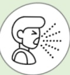

## COPD Lung Exercise Training

## Upper Limb Exercises — Water Bottle & Dumbbell Training

## What is COPD?

Chronic respiratory inflammation, an irreversible obstructive disease

Eighth leading cause of death in Taiwan

Symptoms: Cough

Sputum

## Shortness of breath

## Risk Factors:

Smoking or secondhand smoke  
Exposure to environmental pollutants  
Occupational exposure  
Family history  
Other lung conditions

## Importance of Upper Limb Exercise Training

Upper limb exercises improve upper limb muscle strength, enhance endurance and respiratory capacity, and reduce the severity of shortness of breath.

Consistent practice is essential!

Training Frequency  
Training Duration  

At least 3 times per week  
At least 20–30 minutes per session  

$ ^{*} $ Recommended frequency and duration are for reference; adjust according to individual conditions  

## References

1. Taiwan Thoracic and Critical Care Society (2022) • 2022 Practical Guidelines for Lung Recovery in Taiwan • Taipei: Taiwan Thoracic and Critical Care Society  

2. Taiwan Thoracic and Critical Care Society (2022) • Run, Little Lung! – Lung Rehabilitation Education Handbook for COPD  

3. Taiwan Thoracic and Critical Care Society (2017) • COPD: What You Need to Know – Comprehensive Care Handbook for COPD  

## Contact Information

| Hospital | Yida Cancer Treatment Hospital | Yida Dachang Hospital |
|---------|-------------------------------|------------------------|
| Address: No. 1, Yida Road, Jiaosu Village, Yancheng District, Kaohsiung City | Address: No. 21, Yida Road, Jiaosu Village, Yancheng District, Kaohsiung City | Address: No. 305, Dachang Road, Sanmin District, Kaohsiung City |
| Phone: 07-6150011 ext. 5072 (COPD Individual Care Specialist) | Phone: 07-6150022 ext. 6477 (COPD Individual Care Specialist) | Phone: 07-5599123 (Pulmonary and Thoracic Clinic) |

