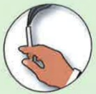
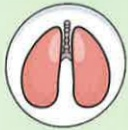
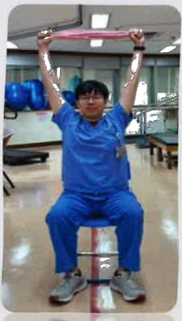

# COPD Lung Exercise Training

## Upper Body Standing and Chest-Expanding Exercises

## What is COPD?

Chronic respiratory inflammation leading to irreversible obstructive disease

Eighth leading cause of death in Taiwan

Symptoms: Cough

Sputum

Shortness of breath

## Risk Factors:

Smoking or secondhand smoke  
Exposure to environmental pollutants  
Occupational exposure  
Family history  
Other lung conditions

## Importance of Upper Body Training to Improve Rounded Posture

1. Rounded posture is common among COPD patients. Besides poor posture and appearance, studies have shown it leads to reduced lung function and a sensation of chest tightness.

2. The more severe the rounded posture, the worse the lung function and the more pronounced the symptoms of breathlessness.

1. Leech JA, Dulberg C, Kellie S, et al. Relationship of lung function to severity of osteoporosis in women. Am Rev Respir Dis. 1990;141(1):68–71.

3. Upper body training can improve the severity of rounded posture, thereby alleviating breathlessness and slowing the deterioration of lung function.

## References

2. Culham EG, Jimenez HA, King CE. Thoracic kyphosis, rib mobility, and lung volumes in normal women and women with osteoporosis. Spine (Phila Pa 1976). 1994;19(11):1250–1255.

3. Schlaich C, Minne HW, Bruckner T, et al. Reduced pulmonary function in patients with spinal osteoporotic fractures. Osteoporos Int. 1998;8(3):261–267.

4. A Ghanbari, F Ghaffarinejad, F Mohammadi, et al. Effect of forward shoulder posture on pulmonary capacities of women. 2008 Jul;42(7):622-3.

## Contact Information

| Hospital | Yida Cancer Treatment Hospital | Yida Dachang Hospital |
|---------|-------------------------------|------------------------|
| Address: No. 1, Yida Road, Jiaosu Village, Yancheng District, Kaohsiung City | Address: No. 21, Yida Road, Jiaosu Village, Yancheng District, Kaohsiung City | Address: No. 305, Dachang 1st Road, Sanmin District, Kaohsiung City |
| Phone: 07-6150011 ext. 5072 (COPD Individual Care Specialist) | Phone: 07-6150022 ext. 6477 (COPD Individual Care Specialist) | Phone: 07-5599123 (Pulmonary and Thoracic Clinic Outpatient) |## Upper Body Upright and Chest-Expanding Exercises

Extend upward

## Hold Two Towels in Hands

Extend to the right

Extend to the left

Inhale for 2-3 seconds and exhale for 4-6 seconds when reaching the highest point.

Perform 10 repetitions per movement. Three movements constitute one set. Do at least three sets daily.

$ ^{*} $ The demonstration of exercise frequency and number of sets is for reference only and can be adjusted according to individual conditions. $ ^{*} $

## Face a Wall, Step Back with a Large Step

Stand with feet shoulder-width apart and hands supporting the wall.

Extend the chest toward the ground and hold for 5~10 seconds.

Perform 10 repetitions each time. Do at least three times daily.

Yi Da Medical Center, Respiratory and Thoracic Department