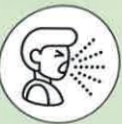

## COPD Pulmonary Exercise Training

## Lower Limb Exercises – Sitting to Standing Training

## What is COPD?

Chronic inflammatory respiratory condition leading to irreversible airway obstruction  
8th leading cause of death in Taiwan  

Symptoms: Cough  

  

Sputum  

  

Shortness of breath  

  

  

## Risk Factors:

Smoking or secondhand smoke  
Exposure to environmental pollutants  
Occupational exposure  
Family history  
Other lung conditions  

  

  

  

## Importance of Lower Limb Exercise Training

1. Chronic respiratory inflammation leading to airway obstruction may cause dynamic overinflation of the lungs, limiting patients' physical capacity.  
2. Exercise training can reduce shortness of breath during physical activity and improve daily functioning and quality of life.  
3. Lower limb exercise training includes endurance and resistance training; combining both types of training can enhance physical capacity and muscle strength.  

## Reference Sources

1. Taiwan Thoracic and Critical Care Society (2022) · Practical Guidelines for Lung Recovery in Taiwan 2022 · Taipei: Taiwan Thoracic and Critical Care Society  
2. Taiwan Thoracic and Critical Care Society (2022) · Run, Little Lung! – Patient Education Handbook on COPD Pulmonary Rehabilitation · Taipei: Taiwan Thoracic and Critical Care Society  

## Contact Information  

| Hospital | Yida Cancer Treatment Hospital | Yida Dachang Hospital |
|---------|-------------------------------|------------------------|
| Address: No. 1, Yida Road, Jiaosu Village, Yancheng District, Kaohsiung City | Address: No. 21, Yida Road, Jiaosu Village, Yancheng District, Kaohsiung City | Address: No. 305, Dachang 1st Road, Sanmin District, Kaohsiung City |
| Phone: 07-6150011 ext. 5072 (COPD Individual Care Specialist) | Phone: 07-6150022 ext. 6477 (COPD Individual Care Specialist) | Phone: 07-5599123 (Pulmonary and Thoracic Clinic Outpatient) |## Sitting to Standing Training - General Conditions

Find a stable  
unwobbly chair  

Sit on the chair  

## Sitting to Standing Training with Walker Assistance

Find a stable  
unwobbly chair  

Sit on the chair  

Place the walker in front  

Cross your hands  
hold them against your chest  

Grip the walker tightly  

Standing → Sitting counts as 1 action  

Standing → Sitting counts as 1 action  

Typically, 20 actions make up one cycle; the number of actions can be adjusted based on individual conditions