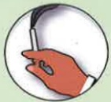

## COPD Pulmonary Exercise Training

## Lower Limb Exercises — Walking, Treadmill Training

## What is COPD?

Chronic respiratory inflammation leading to irreversible obstructive disease

Eighth leading cause of death in Taiwan

Symptoms: Cough

Sputum

Shortness of breath

Risk factors:

Smoking or secondhand smoke

Exposure to environmental pollutants

Or occupational exposure

Family history

Or other lung conditions

21X29.7cm

## Importance of Lower Limb Exercise Training

1. Chronic respiratory inflammation leading to airway obstruction may cause dynamic overinflation of the lungs, limiting patients' physical activity capacity.

2. Exercise training can reduce shortness of breath during physical activity and improve daily functioning and quality of life.

Printed in July 2024

3. Lower limb exercise training includes endurance and resistance training; combining both types of training can enhance physical capacity and muscle strength.

4. Walking and treadmill training are suitable for individuals with good balance and can be combined with diaphragmatic breathing and abdominal breathing during training.

## Reference Sources

1. Taiwan Thoracic and Critical Care Society (2022) • Practical Guidelines for Lung Recovery in Taiwan 2022 • Taipei: Taiwan Thoracic and Critical Care Society

2. Taiwan Thoracic and Critical Care Society (2022) • Run, Little Lung! – Patient Education Handbook on COPD Pulmonary Rehabilitation • Taipei: Taiwan Thoracic and Critical Care Society

## Contact Information

| Hospital | Yida Cancer Treatment Hospital | Yida Dachang Hospital |
|---------|-------------------------------|------------------------|
| Address: No. 1, Yida Road, Jiaosu Village, Yanchao District, Kaohsiung | Address: No. 21, Yida Road, Jiaosu Village, Yanchao District, Kaohsiung | Address: No. 305, Dachang Road, Simei District, Kaohsiung |
| Phone: 07-6150011 ext. 5072 (COPD Individual Care Specialist) | Phone: 07-6150022 ext. 6477 (COPD Individual Care Specialist) | Phone: 07-5599123 (Respiratory and Thoracic Clinic) |

Newly established HA-9-0117(1) in June 2024Walking exercise requires wearing appropriate footwear.

Individuals with poor balance may use a cane or walker for assistance.

If a home treadmill is available, it can be used to adjust to a suitable speed.

It is recommended to perform the exercise at least three times per week, each session lasting 15–20 minutes; the frequency and number of sessions can be adjusted according to individual conditions.