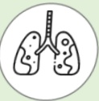
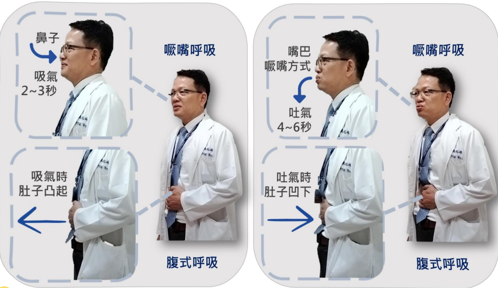

## COPD Pulmonary Exercise Training

## Breathing Exercises -- Lip Sucking Breathing and Diaphragmatic Breathing

## What is COPD?

Chronic respiratory inflammation leading to irreversible obstructive disease

Eighth leading cause of death in Taiwan

Symptoms: Cough

Sputum

Shortness of breath

## Risk Factors:

Smoking or secondhand smoke  
Exposure to environmental pollutants  
Occupational exposure  
Family history  
Other lung conditions

## Importance of Breathing Exercises

1. Chronic respiratory inflammation leading to airway obstruction may cause dynamic overinflation of the lungs, limiting patients' physical activity capacity.  
2. Breathing exercises can increase exhalation time, reducing gas retention in the lungs and helping to decrease dynamic overinflation during exercise, thereby improving patients' dyspnea.

## Reference Sources

1. Taiwan Thoracic and Critical Care Society (2022) • 2022 Run, Little Lungs! - COPD Pulmonary Rehabilitation Educational Handbook • Taipei: Taiwan Thoracic and Critical Care Society  
2. Taiwan Thoracic and Critical Care Society (2017) · What Is COPD? - Comprehensive Care Handbook for COPD • Taipei: Taiwan Thoracic and Critical Care Society

## Contact Information

| Hospital | Yida Cancer Treatment Hospital | Yida Dachang Hospital |
|---------|-------------------------------|------------------------|
| Address: No. 1, Yida Road, Jiaosu Village, Yanchao District, Kaohsiung City | Address: No. 21, Yida Road, Jiaosu Village, Yanchao District, Kaohsiung City | Address: No. 305, Dachang 1st Road, Sanmin District, Kaohsiung City |
| Phone: 07-6150011 ext. 5072 (COPD Individual Care Specialist) | Phone: 07-6150022 ext. 6477 (COPD Individual Care Specialist) | Phone: 07-5599123 (Pulmonary and Thoracic Clinic) |## Breathing Exercises

Nose

Pouting breathing

Inhale for 2~3 seconds

Mouth

Pouting method

Pouting breathing

During inhalation

Abdomen protrudes

Diaphragmatic breathing

Diaphragmatic breathing

Perform these actions regularly and repeatedly each day. Adjust the number of times and frequency according to individual conditions. 

During exhalation

Abdomen sinks

Diaphragmatic breathing

Diaphragmatic breathing

Perform these actions regularly and repeatedly each day. Adjust the number of times and frequency according to individual conditions.