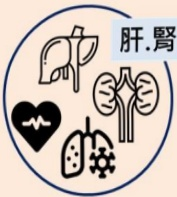
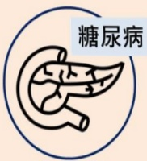
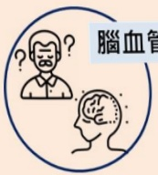

## COPD Vaccine Administration: Pneumococcal Vaccine

## What is COPD?

## Chronic respiratory inflammation, an irreversible obstructive disease

8th leading cause of death in Taiwan

## Symptoms: Cough

Sputum

## Shortness of breath

## Risk factors:

Smoking or secondhand smoke  
Exposure to environmental pollutants  
Occupational exposure  
Family history  
Other lung conditions

## COPD Vaccination

1. According to domestic and international care guidelines, COPD patients should receive relevant vaccinations to prevent related infections, reduce the frequency of acute exacerbations and complications, and thereby decrease hospitalization rates and mortality.

2. The 2023 GOLD guidelines recommend that COPD patients receive the following vaccines: annual influenza vaccine, pneumococcal vaccine (13-valent and 23-valent in Taiwan), COVID-19 vaccine, whooping cough vaccine, and shingles vaccine.

3. COPD patients should receive pneumococcal vaccination not only those aged 65 and above, but also those under 65 with comorbid chronic conditions.

## References

1. Taiwan Thoracic and Critical Care Society. Clinical Care Guidelines for COPD. 2019.  
2. 2023 GLOBAL STRATEGY FOR PREVENTION, DIAGNOSIS AND MANAGEMENT OF COPD. 2023.

## Contact Information

| Hospital | Defeng Hospital | Dali Chang Hospital |
|---------|----------------|---------------------|
| Address: No. 1, Yida Road, Jiaosu Village, Yancheng District, Kaohsiung City | Address: No. 21, Yida Road, Jiaosu Village, Yancheng District, Kaohsiung City | Address: No. 305, Dachang 1st Road, Sanmin District, Kaohsiung City |
| Phone: 07-6150011 ext. 5072 (COPD individual care specialist) | Phone: 07-6150022 ext. 6477 (COPD individual care specialist) | Phone: 07-5599123 (Respiratory and thoracic outpatient clinic) |

Pulmonary obstruction international concern you

If you have any questions

Welcome to consult a thoracic surgeon

## Pneumonia

A respiratory infection disease caused by bacteria or viruses transmitted through air or droplets,

Common symptoms: fever, cough, shortness of breath or difficulty breathing, chest pain, etc., which may lead to sepsis and endanger life.

## Streptococcus pneumoniae

The most common bacterium causing pneumonia,

It may also cause otitis media, sinusitis, bronchitis, meningitis, etc.

Main transmission methods: droplet transmission via coughing or sneezing by carriers, or touching items contaminated with bacteria.

Chronic diseases such as liver, kidney, heart, and lungs

## Types of Pneumococcal Vaccines

## 13-valent

Conjugate vaccine PCV13 originally self-paid

2023: eligible for public funding from age 65 upward

Longer protection period

Two doses must be administered with a one-year interval

$ ^{*} $ Actual subsidy status is subject to the latest government policy at the time

23-valent

Polysaccharide vaccine PPV23

Originally self-paid

71 years and above: eligible for public funding

2023: eligible for public funding from age 65 upward

Protection period approximately 5 years

## Recommended high-risk groups for vaccination

Diabetes

Cerebrovascular disease, dementia

Smokers