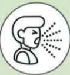
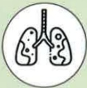
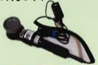

## COPD Lung Function Training

## Lung Physical Therapy and Training — Chest Physiotherapy (Chest Percussion) & Postural Drainage

## What is COPD?

Chronic inflammatory respiratory disease with irreversible obstruction

Eighth leading cause of death in Taiwan

## Symptoms: Coughing

Sputum

Shortness of breath

## Risk Factors:

Smoking or secondhand smoke  
Exposure to environmental pollutants  
Occupational exposure  
Family history  
Other lung conditions

## Importance of Chest Physiotherapy

1. Chronic respiratory inflammation and excessive sputum production leading to airway obstruction may prevent the lungs from effectively clearing sputum, thereby affecting ventilation and gas exchange.

2. Common physical therapy techniques can enhance sputum clearance from the airways, increase ventilation, improve gas exchange, and prevent or slow the progression of respiratory disease deterioration.

3. Chest percussion (chest percussion) uses a tapping method on the thoracic wall to loosen sputum secreted in the lungs, allowing it to flow from the bronchi into the lungs and be expelled through coughing. This is more effective when combined with postural drainage.

4. Postural drainage uses the principle of gravity and changes in body position to position areas with high sputum accumulation at a higher level, enabling sputum to be drained into larger airways via chest percussion and then expelled through coughing.

## References

1. Taiwan Thoracic and Critical Care Society (2022) • 2022 Run, Little Lungs! — COPD Pulmonary Rehabilitation Educational Handbook • Taipei: Taiwan Thoracic and Critical Care Society

2. Taiwan Thoracic and Critical Care Society (2017) How Much Do You Know About COPD — Comprehensive Care Handbook for COPD • Taipei: Taiwan Thoracic and Critical Care Society

## Contact Information

## Yida Hospital

Address: No. 1, Yida Road, Jiaoshu Village, Yancheng District, Kaohsiung City  
Phone: 07-6150011 ext. 5072 (COPD Individual Care Specialist)

Yida Cancer Treatment Hospital

Address: No. 21, Yida Road, Jiaoshu Village, Yancheng District, Kaohsiung City  
Phone: 07-6150022 ext. 6477 (COPD Individual Care Specialist)

Yida Da Chang Hospital

Address: No. 305, Da Chang Road, Sanmin District, Kaohsiung City  
Phone: 07-5599123 (Pulmonary and Thoracic Clinic)## Timing for Chest Physiotherapy

1 hour before meals or 2 hours after meals

Reduces vomiting caused by coughing during fullness, preventing aspiration pneumonia

Methods and tools for chest physiotherapy

Common methods include using hands in a cupped shape, chest percussion cup, chest percussion stick, etc., with a tapping rate of 3–5 times per second

Recommended duration of 3–5 minutes per area, performed three times daily

## Precautions

Avoid percussion near drainage tubes or surgical incisions. When percussing the back, avoid the shoulders (scapulae), spine, and kidneys. When percussing the anterior chest, avoid the sternum and clavicle.

If cyanosis, respiratory distress, changes in vital signs, or hemoptysis occur, immediately stop chest physiotherapy

Upper lobe

## Middle and lower lobes

