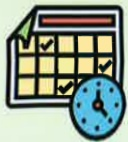
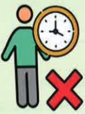

# COPD Pulmonary Exercise Training

Daily Energy-Saving Tips

## What is COPD?

Chronic inflammatory respiratory condition with irreversible obstructive disease  
8th leading cause of death in Taiwan

## 🧠 Symptoms: Cough

Sputum

## Risk Factors:

Smoking or secondhand smoke  
Exposure to environmental pollutants  
Occupational exposure  
Family history  
Other lung conditions

Yi Da Medical Foundation 21X29.7cm Printed in August 2024

## Importance of Energy-Saving Techniques

1. Energy-saving techniques (also known as work simplification techniques) help patients conserve energy by efficiently using their bodies and organizing actions, thereby maintaining independence in daily activities and reducing discomfort caused by illness.

2. Proper use of energy-saving techniques enables patients with breathing difficulties and shortness of breath during exercise to perform daily activities more easily. Combined with breathing exercises, these techniques can reduce the energy expenditure required during physical activities.

## Reference Sources

1. Taiwan Thoracic and Critical Care Society (2022) · Practical Guidelines for Lung Recovery in Taiwan 2022 · Taipei: Taiwan Thoracic and Critical Care Society

2.1. Taiwan Thoracic and Critical Care Society (2022) • "Run, Little Lung!" – Educational Handbook on COPD Pulmonary Rehabilitation

3. Taiwan Thoracic and Critical Care Society (2017) · "COPD: What You Need to Know" – Comprehensive Care Handbook for COPD

## Contact Information

| Yi Da Hospital | Yi Da Cancer Treatment Hospital | Yi Da Dachang Hospital |
|---------------|-------------------------------|------------------------|
| Address: No. 1, Yida Road, Juxu Village, Yancheng District, Kaohsiung City | Address: No. 21, Yida Road, Juxu Village, Yancheng District, Kaohsiung City | Address: No. 305, Dachang 1st Road, Sanmin District, Kaohsiung City |
| Phone: 07-6150011 ext. 5072 (COPD Individual Care Specialist) | Phone: 07-6150022 ext. 6477 (COPD Individual Care Specialist) | Phone: 07-5599123 (Pulmonology & Thoracic Medicine Outpatient Clinic) |## Clothing

Concentrate on clothing items

Easy to access

Reduce clothing with buttons

Dress while sitting

Avoid bending over

## Cooking and Eating

Concentrate on utensils and ingredients

Eat small meals frequently

Avoid overeating

Chew slowly to avoid choking

Little tips

Pending tasks

Prioritize tasks

Weekly work schedule

Plan tasks in advance

Avoid overloading on a single day

## Activities and Shopping

Make full use of various assistive devices

Walk comfortably and safely

Use a wheeled cart

Shopping and purchasing are easier

## Wearing Shoes and Bathing

Wear shoes while sitting or use shoe lift aids

Avoid bending over

Use long-handled brushes to avoid bending over

Slow down

Don't rush

Avoid bending over

Avoid prolonged standing

Make use of tools for assistance