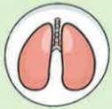

Taiwan Medical Foundation 21X29.7cm Printed in August 2024

# COPD Pulmonary Exercise Training

## Breathing Training – Vibration Expiratory Positive End-Pressure Device Training

## What is COPD?

A chronic inflammatory respiratory condition causing irreversible airway obstruction

8th leading cause of death in Taiwan

🧠 💪 Symptoms: Coughing

Sputum

Shortness of breath

## Risk Factors:

Smoking or secondhand smoke  
Exposure to environmental pollutants  
Occupational exposure  
Family history  
Other lung conditions

## Importance of Breathing Training

1. Chronic inflammation of the airways leads to airway obstruction, potentially causing dynamic overinflation of the lungs and limiting patients' physical activity capacity.

2. Breathing training increases expiratory time, reducing gas retention in the lungs and helping to reduce dynamic overinflation during exercise, thereby improving patients' breathing difficulties.

3. Expiratory Positive Pressure (PEP) devices are adjustable breathing training tools that use a set resistance to maintain a positive pressure state during exhalation. When combined with diaphragmatic relaxation and abdominal muscle engagement, PEP helps prevent airway collapse during exhalation, improves gas retention in the thoracic cavity, and aids in the clearance of respiratory secretions.

## Reference Sources

1. Taiwan Thoracic and Critical Care Society (2022) • 2022 Run, Little Lungs! – COPD Pulmonary Rehabilitation Educational Manual • Taipei: Taiwan Thoracic and Critical Care Society

2. Taiwan Thoracic and Critical Care Society (2017) • What is COPD? – Comprehensive Care Handbook for COPD • Taipei: Taiwan Thoracic and Critical Care Society

## Contact Information

| Yida Hospital | Yida Cancer Treatment Hospital | Yida Dachang Hospital |
|--------------|-------------------------------|------------------------|
| Address: No. 1, Yida Road, Jiaosu Village, Yancheng District, Kaohsiung City | Address: No. 21, Yida Road, Jiaosu Village, Yancheng District, Kaohsiung City | Address: No. 305, Dachang 1st Road, Sanmin District, Kaohsiung City |
| Phone: 07-6150011 ext. 5072 (COPD Individual Care Specialist) | Phone: 07-6150022 ext. 6477 (COPD Individual Care Specialist) | Phone: 07-5599123 (Pulmonary and Thoracic Clinic) |## Vibration Exhalation with Positive End-Expiratory Pressure (PEEP) Device Training

## Numerous commercial models available—choose one suitable for individual use

## Training Focus

1. Inhalation : Exhalation = 1 : 3 ~ 4  
2. Mouth must tightly seal the blow mouth with no air leakage

## Recommended Volume

30 repetitions per cycle; for those who feel breathless, take 3–5 breaths of rest between cycles. Perform at least 2 cycles per day.

Daily consistent practice; frequency and number of repetitions should be adjusted according to individual conditions.

## Cleaning and Assembly

Rotate to the minimum scale  

Pull out the soft tube outward  

Remove the blow mouth  

Place the cleaner from top to bottom  

Rinse with clean water and air dry  

After drying, pull the cleaner back in

## General Conditions

Nasal inhalation for 2–3 seconds  

Mouth  

Insert the polymeric blow mouth  

Exhale  

For more than 6 seconds  

## Combined with Aerosol Medication

Reinstall the soft tube  

Adjust to an appropriate strength  

Reinstall the blow mouth and begin training  

Mouth  

Insert the polymeric blow mouth  

Inhale for 2–3 seconds  

Self-test

Cheeks should not bulge  

Use the palm of the hand  

Mouth  

Insert the tight blow mouth  

Exhale for more than 6 seconds  

Anterior chest  

## Cheeks Should Not Bulge  

## If exhalation technique is correct, you will feel a vibration sensation in the lungs

Place the palm on the thoracic area (between the two nipples)  

Back  

Place one hand palm on the back  

Between the two cheekbones  

→ Central airway  

Place both hands palms on the back  

Below the two cheekbones  

→ Lower lung lobes