Pulmonary Obstruction

(COPD)

Care Handbook

Yi Da Medical Respiratory and Thoracic Department## Basic Information

Name: ___

Date of Birth

Contact Phone

Primary Physician

Personal Manager

Contact Method

Disease-related## Emphysema

One. What is Emphysema... 03  
Two. Overview of Diagnosis and Treatment of Emphysema... 06  
Three. Medication Treatment of Emphysema... 09  
Four. Acute Exacerbations and Management... 20  
Five. Non-pharmacological Treatment of Emphysema... 23  
(1) Smoking Cessation and Vaccination... 24  
(2) Pulmonary Rehabilitation Exercises... 26  
(3) Chest Physiotherapy... 35  
(4) Comorbidities and Nutritional Care in Emphysema... 37  
(5) Home Oxygen Therapy... 39  
Six. References... 41

## One. What is Emphysema

Emphysema (COPD) is a chronic inflammatory condition of the respiratory tract, characterized by irreversible obstructive lung disease. The primary cause of chronic inflammation is long-term irritation of the respiratory tract (such as smoking, dust, chemical substances, etc.). This inflammatory response leads to increased mucus secretion in the airways, resulting in bronchial obstruction and impaired gas exchange, causing breathing difficulties and other respiratory problems.

Healthy respiratory tract

Inflamed respiratory tract

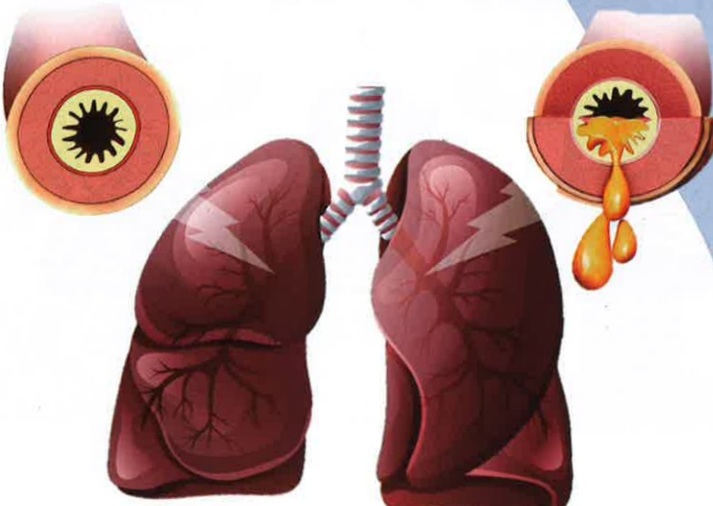
## What is pulmonary obstruction

Pulmonary obstruction ranks as the 9th leading cause of death in Taiwan (2022), causing over 5,000 deaths annually, accounting for 6%–10% of total mortality among the population, with a first-hospitalization mortality rate of 22%.

Common symptoms include "coughing, producing phlegm, and persistent shortness of breath," which are often mistaken for common cold or asthma symptoms and thus overlooked. If you have chronic coughing, expectoration, breathing difficulties, or a history of exposure to hazardous factors, it is recommended to seek medical attention for further examination and diagnosis.

## What is pulmonary obstruction

## Risk factors

Smoking

Secondhand smoke

Environmental/occupational exposure

Dust

## Family history

Lung condition

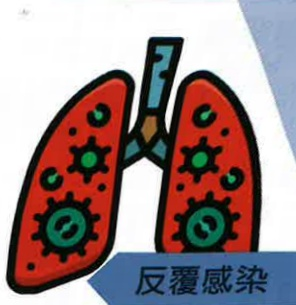

Recurrent infections## Two. Overview of Diagnosis and Treatment of Pulmonary Obstruction

## Diagnosis

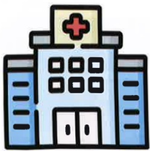

## Three

Medical history

Family history

Smoking history

Risk factors

Respiratory symptoms

## Respiratory and Thoracic Outpatient Clinic

Smoking history

Coughing

Respiratory symptoms

Shortness of breath

Risk factors

(Exposure to irritants)

## Two. Overview of Diagnosis and Treatment of Pulmonary Obstruction

Family history

## Physician Evaluation

## Has the patient smoked? Long-term smoking?

Does the patient frequently cough? Does the patient often produce sputum?

Does the patient experience sudden shortness of breath that is getting worse over time?

Is the patient particularly short of breath during physical activity (e.g., exercise, climbing stairs, lifting heavy objects)?

Does the patient have persistent shortness of breath?

Has the patient been exposed to kitchen oil fumes for a long time?

Has the patient been exposed to occupational dust (e.g., asbestos, silica, coal dust, cotton, grains) or chemicals (sulfuric acid, nitric acid, ammonia)?

Does a family member or relative have a history of pulmonary obstruction?

## Diagnosis

## Three three three

Physician assessment may include:

Chest X-ray

or

Chest CT scan

## Pulmonary Function Test

An essential diagnostic examination in thoracic medicine

A method to assess lung function by measuring lung volumes

During the test, the patient takes a deep breath and then forcefully exhales

The degree of airflow obstruction is evaluated using Forced Vital Capacity (FVC) and Forced Expiratory Volume in 1 second (FEV1)

If FEV1/FVC < 70%, it indicates airflow obstruction

Diagnosis of pulmonary obstruction is confirmed by combining physician assessment with symptom severity, smoking history, exposure to risk factors, chest X-ray, etc.## II. Overview of Diagnosis and Treatment of Pulmonary Obstruction

## Treatment

Improve symptoms, slow disease progression, and maintain quality of life

Pharmacological treatment

## Non-pharmacological treatment

## III. Pharmacological Treatment of Pulmonary Obstruction

## Inhaled Medications

Bronchodilators are the primary medications for treating pulmonary obstruction.

Single agents

For emergency use

Combination agents

Short-acting beta-2 agonists (SABA)

Short-acting

Combination of short-acting beta-2 agonists and short-acting anticholinergics (SABA + SAMA) with inhaled corticosteroids (ICS)

For maintenance use

Long-acting beta-2 agonists (LABA)

Long-acting anticholinergics (LAMA)

Fixed-dose combination

Bronchodilators

(LABA + LAMA)

Fixed combination of inhaled corticosteroids and long-acting beta-2 agonists

(LABA + ICS)## Three. Medication Treatment for Obstructive Lung Disease

## Three. Medication Treatment for Obstructive Lung Disease

## Inhaled Medications

## Long-acting Monotherapy

## Extended-Release Inhalation Aerosol

## Long-acting Anticholinergic Agent (LAMA)

Product name:  
Spiriva Respimat  

Chemical name:  

Tiotropium  

Chinese name:  
Shi Xuan Le Shu Pei Inhaler  

Dosage:  
Once daily, 2 puffs per dose  

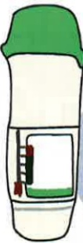

## Inhaled Medications

## Extended-Release Inhalation Aerosol

## Long-acting Combination Therapy

## Dual Long-acting Bronchodilator (Fixed dual LABA+LAMA)

Product name:  
Spiolto Respimat  

Chemical name:  

Olodaterol + Tiotropium  

Chinese name:  
Shi Bei Le Shu Pei Inhaler  

Dosage:  
Once daily, 2 puffs per dose  

## Dual Long-acting Bronchodilator (Fixed dual LABA+LAMA)

Product name:  
Dry Powder Inhaler  

Anoro Ellipta  

Chemical name:  
Vilanterol + Umeclidinium  

Chinese name:  
An Feng Le Yi Li Da Dry Powder Inhaler  

Dosage:  
Once daily, 1 puff per dose## Three. Medication Treatment for Obstructive Lung Disease

## Three. Medication Treatment for Obstructive Lung Disease

## Inhaled Medications

## Long-acting Combination Therapy

## Dual Long-acting Bronchodilators

(Fixed dual LABA + LAMA)

## Dry Powder Inhaler

Product Name:  
Ultibro Breezhaler  

Chemical Name:  

Indacaterol +  
Glycopyrronium  

Chinese Name:  
Angdibo Inhaler Capsule  

Dosage:  
Once daily, one dose per administration

## Dual Long-acting Bronchodilators

(Fixed dual LABA + LAMA)

## Metered-Dose Inhaler

Product Name:  
Bevespi Aerosphere  

Chemical Name:  
Formoterol + Glycopyrronium  

Chinese Name:  
Bilungyi Aerosol Spray  

Dosage:  

Twice daily, two sprays per administration

## Inhaled Medications

## Long-acting Combination Therapy## Three. Medication Treatment for Obstructive Lung Disease

## Three. Medication Treatment for Obstructive Lung Disease

## Inhaled Medications

## Long-acting Combination (containing ICS)

## Fixed Combination of Inhaled Corticosteroids and Long-acting Beta-2 Agonists (ICS + LABA)

Product name:  
Relvar Ellipta  

Chemical name:  
Dry powder inhaler  
Fluticasone furoate  
+ Vilanterol  

Chinese name:  
Runwa Yelida Dry Powder Inhaler  

Dosage:  
Once daily, 1 spray  

Metered-dose inhaler (MDI)

## Fixed Combination of Inhaled Corticosteroids and Long-acting Beta-2 Agonists (ICS + LABA)  
Product name:  
Dry powder inhaler  
Symbicort Turbuhaler  

Chemical name:  
Budesonide  
+ Formoterol  

Chinese name:  
Xibixuo Dobao Dry Powder Inhaler  

Dosage:  

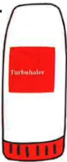

## Inhaled Medications

Twice daily, 2 sprays per dose

## Long-acting Combination (containing ICS)

## Fixed Combination of Inhaled Corticosteroids and Long-acting Beta-2 Agonists (ICS + LABA)

Product name:  
Seretide Evohaler MDI  

Chemical name:  
Fluticasone propionate  
+ Salmeterol  

Chinese name: ___  
Shilai Inhaler  

Dosage:  
Twice daily, 2 sprays per dose  

Fixed Combination of Inhaled Corticosteroids and Long-acting Beta-2 Agonists (ICS + LABA)  

Product name:  
Symbicort Rapihaler MDI  
Metered-dose inhaler (MDI)  

Chemical name:  
Budesonide  
+ Formoterol  

Chinese name:  
Xibixuo Qi Hua Spray  

Dosage:  
Twice daily, 2 sprays per dose  

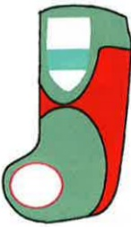
## Three. Medication Treatment for Lung Obstruction

## Inhaled Medications

## Long-acting Combination (with ICS)

## Three. Medication Treatment for Lung Obstruction

## Inhaled Medications

## Long-acting Combination + ICS (Triple Therapy)

Dry powder inhaler

## Inhaled Corticosteroid (ICS) + Long-acting Anticholinergic (LAMA) + Long-acting Beta-2 Agonist (LABA)

Product name: Trelegy Ellipta

Chemical name:

Fluticasone furoate

+ Umeclidinium

+ Vilanterol

Chinese name:

Lung Le Xi Yili Da Dry Powder Inhaler

Dosage: Once daily, 1 spray per dose

Metered-dose inhaler

## Inhaled Corticosteroid (ICS) + Long-acting Anticholinergic (LAMA) + Long-acting Beta-2 Agonist (LABA)

Product name: Trimbow

Chemical name:

Beclomethasone dipropionate

+ Glycopyrronium

+ Formoterol

Chinese name: Xuan Bao Metered-dose Inhaler

Dosage: Twice daily, 2 sprays per dose## Three, Drug Therapy for Airway Obstruction

Inhalation medications

Long-acting combination + ICS (three-in-one)

## Three, Drug Therapy for Airway Obstruction

Inhalation medications

## Proper Usage

Incorrect usage## Four. Symptoms of Acute Deterioration and Management

## Symptoms

In patients with pulmonary obstruction, acute deterioration primarily manifests as a sudden worsening of respiratory symptoms, with the degree of change exceeding their usual baseline, thus requiring a change in medication.

More severe coughing

Increased sputum production

Thicker sputum

Worsening shortness of breath

## Acute Deterioration Symptoms and Management

Prevention and Management

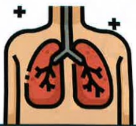

Avoid upper respiratory infections

Avoid exposure to harmful substances

Get vaccinated

Use masks and protective equipment

Once acute deterioration occurs, immediate use of rescue medications and prompt medical consultation should be initiated.

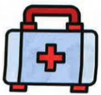

Ventolin

Metered-dose inhaler

Budesonide

Metered-dose inhaler

Budesonide Plus

Metered-dose spray## Acute Exacerbation Symptoms and Management

Decline in lung function  
Worsening symptoms  
In-hospital mortality rate  
One-year mortality rate  
Intensive care unit (ICU) admission rate  
Mechanical ventilation rate  
Rate of respiratory failure  
Decline in quality of life

## Five. Non-pharmacological Treatments for Airway Obstruction

Smoking cessation and vaccination  
Pulmonary rehabilitation exercises  
Thoracic physical therapy

At-home oxygen therapy## Five. Non-pharmacological Treatment for Lung Obstruction

## Five. Non-pharmacological Treatment for Lung Obstruction

## Smoking Cessation and Vaccination

## Smoking Cessation

Tobacco contains over 7,000 chemicals,  
of which hundreds are toxic, and at least 93 are known carcinogens.  

Smoking is the leading risk factor for lung obstruction, leading to deterioration of lung function, reduced quality of life, and is associated with many of the top ten causes of death (such as malaria, cardiovascular diseases, stroke, etc.).

## According to statistical data:

Smokers are 25 times more likely to develop lung cancer than non-smokers, and smokers with lung obstruction are 120 times more likely to develop it.

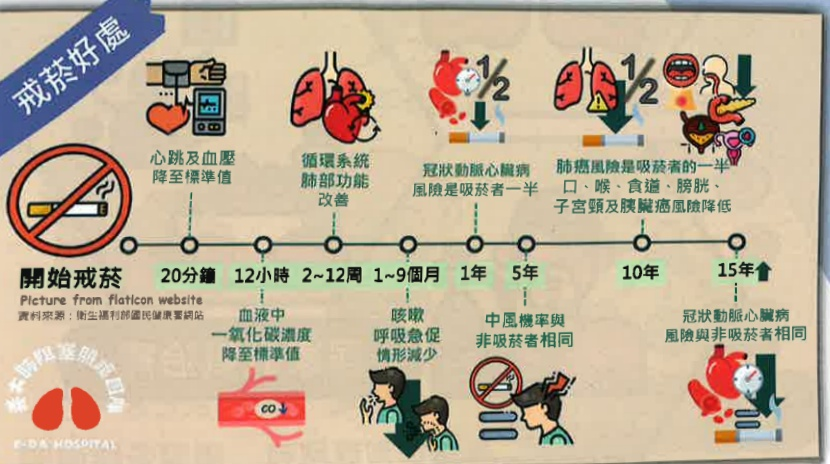

## Vaccination

## Influenza Vaccine

From October each year to March of the following year

For individuals aged 65 and above

Publicly funded 23-valent or 13-valent vaccine

Two doses administered with a one-year interval between them

*Actual subsidy details are subject to the latest government policy announcement.

## Pneumococcal Vaccine

## COVID-19 Vaccine

Administered according to updates of circulating virus strains.

## Shingles Vaccine

Self-paid, two-dose regimenThe above actions should be practiced regularly and repeatedly each day.

The number of daily practice sessions and frequency should be adjusted according to individual circumstances.

## Five. Non-pharmacological Treatment for Obstructive Lung Disease

## Lung Recovery Exercises

## Comprehensive Lung Recovery Program

Lung recovery is a comprehensive intervention strategy individually tailored based on detailed patient assessments, including exercise training, health education (such as disease education, medication education, etc.), and promotion of healthy behaviors. The aim is to improve the physiological and psychological conditions of patients with obstructive lung disease and to enhance their long-term adherence to beneficial health behaviors.

## Five. Non-pharmacological Treatment for Obstructive Lung Disease

## Exercise Training

Improve muscle strength and cardio-pulmonary function, reduce breathlessness during physical activity, and improve daily activities and quality of life.

## Pursed-Lip Breathing & Diaphragmatic Breathing

Through breathing exercises, the exhalation time can be increased to reduce lung gas retention, helping to decrease dynamic overinflation caused by exercise and thereby improving the patient's breathlessness.

Breathing Exercises

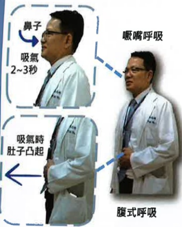

## Five. Non-pharmacological Treatment for Lung Obstruction

## Perform these exercises regularly and repeatedly each day

The number of times and frequency of daily practice should be adjusted according to individual conditions.

## Five. Non-pharmacological Treatment for Lung Obstruction

## Water bottle (or dumbbell) training

Through upper limb exercises, improve upper limb muscle strength, enhance exercise endurance and respiratory intensity, and alleviate the sensation of shortness of breath.

## YouTube

## Upper limb exercises

Recommended frequency: at least 3 times per week  
Duration: 20–30 minutes per session  
Combined with mouth breathing, the effect is enhanced.  
The number of practice sessions can be adjusted according to individual conditions.## Five. Non-pharmacological Treatment for Lung Obstruction

## Five. Non-pharmacological Treatment for Lung Obstruction

## Elastic Band Training

Biceps Training

## YouTube

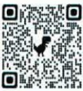

Triceps Training

Biceps Training

Recommended frequency: at least 3 times per week, each session lasting 20–30 minutes

Combining this exercise with pursed-lip breathing enhances effectiveness; the number of repetitions can be adjusted according to individual conditions.

## Walking (Using a Treadmill)

## YouTube

Lower limb exercises are divided into endurance training and resistance training. Combining both types of training can improve physical capacity and muscle strength.

Walking and treadmill training are suitable for individuals with good balance. These exercises can be combined with pursed-lip and diaphragmatic breathing.

Lower limb exercises

When walking, wear appropriate footwear.

For individuals with poor balance:

Use a walking stick or walker for assistance.

If a treadmill is available at home, adjust the speed to suit individual needs.

Recommended frequency: at least 3 times per week, each session lasting 15–20 minutes. The number of repetitions can be adjusted according to individual conditions.

## Sitting to Standing

Lower limb exercises

Cross hands

Hold them in front of the chest

## YouTube

Sitting to standing counts as one movement.

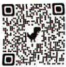

Find a stable, non-tip-over chair. Individuals with poor balance can place a walker in front for support.

Typically, 20 repetitions constitute one cycle. The number of repetitions can be adjusted according to individual conditions.## Five. Non-pharmacological Treatment for Pulmonary Obstruction

## Five. Non-pharmacological Treatment for Pulmonary Obstruction

## Cycling Exercise

## Lower Limb Exercises

Wear appropriate shoes and perform adequate warm-up exercises.  
If a stationary bicycle is available at home, it can be used to adjust speed and resistance.

## YouTube

**Recommended amount**: At least 3 times per week, 15–20 minutes per session. Pause and rest if discomfort occurs during exercise. The frequency and number of sessions can be adjusted according to individual conditions.

## Crab Walking Training

Suitable for individuals with good balance who can walk independently.  
For individuals with insufficient balance but who can still walk independently, it is recommended to assist with support against a wall during training.

## Lower Limb Exercises

Secure elastic bands or resistance bands at the thighs of both legs.  
Take 5 steps to the left, then 5 steps to the right.  
Stand with feet shoulder-width apart.  
Slightly bend the knees.  
Keep the upper body upright, do not bend the back, and place hands on the waist.

Repeat each side 4 times per cycle.

## YouTube

If mild muscle fatigue is felt after training, apply gentle heat to relieve discomfort.  
If discomfort occurs during exercise, pause and rest.  
The frequency and number of training sessions can be adjusted according to individual conditions.

## Grip Ball (or Hand Grip Exercise)

## YouTube

Sarcopenia is a syndrome characterized by a decline in muscle mass, strength, and function throughout the body. Studies have found that approximately 27% of COPD patients have sarcopenia.  
Hand grip strength not only reflects hand muscle strength but also serves as the best indicator of overall muscle strength.

COPD patients with low grip strength and reduced skeletal and respiratory muscle function are at increased risk of acute exacerbations and mortality, leading to deterioration of lung function and reduced quality of life.  
Studies show that for every 1 kg decrease in grip strength, the risk of COPD worsening increases by 5%.

Grip Ball Selection

Moderate  
Too large

Too small

Perform each squeeze for 2–5 seconds, 20 repetitions per set.  
At least 3 sets per day, with adjustments based on individual conditions.## Five. Non-pharmacological Treatment for Pulmonary Obstruction

## Five. Non-pharmacological Treatment for Pulmonary Obstruction

## Energy-Saving Techniques (also known as Work Simplification Techniques)

By arranging sequential actions, conserve energy and maintain independence in daily activities.

Appropriate use of energy-saving techniques can help patients with breathing difficulties and dyspnea during physical activity to perform daily living activities more easily. Combined with breathing exercises, these techniques can reduce the energy expenditure required during activities, thereby minimizing discomfort caused by the disease.

Energy-Saving Techniques

Taking a bath while sitting

Using a long-handled brush for assistance

Avoiding bending over

## Thoracic Physical Therapy

Timing for chest percussion

One hour before meals

Two hours after meals

Chest percussion tools

Commonly include

Hand formed into a hollow cup shape

Chest percussion cup,

Chest percussion stick, etc.

To reduce the risk of vomiting and aspiration pneumonia caused by coughing after full meals.

Method of chest percussion

Strike at a rate of 3–5 times per second

Recommended duration of 3–5 minutes per area

Perform three times daily

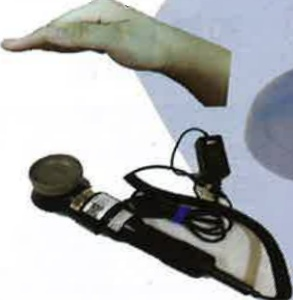

Precautions

Avoid percussion over drainage tubes, surgical incisions, or certain organ areas...

Stop immediately if cyanosis, dyspnea, changes in vital signs, or hemoptysis occur

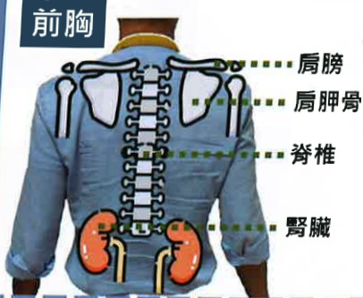

## Five. Non-pharmacological Treatment for Pulmonary Obstruction

## Anterior Chest

Semi-Fowler's position

## Upper Lobe

Bed tilt angle

Recommended 45–60 degrees

## Middle and Lower Lobes

Chest percussion at the supraclavicular area of the upper lung

## Back

Upright sitting position

## Back, Bilateral Simultaneously

Head-down, foot-up position; prone position

Suitable for young individuals with good balance and no contraindications such as hypertension, cardiovascular disease, or increased intracranial pressure

Back

Lateral recumbent position

Prone position (3/4 prone)

Place a pillow under the chest

Percussion (1) under the armpit (2) parallel to the spine at the armpit level (3) below the scapula

## Five. Non-pharmacological Treatment for Pulmonary Obstruction

Comorbidities and Nutritional Care for Pulmonary Obstruction

Comorbidities

Pulmonary obstruction is a chronic inflammatory disease that often coexists with other medical conditions, which may affect the control of pulmonary obstruction.

Cardiovascular disease

Osteoporosis

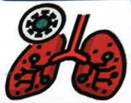

Lung cancer

Bronchiectasis

Infectious diseases

Sleep apnea## Five. Non-pharmacological Treatment for Pulmonary Embolism

## Nutritional Care

About 30–60% of patients with pulmonary embolism have malnutrition. Maintaining ideal body weight and fluid balance is important.

Additionally, about 27% have sarcopenia (a syndrome characterized by decreased muscle mass, strength, and function throughout the body).

Declining respiratory muscle function increases the risk of acute exacerbations and mortality, worsens lung function, and affects quality of life.

## High-quality nutrition can improve symptoms and enhance quality of life

High-quality protein

Beans, fish, eggs, meat

One palm-sized portion

Small, frequent meals

Moderate portion sizes

Avoid overeating

Affects breathing

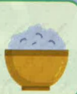

High-quality fats and nuts – cooked by stir-frying or mixing, not boiling

Loss of appetite

Specialized nutritional supplements

Lai Dou

Fluid intake to maintain metabolic balance in the body

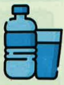

Avoid gas-producing foods

Legumes, cauliflower

Onion, sticky rice

*Actual nutritional needs should be adjusted according to individual conditions*

*If any concerns arise, consult a professional nutritionist*

## Five. Non-pharmacological Treatment for Pulmonary Embolism

## Home Oxygen Therapy

Oxygen is a treatment method that requires a prescription from a physician for use.

Improves complications of hypoxemia

Reduces the burden on the respiratory and cardiovascular systems

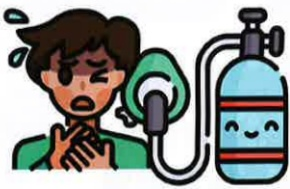

Alleviates symptoms of dyspnea

Improves quality of life and survival rate## Five. Non-pharmacological Treatment for Pulmonary Embolism

## Signs of Hypoxia

Dyspnea

Tachycardia

Cold sweat

Confusion

Dizziness

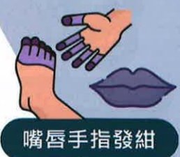

Cyanosis of lips and fingers

## Equipment for Long-term Home Oxygen Therapy

Doctors will select the most appropriate oxygen supply device based on factors such as the patient's activity level, oxygen flow rate, indoor environment, and economic considerations. Common types include:

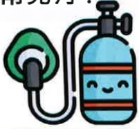

Electrically powered / portable rechargeable

Oxygen cylinder

Oxygen generator

## Six. Literature References

Taiwan Thoracic and Critical Care Society (2017). *How Much Do You Know About Pulmonary Embolism – A Comprehensive Care Manual for Pulmonary Embolism in Taiwan*. Taipei: Taiwan Thoracic and Critical Care Society

Taiwan Thoracic and Critical Care Society (2021). *2021: Mastering Inhaler Use in Your First Attempt*. Taipei: Taiwan Thoracic and Critical Care Society

Taiwan Thoracic and Critical Care Society (2022). *Clinical Practice Guidelines for Pulmonary Rehabilitation in Taiwan 2022*. Taipei: Taiwan Thoracic and Critical Care Society

Taiwan Thoracic and Critical Care Society (2022). *Run, Little Lungs! – Educational Handbook on Pulmonary Rehabilitation for Pulmonary Embolism*

Taiwan Thoracic and Critical Care Society (2023). *Clinical Care Guidelines for Pulmonary Embolism in Taiwan*. Taipei: Taiwan Thoracic and Critical Care Society

Image sources: https://www.flaticon.com/  
Image sources: https://www.canva.com/Pulmonary embolism consultation

Yida

Team

E-DA HOSPITAL

Yida Hospital

Yanchao District, Kaohsiung City

No. 1, Yida Road, Jiaosu Li, Yanchao District

07-6150011

Ext. 5072

Pulmonary embolism case manager

Contact Information

Yida Cancer Treatment Hospital

No. 21, Yida Road, Jiaosu Li, Yanchao District, Kaohsiung City

07-6150022

Ext. 6477

Pulmonary embolism case manager

Yida Da Chang Hospital

No. 305, Dachang Road, Sanchong District, Kaohsiung City

07-5599123

Respiratory and thoracic medicine outpatient clinic

Yida Medical Foundation 14.8x21cm

HA-9-0127(1) Newly established in 2024.05 Printed in 2024.08