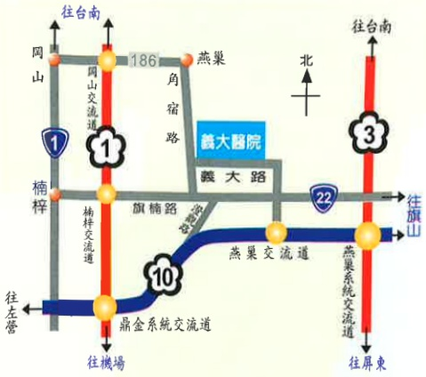

Address: No. 1, Yida Road, Jiaosu Village, Yanchao District, Kaohsiung City  
Phone: 07-6150011  
Website: edah@edah.org.tw  

This copyright shall not be reproduced, duplicated, or resold without the consent of the copyright holder.  
Copyright Holder: Edah Medical Foundation  
Form Number: HA-1-0011 (1)  
Edah Medical Foundation, 20x20 cm, printed in 2016.01, revised in 2011.05  

## Dizziness Precautions  

## Dizziness Precautions

## 1. What is Dizziness:

Dizziness is a symptom caused by various diseases, primarily due to imbalance or inflammation of the inner ear nerves. Patients often experience a sensation of spinning or rotation, where visual surroundings appear to rotate when looking around. This may be accompanied by nausea, vomiting, and difficulty standing steadily. In contrast, patients with "head fog" typically do not feel such intense sensations; they merely feel their heads heavy and have unsteady walking.

## 2. Common Diseases Causing Dizziness

| Disease Name | No Surgery or Hospitalization Required | Requires Surgery or Hospitalization |
|-------------|----------------------------------------|-------------------------------------|
| Vestibular inflammation or dysfunction (part of the 8th cranial nerve) | ◎ |  |
| Acute otitis media | ◎ |  |
| Foreign body in the ear or excessive earwax | ◎ |  |
| Temporal lobe epilepsy | ◎ |  |
| Other diseases causing circulatory impairment | ◎ |  |
| Stroke |  | ◎ |
| Brain tumor or acoustic neuroma |  | ◎ |
| Encephalitis, meningitis, or brain injury |  | ◎ |
| Multiple sclerosis |  | ◎ |

## 3. Home Life Precautions:

1. It is recommended to rest in bed, maintain regular sleep schedules, avoid excessive fatigue, staying up late, and emotional stress.

2. Keep the rest environment quiet and with soft lighting.

3. Change positions slowly; when getting up from bed, have someone assist to prevent falls.

4. Avoid consuming overly salty foods, such as pickled foods or pickled vegetables.

5. For patients with cardiovascular diseases, keep a blood pressure monitor at home and measure blood pressure regularly.

6. Quit smoking and betel nut: If you smoke or chew betel nut, it will have a negative impact on your condition. For your own health and your family's well-being, please firmly commit to quitting.

7. Take medications regularly, especially those for hypertension and diabetes. Always take them as prescribed. If a doctor at the emergency department has prescribed medication, please take it as instructed, in the correct dosage and timing. If symptoms persist after the medication runs out, please visit the neurology, otolaryngology, general internal medicine, or family medicine outpatient clinic for further follow-up treatment.

## 4. If any of the following occur, please return for follow-up immediately:

1. Worsening headache or dizziness.

2. Hearing loss, tinnitus, blurred or severe vision, nausea, or vomiting.

3. Sudden weakness, numbness, or abnormal sensation on one side of the body.

4. Uncontrolled twitching or seizures.

5. Persistent fever exceeding 38.5°C.

6. Any other symptoms or signs that make you feel uneasy.