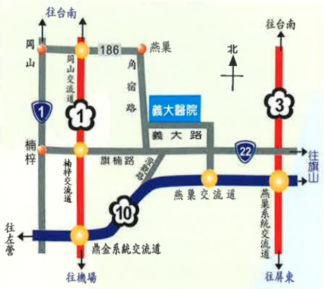

Address: No. 1, Yida Road, Jiaosu Village, Yanchao District, Kaohsiung City  
Phone: 07-6150011  
Website: edah@edah.org.tw  

This copyright is protected and may not be reproduced, copied, or resold without the written consent of the copyright holder.  

Copyright Holder: Edah Medical Foundation  
Form Number: HA-1-0050(2)  

Edah Medical Foundation, 20x20 cm, printed in January 2016, revised in May 2012  

Nasal Surgery Precautions  

  

Edah Medical Foundation, Published by E-DA HEALTHCARE GROUP## Nasal Surgery Precautions

## 1. Precautions:

☐ For patients undergoing local anesthesia, food intake can begin immediately after surgery. For those undergoing general anesthesia, food intake should be delayed until 4–6 hours post-surgery. Begin with 1–2 small amounts of liquid (such as water, milk, or juice). If no vomiting occurs, then proceed to consume semi-liquid foods like milk shakes or clear porridge.

☐ Nasal packing with gauze should not be removed by patients themselves; it will be removed by the doctor at a later stage.

☐ Apply ice packs to the affected area (each session for 10–15 minutes, followed by a 20–30 minute rest) to help control bleeding, reduce swelling, and alleviate pain.

☐ If discomfort occurs during icing of external cotton balls or small gauze pads, remove them immediately and rest. Avoid frostbite. Replace the pads as soon as they become wet.

☐ When getting up from bed, first sit on the bed for 5–10 minutes before standing, and pay attention to safety.

☐ Due to the gauze packing blocking the nasolacrimal duct, secretions will flow out through the eyes, resulting in increased tearing—this is a normal phenomenon.

☐ When sneezing, gently cover the nostrils with your fingers and exhale through the mouth.

☐ Swimming is not allowed for three months.

☐ To prevent bleeding, avoid bending or lowering your head during bathing or washing hair for two weeks after surgery.

☐ Avoid strenuous activities (such as sit-ups) or lifting heavy objects (over 15 kg).

☐ Drink plenty of water (2000–3000 cc per day) and consume fiber-rich vegetables and fruits (such as water pear and oatmeal) to prevent constipation.

☐ Avoid forcefully blowing your nose or picking your nose.

☐ Avoid alcohol, smoking, or taking tonics, as these may lead to nosebleeds and hinder wound healing.

☐ A small amount of fresh blood may be observed from the surgical site after surgery. However, if there is persistent bleeding or if the entire gauze pad becomes soaked, apply pressure to stop the bleeding for 5–10 minutes. If the bleeding does not subside or if redness, swelling, heat, or pain appears in the nasal area, contact the nursing staff immediately.

