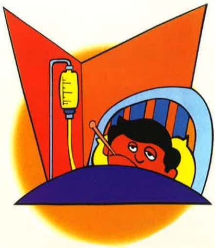
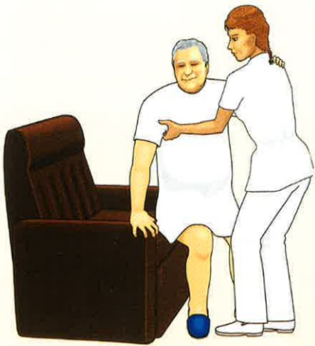

Address: No. 1, Yida Road, Jiaosu Village, Yanchao District, Kaohsiung City  
Phone: 07-6150011  
Website: edah@edah.org.tw  

This copyright shall not be reproduced, duplicated, or resold without the consent of the copyright holder.  
Copyright Holder: Edah Medical Foundation  
Form Number: HA-1-0079(2)  
Edah Medical Foundation, 20x20 cm, printed in May 2016, revised in May 2012  

Diarrhea  

## Diarrhea

## I. Definition:

Refers to increased stool water content or frequency, or both (more than 250 grams of stool in 24 hours, with more than 150 milliliters of water content).

## II. Causes of Diarrhea:

1. Viral or bacterial infections  
2. Consuming unclean food  
3. Stress: Emotional stress can also cause intestinal cramps and diarrhea  
4. Excessive alcohol consumption  
5. Antibiotics: These can disrupt the beneficial gut microbiota balance  
6. Drinking untreated or unfiltered water: Water may contain pathogenic organisms such as Giardia lamblia, or other parasites and amoebas, leading to diarrhea  
7. Hyperthyroidism

## III. Symptoms and Signs:

1. Passage of loose, watery stools  
2. Frequent bowel movements  
3. Abdominal pain or cramping

## IV. Treatment and Care:

1. Seek medical diagnosis and address the underlying cause to eliminate the pathogenic factor  
2. Rehydrate and replenish electrolytes: For mild diarrhea, oral rehydration solutions (e.g., Shupao) can be consumed; for severe diarrhea with dehydration, intravenous infusion may be required  
3. Milk: If lactose intolerance is present, milk intake should be minimized. Prefer light rice porridge or thin porridge. In the early stages or mild cases of diarrhea, diluted regular infant formula can be given. However, if symptoms do not improve or if there is severe or chronic diarrhea, medical attention should be sought immediately  
4. Home care and health education  
5. Education on maintaining the integrity of perianal skin  
6. Avoid foods that produce gas  

