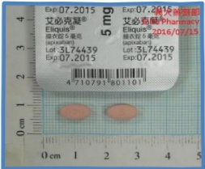
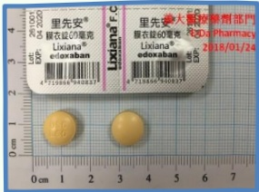
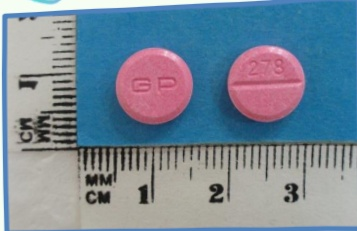
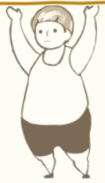

## Stroke Patient Health Education Manual## Table of Contents

Stroke? - - - - - - - - - - 2

Types and Symptoms of Stroke - - - - - - 4

Stroke Risk Factors - - - - - - - 7

Medications for Stroke Treatment - - - - - - - 11

Long-term Lifestyle and Rehabilitation - - - - - - - 15## What is a stroke?

A stroke mainly occurs due to blocked blood flow to the brain, leading to oxygen deficiency and resulting in brain function impairment.

Stroke is one of the top ten causes of death among Chinese people. Besides causing significant physical and mental impacts on patients, a stroke also brings great anxiety and distress to families.

## 33## Stroke Stages

## Acute Phase (within one week of stroke)

## Subacute Phase (2 weeks to 6 months)

## Maintenance Phase (after 6 months)

1. Patients should receive professional care in a safe and quiet environment, such as a specialized ward.

2. Reduce the risk of complications such as pneumonia and urinary tract infections, and enter rehabilitation as early as recommended by the doctor.

1. This phase is the golden period for rehabilitation; early rehabilitation greatly helps functional recovery.

2. Patients should actively participate in rehabilitation under professional guidance, set realistic goals, and attempt daily activities (such as dressing and eating).

3. Approximately 40% of patients may be troubled by limb spasticity.

Continue to cooperate with rehabilitation and stroke prevention, and pay attention to cognitive function and emotional well-being.Types of Stroke

Ischemic Stroke

## Causes:

1. Blockage of brain blood vessels leading to blood flow obstruction and impaired blood supply

## Non-cardiac

Due to atherosclerosis of the brain blood vessel walls, causing thickening of the vessel walls and formation of plaques, which gradually narrow the vessel lumen, resulting in:

★ Atherosclerotic cerebral infarction in large arteries: occurs due to blockage in major blood vessels  
★ Lacunar infarction: occurs due to blockage in small blood vessels

Usually associated with the "three highs" (high blood pressure, high blood lipids, high blood sugar)

## Cardiac

Caused by thrombi or plaques becoming lodged in brain blood vessels, leading to blockage:

Often results from thrombi originating in the heart, hence also known as cardiac embolic stroke. Usually associated with arrhythmiaHemorrhagic stroke

Caused by rupture of brain blood vessels, leading to blood clots pressing on the brain and affecting blood supply.

Hemorrhagic stroke

When a hemorrhagic stroke occurs, it causes brain swelling and increased intracranial pressure, thereby damaging brain cells and tissues.

Usually associated with hypertension or an aneurysm.

Ischemic stroke: accounts for approximately 70–80% of all strokes  
Hemorrhagic stroke: accounts for approximately 20–30% of all strokes

Stroke Risk Factors

Lifestyle Factors

Overweight

Unhealthy dietary habits

Lack of physical activity

Psychological stress

Depression

Misuse of alcohol or drugs

Smoking

## Ministry of Health and Welfare, National Health Agency

1. Smoking cessation services are available at outpatient clinics, inpatient hospitals, emergency departments, and community pharmacies, funded by the Tobacco Health Welfare Fund.

2. After receiving smoking cessation services, follow-up and counseling are provided at 3 months and 6 months, with continuous support to strengthen motivation and willpower for quitting smoking.

Free smoking cessation hotline: 0800-636363## Stroke Risk Factors

## Other Diseases

## Hypertension

Approximately 50% of strokes are caused by hypertension.

☑ Easily damages the inner lining of blood vessels, leading to cholesterol accumulation and thus accelerating vascular hardening  
◆ Increases the risk of rupturing blood vessels, raising the danger of intracranial hemorrhage

## Diabetes

The risk of stroke increases by 1.5 to 3 times.

It causes vascular degeneration, increased blood viscosity, and vascular hardening. When occurring in the brain, it often results in atherosclerosis of coronary arteries, peripheral arteries, and cerebral arteries, as well as small vessel disease.

## Heart Disease

When the heart muscle or valves have lesions or arrhythmias, blood flow becomes obstructed and prone to clotting, eventually leading to cerebral embolism.

## High Lipid Levels

➢ High lipid levels are one of the key causes of vascular hardening.  
Elevated cholesterol and triglycerides cause arterial hardening, thereby increasing the risk of stroke.

Some stroke risk factors  
can be improved through lifestyle modifications.  
For example: controlling hypertension, diabetes, and high lipid levels, etc.## Stroke Risk Factors

## Recurrent Stroke Assessment Scale

| Risk Factor | Score | √/× |
|------------|-------|-----|
| Age < 65 years | 0 |  |
| Age 65–75 years | 1 |  |
| Age > 75 years | 1 |  |
| Hypertension | 1 |  |
| Diabetes | 1 |  |
| History of myocardial infarction | 1 |  |
| Other cardiovascular diseases (excluding myocardial infarction and atrial fibrillation) | 1 |  |
| Peripheral arterial disease | 1 |  |
| Smoking | 1 |  |
| History of ischemic stroke or transient ischemic attack | 1 |  |
| Total score |  |  |

Scoring method: Assign 0 or 1 point based on the presence or absence of each risk factor. The maximum total score is 9.

| Risk Level | Low Risk | High Risk | Extreme High Risk |
|-----------|----------|-----------|-------------------|
|  | Score 0–2 | Score 3–6 | Score > 6 |
| One-year risk of recurrent stroke | ≤ 4% | > 4% |  |## Stroke Treatment Medications

1. Use antiplatelet drugs to prevent the first occurrence or recurrence of ischemic stroke.

2. For patients with cardiac conditions such as atrial fibrillation, anticoagulants or combined therapy are recommended to prevent recurrence of cardioembolic stroke.

Aspirin (aspirin)

Effect

Antiplatelet drug

Inhibits platelet aggregation

Special risks

May slightly increase the risk of hemorrhagic stroke

Side effects risks

1. Prolongs bleeding time  
2. Gastrointestinal irritation  
3. Rare: hives, angioedema, or asthma

Aspirin is not recommended for patients with high bleeding risk. If you have a history of gastric or intestinal ulcers, gastrointestinal bleeding, or are taking medications that increase bleeding risk, please inform your doctor to assess your bleeding risk!!Stroke Treatment Medications

Clopidogrel

Effect

Selective inhibition of platelet aggregation

Contraindications

Prohibited in patients with severe liver dysfunction, those with active bleeding (such as peptic ulcer or intracranial hemorrhage), and pregnant or lactating women

Side effects

Risk

Bleeding events typically occur within the first month of treatment

1. Clopidogrel can be used as a treatment to prevent recurrent stroke.

2. For patients who are not suitable for aspirin therapy, clopidogrel can be an alternative treatment option.

Cilostazol

Effect

Inhibition of platelet aggregation

## Contraindications

Patients with ventricular tachycardia, ventricular fibrillation, or multifocal ventricular arrhythmias; those with unstable angina, recent myocardial infarction within the past six months, or prior coronary artery intervention within the past six months, should not use this medication.

Side effects

Risk

Headache, diarrhea, palpitations, dizziness, and abnormal liver function

1. Cilostazol can be used as a medication to prevent recurrent stroke.

2. For patients who are not suitable for aspirin therapy, cilostazol can be used to reduce the risk of recurrent stroke after excluding a history of heart failure.## Stroke Treatment Medications

## Anticoagulants

## Novel Oral Anticoagulants

## dabigatran

## rivaroxaban

## apixaban

edoxaban

• Fixed dosing is available and no regular blood monitoring is required

## Advantages

- Compared to warfarin, these drugs have fewer drug interactions and no food interactions

If medication is not taken on time, the risk of blood clot formation increases

• Gastrointestinal side effects may lead to discontinuation of treatment

## Precautions

- In case of bleeding or emergency surgery, consider using antidotes that can rapidly reverse coagulation abnormalities

It is not possible to assess whether anticoagulant effect is within the therapeutic range

• Caution is required when using in patients with renal impairmentStroke Treatment Medications

Anticoagulants

Warfarin

## Advantages

- Extensive clinical experience in use

- Effectively controls clotting within a safe therapeutic range, resulting in fewer side effects

- In case of overdose or bleeding, physicians can use vitamin K as an antidote

Note

- Narrow therapeutic window

- Interactions with various foods and medications

- Patients need regular blood monitoring to maintain appropriate INR (assesses coagulation function; higher INR values indicate increased bleeding risk)

- Some patients may be highly sensitive to warfarin or develop resistance to it

- Use in elderly patients increases the risk of bleeding

## Medication Safety:

1. The right medicine—cures the disease; the wrong medicine—takes a life

2. Medication safety is up to you—only then can you enjoy a healthy life

3. Strict control of medications—life is secure

4. Never buy medications without prescription—only then can safety be trusted## Long-term living and rehabilitation after stroke

After neurological function and vital signs have stabilized, rehabilitation plans are actively arranged based on the extent of impairment in motor and cognitive functions. The primary goal of this stage is to enhance self-care abilities, so that patients can live as independently as possible upon returning home and reduce their dependence on caregivers.

## Rehabilitation begins during hospitalization

During the acute phase, joint mobilization is the main focus. Once the patient's condition stabilizes, exercises such as turning over, sitting up, repositioning, and using assistive devices can be introduced, followed by learning to walk and hand function to achieve the goal of daily living independence. Patients need to continue rehabilitation after discharge to achieve the best possible functional recovery.

## Stroke Long-term Living and Rehabilitation

Inpatient Rehabilitation

Occupational Therapy

Physical Therapy

Speech Therapy

Self-care

Motor Function

Psychosocial Support

Help patients train hand functions and enhance their ability to perform self-care in daily life.

Help patients learn to turn over, move, walk, and regain activity capabilities.

Assist patients in recovering language comprehension and expression, as well as training swallowing function.

Learn basic daily living activities such as dressing, eating, toileting, and bathing with caregiver assistance.

Maximize involvement of affected limbs in activities.

Family education and individual psychological support.## Daily Life

## Food

## Before Eating

Start with more viscous foods, then proceed to solid foods.

Liquid foods should only be consumed after confirming they will not cause choking.

It is recommended to appropriately use thickening agents.

## During Eating

Food should be placed into the mouth from the healthier side.

Use a spoon that fits the size of the mouth, and eat at a moderate pace without being too rapid.

## After Eating

Sit during eating, and remain seated for at least 30 minutes after eating before lying down.

## Other Notes

Drink enough water daily to maintain good bowel habits.

Maintain a balanced diet and nutritional record, and consistently record body weight.

Continue with swallowing therapy and regularly assess swallowing function to timely adjust dietary content and methods.

Avoid excessive use of animal-based oils. Reduce intake of oil, salt, and sugar.

Tube feeding should not be left at room temperature for more than 30 minutes; do not consume if left longer.

## Avoid Over-supplementation

➢ Choose lean meats, nuts, and low-fat or fat-free dairy products  
➢ Diet should include a variety of vegetables and fruits  
Choose whole grains and high-fiber foodsOther Notes

Complications

Severity

Management Strategies

Dysphagia

23% to 50% of acute stroke patients will experience dysphagia

Dysphagia increases the risk of aspiration pneumonia, pulmonary infections, and malnutrition, leading to prolonged hospital stays and higher stroke mortality rates.

1. Texture selection: If liquids cause coughing or choking, food thickening agents can be added.  
(The consistency should be adjusted according to the therapist's recommendation.)

2. Posture adjustment: It is recommended to eat in a head-down position, and head-tilt posture should be avoided as much as possible.  
(Please follow the therapist's advice.)

The following signs indicate potential swallowing difficulties:

1. Food remains in the mouth or spills out during eating.  
2. Coughing or choking frequently when eating or swallowing.  
3. Inability to naturally close the corners of the mouth, with saliva leaking from the mouth.## Other Notes

## Maintaining a Healthy Body Weight

18.5

24

Body Mass Index (BMI)

27

BMI = Weight (kg) / Height² (m)

30

35

BMI < 18.5

$$ 18.5 \leq BMI < 24 $$ 

$$ 
\begin{aligned}
&24 \leq BMI < 27 \\
&\underline{27 \leq BMI < 30} \\
&\underline{30 \leq BMI < 35} \\
&\underline{BMI \geq 35}
\end{aligned} 
$$ 

Underweight

Healthy weight

Overweight

Mild obesity

Moderate obesity

Severe obesity

Waist Circumference (cm)

Men ≥ 90 cm

Women ≥ 80 cm

## Control Targets for Chronic Diseases

| Blood Pressure | Lipid Levels | Blood Glucose |
|---------------|--------------|---------------|
| Systolic/Diastolic Pressure | Low-Density Lipoprotein (LDL) Value | Glycated Hemoglobin (HbA1c) |
| <140/90 mmHg | <100 mmHg | <7% |
| g | or reduced to 50% of pre-treatment level | |## Daily Life - Clothing

Wear comfortable, easy-to-change, and easy-to-wash clothing. Prefer front-buttoned garments, and choose clothes one size larger than your usual fit.

Clothing and pants should generally be put on while sitting.

## Undressing

Remove the side of the healthy limb first, then the affected side.

## Dressing

Put on the affected side first, then the healthy side.

Avoid shoes that require laces, to prevent slipping and tripping due to loose laces.

## :

Avoid clothing that is too tight, as it may make dressing and undressing difficult.## Daily Living Habitation

There should be stable and reliable handrails or furniture, as well as related accessible facilities both indoors and outdoors to prevent falls.

The bed should not be too high, allowing the patient to step down without having their feet dangling in the air, so they can safely touch the ground.

The home environment should have adequate lighting to avoid poor visibility and falls.

Furniture arrangements in the room should be kept as stable and unchanged as possible.

The bathroom should have handrails and non-slip facilities, and using a sitting toilet is safer.

## Think of Flavor, Combine with Care

## Daily Life Care

1. Turn the patient every 2~3 hours.

2. Perform passive joint exercises at appropriate times.

3. Keep the skin clean and dry; alternatively, use a foam mattress to prevent pressure sores.

4. Pay attention to maintaining airway patency. Encourage the patient to take deep breaths and cough, or have family members assist with back percussion.

5. Suggest adopting a sitting position more often, which can expand lung capacity.

The patient's bed should have protective devices such as bed rails or bed guards. Protective restraints may be provided if necessary to prevent falls or accidental dislodgement of tubes.

The technique of transitioning from lying to sitting

Step 1  
Turn your body to the side and pull the affected leg toward the edge of the bed.

Step 2  
Use your stronger side arm to lift your body.

Step 3  
Place your stronger side palm on the bed to support your body and sit up.Walking techniques  
Walking techniques - How to use a four-point walker  
When going up stairs: the healthy side foot goes first (up), the affected side foot goes first (down)  
The healthy limb takes one step forward, then proceed sequentiallyFiction:

https://www.fiction.com/

Society of Stroke in Taiwan:

https://www.stroke.org.tw/Goweb2/include/index.php

Taiwan Stroke Patient Association:

http://www.stroke.org.tw/

Source references:

___

## MemoYi Da Hospital:

Address: No. 1, Yida Road, Jiaosu Village, Yancheng District, Kaohsiung City  
Phone: 07-6150011

Yi Da Cancer Treatment Hospital:

Address: No. 21, Yida Road, Jiaosu Village, Yancheng District, Kaohsiung City  
Phone: 07-6150022

Yi Da Da Chang Hospital

Address: No. 305, Da Chang Road, Simei District, Kaohsiung City  
Phone: 07-5599123

This copyright holder shall not reproduce or resell without the consent of the copyright holder.

Copyright Holder: Yi Da Medical Foundation