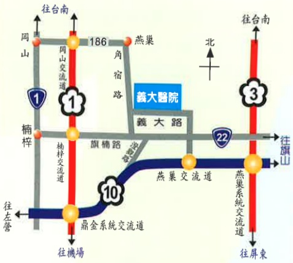

Address: No. 1, Yida Road, Jiaosu Village, Yanchao District, Kaohsiung City  
Phone: 07-6150011  
Website: edah@edah.org.tw  

This copyright shall not be reproduced, duplicated, or resold without the consent of the copyright holder.  
Copyright Holder: Edah Medical Foundation  
Form Number: HA-1-0105 (1)  
Edah Medical Foundation, 20x20 cm, printed in 2016.01, revised in 2011.05  

## Post-Hospital Care Instructions for Patients with Head Injuries  

## Head injury patients: Post-discharge precautions

## I. Introduction:

Any head injury (even if no obvious or severe symptoms are present) may lead to brain injury or intracranial bleeding hours, days, or even one to two months after the incident. The first 72 hours following injury are the most critical period for observation and require special attention.

## II. Causes:

Motorcycle accidents are the leading cause of head injuries. Other causes include assaults, falls, slips, and unexpected incidents.

## III. Precautions:

If the patient develops any of the following symptoms, please seek immediate medical attention at a hospital for further examination:

1. Severe headache, blurred vision, or double vision.

2. Nausea or excessive vomiting.

3. Difficulty breathing or increased breathing rate.

4. Redness or swelling of the eyes, or a sensation of noise in the ears.

5. Neck stiffness, or body temperature exceeding 38.5°C.

6. One side of the hands or feet feeling weak or uncoordinated, leading to frequent falls.

7. Muscle twitching or seizures (epileptic episodes) in the hands, feet, or mouth.

8. Bleeding from the nose or ears, or an unknown fluid leakage.

9. Changes in consciousness, restlessness, slurred speech, drowsiness, or coma.

10. After returning home, please return to the neurosurgery outpatient clinic every two weeks for follow-up treatment for three months.

