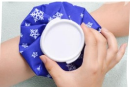

## Understanding Fracture Treatment and Care

## 1. What is a Fracture?

A fracture refers to the breaking or deformation of a bone due to direct or indirect external force, resulting in damage to bone tissue. It may also involve injury to surrounding muscles, soft tissues, and nerves.

## 2. Classification of Fractures

1. Simple fracture / Closed fracture: The fracture site shows only a crack, with no skin damage.

2. Comminuted fracture / Complete fracture: The bone breaks completely into two ends or shatters into multiple fragments.

3. Complex fracture / Open fracture: The skin or mucous membranes near the fracture site are damaged, and the broken bone comes into contact with the skin or the external environment.

## 3. Symptoms of a Fracture:

Pain, severe cases may also involve internal bleeding, swelling, and compression or damage to surrounding major nerves, arteries, and veins.

## 4. Treatment Methods:

1. For simple fractures where displacement is minimal or the fracture is located in a less vulnerable area, conservative treatment may be considered, using splints or casts for immobilization.

2. For complex, complete, or open fractures, surgical realignment and fixation are required. Surgical methods include:

(1) Internal fixation: Using surgical procedures such as bone pins or plates to stabilize the fracture site.

(2) External fixation: Fixing the fracture site from outside the body.

**V. Pre- and Post-Operative Care for Fracture Patients:**

### 1. Pre-Operative Preparation:

(1) Complete chest X-ray, X-ray of the injured limb, ECG, and blood tests.

(2) After the doctor explains the condition, complete the surgical consent form, anesthesia consent form, and any necessary self-paid medical device consent forms as required.

(3) Begin fasting and fluid restriction 8 hours before surgery (from midnight).

(4) If taking anticoagulant medications (such as anticoagulants or antiplatelet agents) or glucose-lowering drugs (such as SGLT2 inhibitors), follow the doctor's instructions to take or discontinue medication, and proactively inform medical staff.

(5) For lower limb fractures, the affected limb is typically not allowed to bear full weight after surgery. Prepare a walker or crutches accordingly.

2. Post-Operative Care Guidelines:

(1) If there is a drainage tube at the wound site, it must be placed on the same side as the surgical site and should be avoided from pulling or tugging to maintain patency and prevent dislodgement.

(2) Post-surgical pain at the wound site: The doctor will prescribe oral pain medication to be taken regularly. If pain persists more than one hour after taking the pain medication, inform the nursing staff for assessment. Additional pain medication may be administered as prescribed.

(3) Use a blanket, pillow, or elevated pillow to raise the surgical limb above heart level to reduce swelling and discomfort.

(4) Begin turning every 2 hours after surgery. On the first day, raise the head of the bed at least three times daily, and perform deep breathing exercises regularly to maintain airway patency.

(5) To reduce pain at the wound site and minimize limb swelling and discomfort, local cold compresses may be applied as prescribed. Each session should last 15–20 minutes, with a total of four applications per day.

(6) After upper limb fracture surgery, a triangular bandage can be used to immobilize the affected limb, increasing comfort.

(7) In principle, the surgical wound should be changed once daily. Please keep the wound dressing clean and dry. If the dressing gets wet by accident or if there is excessive oozing, please inform the nursing staff and notify the doctor for a dressing change.

(8) Cleaning of the external fixation pins: keep the area around the pins clean and dry. Disinfect once in the morning and once in the evening daily. If there is oozing or redness, increase the frequency of disinfection accordingly.

(9) Consume sufficient calories daily. In terms of diet, increase intake of protein such as fish, meat, eggs, and dairy products. Supplement calcium (e.g., small fish dried, raisins, sesame seeds, nori) and vitamin D (through sun exposure) to replenish lost nutrients and promote bone and wound healing.

(10) It is recommended to reduce the use of stimulants such as coffee, strong tea, smoking, and alcohol, as these substances may prolong the healing time of fractures.

(11) The degree of weight-bearing on the injured limb should follow the instructions given by the physician after assessment.

(12) Passive muscle contraction exercises can be performed on the affected limb to promote blood circulation. (Finger clenched and relaxed exercise) as shown in Figure 1, (dorsiflexion and flexion of the foot) as shown in Figure 2. Perform approximately ten repetitions per hour according to physical capacity, but avoid vigorous movements.

Figure 1: Finger clenched and relaxed exercise  
Figure 2: Dorsiflexion and flexion of the foot

## Five. References:

Yuan Sujuan (2020). Nursing Care of Musculoskeletal Disorders. Edited by Liu Xue'e. Adult Internal and External Medicine Nursing, Volume 8, pp. 589–590. Hua Xing.

Deng Chongli, Li Suqin, Yuan Guangxia, Wu Yiping (2021). Nursing Care of Patients with Musculoskeletal Disorders. Edited by Lin Guimian et al. Internal and External Medicine Nursing Techniques, Volume 9, pp. 465–467. Hua Xing.

Yi Da Hospital  
Address: No. 1, Yida Road, Jiaosu Village, Yancheng District, Kaohsiung City  
Phone: 07-6150011  

Yi Da Cancer Treatment Hospital  
Address: No. 21, Yida Road, Jiaosu Village, Yancheng District, Kaohsiung City  
Phone: 07-6150022  

Yi Da Dachang Hospital  
Address: No. 305, Dachang Road, Sancheng District, Kaohsiung City  
Phone: 07-5599123  

## Understanding Fracture Treatment and Care

