Hand-held teaching video

Total knee arthroplasty

## Care Instructions

Total knee arthroplasty## Table of Contents

I. Understanding Total Knee Arthroplasty …… 1  
1. Introduction …… 1  
2. Should I undergo total knee arthroplasty? …… 1  
3. What is total knee arthroplasty? …… 2  
4. Indications …… 2  
II. Hospitalization Process Introduction …… 3  
III. Preoperative Preparation …… 4  
1. Preparation of Equipment …… 4  
2. Should I stop anticoagulant medication before surgery? …… 5  
3. Preoperative Instructions …… 6  
4. Preoperative Rehabilitation Exercise Preparation …… 7  
IV. Postoperative Care Guidelines …… 10  
1. Postoperative Limb Positioning and Care Precautions …… 10  
2. Catheter Placement Precautions …… 11  
3. Dietary Guidance …… 13  
4. Postoperative Medications …… 17  
V. Pain Management …… 19一、The Impact of Pain........19  
  
二、Common Pain Relief Methods After Surgery........20  
  
三、Methods to Alleviate Pain Without Medication........21  
  
四、Frequently Asked Questions About Pain........21  
  
L、Post-Surgical Rehabilitation and Exercise Training........23  
  
一、On the Day of Surgery........23  
  
二、Day 1 After Surgery........24  
  
三、Day 2 After Surgery........25  
  
四、Day 3 After Surgery........26  
  
五、Day 4 After Surgery........27  
  
六、Day 5 After Surgery........28  
  
七、Day 6 After Surgery and Beyond........29  
  
八、How to Use Walking Aids........30  
  
九、Walking Activities........31  
  
十、Wheelchair Position Changes........31  
  
Q、Preventing Falls........32  
  
S、Post-Surgical Care and Precautions........33  
  
一、How to Prevent Deep Vein Thrombosis........33Two. Wound Care After Returning Home......34  
Three. Home Care Precautions......36  
Nine. At-Home Rehabilitation Plan......38  
One. Stretching Exercises Section......38  
Two. Strength Training Section......39  
Ten. References......40## I. Understanding Total Knee Arthroplasty

## 1. Introduction

When the knee joint degenerates, patients may experience pain, swelling, deformity, and weakness in the affected limb. In severe cases, this can lead to difficulty walking. Initial outpatient management typically involves medication and physical therapy. If pain or deformity persists despite medication and rehabilitation, and if walking becomes difficult, total knee arthroplasty may be required.

## Normal Knee Joint

Degenerated Knee Joint

## 2. Should I undergo total knee replacement surgery?

✓ Moderate exercise  
✓ Physical therapy  
✓ Oral pain relievers  

✓ Maintaining a healthy weight  
✓ Use of assistive devices  

✓ Tibial osteotomy correction  
✓ Total joint replacement  

Treatment of degenerative joint disease – shared decision-making between patient and physician  
Shared decision-making video  

✓ Hyaluronic acid injection  
✓ PRP (high-concentration platelet-rich plasma) injection  

## Three. What is Total Knee Arthroplasty?

A surgical procedure involving the implantation of artificial joints into the tibia and femur due to damage or pathology of the knee joint. The artificial knee joint is made from metal and high-density plastic materials, designed according to the anatomical structure, shape, and function of the human knee joint. The surgeon removes the worn-out cartilage and implants artificial joints into the tibia and femur to replace them.

## Four. Indications

1. Degenerative arthritis

2. Rheumatoid disease

3. Traumatic arthritis

4. Gouty arthritis

5. Osteonecrosis

6. Infectious arthritis

## Two: Introduction to Hospitalization Process

## 3. Preoperative Preparation

## 1. Preparation of Equipment

## (1) Walker

Starting from day 1-2 post-surgery, medical and nursing staff will instruct the patient on how to use assistive devices to get out of bed and move around.

## (2) Ice Pack

Used for icing the surgical wound post-operation to prevent swelling of the affected limb and alleviate pain.

## (3) Personal Medications

Please bring your regularly taken medications, along with the medication bottles and packaging, to the hospital on the day of admission and hand them over to the nursing staff so that medical and nursing personnel can understand your medication regimen. (If you are taking anticoagulants, antiplatelet agents, or vasodilators, please continue taking them as prescribed by your doctor and inform the medical and nursing staff.)

## (4) Medical Grade Compression Socks for Feet and Lower Legs

Worn after surgery to prevent deep vein thrombosis in the lower limbs.

## (5) Signing of Relevant Consent Forms

✓ Surgical Consent Form  
✓ Anesthesia Consent Form  
✓ Pre-anesthesia Assessment Form  
✓ Self-paid Service Consent Form

## II. Should anticoagulant medications be stopped before surgery?

Which anticoagulant medications should be temporarily discontinued before joint replacement surgery? For how long should they be stopped?

Many elderly patients with joint degeneration also have cardiovascular diseases and are currently taking antithrombotic medications. These drugs provide cardiovascular protection and help prevent tragic events such as heart attacks and strokes. The decision to stop or continue these medications hinges on balancing the benefits against the risks.

"Before undergoing any surgery, please inform your doctor about the medications you are currently taking."

Please proactively discuss this with your doctor and do not make decisions about medication use on your own.

## Antithrombotic Medications

## Antiplatelet Agents

• Aspirin  
· Aspirin (Lixi)  
• Baotu Tong / Jianke Tan  
· Puda / Jianlidai  
· Nankangping

## Anticoagulants

• Kemaiting / Oufuning  
- Novel anticoagulants (Puxuanda, Bairui, Aibikening, Lixinan)## Three. Preoperative Instructions

1. Blood tests, chest X-ray, electrocardiogram, and pre-anesthesia evaluation will be completed on the day of admission.

2. To prevent aspiration pneumonia during surgery due to vomiting, patients must fast for 8 hours before surgery. Medical staff will inform patients of the fasting time after 9 p.m. Fasting items include: food, water, and any chewable items such as chewing gum or betel nut.

3. On the day before or on the day of surgery, patients are advised to bathe their affected limb and body.

4. Before surgery, the surgeon will mark the surgical site. Before entering the operating room, medical staff will perform local cleaning of the surgical site and cover it with a dressing.

5. The surgery duration is approximately 4 to 6 hours, depending on individual anesthesia methods and anesthesia recovery time. For patients undergoing general anesthesia, a breathing tube will be placed in the throat during anesthesia to assist with breathing, which may cause throat discomfort or minor blood-tinged sputum. Drinking small amounts of warm water frequently can help alleviate these symptoms. However, if fresh blood is continuously coughed up, patients should immediately inform medical staff for assistance.

6. A family member must accompany the patient throughout the entire surgical procedure and during the return to the ward post-surgery.## IV. Preoperative Rehabilitation Exercise Preparation

Exercise timing: Before surgery

Exercise objectives: Maintain joint flexion angle/increase muscle strength, to facilitate smooth postoperative recovery

Exercise frequency: Hold each movement for 5 seconds, repeat 15 times per set, perform 4 sets per day.

Quadriceps muscle strength training

Training purpose: Enhance muscle strength on the affected side; it is recommended to perform bilateral exercises, with the image showing band wrapping indicating the surgical affected limb

Lying position: Lift the foot upward

Sitting position: Extend the calf upward

Standing position: Lift the foot upward| colspan="3" | 關節彎曲活動角度訓練目的:增加患側關節循環及維持關節角度圖片繃帶纏綁肢體為手術患肢示意圖 |
| --- | --- | --- |
| colspan="3" | 平躺姿勢:盡可能將大腿/膝蓋彎曲,再慢慢伸直 |
|  |  |  |
| center |  |  |  |
| colspan="3" | 平躺姿勢使用毛巾協助:盡可能將大腿/膝蓋彎曲,再慢慢伸直 |
|  |  |  |
| center |  | 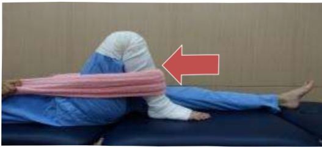 |  |
| colspan="3" | 坐姿:盡可能將大腿/膝蓋彎曲,再慢慢將腳放回地面 |
|  |  |  |
| center |  | 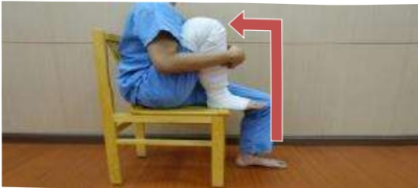 |  |
| colspan="3" | 強化上臂肌力訓練目的:增加雙側上肢肌力,幫助手術後轉位及使用助行器能力使用有扶手的固定式椅子,盡可能伸直手肘並抬起身體,再慢慢將身體降下至椅面 |
|  |  |  |
| center |  |  |  |

 (width="27%")

Enhance cardiorespiratory endurance

Training objective: Improve cardiorespiratory endurance prior to surgery

Diagram illustrating the application of bandages to limbs for surgical affected limbs

## ★ Stationary bicycle for 10 minutes

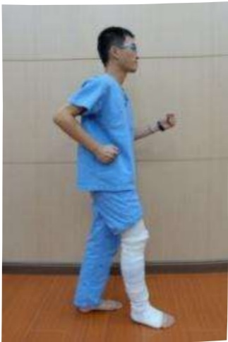

Physical therapist's warm reminder: Be cautious for safety and prevent falls

Produced by the Rehabilitation Department, Physical Therapy Team, Tainan Medical Foundation## IV. Postoperative Care Guidelines

## I. Postoperative Limb Positioning and Care Instructions

1. After surgery, to prevent swelling of the affected limb, pain, and peripheral circulation disorders, nursing staff will assist the patient in elevating the affected limb using a pillow or cotton blanket and applying ice packs.

2. Do not use supports or pillows under the knee of the affected limb, as this may cause knee contracture and prevent the leg from being fully straightened.

3. Frequently change the position of ice application on the affected knee to avoid icing the knee joint or icing both knees simultaneously, which could impair blood circulation. Ice application should be stopped after the patient goes to sleep at night.

4. To prevent fever and inadequate lung expansion, patients should perform deep breathing and coughing exercises regularly. Nursing staff will assist in teaching the patient to turn and pat the back every two hours (avoiding the waist and spine). Patients are encouraged to increase fluid intake to 2000–3000 ml per day (except for patients with fluid restrictions).

5. Raise the head of the bed by approximately 30 to 45 degrees to facilitate eating and prevent vomiting-induced aspiration.

Deep breathing and coughing techniques, as well as turning and back patting methods## II. Notes on Pipeline Placement

## (1) Indwelling Catheter

1. Due to postoperative activity safety, an indwelling catheter will be placed after surgery.

2. Medical staff will assess the appropriate time for removing the indwelling catheter.

3. The indwelling catheter will be secured on the inner thigh (for females) or lower abdomen (for males).

4. The urine collection bag should be placed below the bladder level; if placed above the bladder, urine backflow may occur, leading to infection. The bottom of the urine bag should be at least 3 cm above the ground to avoid contact with the floor.

## At least 3 cm above the ground

5. If there is a persistent decrease in urine output or bladder discomfort, please check whether the catheter has kinked, and seek assistance from medical staff.## (二) Drainage Tube

1. After surgery, a drainage tube will be placed at the surgical site of the affected limb to drain blood and prevent hematoma.

2. During the placement of the drainage tube, in addition to preventing dislodgement of the tube, the Y-shaped connector should be frequently squeezed. Ice packs should not be applied directly to the drainage tube to avoid clot formation and blockage.

3. You should turn frequently or get out of bed to promote drainage of blood. If the drainage tube rapidly swells, it may indicate excessive blood volume or air leakage in the tube; please inform the medical or nursing staff immediately for evaluation.

4. Since the drainage tube operates under negative pressure, it can be placed directly on the bed without needing to be hung at the bedside. However, it should be avoided from being folded. When getting out of bed, it can be secured to clothing to prevent pulling on the tube and dislodgement.

5. The time for removal of the drainage tube varies depending on individual drainage volume. If removal is required, a physician will work with a specialist nurse to assist in the procedure.## Three. Dietary Guidance

1. After returning to the ward post-surgery, if there are no symptoms of dizziness or vomiting, adopt a progressive dietary approach: first try drinking a small amount of plain water. If no vomiting occurs, after one hour, you may consume liquid foods (such as fruit juice), then gradually transition to soft and easily digestible foods (such as porridge), and by the next day, you can return to normal eating. This progressive diet helps prevent digestive discomfort caused by slowed intestinal peristalsis due to anesthesia.

2. Eat more vitamin C-rich fruits such as kiwi, cherries, and grapes, as well as high-protein foods such as chicken, duck, fish, and beef, to promote wound healing. Also, consume high-fiber foods such as green vegetables to prevent constipation.

3. Remember to eat in a semi-reclining or sitting position, as eating while lying down increases the risk of aspiration and subsequent aspiration pneumonia.

Post-surgical dietary guidance

Nutritional Therapy Department provides post-surgical dietary reference meal plans## Postoperative Dietary Reference Meal Plan

Calories: 350 kcal  
Protein: 15 g  

## 1500 kcal

| Type       | Meal Option                          |
|------------|--------------------------------------|
| Convenience Store | Salted and Scallion Braised Pork Rice Ball + Yemi Soy Milk |
| Salted and Scallion Braised Pork Rice Ball | Rice 37g (about 1/4 bowl), Braised Pork 10g |
| Yemi Soy Milk | 260ml (about 7/8 full), containing 15g sugar |

| Self-serve Meal | Meal Option                        |
|----------------|------------------------------------|
| Buffet Meal     | Spicy Braised and Preserved Pork Rice Box |
| White Rice      | 150g (3/4 bowl)                   |
| Braised Pork    | 65g (2/3 palm)                   |
| Red Sauce Fried Egg | 60g (half egg / about 1/4 bowl of red sauce) |
| Stir-fried Big Yellow Gourd | 58g (about 1/4 bowl of big yellow gourd) |
| Garlic Stir-fried Small Yellow Gourd | 55g (about 1/4 bowl of small yellow gourd) |
|                | Papaya 160g (1/3 of a fruit)     |

| Meal Package | Meal Option                     |
|-------------|---------------------------------|
| Package      | Dumpling Package               |
| Dumpling Skin, Pickled Cucumber, Cold-Pressed Water Spinach, Dry Thread with Seaweed, Nori Soup, Dumpling Filling, One Apple | 60g (3/4 bowl), Vegetables 105g (one bowl), Pork Filling 70g (one palm), 3/4 bowl (8/10 full quantity) |

Nutrition Therapy Department, Yida Medical Foundation## Postoperative Dietary Reference Meal Plan

Calories: 530 kcal  
Protein: 24 g  

## 1600 kcal

| Breakfast Shop | Traditional Omelet Pancake + Fresh Milk |
|----------------|----------------------------------------|
| Omelet Pancake | Pancake skin 150g (3/4 bowl)          |
| Low-fat Fresh Milk | 1 egg                               |
|                | Fresh milk 280ml                     |

| Meal Set |  |
|---------|---|
| White Rice |  |
| Pickled Yellow Cucumber |  |
| Cold Cucumber Ribbons |  |
| Dried Tofu with Seaweed Salad |  |
| Nori Soup |  |
| Roast Meat |  |
| Egg |  |
| Apple (1 serving) |  |

| Taiwanese Roast Pork Rice Meal Set |  |
|------------------------------------|---|
| 150g (3/4 bowl)                   |  |
| 105g of Aromatic Vegetables (1 bowl) |  |
| 45g (1/3 to 2/3 palm)            |  |
| 1 oil egg                        |  |
| 120g (3/4 bowl or 8/10 full)     |  |

Calories: 540 kcal  
Protein: 23.5 g  

| Meal Set | Half Lean, Half Meat Beef Noodle + Tofu |
|---------|----------------------------------------|
| Noodles | 340g (after water absorption), 3 servings (3/4 bowl) |
| Beef | 60g (2/3 palm) |
| Chinese Bok Choy | 24g (1/4 bowl) |
| Cold Tofu Salad | 90g (about 1/3 of a soft tofu box) |
| | Kiwi 120g (1.5 fruits) |

Gan Da Hospital, Department of Yellow Treatment, Section of Fu  
Yi Da Medical Foundation, Nutrition Therapy Team, Prepared# Postoperative Dietary Reference Meal Plan

1800 kcal

| Breakfast Shop | Content |
|---------------|---------|
| Soy milk | 260ml, about 7/8 full (sugar content: 15g) |
| Two slices of bread | 100g (one bowl of rice) |
| Lettuce | 10g |
| Cheese | One slice of full-fat cheese |
| Fried egg | One egg |

| Lunch Shop | Content |
|-----------|---------|
| White rice | 200g (one bowl) |
| Pork slices | 50g (about 1/3 to 2/3 of a palm) |
| Five-spice bean curd | 42g (about 1/3 of a palm) |
| Preserved egg | 60g (one egg) |
| Stir-fried bok choy | 80g (about 3/4 of a bowl) |
| Garlic stir-fried Chinese cabbage | 75g (about 3/4 of a bowl) |
| Orange | 150g (one orange) |

Compiled by the Nutrition Therapy Department, Tainan Medical Foundation## IV. Postoperative Medications

## (I) Prophylactic Antibiotics

1. Surgical prophylactic antibiotics refer to the administration of antibiotics to patients before surgery, prior to wound contamination or infection, in order to prevent postoperative infections.

2. Possible side effects such as allergies or gastrointestinal discomfort—such as skin rash, itching, or diarrhea—should be reported immediately to the medical team if they occur.

## (II) Antithrombotic Medications

1. To prevent the occurrence of deep vein thrombosis, physicians will assess the patient's condition after surgery and decide whether to prescribe antithrombotic medications (such as antiplatelet agents or anticoagulants).

2. If you have a history of gastrointestinal bleeding or peptic ulcers, please inform the medical team in advance.

3. During medication use, if you are scheduled to undergo any surgical procedures, tooth extraction, endoscopy, or other procedures or examinations that may cause bleeding, please inform your doctor in advance about your current use of these medications.

4. While taking antithrombotic medications, be cautious during daily activities to avoid injury. Use a soft-bristled toothbrush or an electric razor when brushing teeth or shaving.5. Possible side effects such as gastrointestinal discomfort or bleeding reactions (e.g., hematoma at the surgical site, gingival bleeding, bruising, hematuria, or black stools). If you experience any bleeding, please return to your medical team immediately.

6. If you are receiving antithrombotic medication prior to knee replacement surgery, you should discuss this with your original prescribing physician and discontinue the medication before surgery. After surgery, please discuss with your surgical physician when it is appropriate to resume antithrombotic medication.## V. Pain Care

## I. The Impact of Pain

Pain is a subjective sensation of suffering, which may be continuous or intermittent, and may manifest as dull, sharp, or stabbing pain. Physiologically, patients may experience anxiety, insomnia, reduced appetite, tachycardia, elevated blood pressure, and endocrine dysfunction. Pain may also slow down breathing (pain from upper abdominal or thoracic surgery worsens with respiration), lead to unwillingness to get out of bed and move, resulting in inadequate lung expansion, venous thrombosis, and other complications, thereby delaying discharge.

Only you can describe your pain. Be brave and tell your doctor or nurse about your pain concerns. With correct expression and assessment methods, 90% of pain can be effectively relieved.

You can do the following:

1. You can state where the pain is located, or point to the area with your hand.

2. Inform the medical or nursing staff when the pain first started, how often it occurs, and how long each episode lasts.

3. Clearly describe the sensation of the pain—for example, dull, sharp, or stabbing pain?

4. Inform the medical or nursing staff whether the pain has affected your daily routine—for example, inability to sleep.

5. Accurately express your pain score.  
We recommend using the "Pain Assessment Scale"

To express pain levels: 0 points means no pain, 10 points means unbearable pain.

## Two: Common postoperative pain relief methods

## Refuse postoperative pain—be brave and say when you're in pain

## Common postoperative pain relief methods include the following:

Oral medication: For mild pain, take medication as instructed by the doctor. Even if there is no current pain sensation, medication should still be taken to achieve better pain control.

## Intramuscular or intravenous injection (non-steroidal or morphine-based analgesics):

Each person has different pain tolerance and absorption efficiency, with time limitations. These methods require fixed-time administration as instructed by the doctor, or are used for sudden, acute pain episodes.

Multimodal analgesia: Evaluated and prescribed by an anesthesiologist, this method selects the appropriate drug administration route and method. It uses machines or intravenous/local administration, sets safe dosages and lock-in times, and allows patients to choose their preferred treatment.## Three. Methods to Alleviate Pain Other Than Medication Treatment

1. Distract yourself from pain through activities such as listening to music, playing cards, playing mahjong, or walking.

2. Relax your mind and maintain a positive mood, for example, by receiving psychological support from family or friends, which can help reduce your perception of pain.

3. Position your body in the posture that feels most comfortable to you during daily life.

4. Use religious beliefs, such as chanting or praying, to divert attention from pain.

5. Ask your treating physician whether cold or hot compresses can help alleviate your pain.

6. When pain becomes unbearable, you can still inform medical staff and request adjustments to your pain medication.

## Four. Common Questions About Pain:

1. Using pain medication does not affect wound healing; rather, it helps by relieving pain, enabling you to get out of bed earlier and thus promoting wound healing.

2. Side effects of pain medication: skin itching, dizziness, nausea, and vomiting, etc.Can be improved by adjusting the dosage.

3. Use patient-controlled analgesia (PCA): The goal of treatment is to use the minimum amount of medication so that the patient does not feel pain while lying in bed, although mild pain may still be felt during severe coughing or movement, with the pain being significantly reduced.

4. Duration of PCA use: Pain gradually decreases over time, typically starting 2–3 days after surgery. Oral analgesics can then be switched to, and PCA can be discontinued.

5. Differences between PCA and traditional analgesia:

(1) PCA delivers medication continuously through a machine; patients can press a button themselves when they feel particularly painful to receive additional pain relief.

(2) Traditional analgesia is administered only when pain becomes intolerable; the medication starts working after about 30 minutes and lasts for 4–6 hours.

6. The anesthesiologist will set the dosage and timing of PCA based on the patient's individual conditions, and will continuously monitor the patient's condition during use to adjust the dosage accordingly. Therefore, addiction or overdose is avoided.

7. The anesthesiologist will assess the patient's condition. PCA is contraindicated if the patient shows signs of altered consciousness, low blood pressure, hypovolemia, or septic shock.

8. Traditional analgesia is covered by the national health insurance; PCA is not covered and must be paid for out-of-pocket.## VI. Postoperative Rehabilitation Exercises

## Please follow the rehabilitation exercises provided by the physical therapist

## 1. On the Day of Surgery

1. Ice敷: 4 times per day, each session for 15 minutes.

2. Dorsiflexion exercises: 4 times per day, 15 repetitions each. Lie flat, extend both legs straight and place the soles of your feet upward, hold for 5 seconds, then press down for 5 seconds. The goal is to improve distal circulation and reduce swelling in the affected knee.

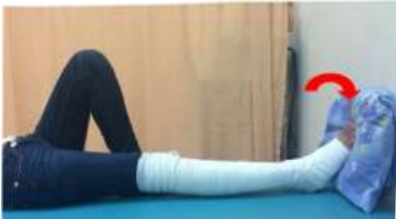

Diagram showing the application of bandage on the surgical limb

3. Gluteal muscle exercises: 4 times per day, 15 repetitions each. Perform in supine position to maintain muscle strength on the affected side and prepare for sitting up.

4. Breathing exercises: 4 times per day, 15 repetitions each. The goal is to assist in eliminating anesthetic drugs and to strengthen respiratory function.

5. As needed, provide assistance or wheelchair repositioning as described on page 34

## Two. Day One After Surgery

1. Passive knee joint angle movement: 2 times per day, each session for 30 minutes. Perform at 50 degrees.

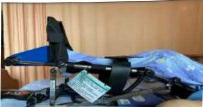

2. Ice application: 4 times per day, each session for 15 minutes.

3. Sitting at the edge of the bed: 4 times per day, each session for 5 minutes.

4. Dorsiflexion of the foot: 4 times per day, 15 repetitions each time.

Diagram showing the application of bandage to the surgical limb

5. Quadriceps and hamstring muscle exercises: 4 times per day, 15 repetitions each time. The affected limb should be placed flat and straight. Place a roll of towel at the knee area to elevate the knee and foot. Perform a downward pressing motion, hold for 5 seconds, then relax. The goal is muscle strength training.

Quadriceps exercise

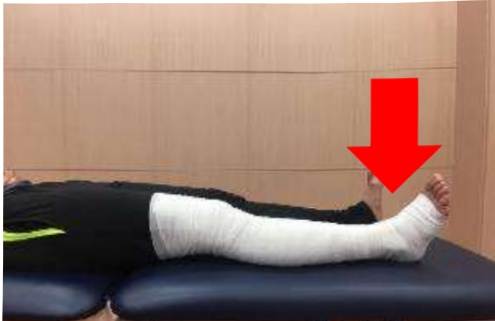

Diagram showing the application of bandage to the surgical limb

Hamstring exercise

6. Wheelchair transfer assistance may be provided as needed, as described on page 33.## Three. Day Two After Surgery

1. Passive knee joint range-of-motion exercises: 2 times daily, 30 minutes each session. Perform at 60 degrees.

2. Ice application: 4 times daily, 15 minutes each time.

3. Dorsiflexion exercises of the foot: 4 times daily, 15 repetitions each time.

4. Quadriceps and hamstring exercises: 4 times daily, 15 repetitions each time.

5. Getting out of bed

(1) Standing: 4 times daily, 5 minutes each time.

(2) Walking with assistive devices: 4 times daily, 5 minutes each time. Use of walker as described on page 32.

Illustration of bandaging the limb for the surgical affected limb

6. Wheelchair transfer assistance may be provided as described on page 33, depending on the situation.

## Day 3 Post-Operatively

1. Passive knee joint range-of-motion exercises: 2 times daily, 30 minutes each session. Target angle: 70 degrees.

2. Ice therapy: 4 times daily, 15 minutes each session.

3. Quadriceps and hamstring exercises: 4 times daily, 15 repetitions each.

Illustration of bandaging the limb for the surgical affected limb

4. Sitting on the bed, extend the affected knee to the mid-angle and hold for 5 seconds; when bending the knee, slowly return to the original position. Objective: to enhance the strength of the affected limb muscles.

Illustration of bandaging the limb for the surgical affected limb

5. Straight leg raise exercise: 4 times daily, 15 repetitions each. Lie flat, extend the affected limb, raise it to 30 degrees and hold for 5 seconds, then slowly lower it. Objective: to strengthen the muscles of the affected limb.

6. Ambulation with assistive devices: 4 times daily, 5 minutes each session. Use of walker as described on page 32.

Illustration of bandaging the limb for the surgical affected limb## Five. Day 4 after surgery

1. Passive knee joint range-of-motion exercise: 2 times daily, 30 minutes each session. Perform to an angle of 80 degrees.

2. Ice application: 4 times daily, 15 minutes each time.

3. Dorsiflexion exercise of the foot: 4 times daily, 15 repetitions each time.

4. Quadriceps and hamstring exercises: 4 times daily, 15 repetitions each time.

5. Straight leg raise exercise: 4 times daily, 15 repetitions each time.

6. Knee flexion and extension stretching exercise: 4 times daily, 15 repetitions each time. Perform within the tolerable pain range, holding for 5 seconds at the end ranges of flexion and extension. The goal is to increase the range of motion of the affected knee joint in both flexion and extension.

Illustration of bandaging the limb for the surgical affected limb

7. Bed exit activity: Assisted walking with assistive devices: 4 times daily, 5 minutes each time. Use of walker as described on page 32.## Six. Day 5 after surgery

1. Passive knee joint range-of-motion exercise: 2 times daily, 30 minutes each session. Perform at 90 degrees.

2. Ice application: 4 times daily, 15 minutes each time.

3. Dorsiflexion exercise of the foot: 4 times daily, 15 repetitions each time.

4. Quadriceps and hamstring exercises: 4 times daily, 15 repetitions each time.

5. Straight leg raise exercise: 4 times daily, 15 repetitions each time.

6. Knee flexion and extension stretching exercise: 4 times daily, 15 repetitions each time. Perform within the tolerable pain range, hold for 5 seconds at the end ranges of flexion and extension. Aim to improve the range of motion of the affected knee joint in both flexion and extension.

Illustration of bandaging the limb for the surgical affected limb

7. Bed exit activity: Assisted walking with assistive devices: 4 times daily, 5 minutes each time. Use of walker as described on page 32.## Seven. Postoperative Day 6 and Beyond (Including Day 6)

1. Passive knee joint angle movement: 2 times per day, each session for 30 minutes. Execute at 100 degrees.

2. Ice application: 4 times per day, each session for 15 minutes.

3. Dorsiflexion of the foot: 4 times per day, each session for 15 repetitions.

4. Quadriceps and gluteal muscle exercises: 4 times per day, each session for 15 repetitions.

5. Straight leg raise exercise: 4 times per day, each session for 15 repetitions.

6. Knee flexion and extension stretching exercises: 4 times per day, each session for 15 repetitions.

7. Bed exit and assisted walking: 4 times per day, each session for 5 minutes.

Postoperative rehabilitation exercises

After completing rehabilitation exercises, remember to

your knee joint

Oh!

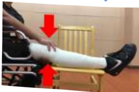
## VIII. How to Use a Walker

1. Adjust the walker height so that your elbows are slightly bent at 20 degrees.

2. Move the walker forward first, then step out with the affected limb.

3. Shift your body weight onto the foot that hasn't undergone surgery (please note that both feet should be aligned with the shoulders and at the same width).

4. Move both hands to advance the walker by one step, ensuring the distance is not too large to prevent instability and falls.

5. Hold the walker to support your body, stepping forward with the affected limb into the red zone to achieve the most stable walking posture.

6. Then, take one step forward with the non-surgical foot, without stepping beyond the affected limb—this is the safest walking method.

Reminder! Taking large steps increases the risk of falling.

Good  
foot  
then  
follow  
up  

Bandage wrapping of the limb indicates the surgical affected limb diagram## IX. Walking Activities

1. On the first day after surgery: Encourage the patient to remain in a semi-sitting position (approximately 70°–90°) as much as possible to prevent orthostatic hypotension when getting up from bed. A gradual transition from bed to standing should be adopted: first raise the head of the bed, wait for 10 minutes without any discomfort, then sit at the edge of the bed for 5–10 minutes. If no dizziness or discomfort occurs, with assistance from others, stand using a walker. Only after confirming no dizziness during standing should the patient use the walker to walk within the ward.

2. From the second day after surgery onwards: The patient can walk using a walker along the hospital corridor, four times per day, each session lasting 5 minutes. After activity, the patient should rest in bed and elevate the affected limb while applying ice to reduce swelling.

3. The use of a walker should be maintained for at least 6–8 weeks to prevent excessive weight-bearing on the bone before it has fully healed.

## X. Wheelchair Transfer

Illustration of bandaging the limb for the surgical affected side

## VII. Preventing Falls

Falls can be prevented. With just a few simple changes, you can avoid falling into a fall-related crisis. Please note: NEVER get out of bed alone!!!

Regularly practice strength, flexibility, and body balance

Essential limb movements are indispensable

Bedside rehabilitation exercises

Five-point grounding bed rehabilitation exercises

Always pay attention to environmental safety

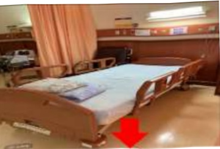

Lower the electric bed to its lowest position when in bed

Pull up both bed rails when leaving the bed

Ensure indoor lighting is bright

Choose appropriate footwear and assistive devices

Be mindful of the effects and side effects of medications you are currently taking

Know the six-word mantra

Methods of using assistive devices

Identify whether the factors cause falls

## VIII. Postoperative Care and Precautions

## 1. How to Prevent Deep Vein Thrombosis

Avoid prolonged sitting or standing, and when lying in bed, avoid long-term compression of the lower limbs. Do not maintain any posture for too long, such as crossing legs while standing, wearing tight clothing. Maintain a healthy body weight, consume adequate fluids and a low-fat diet, engage in appropriate physical activity, and refrain from smoking.

## Wearing Medical Compression Socks After Surgery

Principles for wearing compression socks:

1. Wear for at least 3 days after surgery

2. Put them on before getting out of bed in the morning, and remove them when bathing at night (recommended: wear for 8 hours per day, for one month)

3. Hand wash and lay flat to dry

(Do not use a dryer, do not hang to dry or expose to direct sunlight)

## II. Wound Care After Returning Home

1. Wash hands before and after touching the wound.

2. Wound disinfection or cleaning should be performed from inside out, without back-and-forth rubbing. The disinfection area should extend approximately 5 cm beyond the wound boundary. When changing the dressing, try to minimize the exposure of the wound to air.

3. Change the dressing daily (it can be done after bathing). However, if there is blood soaking through the gauze, the gauze gets wet by accident, or the gauze falls off, the dressing must be changed immediately.

4. Keep the wound and gauze clean and dry. Avoid bathing or getting the wound wet. Try to use wiping instead of soaking.

5. Items needed for dressing change:

(1) 20 ml normal saline solution: use once and discard immediately after use.

(2) 4×4 gauze

(3) Sterile cotton swabs

(4) Water-soluble povidone-iodine: keep for one week after opening.

(5) 3M paper tape: if allergic to paper tape, choose an anti-allergy tape instead.

(6) 6-inch elastic bandage (can be washed and reused).### 6. Wound Care Steps:

1. Wash hands with hand soap or soap.

3. Use a normal saline cotton swab to clean the wound, wiping in a circular motion from the center of the wound outward, gradually expanding to a diameter greater than 5 cm beyond the surrounding area of the wound, avoiding back-and-forth wiping.

Place the gauze, grasp one corner, and pull it out. Position it so that it aligns with the center of the wound, cover the wound, and do not move it again. Secure it with adhesive tape.

2. Remove the gauze and examine the wound.

4. Use a water-soluble povidone-iodine cotton swab to disinfect the wound, wiping in a circular motion from the center of the wound outward, gradually expanding to a diameter greater than 5 cm beyond the surrounding area of the wound, avoiding back-and-forth wiping.

6. Apply compression bandaging as instructed by the doctor, and wear compression stockings accordingly.## Three. Precautions for Home Care

1. Continue performing rehabilitation exercises taught in the hospital every day after returning home.

2. Keep wounds as dry as possible. If redness, swelling, or abnormal exudate occurs, seek medical evaluation promptly.

3. Avoid rubbing or bumping the wound and intense physical activities (such as running or jumping). Adhere to the activity restrictions instructed by your doctor.

4. Use a walking aid for 6–8 weeks post-surgery until your doctor, during follow-up visits, deems it safe to resume normal activities. Take precautions to prevent falls.

5. After prolonged periods of standing or getting up from bed, the blood flow back to the extremities of the affected limb may be slower, leading to swelling in the feet. Therefore, elevate the affected limb and apply ice after getting up to help reduce swelling.

6. The following activities must be approved by your doctor before being performed: driving, half-squatting, lifting heavy objects (over 3 kilograms), long-distance walking, or hiking.

7. When passing through security checkpoints, the machine may alert you that you are carrying metal. You can explain the situation to the security officer or provide your hospital surgical certificate.

8. For both internal and external metallic implants such as artificial joints, deep heat therapy (e.g., shortwave diathermy) is strictly prohibited, as excessive heat concentration may cause burns.

9. When a patient has a cold or infection in another area or requires dental treatment, proactively inform your doctor about the presence of a joint replacement so that the doctor can appropriately assess medication guidelines.10. When can the wound be exposed to water: Only after the doctor has informed you when it is safe to expose the wound, can you take a shower.

11. If any of the following symptoms occur, you should visit the clinic immediately:

(1) The wound has not healed after a long time, with persistent exudate, odor, or continuous bleeding.

(2) The wound is swollen, the skin around the wound is hot, and the pain at the wound site has not improved.

(3) A fever persists above 38.5°C.

(4) You have slipped or bumped your knee.## IX. At-Home Rehabilitation Program

## I. Stretching Exercises

Objective: Gradually increase knee joint angle to 0-120 degrees

Hold for 10-20 seconds, then relax,  
Repeat 20 times,  
At least 4 sessions per day

Knee-to-chest stretch

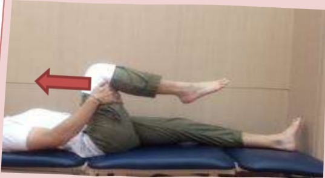

Straight-leg raise stretch

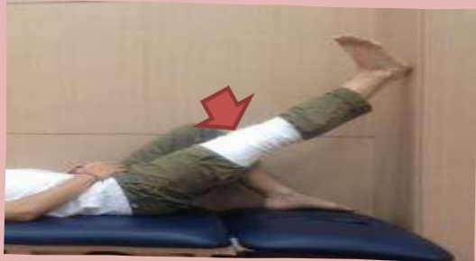

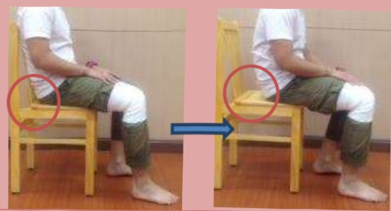

Straight leg stretch

## II. Muscle-Strengthening Exercises

Hold for 10–20 seconds, then relax,  
Repeat 20 times,  
At least 4 times per day

Calf Stretch (1)

Hamstring Stretch with Towel Roll

Calf Stretch (2)

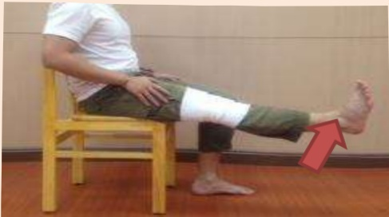

Glute Bridge Exercise

## Ten. References

1. American Diabetes Association (ADA) 2015 Guideline.

2. Ayalon O, Liu S, Flics S, et al. A multimodal clinical pathway can reduce length of stay after total knee arthroplasty. HSS J. 2011 Feb;7(1):9-15.

3. American Society of Hematology 2019 guidelines for management of venous thromboembolism.

4. Benedetti MG, Sarti D, Stagni SB, et al. Fast-Track and Rehabilitation Following Primary Knee Arthroplasty: A Literature Review. The Open Rehabilitation Journal. 2015(8):17-24.

5. Chaurasia A, Garson L, Kain ZL, et al. Outcomes of a joint replacement surgical home model clinical pathway. Biomed Res Int. 2014:296-302.

6. Christelis N, Wallace S, Sage CE, et al. An enhanced recovery after surgery program for hip and knee arthroplasty. Med J Aust. 2015 Apr 20;202(7):363-368.

7. Den HA, Gliesche K, Timm J, et al. Pathway-controlled fast-track rehabilitation after total knee arthroplasty: a randomized prospective clinical study evaluating the recovery pattern, drug consumption, and length of stay. Arch Orthop Trauma Surg. 2012 Aug;132(8):1153-1163.

8. Gooch K, Marshall DA, Faris PD, et al. Comparative effectiveness of alternative clinical pathways for primary hip and knee joint replacement patients. Osteoarthritis cartilage. 2012 Oct;20(10):1086-1094.9. Mackeen AD, Packard RE, Ota E, Berghella V, Baxter JK. Timing of intravenous prophylactic antibiotics for preventing postpartum infectious morbidity in women undergoing cesarean delivery. The Cochrane Database of Systematic Reviews, 2014;12 : CD009516.

10. Sandral I. Berrios-Torres; Craig A. Umscheid; Dale W. Bratzler, et al (2017). Centers for Disease Control and Prevention Guideline for the Prevention of Surgical Site Infection, 152(8):784-791.

11. Sandral I. Berrios-Torres; Craig A. Umscheid; Dale W. Bratzler, et al (2017). Centers for Disease Control and Prevention Guideline for the Prevention of Surgical Site Infection, 152(8):784-791.

12. Xu GG, Sathappan SS, Jaipaul J, et al. A review of clinical pathway data of 1,663 total knee arthroplasties in a tertiary institution in Singapore. Ann Acad Med Singapore. 2008 Nov;37(11):924-928.

Yi Da Cancer Treatment Hospital  
Address: No. 21, Yida Road, Jiaosu Village, Yancheng District, Kaohsiung City  
Phone: 07-6150022  

Yi Da Dachang Hospital  
Address: No. 305, Dachang Road, Sanchong District, Kaohsiung City  
Phone: 07-5599123  

This copyright is protected and may not be reproduced, copied, or resold without the written consent of the copyright holder.  

Copyright Holder: Yi Da Medical Foundation  

Yi Da Medical Foundation 21*29.7cm Printed in February 2022. New Establishment HA-1-0128(1)