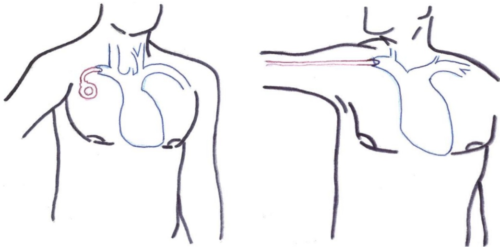
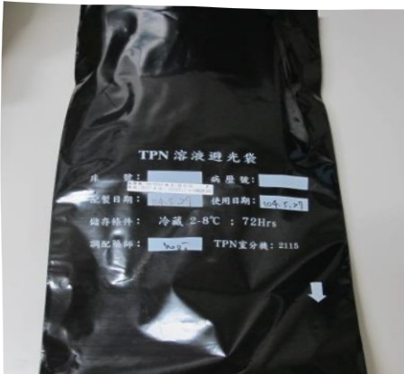
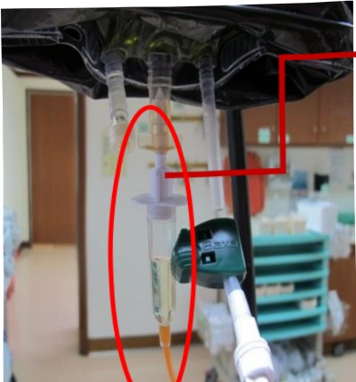
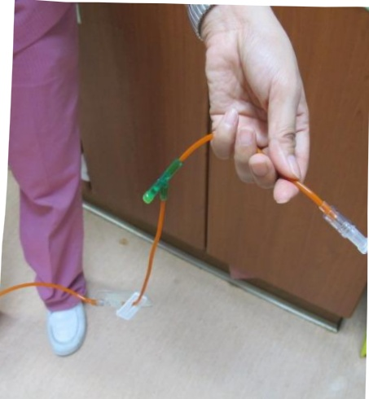
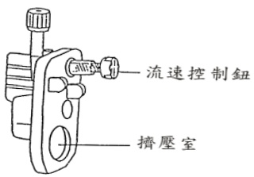
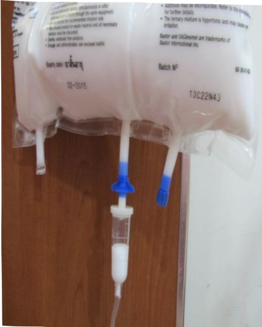
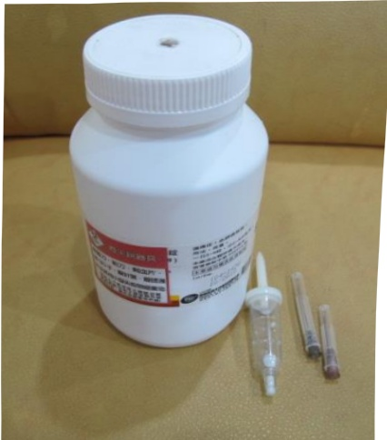

## Introduction

Food and health are closely related. With modern people's diverse daily routines, nutritional imbalance often occurs, leading to various potential diseases. In recent years, medical science has advanced significantly, and diseases that were once considered incurable now have new treatments, cures, or ways to alleviate symptoms, extending patients' lifespans. However, as patients' conditions change during treatment, they may at certain stages be unable to obtain sufficient nutrition through the gastrointestinal tract. In such cases, they may need to rely on intravenous nutrition (commonly known as "nutrition injections" or "infusions") for long-term or temporary support—becoming essential for sustaining life.

To enable you and your family to receive safe infusion nutrition treatment at home, we provide relevant educational content to help you and your family carry out the care of various nutrition infusions at home. This allows for self-care at home while continuing to work, significantly improving your or your family's quality of life.## Table of Contents

One: What is enteral nutrition?... 3  
Two: Who needs home intravenous nutrition?... 3  
Three: What should be paid attention to when receiving intravenous nutrition at home?... 4  
Four: Storage methods for intravenous nutrition solutions... 5  
Five: Home preparation for intravenous nutrition infusion... 6  
Six: Steps for using total parenteral nutrition and lipid emulsions... 7-12  
Seven: Steps for home peripheral venous nutrition infusion... 12-16  
Eight: Steps for terminating home intravenous nutrition infusion... 17  
Nine: Related supplies and other equipment for home intravenous care... 18  
Ten: Handling methods for possible problems and complications... 19-21  
Eleven: Outpatient scheduling... 21  
Twelve: Daily living and care... 22-23## 【What is enteral nutrition?】

Some patients, due to illness, are unable to absorb nutrients through their mouth or gastrointestinal tract. In such cases, nutrients can be delivered directly into large blood vessels near the heart via a tube. This prevents inflammation in smaller peripheral blood vessels.

Figure 1: Injecting the five essential nutrients (carbohydrates, proteins, fats, vitamins, and trace elements) into the body.

## 【Who needs home-based enteral nutrition?】

Sometimes patients no longer need hospitalization but are still unable to obtain nutrients through their mouth or nasogastric tube. With the assistance of medical and nursing teams, they can receive nutritional infusions at home.## 【Three: What should be paid attention to when receiving nutritional infusion at home?】

(1) Select family members or patients to receive care training. Training items include:

1. How to change the catheter? What is the drip rate?

2. How to measure blood glucose.

3. Record the amount of infusion administered, food intake, bowel movements, urine output, and bring the records to the hospital for reference during weekly outpatient visits.

4. Monitor for redness, swelling, or leakage at the injection site; change the catheter daily.

5. Prevention and observation of complications: check for fever, redness, swelling, heat, pain at the injection site, sweating, dizziness, or discomfort.

6. How to collect medication and attend follow-up appointments.

7. Who to contact when problems arise?

(2) Prepare a refrigerator for storing the nutritional infusion and the necessary disinfection supplies.

(3) Before each infusion, wash hands thoroughly with soap or alcohol-based hand sanitizer.

(4) Coordinate the infusion schedule with family members' availability. In hospitals, infusions typically run for 24 hours. However, if the patient has sufficient physical strength to move around, discuss with the medical team to adjust the infusion duration to 16–20 hours. This allows patients to engage in activities such as bathing or walking during the non-infusion periods.

(5) Take body temperature daily.

(6) Weigh the patient weekly during outpatient visits.

(7) During weekly outpatient visits, go to the chemotherapy room to change the injection needle or disinfect the injection site.The site.

(8) Pay attention at all times to the infusion condition of the nutritional infusion, to prevent blood glucose from being too low or too high.

(9) If you experience any problems or symptoms, such as fever, high (or low) blood glucose, or other issues, please contact the parenteral nutrition nurse.

(10) Pay attention to outpatient appointment times; if you are unable to go to the hospital, please contact the parenteral nutrition nurse.

(11) Although food intake is small, oral hygiene should still be maintained.

## 【Four. Storage Methods for Parenteral Nutrition Infusions】

1. Total parenteral nutrition: Store in the refrigerator (2-8°C), as shown in Figure 2.

2. Peripheral parenteral nutrition: Store at 15-25°C in a cool, shaded area indoors, away from sunlight.

3. Lipid emulsions: Store at 15-25°C in a cool, shaded area indoors, away from sunlight.

Figure 2## 【Five: Preparing for Home Parenteral Nutrition Infusion】

## (1) First, wash your hands thoroughly with soap or alcohol-based hand sanitizer (follow steps as shown in Figure 3)

## Ensure proper handwashing to prevent infection

Step 1:  
Rub the palms of your hands together, palm-to-palm

Step 2:  
Wash the backs of both hands, with fingers crossed and rubbed together

Step 4:  
Interlock fingers and rotate them while rubbing

Step 3:  
Rub the palms of both hands, with fingers crossed and rubbed together

Step 5:  
Rotate the thumbs of both hands against each other

## Figure 3## 【Six. Steps for Using Total Parenteral Nutrition (TPN) and Lipid Emulsions】

## (1) Steps for Using Total Parenteral Nutrition – See the following diagrams

Prepare the necessary items (TPN infusion set, light-protected infusion tubing, 10 mL syringe, normal saline, alcohol swabs).

Remove the TPN bag from the refrigerator 2 hours before use to allow it to thaw.

Check the TPN bag for any damage, and ensure the solution is not discolored or cloudy (normal solution should be pale and clear).

(Yellow).  

1. First, peel open the water-soluble vitamin ampoule, withdraw 4 cc of the internal solution, then peel open the lid of the fat-soluble vitamin and disinfect it with an alcohol-impregnated cotton swab.  
2. Add the 4 cc of water-soluble solution to the fat-soluble vitamin, shake well, then withdraw it.  
Open the lid of the trace element vial, withdraw 10 cc, then add through the medication port.  
Peel open the medication port and add the previously mixed vitamins (4 cc) and trace elements (10 cc).

Rotate the middle connecting tube to peel it off, then connect it to the orange light-proof connecting tube.

## Connection of infusion bag and infusion tube:

Open the cap of the infusion tube's needle, then insert it into the outlet of the infusion bag. The outlet of the infusion bag must be sterile; if it is accidentally contaminated, disinfect it with an alcohol wipe before connecting.

Infusion tube排气 (air removal):

Press the drip chamber 1-2 times

Fill with 1/2 to 2/3 of the liquid

Infusion tube排气:

The set contains an air trap chamber, so first invert it, then pull the flow rate control knob open.

Once the compression chamber is fully filled with liquid, return it to an upright position.

Wait until the liquid reaches the front end of the infusion tube, then press down and secure the flow rate control knob. After disinfecting the patient end with an alcohol cotton swab, connect the drip set and gradually open the flow rate control knob to confirm that the drops fall smoothly, then begin infusion.

Administer lipid emulsion and total parenteral nutrition via a three-way piston, with infusion duration of at least 16 hours and not exceeding 24 hours.

After completing the infusion, flush the residual medication in the artificial vascular catheter with 10 mL of normal saline, then secure the catheter with a needle cap.

## (二) Steps for Lipid Emulsion Infusion - Schematic Diagram

1. Store at room temperature without refrigeration. Do not use if the solution has changed color, contains foreign matter, or shows any other abnormalities.

2. Prepare supplies (alcohol wipes and standard connecting tubing)

1. Remove the cap, then disinfect it with an alcohol wipe for 15 seconds, and connect using a standard connector tube.

2. Prime the infusion tube: fill the outlet of the infusion bag to 1/2 to 2/3 of the volume in the drip tube.

3. The infusion time must be at least 12 hours and no more than 24 hours.

## 【Seven. Steps for Home Peripheral Parenteral Nutrition Administration】

## (I) Steps for Baxter Nutrient Injection - Schematic Diagram

1. Open the outer membrane sleeve and confirm that the sealed bag and the partition seal are intact and undamaged.

2. Prepare the required items (peripheral venous nutrition infusion set, infusion connector tube, 10 cc syringe, normal saline, alcohol wipes).

A mixed solution — grasp the upper sides of the bag and roll the soft bag forward like rolling a towel, applying force to expand the divider.

Flip the soft bag two to three times to evenly mix the solution.

Peel off the middle infusion port.

Remove the infusion tube and insert it into the infusion port by rotating.

After connecting, release air, then attach the needle to the patient's injection site. During injection, continuously monitor the infusion status of the nutritional solution.

Infusion duration should be at least 12 hours, and up to 24 hours.

Replace the new package before the infusion is complete.## (二) Fisonscale Nutritional Infusion Administration Steps - Schematic Diagram

1. Open the outer membrane sleeve and confirm the integrity of the sealed bag and the divider seal, ensuring there is no damage.

2. Prepare the required items (peripheral venous nutrition infusion set, infusion tubing, 10 mL syringe, normal saline, alcohol cotton swabs).

1. Mix the solution—grasp the top two sides of the bag and roll it like a towel. With your right hand, first roll the right side of the bag from top to bottom, pushing the liquid to the left side to expand the divider.

2. Hold the bag with your right hand continuously, then use your left hand to roll the left side of the bag to the right to mix the lipid emulsion.

Rotate the side port open.

Remove the connecting tube and insert it into the port by rotating.

Connect and release air, then attach to the injection site.

Infusion time should be at least 14 hours. If the infusion is not completed within 24 hours, replace with a new package.【Eight. Steps for Handling the End of Home Parenteral Nutrition Infusion】

(1) Pay attention to environmental cleanliness.  
(2) Wipe the desk clean, then disinfect it with alcohol.  
(3) Prepare supplies (10 cc empty syringe, 20 cc normal saline, alcohol cotton swabs)  
(4) Wash hands with soap or use a dry hand sanitizer.  
(5) Close the clamp.  
(6) Fold the catheter back.  
(7) Loosen the connection between the catheter and the infusion tube.  
(8) Disinfect the catheter connection with alcohol cotton swabs, then connect it to the pre-drawn normal saline.  
(9) Inject 10 cc of normal saline.  
(10) Attach the injection cap and secure it.  
(11) Medical waste such as syringes, needles, empty syringes, infusion tubing, infusion bags, and glass vials must be returned to the hospital for proper disposal and must not be thrown into household trash.  
(13) Sharp medical waste such as syringes should be placed in a container or bottle.  
(14) Infusion tubing and infusion bags should be placed in waterproof bags for return to the hospital for disposal.

## 【Nine. Home-based Venous Care Supplies and Other Technologies】

## (1) Care-related Supplies (See Table 1)

| Required Supplies | Places where they can be purchased or obtained |
|------------------|-------------------------------------------------|
| Alcohol wipes, 20 mL normal saline, sterile gauze, transparent dressing pads, 3M tape | General pharmacies or medical equipment stores |
| Parenteral nutrition solution, lipid emulsion, syringes, IV tubing connectors | Provided by hospitals |
| IV pump device | Rentable depending on circumstances |
| IV stand | Available through medical assistive equipment rental services |
| Ice bucket and ice pack | Available at general stores |

(Table 1)

(2) Other Technologies: Central Venous Catheter Dressing ChangeDisinfection schedule: Disinfect and change the dressing once per week; change it immediately if sweating or soiled.

Steps:

1. Wash hands with soap or use alcohol-based hand sanitizer.

2. Remove the soiled dressing, and check whether the catheter has slipped out or if there is any sign of inflammation around the skin (pay attention to whether there is pus or redness at the injection site).

4. Perform disinfection method: disinfect in a circular motion from inside out, covering an area larger than the sterile transparent dressing. The sequence is 10% iodine alcohol → hold for 30 seconds → 75% alcohol, repeated three times.

4. Secure the sterile transparent dressing (OP SITE) (see Table 2). (For individuals allergic to the sterile transparent dressing, use gauze coverage, but the dressing must be changed daily).

Remove the paper from the center of the outer side

Apply it flat without wrinkles to the skin.

## [10. Possible Issues and Management of Complications]

|  | Abnormal Condition | Possible Causes | Management | When to Contact Healthcare Provider |
|---|---|---|---|---|
| 1 | Fever | Catheter infection | Stop infusion | Immediately || 2 | 穿刺部位皮膚紅腫 | 導管感染 | 局部消毒 | 馬上 |
|---|------------------|---------|---------|------|
| 3 | 因空氣進入中心靜脈導管發生呼吸困难 | 空氣拴塞 | 左側臥,頭低腳高,等待救護車到來 | 馬上 |
| 4 | 口渴且意識模糊 | 高血糖 | 測量血糖值,輸液減量 | 馬上 |
| 5 | 冷汗、不舒服、口渴、空腹 | 低血糖 | 測量血糖值,給與糖水 | 馬上 |
| 6 | 空氣進入點滴管及導管裏 | 很多種情形 | 1.氣泡產生程度沒有問題。2.使用注射筒抽出空氣。3.有大量空氣進入體內時應醫院聯絡。 | 1.不需要 2.不需要 3.馬上 |
| 7 | 導管阻塞,無法輸注 | 導管阻塞 | 停止輸注,注入生理食塩水,如不行請返院就醫。 | 門診時間與護理師聯絡 |
| 8 | 溶液軟袋破裂 | 操作不當 | 1.若不小心打破,立 | 門診時間與 |Tzu Chi Medical Foundation

|   |   |   |   |   |
|---|---|---|---|---|
| 9 | The drip tube partially leaks liquid | The connection of the drip tube comes loose or the drip tube is damaged | Replace all drip tubes | Contact nurse during outpatient hours |
| 10 | The pump operates poorly | Abnormalities in the circuit system | Pause infusion | Contact manufacturer |
| 11 | The injection cap falls off | Not securely tightened | Immediately clamp the catheter near the body, disinfect with alcohol cotton swab, and replace with a new injection cap. | Not required |

## [11. Outpatient Schedule]

### 1. Collecting Total Parenteral Nutrition (TPN)

Visit the outpatient clinic of the nutrition specialist physician every week for blood tests. The physician and specialized venous nurse will assess the home use of parenteral nutrition. The physician will decide, based on the situation, whether to schedule follow-up visits at regular intervals.Between the time of prescription issuance, go to the pricing counter to settle the bill. Approximately 2–3 hours later, please go to the pharmacy on the first floor to collect the lipid emulsion and the medication consultation room to collect the total parenteral nutrition (TPN) solution. Also, collect the related medical supplies at the first-floor injection room (light-protected tubing, regular tubing, three-way piston, 5 cc syringe caps, and 10 cc syringe caps). During the journey home, the total parenteral nutrition solution must be kept cold using an ice bucket. Once home, store it in the refrigerator, where it can be kept for up to 7 days.

### 2. Collection of Peripheral Parenteral Nutrition

Visit your original treating physician's outpatient clinic for a follow-up visit. The physician and the specialized peripheral venous nutrition nurse will assess your home-based peripheral venous nutrition usage. The physician will determine the frequency of outpatient follow-ups based on the situation and issue a prescription. After receiving the prescription, go to the pricing counter to settle the bill. Collect the peripheral parenteral nutrition solution at the pharmacy on the first floor. Also, collect the required medical supplies (regular tubing, syringe caps, and 10 cc syringe caps) at the first-floor injection room. After returning home, store the solution at room temperature and avoid exposure to direct sunlight.

## [12. Daily Living Care]

## (1) Bathing:

Bathing can be done during times when no parenteral nutrition injections are being administered. If it is unavoidable and the injection site gets wet, there is no need to worry, as the sterile transparent dressing (OP SITE) is waterproof. If water does enter the injection site, simply re-disinfect and change the dressing.

## (2) Activities:

Try to administer injections at night, allowing daytime activities such as going out or attending school. Older children can be trained to take on some responsibility for their care. Family members should treat the situation with normalcy and avoid excessive concern.Protect him.

## (3) Diet:

For patients receiving central venous nutrition therapy, it is almost impossible to absorb nutrients through the mouth or gastrointestinal tract. When a patient's condition improves, doctors will assess whether oral feeding is possible. Since each patient has different physical conditions, do not encourage patients to try oral intake without first discussing with medical staff.

(4) Urination and defecation:

Central venous nutrition therapy may lead to frequent nighttime urination, which can affect sleep. In such cases, discuss with your doctor to adjust the timing of nutrient infusion. Additionally, consider whether the locations for urination and defecation are convenient. If physical strength decreases, consider renting or purchasing a commode chair to prevent falls.

(5) Clothing:

Choose loose, button-up clothing, and secure the infusion set with tape to avoid pulling on the catheter when changing clothes.

(6) Living environment:

If you do not have a portable infusion stand, you can install hooks at home that can support the IV bags.Da Yang Medical Foundation

# At-Home Parenteral Nutrition Care Handbook

Third Edition

Da Yang Medical FoundationYi Da Medical Foundation

Yi Da Hospital, Yi Da Medical Foundation

Address: No. 1, Yida Road, Jiaosu Village, Yanchao District, Kaohsiung City  
Consultation Phone: 07-6150011 Ext. 257331 (Monday to Friday, 08:00–17:00)  
07-6150011 Ext. Discharge Ward (24 hours)

Yi Da Cancer Treatment Hospital, Yi Da Medical Foundation

Address: No. 21, Yida Road, Jiaosu Village, Yanchao District, Kaohsiung City 824  
Consultation Phone: 07-6150022 Ext. 257103 (Monday to Friday, 08:00–17:00)  
07-6150022 Ext. Discharge Ward (24 hours)

This work may not be reproduced, duplicated, or resold without the consent of the copyright holder.

Prepared by: Yi Da Medical Foundation, Parenteral Nutrition Treatment Team  
Copyright Holder: Yi Da Medical FoundationTaiwan Medical Foundation 14.8*21cm

2020.07 Printed HA-1-0145(2)