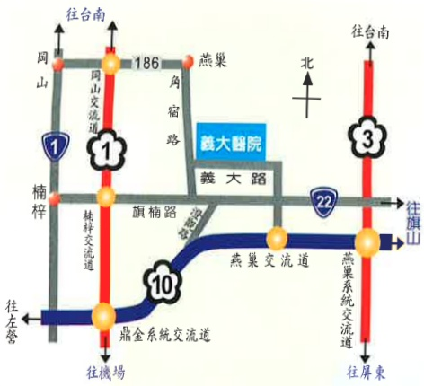
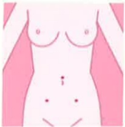

### 5. Activity Guidance:

Gradual ambulation should be initiated within 24 hours post-surgery,  
and family members must accompany the patient throughout the process.

An abdominal binder can be used to reduce muscle strain during movement.

The head of the bed can be elevated to practice deep breathing, coughing, and turning in bed.

Heavy lifting exceeding 5 kg should be avoided for 6–8 weeks post-surgery,  
and activities such as horseback riding, cycling, prolonged sitting, and intense physical exercise should be avoided for three months to prevent pelvic congestion and discomfort.

---

### Menstrual Recovery

Women who undergo hysterectomy will no longer have menstruation.  
Women who undergo partial myomectomy or unilateral oophorectomy may resume normal menstruation.

Normal sexual activity can generally be resumed after 6–8 weeks post-surgery, when deep pelvic tissues have recovered sufficiently.

If fever, severe abdominal pain, or abnormal vaginal discharge occur after discharge, medical attention should be sought immediately. Address: No. 1, Yida Road, Jiaosu Village, Yanchao District, Kaohsiung City, 824

Phone: 07-6150011  
Website: edah@edah.org.tw  

This copyright is protected and unauthorized reproduction, reprinting, or resale is prohibited without the copyright holder's consent.  
Copyright Holder: Edah Medical Foundation  
Form Number: HA-1-0164 (1)  
Edah Medical Foundation, 20X29.7cm, printed in 2015.11, established in 2012.06

## Gynecological Laparoscopic Surgery Guidelines

## Gynecological Laparoscopic Surgery Guidelines

## Preoperative Preparations:

1. Complete the surgical and anesthesia consent forms and undergo pre-anesthesia evaluation.

2. Perform blood tests, X-ray, and electrocardiogram (ECG) examinations.

3. Remove all wearable items from the body prior to surgery: removable dentures, earrings, wristbands, rings, and jewelry; remove nail polish.

4. Begin fasting from 12:00 PM the night before surgery, including water. On the day of surgery, have enema and intravenous infusion between 5–6 a.m.

5. Skin shaving will be performed upon entering the operating room.

6. Wear disposable underpants on the day of surgery, and prepare disposable underpants, sanitary pads, and abdominal support belts.

Specialized surgical instruments such as scissors, clamps, and electrocautery devices can be used to remove tumors from the abdominal cavity.

## Postoperative Instructions:

1. Pain relief injections can be administered after surgery to alleviate pain.

2. If intestinal adhesions are released during surgery, the intestines may become irritated, causing cramping pain; pain medication can be given to relieve this.

3. After surgery, nausea, vomiting, throat pain, shoulder, and neck pain may occur due to anesthesia and carbon dioxide insufflation into the abdominal cavity.

### 4. Wound Care:

* There will be 1–3 incisions of approximately 0.5–1 cm in size on the abdomen. These wounds will be covered with cosmetic adhesive tape and gauze, and only need to remain dry.

Laparoscopic Surgery

* Bathing is allowed only after the doctor examines the wound and confirms healing (approximately 7–10 days). If the wound shows signs of redness, swelling, heat, pain, or discharge, seek medical attention immediately.

### 5. Dietary Guidance:

$ ^{*} $ Food intake is permitted after 8 hours post-surgery or after bowel movement has resumed, depending on the surgical procedure.

* Eat small meals frequently: start with water and rice porridge, and gradually progress to two meals of porridge before transitioning to dry rice.

* For patients prone to bloating, avoid gas-producing foods such as legumes, sweet potatoes, onions, and carbonated beverages. Eat in small portions and get up and move around frequently.

$ ^{*} $ Avoid smoking, alcohol, strong tea, coffee, spicy foods, and herbal medicines.

* Patients who undergo bilateral oophorectomy are at increased risk of osteoporosis; increase calcium-rich food intake accordingly.

4. Intravenous infusion and urinary catheter will be administered post-surgery, and abdominal drainage tubes may be left in place depending on the surgical procedure; these tubes will be removed based on recovery progress.

5. A small amount of brownish vaginal discharge may appear 1–2 weeks after surgery.

