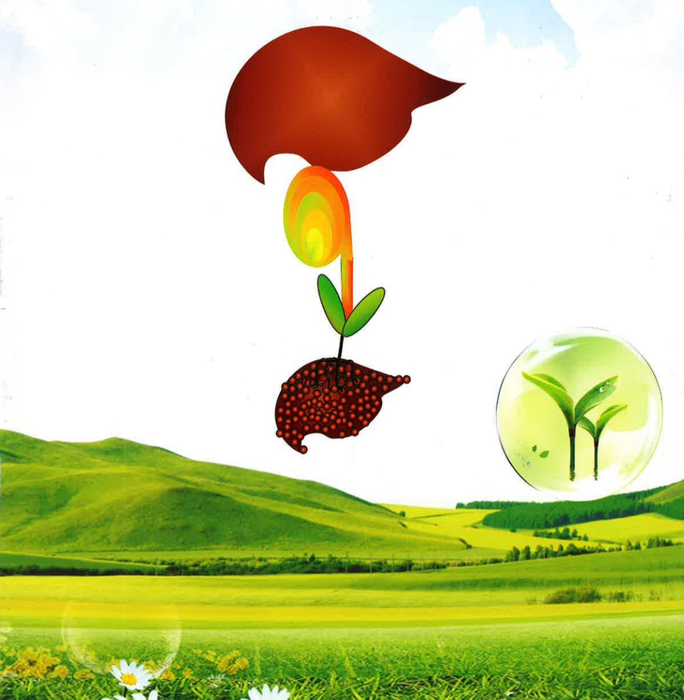
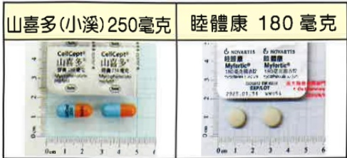
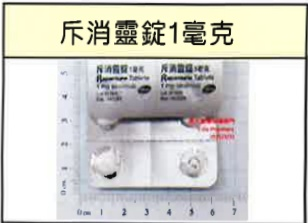
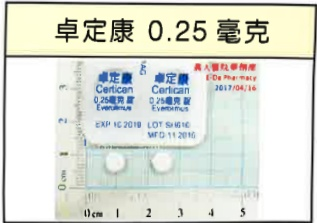
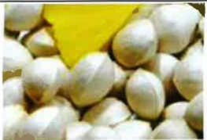
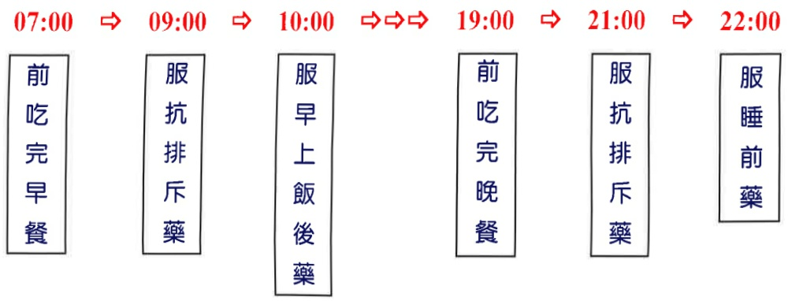

# The Beginning of a Colorful Life

## Liver Transplant Patient Care Handbook

Name: ___

Date of Birth: ___

Date of Handover: ___

Doctor's Name: ___

Hospital: Yida Hospital

Care Coordinator: Huang Lijie

Contact Number: 07-6150011 ext. 5855

Liver transplantation involves replacing a dysfunctional liver with a healthy one, thereby gradually improving the patient's health status and quality of life. Since the newly implanted liver is recognized by the body's immune system as a foreign object, the immune system will attempt to attack it. To prevent the new liver from being attacked and to avoid rejection, patients must take immunosuppressive drugs for life. These medications increase the risk of infections compared to the general population. However, by paying attention to small daily details and by strictly following medical instructions—including taking medication on time and attending regular outpatient follow-ups—you can gradually return to a quality of life similar to that before the transplant.

## Post-liver transplant care instructions

## 1. What is rejection?

Rejection occurs when the body's immune system recognizes foreign substances and triggers a defensive response. It is more common within the first three months after transplantation. Symptoms of rejection can often be confused with those of vascular or biliary obstruction or infection, and further differential diagnosis and treatment are usually required. Therefore, if you experience any of the following rejection symptoms, please contact the transplant team immediately:

1. Possible symptoms include:

(1) Fever (body temperature consistently above $ 38.5^{\circ} $ C).

(2) Increased heart rate.

(3) Abdominal pain (especially in the upper right abdomen).

(4) Rapid abdominal enlargement.

(5) Darkened urine (tea-colored urine), and pale stools (grayish-white stools).

(6) Jaundice.

(7) Loss of appetite.

(8) Fatigue and lethargy.

(9) Symptoms similar to a cold (such as chills, fever, abdominal pain, muscle aches, restlessness, anxiety, or significant mood swings; if family members also show cold symptoms, please inform the transplant team immediately).

2. Differential diagnosis:

(1) Blood tests.

(2) Ultrasound examination.

(3) Liver biopsy.

3. Treatment for rejection:

(1) Increase the dosage of immunosuppressive drugs.

(2) Intravenous administration of large doses of corticosteroids (Methylprednisolone).

(3) Increase the use of other immunosuppressive drugs (such as MMF).

## 2. Infection symptoms

To prevent infection, avoid contact with individuals suffering from infectious diseases such as chickenpox or measles. Maintaining a clean home environment and practicing proper health care are also essential. Below are possible infection symptoms and corresponding management measures:

## 1. Possible symptoms

(1) Cough (indicative of pulmonary infection).

(2) Fever (body temperature consistently above 38.5°C for more than 24 hours).

(3) Abnormal changes in skin wounds (such as redness, swelling, warmth, or fluid discharge).

(4) Rash (such as having been in close contact with individuals showing symptoms of measles or chickenpox, or spending over one hour in the same room as someone with a rash; exposure to someone who develops a rash within 24 hours is considered equivalent to direct contact with a person showing rash symptoms).

2. Differential diagnosis:

(1) Blood testing.

(2) Bacterial or viral culture.

(3) Arrange for X-ray examination.

3. Treatment for infection symptoms:

(1) Reduce the dosage of immunosuppressive drugs.

(2) Administer antibiotics, antiviral agents, or antiviral globulin based on the source of infection.

## Three. Dietary Guidance

## 1. Caloric and Protein Requirements

|  | Before Transplant | Early Post-Transplant (Acute Phase; First 3 Months After Transplant) | Stable Period |
|---|---|---|---|
| Calories | General patients: 30 kcal/kg; Obese patients: 25 kcal/kg | 30–35 kcal/kg | 30 kcal/kg |
| Protein | 1.2–1.5 g/kg/day | 1.5 g/kg/day | 1–1.2 g/kg/day |

**Obesity is defined as BMI > 24.**  
**BMI calculation formula: [Weight (kg) ÷ Height (m)²].**  
Example: Consuming 1.5 g of protein per kg per day (e.g., if body weight is 50 kg, then 75 grams of protein should be consumed daily, approximately 7–8 portions of protein-rich foods).  

1 portion of protein food (1 portion = 7 grams of protein)  
= 1 two-ounce portion of meat (chicken, duck, goose, pork, beef, lamb, or fish, about three finger-width in size)  
= 1 cup (190 ml) of soy milk  
= 1 egg or 2 egg whites  
= 1/2 box of young tofu or 2 traditional block tofu  
= 2 triangular oil tofu pieces  

## 2. Dietary Guidance During Early Post-Transplant and Stable Period  

## (1) Pre-Transplant Nutritional Assessment  

Nutritional screening and evaluation for malnutrition should be conducted promptly for patients scheduled for surgery or planned liver transplantation, to treat malnutrition preoperatively and thereby improve body protein status.  

(2) Early Post-Transplant (Acute Phase; First 3 Months After Transplant)  

Post-surgery, the risks of sarcopenic obesity and metabolic syndrome should be considered. Nutritional rehabilitation should aim to restore whole-body protein and muscle function as early and rapidly as possible. Therefore, during this stage, patients should consume a **high-protein diet** and obtain **sufficient calories**.  

## Dietary Principle One  

a. Adequate protein intake (1.5 g/kg) and caloric intake.  

b. Avoid consuming grapefruit (juice) or pomelos (and related products) one hour before or after taking immunosuppressants. Grapefruit may cause severe side effects such as muscle spasms and loss of consciousness; pomelos may interfere with drug absorption.  

c. Pay attention to food safety and hygiene, avoid consuming raw foods (such as raw salad, raw fish, raw eggs, raw oysters, raw meat, and unsterilized fresh milk), ensure all food is thoroughly cooked and boiled before consumption, avoid eating leftovers, and ensure utensils are cleaned and disinfected before use.  

d. Choose fruits with skin and remove the outer skin, or boil fruits before consumption.  

e. Avoid consuming supplements and immune-boosting foods (such as human ginseng, ginkgo biloba, seaweed, etc.) to prevent triggering rejection reactions.  

f. For patients with hyperglycemia (due to steroid or immunosuppressant use), control starch intake appropriately and avoid refined sugars (fructose, sucrose, etc.). Replace staple foods with non-refined starches such as whole grains or root and tuber vegetables (pumpkin, sweet potato, brown rice, etc.).  

g. For patients with hyperkalemia (due to immunosuppression), reduce intake of high-potassium foods (bananas, watermelon, vegetable juice, meat broth, traditional Chinese medicine soups, energy drinks, monosodium glutamate, etc.). Alternatively, blanch vegetables (2–3 minutes) before stir-frying or mixing with oil.  

(3) Stable Period  

Maintain the function of the transplanted organ through proper nutrition, reduce metabolic complications caused by long-term immunosuppressive drug use, and improve quality of life. Maintain good nutritional status to prevent nutrient deficiencies and reduce the occurrence of hyperglycemia, hyperlipidemia, hypertension, and obesity.## Dietary Guidelines No. 2

a. Consume appropriate calories and protein intake to maintain an ideal body weight; a balanced diet is sufficient.

b. Ensure adequate intake of fruits and vegetables to increase dietary fiber, which helps prevent cardiovascular diseases and metabolic disorders such as hypertension, hyperlipidemia, and hyperglycemia.

C. Use plant-based oils (olive oil, canola oil, sunflower oil, salad oil) as the primary cooking oils, consuming them in moderation, and reduce the use of animal-based fats (butter, cream, lard, tallow).

d. Limit fried, pan-fried, and oily foods; avoid high-fat foods such as animal skin (fish skin, pork skin), fatty meats (five-layer pork, trotters), and processed products (smoked meat, sausages, ham).

e. Consume minimal high-cholesterol foods, such as animal organs, sea urchins, fish roe, crab roe, etc.

f. Reduce intake of high-saturated fat foods, including animal fats (butter, tallow, fatty meats) and processed plant-based oils (plant-based cream, snacks, pastries, bread).

g. Limit consumption of refined sugars (white sugar, fructose), to prevent the development of hyperglycemia and hyperlipidemia.

h. Use appropriate seasoning without excessive salt intake to prevent hypertension and edema.

i. Patients on long-term steroid therapy should supplement calcium (from high-calcium foods) at a daily dose of 1200–1500 mg.

## Four. Home Care

1. How to monitor rejection reactions, infection symptoms, and drug side effects

(1) Measure and record body temperature and blood pressure daily (once per day).

(2) Observe the frequency, color, and consistency of urine and stool; if tea-colored urine or grayish-white stools are observed, immediately inform the transplant team.

2. Maintain a normal and regular lifestyle: adjust daily routines to remain normal and consistent.

3. Maintain good hygiene habits: both you and your family should maintain good hygiene practices, such as frequent handwashing, brushing teeth or rinsing mouth after meals and eating.

## 4. Activities or Outdoor Visits

(1) Avoid going to crowded places; if unavoidable, wear a mask for protection.

(2) Intense physical activities (such as running, swimming, sexual activity) should be avoided until six months after surgery.

## 5. Dental and Ophthalmic Follow-ups

(1) Regular dental check-ups every six months: inform the dentist of all medications you are taking. If dental treatment is required, preventive antibiotics should be administered beforehand.

(2) Regular ophthalmic examinations every 6 to 12 months: steroids may affect vision.

## 6. Preventive Vaccinations

(1) Hepatitis B vaccination is a top priority before and after liver transplantation.

(2) Inactive vaccines should not be administered; live vaccines (e.g., influenza vaccine, pneumococcal vaccine) can only be given after six months.

(3) Polio vaccination should be replaced with the inactivated form, i.e., the Salk vaccine.

## 7. Other Notes

(1) Avoid indoor plant cultivation or entering plant greenhouses to prevent infection from plant pathogens.

(2) Avoid keeping pets to reduce the risk of vector-borne infections.

(3) If diarrhea occurs and watery stools exceed six times with a duration of over 12 hours, do not immediately use anti-diarrheal medications; instead, return to the hospital for stool culture.## Five. Follow-up Plan

## 1. From discharge to one month

(1) Check white blood cell count, renal function, FK506 (immunosuppressive agent) blood concentration, and blood glucose every 1–2 weeks.

(2) Liver function blood tests.

## 2. From one month to two months

(1) Check white blood cell count, renal function, FK506 (immunosuppressive agent) blood concentration, and blood glucose every 2–4 weeks.

(2) Liver function blood tests.

3. Subsequently, check once a month: the testing items will be determined by the physician's assessment. After one year post-transplant, follow-up visits will be scheduled every three months.

(1) If white blood cell count < 2000, there is a risk of infection, and the dosage of immunosuppressive medication should be adjusted.

(2) If creatinine levels rise, it indicates renal toxicity, and the dosage of immunosuppressive medication should be adjusted.

(3) If liver function markers rise, it may suggest organ rejection; diagnosis must first be confirmed before adjusting medication dosage.

4. Check cholesterol index and tumor markers every three months.

5. Test for hepatitis virus antigens and antibodies every three months; after one year, switch to annual testing.

6. Test for hepatitis virus load every six months.

7. Perform abdominal ultrasound every three months; after one year, switch to annual testing.

8. Perform a CT scan annually.

The success or failure of liver transplantation is 30% due to the efforts of the transplant team and high-quality care, and 70% depends on your cooperation with medical procedures, possessing correct home care knowledge, and having a strong family support system. If you have any questions during home care, please call the following consultation number: 615-0011 ext. 5855.

## Six. Medications Used After Transplantation

## 1. Preventing Organ Rejection

|  |  |  
|---|---|  
| **FFK-506 Short-Acting Type** |  |  
| **Prolactin 0.5 mg** | **Prolactin 1 mg** | **Prolactin 5 mg** |  
|  |  |  |  

**FK-506 Long-Acting Type**

 (40%)  
 (19%)  
 (20%)  
 (12%)  
 (13%)  
 (13%)  

Note: This medication also has anti-inflammatory effects.## 2. Medications for Preventing Post-Transplant Infections

<table border=1 style='margin: auto; width: max-content;'>
<tr>
<td style='text-align: center;'>Mengke Xing Tablets 480 mg </td>
<td style='text-align: center;'></td>
<td style='text-align: center;'>[l]</td>
</tr>
<tr>
<td colspan="3">Indication: Prevent lung infection</td>
</tr>
<tr>
<td style='text-align: center;'>Beileke 0.5 mg</td>
<td style='text-align: center;'>Xingdin 0.5 mg</td>
<td style='text-align: center;'>Fusiding 300 mg, Weilide 2.5 mg</td>
</tr>
<tr>
<td style='text-align: center;'></td>
<td style='text-align: center;'></td>
<td style='text-align: center;'></td>
</tr>
<tr>
<td colspan="3">Indication: Treatment of B-type hepatitis or prevention of B-type hepatitis recurrence</td>
</tr>
</table>

## 3. Other

## VII. Post-Operative Wound Care

To maintain a flat wound and reduce the risk of keloid formation, replace the wound dressing (or cosmetic adhesive) every 3 days and apply it for at least 3 to 6 months. If the wound becomes red or itchy to the point of discomfort, remove the dressing (or adhesive) first, wait until the redness and itching subside, then reapply. The dressing should be applied perpendicularly to the wound, with each piece overlapping (as shown in the diagram below). You can take a shower; after showering, simply dry the dressing (or adhesive) on the wound.

Appendix 1

<table border=1 style='margin: auto; width: max-content;'>
<tr>
<td style='text-align: center;'>High-potassium foods</td>
</tr>
<tr>
<td style='text-align: center;'>Bananas, strawberries, honeydew melon, tangerines, papaya, eggplant, tomatoes</td>
</tr>
<tr>
<td style='text-align: center;'>Potatoes, radishes, leafy greens, carrots, broccoli, cabbage, spinach</td>
</tr>
<tr>
<td style='text-align: center;'>Red mustard greens, soybean sprouts, shiitake mushrooms, green cauliflower, Chinese cabbage sprouts</td>
</tr>
<tr>
<td style='text-align: center;'>Coffee, nuts, sports drinks, chocolate, cocoa, low-sodium soy sauce</td>
</tr>
</table>## Appendix 2

## Transplant patients should avoid using traditional Chinese herbs and herbal plants

|  |  |
|---|---|
| **Increase drug concentration** | Chamomile, goldenseal, tangerine peel, tangerine shell |
| **Decrease drug concentration** | Huang Qin, Huang Bai |
| **Reduce immunosuppressive effect** | Ginseng |
| **Health supplements** | Ginkgo biloba (inhibits coagulation function)   Red yeast rice (must be discussed with a physician or pharmacist before consumption) |

## 【II】Common traditional Chinese herbs and herbal plants that interact with immunosuppressants

|  | Image |  |  | Image |  |
|---|---|---|---|---|---|
| Chamomile |  |  | Tangerine peel |  |  |
| Goldenseal |  |  | Huang Qin |  |  |
| Ginkgo biloba |  |  | Licorice |  |  |
| Tangerine shell |  |  | Huang Lian |  |  |

## Medication timing notes

|  |  |
|---|---|
| * Take medication on an empty stomach (FK506, Shanxiduo/Mutikang)  Take medication  before meals or 2 hours after meals  * Clinic visit reminders  1. If blood draw is scheduled on the day of visit, do not take medication; take it after blood draw  2. Carry medication with you for easy access  3. Take evening medication as usual at the regular time |  |

07:00  
09:00  
Take immunosuppressive medication  
10:00  

Take medication after breakfast  

19:00  

  

Eat dinner before taking medication  

21:00  
22:00  
Take immunosuppressive medication  
Take bedtime medication  

## Sources

☑ Drug information: Drug labels, UpToDate database  
Taiwan Food and Drug Administration – Traditional Chinese and Western Medicine Combined Use Consultation Database  
Taiwan Food and Drug Administration – Consumer Service Website – Taiwan Food and Ingredient Database (2017 edition)  

☑ Clinical Nutrition – Dietary Therapy  
◆ Liver Disease Prevention Academic Foundation Special Issue  
◆ Huang Hui-ling (2015). Nutritional Care in Liver Transplantation. Changhua Nursing, 22(1), 12–12.  

☑ Transplantation of the liver. 2005, p. 491–503  
◆ EASL Clinical Practice Guidelines: Liver Transplantation. Journal of Hepatology 2016;64(2): 433–485.[]| Date/Testing Item |  |  |  |  |  |  |
|-------------------|---|---|---|---|---|---|
| FK506 Drug Concentration |  |  |  |  |  |  |
| FK506 (Tacrolimus) Dose |  |  |  |  |  |  |
| MMF (Mycophenolate Mofetil / CellCept) Dose |  |  |  |  |  |  |
| Body Weight |  |  |  |  |  |  |
| Blood Pressure |  |  |  |  |  |  |
| Body Temperature |  |  |  |  |  |
| Date/Testing Item |  |  |  |  |  |  |
| FK506 Drug Concentration |  |  |  |  |  |  |
| FK506 (Tacrolimus) Dose |  |  |  |  |  |  |
| MMF (Mycophenolate Mofetil / CellCept) Dose |  |  |  |  |  |  |
| Body Weight |  |  |  |  |  |  |
| Blood Pressure |  |  |  |  |  |  |
| Body Temperature |  |  |  |  |  |  |
| Date/Testing Item |  |  |  |  |  |  |
| FK506 Drug Concentration |  |  |  |  |  |  |
| FK506 (Tacrolimus) Dose |  |  |  |  |  |  |
| MMF (Mycophenolate Mofetil / CellCept) Dose |  |  |  |  |  |  |
| Body Weight |  |  |  |  |  |  |
| Blood Pressure |  |  |  |  |  |  |
| Body Temperature |  |  |  |  |  |  |
| Date/Testing Item |  |  |  |  |  |  |
| FK506 Drug Concentration |  |  |  |  |  |  |
| FK506 (Tacrolimus) Dose |  |  |  |  |  |  |
| MMF (Mycophenolate Mofetil / CellCept) Dose |  |  |  |  |  |  |
| Body Weight |  |  |  |  |  |  |
| Blood Pressure |  |  |  |  |  |  |
| Body Temperature |  |  |  |  |  |  |
| Date/Testing Item |  |  |  |  |  |  |
| FK506 Drug Concentration |  |  |  |  |  |  |
| FK506 (Tacrolimus) Dose |  |  |  |  |  |  |
| MMF (Mycophenolate Mofetil / CellCept) Dose |  |  |  |  |  |  |
| Body Weight |  |  |  |  |  |  |
| Blood Pressure |  |  |  |  |  |  |
| Body Temperature |  |  |  |  |  |  |
| Date/Testing Item |  |  |  |  |  |  |
| FK506 Drug Concentration |  |  |  |  |  |  |
| FK506 (Tacrolimus) Dose |  |  |  |  |  |  |
| MMF (Mycophenolate Mofetil / CellCept) Dose |  |  |  |  |  |  |
| Body Weight |  |  |  |  |  |  |
| Blood Pressure |  |  |  |  |  |  |
| Body Temperature |  |  |  |  |  |  |

Address: No. 1, Yida Road, Jiaosu Li, Yanchao District, Kaohsiung 82445

Phone: 07-6150011 ext. 5855

This copyright shall not be reproduced, duplicated, or resold without the consent of the copyright holder.

Copyright Holder: Yida Medical Foundation, Yida Hospital Organ Transplant Center, Pharmacy Department & Clinical Nutrition Team

Printed by Yida Medical Foundation in August 2024, Revised in June 2024, HA-1-0166(2)