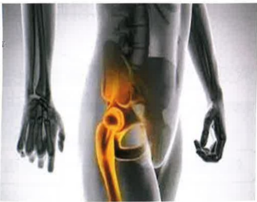
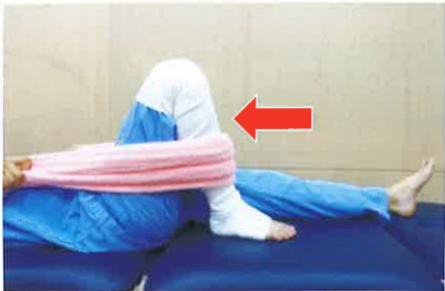
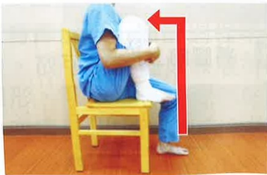
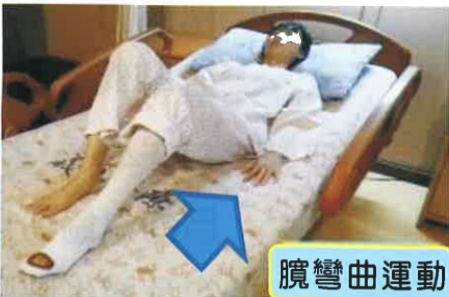
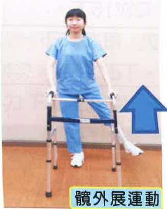
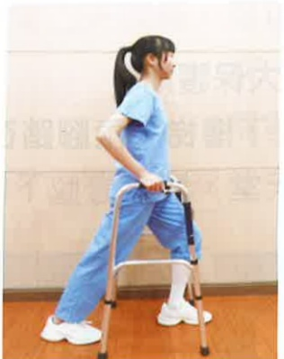
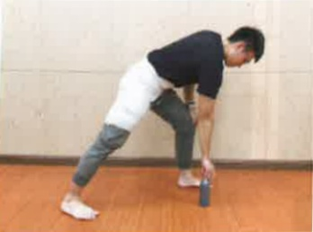
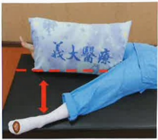

Yi Da Hospital  
Address: No. 1, Yida Road, Jiaosu Village, Yancheng District, Kaohsiung City  
Phone: 07-6150011  

Yi Da Cancer Treatment Hospital  
Address: No. 21, Yida Road, Jiaosu Village, Yancheng District, Kaohsiung City  
Phone: 07-6150022  

Yi Da Da Chang Hospital  
Address: No. 305, Da Chang Road, Sancheng District, Kaohsiung City  
Phone: 07-5599123  

This copyright is not allowed to be reproduced, printed, or resold without the consent of the copyright holder.  
Copyright Holder: Yi Da Medical Foundation  
Yi Da Medical Foundation 21X29.7cm Printed in 2024.06 Revised in 2024.02 HA-1-0173(2)  

# Understanding Care and Precautions for the RAO Joint Replacement  

## ~~Objective~~

I. My Care Team......1  
II. Understanding Hip Replacement Surgery......2  
1. Introduction......2  
2. What is Total Hip Replacement?......3  
3. Indications......3  
III. Hospitalization Process Introduction......4  
IV. Preoperative Preparation......5  
1. Preparation of Equipment......5  
2. How to Discontinue Anticoagulant Medications Before Surgery......6  
3. Preoperative Instructions......6  
4. Preoperative Rehabilitation Exercise Preparation......7  
V. Postoperative Care Guidelines......10  
1. Postoperative Limb Positioning and Care Instructions......10  
2. Catheter Placement Precautions......11  
3. Dietary Guidance......12  
4. Medication Use Throughout the Surgical Period......16VI. Pain Care .....17  
I. The Impact of Pain .....17  
II. Common Post-Operative Pain Relief Methods .....18  
III. Non-Pharmacological Methods to Alleviate Pain .....19  
IV. Common Questions About Pain .....19  
VII. Post-Operative Rehabilitation Exercises .....21  
I. On the Day of Surgery .....21  
II. First Day After Surgery .....22  
III. Second Day After Surgery .....23  
IV. Third Day After Surgery .....23  
V. From the Fourth Day After Surgery Onward .....24  
VI. Correct Methods for Using Walkers and Moving Up and Down Stairs .....25  
VII. Walking Activities .....26  
VIII. Wheelchair Position Changes .....27  
VIII. Fall Prevention .....28  
IX. Post-Operative Care and Precautions .....29  
I. How to Prevent Deep Vein Thrombosis .....29  
II. Wound Care After Returning Home .....30  
III. Post-Discharge Care Precautions .....32  
X. Home-Based Rehabilitation .....33  
XI. References .....38

## I. My Care Team (Applicable to: Yida Hospital)

| Position | Consultation Hours (Monday to Friday) | Consultation Phone | Night and Holiday Consultation Phone |
|---------|----------------------------------------|-------------------|--------------------------------------|
| Personal Care Manager | 08:30–16:30 | 07-6150011 ext. 5574, 257451 | 07-6150011 ext. 257099 (on-call nursing supervisor) |
| Physical Therapist | 08:00–17:00 | 07-6150011 ext. 257061 | 07-6150011 ext. 3711, 3712, 3721, 3722 (ward nursing staff) |
| Social Worker | 08:00–17:30 | 07-6150011 ext. 1332, 1339 | 07-6150011 ext. 257084 |
| Pharmacist | 08:00–17:00 | 07-6150011 ext. 257310 | 07-6150011 ext. 2130 (emergency pharmacy) |
| Nutritionist | 08:00–17:00 | 07-6150011 ext. 257739 | 07-6150011 ext. 257739 |
| Clinical Psychologist | 08:00–17:00 | 07-6150011 ext. 8585 | 07-6150011 ext. 2666 |
| Nurse | 7A Ward (three-shift rotation), 7B Ward (three-shift rotation) | 07-6150011 ext. 3711, 3712, 3721, 3722 | 07-6150011 ext. 3711, 3712, 3721, 3722 |

## Two. Understanding Total Hip Replacement

## One. Introduction

The hip joint is the joint connecting the pelvis and thigh, composed of the acetabulum and femoral head. It is a crucial joint for walking and daily movement. When the hip joint is damaged to the point of causing pain during walking and weakness in the affected limb, severe cases may result in difficulty walking. Initial outpatient management typically involves medication and physical therapy. If pain or deformity persists despite medication and rehabilitation, leading to impaired mobility, total hip replacement surgery is required.

Normal hip joint

Degenerated hip joint

Degenerated hip joint

Femoral head avascular necrosis

## Two. What is Total Hip Replacement?

A total artificial hip joint is designed to mimic the human hip joint structure and replace a diseased or damaged joint. It consists of an artificial acetabular component, an artificial femoral head, an artificial acetabular liner, and an artificial femoral stem. This construct provides a more stable hip joint, effectively reducing pain and improving joint mobility.

## Three. Indications

1. Congenital hip dysplasia  
2. Degenerative hip arthritis  
3. Rheumatoid hip arthritis  
4. Traumatic hip arthritis  
5. Avascular necrosis of the femoral head  
6. Femoral neck fracture

## 3. Introduction to Hospitalization Process (Applicable Hospitals: Yida Hospital)

## IV. Preoperative Preparation

## 1. Preparation of Equipment

## (1) Walker

It is recommended that patients get up and move as early as possible after surgery. Medical and nursing staff will teach patients how to use assistive devices to get out of bed.

## (2) Ice Pack

Used for icing the surgical wound post-operation to prevent swelling of the affected limb and alleviate pain.

## (3) Personal Medications

Please bring your regularly taken medications, along with the medication bottles and packaging, to the hospital on the day of admission and hand them over to the nursing staff. This will allow medical and nursing personnel to understand your medication history. If you are taking anticoagulant medications (such as anticoagulants or antiplatelet agents) or glucose-lowering medications (such as SGLT2 inhibitors), please follow the doctor's instructions to take or discontinue them, and proactively inform the medical and nursing staff.

(4) Medical Grade Compression Socks  
Worn after surgery, these socks can help prevent deep vein thrombosis in the lower limbs.

## (5) Signing of Relevant Consent Forms

✓ Surgical Consent Form  
✓ Anesthesia Consent Form  
✓ Pre-anesthesia Assessment Form  
✓ Self-paid Service Consent Form

## Two. How to discontinue anticoagulant medications before surgery?

Since anticoagulant medications prolong coagulation time, if you are scheduled for total joint replacement surgery, you should proactively inform your doctor about which anticoagulant medication you are currently taking. The surgical physician will assess whether preoperative discontinuation of the medication is necessary. You may also visit your original prescribing physician to confirm whether it is acceptable to discontinue the medication and for how long. Therefore, please follow your doctor's instructions regarding anticoagulant use and proactively inform medical staff of whether you have discontinued the medication and on what date. Do not discontinue the medication on your own, as this may lead to insufficient discontinuation duration and increased bleeding risk, or prolonged discontinuation leading to thromboembolic events.

## Three. Preoperative Information

1. Blood tests, chest X-ray, electrocardiogram, and pre-anesthesia evaluation will be completed on the day of admission.

2. To prevent aspiration pneumonia during surgery due to vomiting, patients must fast for 8 hours before surgery. Medical staff will inform you of the fasting time after 9 p.m. Fasting includes all food, water, and any chewable items such as chewing gum, betel nut, or candy.

3. On the day before or on the day of surgery, patients should bathe their affected limb and body.

4. Before surgery, the surgeon will mark the surgical site. Before entering the operating room, medical staff will perform local cleaning of the surgical site and cover it with a dressing.

5. The surgery typically lasts about 4–6 hours, depending on individual anesthesia methods and recovery time. For patients undergoing general anesthesia, a breathing tube will be placed in the throat during anesthesia to assist with breathing, which may cause throat discomfort or mild blood-tinged sputum. Drinking small amounts of warm water frequently can help alleviate these symptoms. However, if fresh blood is continuously coughed up, patients should immediately inform medical staff for assistance.

6. A family member must accompany the patient throughout the entire surgical procedure and during the transfer back to the hospital room.

## Four. Preoperative Rehabilitation Exercise Preparation

Exercise timing: Before surgery  
Exercise goals: Maintain joint flexion angle and improve muscle strength to facilitate smooth postoperative recovery  
Exercise frequency: Each movement is held for 5 seconds, repeated 15 times per set, with 4 sets per day.

## Quadriceps Muscle Strength Training

Training purpose: Enhance muscle strength on the affected side; it is recommended to perform the exercise on both sides  

Image showing tape wrapping of the limb as an illustration of the surgical affected side

Lying position: Lift the leg upward

## Sitting position: Extend the calf upward

## Standing position: Lift the foot upward

## Joint Flexion Angles

Training purpose: Improve circulation in the affected joint and maintain joint angles

Diagram showing the application of bandages on the limb for the surgical affected side

## Supine position: As much as possible, bend the thigh/leg, then slowly extend it

## Supine position with towel assistance: As much as possible, bend the thigh/leg, then slowly extend it

## Sitting position: As much as possible, bend the thigh/leg, then slowly place the foot back on the ground

## Strengthening upper arm muscle strength

Training purpose: Improve strength in both upper limbs, aiding postoperative repositioning and use of walkers

Use a fixed chair with a handrail, fully extend the elbows and lift the body, then slowly lower the body back to the chair seat

## Enhancing cardiovascular endurance

Training purpose: Improve cardiovascular endurance prior to surgery. Diagram showing the application of bandages on the limb for the surgical affected side

##  $ ^{※} $ Fixed bicycle for 10 minutes

$ ^{※} $ Bicycle height: Pedal all the way down, knees nearly fully extended

##  $ ^{※} $ Walking on a safe flat surface for 10 minutes

Physical therapist's friendly reminder: Be cautious for safety and prevent falls.  
Taiwan Medical Foundation, Rehabilitation Department, Physical Therapy Team, prepared## V. Postoperative Care Guidelines

## I. Postoperative Limb Positioning and Care Instructions

1. After surgery, we will assist you in naturally extending your legs outward and place a pillow (triangular pillow) between your legs to keep your feet apart, achieving at least a 30-degree external rotation of the hip joints to prevent dislocation.

2. To prevent swelling, pain, and impaired peripheral circulation in the affected limb, a pillow can be used to elevate the surgical leg, which helps reduce edema.

Lying Flat

Lying on Side

3. Apply ice to the surgical site to reduce pain and swelling. Frequently change the ice application site to avoid impaired blood circulation. Ice application should be stopped after bedtime.

4. To prevent postoperative fever and inadequate lung expansion, patients should perform deep breathing and coughing exercises regularly. Medical staff will assist in teaching patients to turn and pat their back every 2 hours (avoiding the waist and spine). Patients should also increase fluid intake—aiming for 2000–3000 ml per day (except for patients with fluid restrictions).

5. Raise the head of the bed by approximately 30–45 degrees to facilitate eating and prevent vomiting-induced aspiration.

## II. Tube Placement Precautions

## (1) Indwelling Catheter

1. For safety during postoperative activity, an indwelling catheter will be placed after surgery.

2. Medical staff will assess the appropriate time for catheter removal.

3. The catheter will be secured on the inner thigh (in females) or lower abdomen (in males).

4. The urine collection bag must be positioned below the bladder.  
Placing it above the bladder may lead to urine reflux and infection. The bottom of the bag should be at least 3 cm above the ground to avoid contact with the floor.

5. If you notice a persistent decrease in urine output or bladder pain, check whether the catheter is kinked and seek medical staff assistance for handling.

At least 3 cm above the ground

## (2) Drain Tube

1. A drain tube will be placed at the surgical site on the affected limb to drain blood and prevent hematoma formation.

2. During the period of tube placement, in addition to preventing dislodgement, the Y-shaped connector should be frequently squeezed. Ice application should be avoided over the drain tube to prevent blood clot formation and blockage.

3. You should turn frequently or get out of bed to move around, to facilitate drainage of blood. If the drainage tube rapidly swells, it may indicate excessive blood volume or air leakage in the tubing; please immediately inform the medical or nursing staff for assessment.

4. Since the drainage tube operates under negative pressure suction, it can be placed directly on the bed without needing to be hung at the bedside. However, it should be avoided from being folded back. When getting out of bed, you can secure the tube to your clothing to prevent pulling on the tubing and causing dislodgement.

5. The timing for removing the drainage tube varies depending on individual drainage volume. If removal is required, a physician will work together with a specialist nurse to assist with the procedure.

## Three: Dietary Guidance

1. After returning to the ward, if there are no symptoms such as dizziness or vomiting, adopt a gradual dietary progression: first try drinking a small amount of plain water. If no vomiting occurs, you may consume liquid foods (such as fruit juice) one hour later, followed by soft, easily digestible foods (such as porridge), and by the next day, you can return to normal eating. This gradual dietary progression helps prevent digestive discomfort caused by slowed intestinal motility due to anesthesia.

2. Eat more vitamin C-rich fruits such as kiwi, cherries, and grapes, as well as high-protein foods such as chicken, duck, fish, and beef, to promote wound healing. Also consume high-fiber foods such as green vegetables to prevent constipation.

3. Remember to eat in a semi-upright or sitting position, as eating while lying down increases the risk of aspiration and subsequent aspiration pneumonia.

## Nutritional Therapy Department Provides Post-Operative Dietary Reference Menus

## Post-Operative Dietary Reference Menu (1500 kcal)

| Supermarket | Salted Scallion Braised Pork Rice Box + Yemai Soy Milk |
|------------|--------------------------------------------------------|
| Salted Scallion Braised Pork Rice | Rice 37g (about 1/4 bowl), Braised Pork 10g |
| Yemai Soy Milk | 260ml (about 7/8 full), containing 15g sugar |

| Buffet | Rice with Braised Pork and Boneless Meat Meal |
|-------|------------------------------------------------|
| White Rice | 150g (3/4 bowl) |
| Pork Bone Fragments | 65g (about 2/3 of a palm) |
| Red Lotus Taro Stir-Fried Egg | 60g (half an egg, about 1/4 bowl of Red Lotus Taro) |
| Stir-Fried Large Cucumber | 58g (about 1/4 bowl of large cucumber) |
| Steamed Small Cucumber | 55g (about 1/4 bowl of small cucumber) |
| Bason | 160g (about 1/3 of a piece) |

| Meal Set | Dumpling Meal Set |
|---------|-------------------|
| Dumplings with Pickled Cucumber, Cold Cucumber with Radish Sauce, Cold Tofu, Cold Seaweed and Nori Soup, Dumpling Syrup, Apple (1 portion) | 60g (3/4 bowl), Vegetables 105g (1 bowl), Pork filling 70g (one palm), 3/4 bowl (8/10 full) |

Da Yuan Hospital Treatment and Rehabilitation Department## Post-surgery dietary reference meal plan 1600 kcal

| Meal Type | Traditional pancake with fresh milk |
|----------|-------------------------------------|
| Pancake | Pancake skin 150g (3/4 bowl) |
| Egg | 1 egg |
| Low-fat fresh milk | 280ml fresh milk |

<table border=1 style='margin: auto; width: max-content;'><tr><td style='text-align: center;'>Meal Plan</td><td style='text-align: center;'>Taiwanese braised pork rice set</td></tr><tr><td style='text-align: center;'>White rice</td><td style='text-align: center;'>150g (3/4 bowl)</td></tr><tr><td style='text-align: center;'>Pickled yellow gherkin</td><td style='text-align: center;'></td></tr><tr><td style='text-align: center;'>Cold-cured carrot strips</td><td style='text-align: center;'>Smoked vegetables 105g (1 bowl)</td></tr><tr><td style='text-align: center;'>Dried silk cold-salted kelp salad</td><td style='text-align: center;'></td></tr><tr><td style='text-align: center;'>Seaweed soup</td><td style='text-align: center;'></td></tr><tr><td style='text-align: center;'>Braised pork</td><td style='text-align: center;'>45g (1/3 to 2/3 palm)</td></tr><tr><td style='text-align: center;'>Egg</td><td style='text-align: center;'>One type of wine egg</td></tr><tr><td style='text-align: center;'>Apple</td><td style='text-align: center;'>120g (3/4 bowl or 8/10 full)</td></tr></table>

| Meal Plan | Half tendon, half meat beef noodle soup + tofu |
|----------|-----------------------------------------------|
| Noodles | 340g (after absorption rate) 3 servings (3/4 bowl) |
| Beef | 60g (2/3 palm) |
| Chinese cabbage | 24g (1/4 bowl) |
| Cold tofu salad | 90g (about 1/3 of a soft tofu box) |
| Kiwi | 120g (1.5 pieces) |

Fei Dai Zhi fa fa jie ye ye

## Post-surgery dietary reference meal plan 1800 kcal

| Breakfast Shop | Cheese egg toast + Yimi soy milk |
|---------------|----------------------------------|
| Yimi soy milk | 260ml, about 7/10 full (15g sugar) |
| Two slices of bread | 100g (one bowl of rice) |
| Romaine lettuce | 10g |
| Cheese | One slice of full-fat cheese |
| Fried scrambled egg | 1 egg |

<table border=1 style='margin: auto; width: max-content;'><tr><td style='text-align: center;'>Lunch Box Shop</td><td style='text-align: center;'>Authentic lunch box</td></tr><tr><td style='text-align: center;'>White rice</td><td style='text-align: center;'>200g (one bowl)</td></tr><tr><td style='text-align: center;'>Pork slices</td><td style='text-align: center;'>50g (about 1/3 to 2/3 palm)</td></tr><tr><td style='text-align: center;'>Five-spice bean curd</td><td style='text-align: center;'>42g (about 1/3 palm)</td></tr><tr><td style='text-align: center;'>Oiled egg</td><td style='text-align: center;'>60g (one egg)</td></tr><tr><td style='text-align: center;'>Stir-fried bok choy</td><td style='text-align: center;'>80g (about 3/4 bowl)</td></tr><tr><td style='text-align: center;'>Garlic stir-fried Chinese cabbage</td><td style='text-align: center;'>75g (about 3/4 bowl)</td></tr><tr><td style='text-align: center;'></td><td style='text-align: center;'>Orange 150g (1 piece)</td></tr></table>

Maximum wall thickness and surface thickness and groove depth have

| Lunch Box Shop | Creamy garlic salted fatty chicken meat set |
|---------------|---------------------------------------------|
| White rice | 200g (one bowl) |
| Chicken meat | 70g (one palm) |
| Water egg | Half an egg |
| Garlic stir-fried Qingjiang | 50g (half bowl) |
| Vegetables with black fungus | 50g (half bowl + a little egg) |
| Carrot and egg stir-fry | Kiwi 120g (1.5 pieces) |## IV. Medication Use Throughout the Surgical Period

## (I) Prophylactic Antibiotics

1. Surgical prophylactic antibiotics refer to the administration of antibiotics to patients before surgery, prior to wound contamination or infection, in order to prevent postoperative infections.

2. Possible side effects such as allergies or gastrointestinal discomfort—such as skin rash, itching, or diarrhea—should be reported immediately to the medical team if they occur.

## (II) Antithrombotic Medications

1. To prevent the development of deep vein thrombosis, the physician will assess the patient's condition and decide whether to prescribe antithrombotic medications (such as anticoagulants or antiplatelet agents) after surgery.

2. If you have a history of gastrointestinal bleeding or peptic ulcers, please inform the medical team in advance.

3. During medication use, if you are scheduled to undergo any surgical procedures, tooth extraction, endoscopy, or other procedures that may cause bleeding, please inform your doctor in advance about your current use of these medications.

4. While taking antithrombotic medications, be cautious during daily activities to avoid injury. Use a soft-bristled toothbrush and an electric razor when brushing teeth or shaving.

5. Possible side effects include gastrointestinal discomfort or bleeding reactions (such as hematoma at the surgical site, gingival bleeding, unexplained bruising, hematuria, melena, or black stools). If any bleeding symptoms occur, please visit the clinic immediately and inform the medical team.

6. If you have been receiving antithrombotic therapy prior to joint replacement surgery and have already discontinued the medication before surgery after discussion with your original prescribing physician, please discuss with your surgical physician regarding the timing of restarting antithrombotic therapy after surgery.

## VI. Pain Management

## I. The Impact of Pain

Pain is a subjective sensation of suffering, which may be continuous or intermittent, and may manifest as dull, sharp, or stabbing pain. Physiologically, patients may experience anxiety, insomnia, reduced appetite, tachycardia, elevated blood pressure, and endocrine dysfunction. Pain may also reduce respiratory rate (especially in upper abdominal or thoracic surgeries, where pain intensifies with breathing), lead to reluctance to get out of bed and thus cause inadequate lung expansion, increasing the risk of venous thromboembolism and other complications, ultimately delaying discharge.

Only you can describe your pain. Be brave and tell your doctor or nurse about your pain concerns. With correct expression and assessment methods, 90% of pain can be effectively relieved.

## What You Can Do:

1. You can describe the location of your pain or point to the area with your hand.

2. Inform the medical staff when your pain first started, how often it occurs, and how long each episode lasts.

3. Clearly describe the sensation of your pain—for example, dull, sharp, or stabbing pain?

4. Inform the medical team whether your pain has affected your daily routine—for example, inability to sleep.

5. Express your pain score accurately. We recommend using a "Pain Assessment Scale" to describe your pain: 0 points means no pain, and 10 points represents unbearable pain.## II. Common postoperative pain relief methods

## Say "pain" boldly — refuse postoperative pain

## Common postoperative pain relief methods include the following:

**Oral medication**: For mild pain, take medication as instructed by your doctor. Even if you currently feel no pain, continue taking the medication to achieve better pain control.

## Intramuscular or intravenous injection (non-steroidal or morphine-based analgesics):

Individuals vary in their pain tolerance and drug absorption, and the duration is limited. These medications must be administered at fixed intervals as directed by your doctor, or used for sudden, acute pain.

**Multimodal analgesia**: The anesthesiologist evaluates and selects the appropriate administration method and route. Medication can be delivered via machine, intravenously, or locally, with safe dosing and locked-in timing to allow patients to choose their preferred method.

**Nerve block procedure**: Under ultrasound guidance, the exact location of the nerve is precisely identified, and local anesthetic is injected around the nerve to temporarily numb it, providing pain relief for 6–8 hours. The affected limb may experience numbness, tingling, or muscle weakness, which will resolve once the drug effect wears off.

## III. Non-pharmacological methods to alleviate pain

1. Distract yourself from pain through activities such as listening to music, playing cards, or going for a walk.  
2. Maintain a relaxed and positive mindset — for example, having companionship from family or friends can provide psychological support and help reduce your perception of pain.  
3. Position your body in the posture that feels most comfortable to you.  
4. Use religious beliefs, such as chanting or praying, to shift your focus away from pain.  
5. Ask your treating physician whether cold or hot compresses can help reduce pain.  
6. When pain becomes unbearable, inform medical staff and request adjustments to your analgesic medication.

## IV. Common questions about pain:

1. Using analgesics does not affect wound healing; in fact, pain relief helps patients get out of bed earlier, which promotes wound healing.  
2. Side effects of analgesics: such as skin itching, dizziness, nausea, and vomiting can be improved by adjusting the dosage.  
3. Self-controlled analgesia: The goal is to use the minimal effective dose of medication so that patients do not feel pain while resting in bed. However, some pain may still be felt during intense coughing or movement, but the pain will be significantly reduced.4. Duration of patient-controlled analgesia (PCA): Pain will gradually decrease 2–3 days after surgery. Oral analgesics can then be used instead, and PCA can be discontinued.

5. Differences between patient-controlled analgesia (PCA) and traditional analgesia:

(1) PCA delivers medication continuously through a machine; patients can press a button themselves when experiencing severe pain to reduce discomfort.

(2) Traditional analgesia is administered only when pain becomes unbearable; the medication starts working after 30 minutes and lasts for 4–6 hours.

6. The anesthesiologist will set the dosage and timing of PCA based on the patient's individual conditions. The dosage will be adjusted during the use period according to the patient's condition, so there is no risk of addiction or overdose.

7. The anesthesiologist will assess the patient's condition. If the patient shows signs of altered consciousness, low blood pressure, hypovolemia, or septic shock, PCA will not be administered.

8. Traditional analgesia is covered by the public health insurance; PCA is not covered and must be paid for out-of-pocket.

## Rehabilitation Exercises After Surgery

Following the rehabilitation exercises guided by a physical therapist can effectively improve functional recovery.

Video Tutorial

## One: On the Day of Surgery

1. Ice application: 4 times per day, each session for 15 minutes.

2. Foot dorsiflexion exercises: 4 times per day, 15 repetitions each. Lie flat, extend both legs, lift the sole of the foot upward for 5 seconds, then press it down for 5 seconds. This helps improve peripheral circulation and reduce swelling in the distal extremities of the operated foot.

3. Gluteal muscle exercises: 4 times per day, 15 repetitions each.

Performed in a supine position.

This helps maintain gluteal muscle strength in the operated leg, preparing the patient for standing.

4. Breathing exercises: 4 times per day, 15 repetitions each.

This helps eliminate anesthetic drugs and strengthens respiratory muscles.

5. As appropriate, gradually elevate the head of the bed, sit at the edge of the bed, or assist with wheelchair transfer (as described on page 27)

Arm abduction exercise

## Two. Day One After Surgery

1. Ice敷: 4 times per day, each session for 15 minutes.

2. Dorsiflexion exercise: 4 times per day, 15 repetitions each time.

3. Ankle circling exercise: 4 times per day, 15 repetitions each time.

4. Quadriceps and lateral tibial muscle exercises:

Elastic sock showing the surgical limb illustration

4 times per day, 15 repetitions each time. Place the operated foot flat on the ground, put a rolled towel at the knee area, press down on the towel, hold for 5 seconds, then release. Purpose: to enhance muscle strength.

Elastic sock showing the surgical limb illustration

Elastic sock showing the surgical limb illustration

5. Hip abduction and hip flexion exercises: 4 times per day, 15 repetitions each time. Abduct and flex the operated foot. Purpose: to improve blood circulation and joint range of motion in the operated leg.

Elastic sock showing the surgical limb illustration

Elastic sock showing the surgical limb illustration

6. Sitting at the edge of the bed: 4 times per day, each session for 5 minutes. Purpose: to gradually improve physical endurance.

7. Use of walker for walking within the hospital room, or assist with wheelchair transfer as described on page 27.

## Three. Day Two After Surgery

1. Ice敷: 4 times per day, each session for 15 minutes.

2. Dorsiflexion exercise: 4 times per day, 15 repetitions each time.

3. Ankle circling exercise: 4 times per day, 15 repetitions each time.

4. Quadriceps and lateral tibial muscle exercises: 4 times per day, 15 repetitions each time.

5. Hip abduction and hip flexion exercises: 4 times per day, 15 repetitions each time.

6. Hip flexion exercise: 4 times per day, 15 repetitions each time.

7. Hip extension exercise: 4 times per day, 15 repetitions each time.

Elastic sock showing the surgical limb illustration

Elastic sock showing the surgical limb illustration

8. Using a walker for walking: 4 times per day, each session for 5 minutes. Purpose: to improve physical endurance and lower limb muscle endurance. Walker usage as described on page 25.

9. Assist with wheelchair transfer as described on page 27.

## Four. Day Three After Surgery

1. Ice敷: 4 times per day, each session for 15 minutes.

2. Dorsiflexion exercise: 4 times per day, 15 repetitions each time.

3. Ankle circling exercise: 4 times per day, 15 repetitions each time.

4. Quadriceps and lateral tibial muscle exercises: 4 times per day, 15 repetitions each time.5. Hip abduction and hip flexion exercises: 4 times daily, 15 repetitions each time.

6. Hip bending and hip extension exercises: 4 times daily, 15 repetitions each time.

7. Hip abduction exercises: 4 times daily, 15 repetitions each time.

8. Seated knee extension exercises: 4 times daily, 15 repetitions each time.

Illustration of elastic sock applied to the surgical limb

Illustration of elastic sock applied to the surgical limb

9. Using a walker for walking: 4 times daily, 5 minutes each time. Improves physical fitness and lower limb muscle endurance. Walker usage is as described on page 25.

## Five. After Day 4 Post-Operation

1. Ice application: 4 times daily, 15 minutes each time.

2. Dorsiflexion exercises of the foot: 4 times daily, 15 repetitions each time.

3. Ankle circling exercises: 4 times daily, 15 repetitions each time.

4. Quadriceps and hamstring exercises: 4 times daily, 15 repetitions each time.

5. Hip abduction and hip flexion exercises: 4 times daily, 15 repetitions each time.

6. Hip bending and hip extension exercises: 4 times daily, 15 repetitions each time.

7. Hip abduction exercises: 4 times daily, 15 repetitions each time.

8. Seated knee extension exercises: 4 times daily, 15 repetitions each time.

9. Hamstring group stretching exercises of the thigh: 4 times daily, 15 repetitions each time.

10. Gastrocnemius and soleus muscle group stretching exercises of the lower leg: 4 times daily, 15 repetitions each time.

Hamstring group stretching exercise

Illustration of elastic sock applied to the surgical limb

Gastrocnemius and soleus muscle group stretching exercise

Illustration of elastic sock applied to the surgical limb

11. Using a walker for walking: 4 times daily, 5 minutes each time. Improves physical fitness and bilateral lower limb muscle endurance. Walker usage is as described on page 25.

## Six. Correct Methods of Using a Walker for Walking and Ascending/Descending Stairs

1. Walker walking exercises

Illustration of elastic sock applied to the surgical limb### 2. Correct Way to Go Up and Down Stairs

(1) The first 1–3 months after surgery is the period of maximum protection for the affected limb.

(2) Please follow the principle of using the healthy limb to go up the stairs and the affected limb to go down the stairs, with both feet stepping on the same step (mnemonic: "Good people use the healthy limb to go to heaven; bad people use the affected limb to go to hell").

Diagram showing the wrapping of the limb for the surgical affected side

## Seven. Walking Activities

1. On the first day after surgery: Encourage the patient to remain in a semi-sitting position (approximately 70°–90°) as much as possible to prevent postural hypotension when getting up from bed. Gradual mobilization should be adopted: first raise the bed, wait for 10 minutes without discomfort, then sit at the edge of the bed for 5–10 minutes. If no dizziness or discomfort occurs, assist the patient in standing with a walker under supervision. Only after confirming no dizziness during standing should the patient use a walker to walk within the ward.

2. From the second day after surgery onwards: The patient can walk with a walker on the hospital corridor, four times per day, each session lasting 5 minutes. After activity, the affected limb should be elevated and ice-cold compress applied to help reduce swelling.

3. The use of a walker should be maintained for at least 6–8 weeks to prevent excessive weight-bearing on the bone before it has fully healed.

## Eight. Wheelchair Transfers

Diagram showing the wrapping of the limb for the surgical affected side

1. When standing up or sitting down, the operated foot should extend forward, with the healthy leg behind.

2. When standing up, press down with both hands to lift the body upward, avoiding excessive forward leaning.

3. After standing, move both hands to the walker handles for support.

4. During transfers, ensure that the wheelchair or bed is within the range that can be reached when sitting.## 8. Preventing Falls

Falls can be prevented. With just a few simple changes, you can avoid falling into a fall-related crisis. Please note: **NEVER get out of bed alone!!**

Regularly practice strength, flexibility, and body balance

Essential limb movements are essential

Bedside rehabilitation exercises

Five-point grounding bed rehabilitation exercises

## Always pay attention to environmental safety

When getting out of bed, lower the electric bed to its lowest position

When leaving the bed, pull up both bed rails

Ensure indoor lighting is bright

Choose appropriate shoes and assistive devices

Be mindful of the effects and side effects of medications you are currently taking, as they may contribute to fall risks

Know the six-word mantra

Methods of using assistive devices

## 9. Postoperative Care and Precautions

## 1. How to Prevent Deep Vein Thrombosis (DVT)

Avoid prolonged sitting or standing. When lying in bed, avoid long-term pressure on the lower limbs. Do not maintain any posture for too long—such as crossing legs while standing, wearing tight clothing. Maintain a healthy body weight, drink adequate fluids, follow a low-fat diet, engage in appropriate physical activity, and avoid smoking.

If medical compression stockings are required after surgery, follow these principles:

1. Wear them for at least 3 days after surgery  
2. Put them on before getting out of bed in the morning, and remove them when bathing at night (recommended: wear for 8 hours per day, for one month)  
3. Hand-wash and lay flat to dry  
(Do not use a dryer or hang to dry in direct sunlight)

## 2. Wound Care After Returning Home

### 1. Wash hands before and after touching the wound.

2. Wound disinfection or cleaning should be performed from inside to outside, without back-and-forth wiping. The disinfection area should extend 5 cm beyond the wound margin. When changing the dressing, try to minimize the exposure of the wound to air.

3. Change the dressing once daily (it can be done after bathing). However, if the gauze becomes soaked with blood, gets accidentally wet, or falls off, the dressing must be changed immediately.

4. Keep the wound and gauze clean and dry. Avoid bathing the wound, and prefer using a wiping method instead.

5. Items needed for dressing change preparation:

(1) 20 ml normal saline solution: discard after single use

(2) 4×4 gauze

(3) sterile cotton swabs

(4) water-soluble povidone-iodine: shelf life is one week after opening.

(5) 3M paper tape: if allergic to paper tape, choose a non-allergenic adhesive tape instead)

(6) 6-inch elastic bandage (can be washed and reused).

### 6. Wound care steps:

1. Wash hands with hand soap or soap.

3. Use a normal saline cotton swab to clean the wound, wiping in a circular motion from the center of the wound outward, gradually expanding to a diameter greater than 5 cm beyond the wound perimeter, avoiding back-and-forth wiping.

5. When opening the gauze dressing, avoid touching the inner surface of the packaging. Grasp one corner of the gauze and pull it out, align it with the center of the wound, cover the wound, and do not move it again. Secure it with adhesive tape.

2. Remove the dressing and inspect the wound

4. Use a water-soluble povidone-iodine cotton swab to disinfect the wound, wiping in a circular motion from the center of the wound outward, gradually expanding to a diameter greater than 5 cm beyond the wound perimeter, avoiding back-and-forth wiping.

6. Follow the doctor's instructions for applying elastic bandages and wearing compression stockings.## Three. Precautions for Home Care

1. Continue performing rehabilitation exercises taught in the hospital every day after returning home.

2. Keep the wound as dry as possible. If redness, swelling, or abnormal exudate occurs, seek medical evaluation promptly.

3. Avoid friction or impact to the wound and intense physical activities (such as running or jumping). Adhere to the activity restrictions instructed by your doctor.

4. A walking aid must be used for 6 to 8 weeks post-surgery until your doctor, during follow-up visits, deems it safe to resume normal activities. Prevent falls during this period.

5. After prolonged periods of standing or getting up from bed, blood circulation in the affected limb may slow down, leading to swelling in the feet. Therefore, elevate the affected limb and apply ice to the wound after getting up to help reduce swelling.

6. The following activities must be approved by your doctor before being performed: driving, half-squatting, lifting heavy objects (over 3 kilograms), long-distance walking, or hiking.

7. When passing through security gates, the machine may alert you that you are carrying metal. You may explain the situation to the security officer or provide a hospital surgical certificate.

8. For internal or external metallic implants such as artificial joints, deep heat therapy (e.g., shortwave) is strictly prohibited, as excessive heat concentration may cause burns.

9. If you have a cold or infection in another area, or require dental treatment, inform your doctor about the presence of a prosthetic joint so that the doctor can appropriately adjust medication.

10. When can the wound be exposed to water? Only after your doctor has advised that the wound is safe to be exposed to water can you take a shower.

11. Seek immediate medical follow-up if any of the following occur:

(1) The wound has not healed after a long time, with persistent exudate, odor, or continuous bleeding.

(2) The wound shows redness, warmth around the skin, or severe pain that does not improve.

(3) A fever persists above 38.5°C.

## Ten. Home Rehabilitation

(1) Precautions: For the first three months after surgery, maintain correct daily postures and avoid hazardous movements.

Position when getting in and out of bed

Joints should not bend beyond 90 degrees

Feet should not cross each other

The operated foot should not be excessively twisted

Standing up and sitting down

Use both hands to support the handrail

Joints should not bend beyond 90 degrees

Hold the walking aid firmly while walking## (二) Sitting posture for putting on pants

|  |  |  |
|---|---|---|
|  |  |  |
| 1. Roll the pant legs first | 2. Place the pants at the side of the leg | 3. Insert through the leg opening |
|  |  |  |
| 4. Do not twist the hip joint | 5. Move the leg opening forward to align | 6. Lift the buttocks to fully put on the pants |

## (三) Helpful reminders: Common mistakes below:

|  | Correct posture | Dangerous actions |
|---|---|---|
| Joint not bent beyond 90 degrees |  |     |
|  |  |  |
| Feet not crossed and not excessively twisted |  |     |
| [F20]  |  |     |## (Four) Home Rehabilitation Exercises:

Exercise purpose: Gradually increase hip joint range of motion and strength,  
and restore daily activities as early as possible  

Exercise prescription: Maintain for 10~15 seconds. Perform 15 repetitions daily, four times a day  

## Warm-up Exercises  

  

  

  

Hip joint exercises
  

| Hip Flexion Exercise | Hip Extension Exercise | Hip Abduction Exercise |
|----------------------|------------------------|-------------------------|
|  |  |  |
| Hamstring stretch | Gastrocnemius stretch | Straight leg raise exercise |
|  |  |  |

## Gentle Exercises  

| Foot dorsiflexion exercise | Knee extension exercise |
|----------------------------|--------------------------|
|  |  |
| Assisted walking with walker (1) Move walker forward (2) Lead with the affected leg (3) Follow with the other leg |  
|  |  |

## Precautions:

(1) After returning home, it is recommended to perform home rehabilitation exercises four times a day, each session lasting about 30 minutes.  

(2) For each exercise, maintain a duration of 5~15 seconds based on the recovery status of the surgical site.  

(3) After each exercise, apply ice for 10~15 minutes, and take prescribed medications as directed by your doctor to effectively control pain in the affected leg, which will lead to better rehabilitation outcomes.  

(4) If intense pain occurs during exercise, seek medical attention immediately and receive appropriate medical treatment.  

(5) For 6~8 weeks post-surgery, use a walker to walk, to prevent falls, until your doctor during outpatient follow-up deems it safe to resume normal activities.  

(6) Within three months post-surgery, when going up stairs, lead with the unaffected leg; when going down stairs, lead with the affected leg to protect the surgical site. Refer to page 26 of the health education booklet for reference.  

Going up and down stairs carries a risk of falling; it is recommended that family members accompany the patient.## Eleven. References

1. Lin Xiao, Wu Cui'e, Li He-hui, Qiu Piao-yi, Luo Xiao-fen (2020). Nursing care for patients with bone, muscle, and joint diseases. Edited by Hu Yuejuan. External and internal medicine nursing, Volume 2 (6th edition, pp. 909–911). Hua Xing.

2. Yuan Sujuan (2020). Nursing care for musculoskeletal disorders. Edited by Liu Xue'e. Adult internal and external medicine nursing, Volume 2 (8th edition, pp. 569–572). Hua Xing.

3. American Academy of Orthopaedic Surgeons (AAOS). (2022, February). Total Hip Replacement Exercise Guide.  
https://orthoinfo.aaos.org/en/recovery/total-hip-replacement-exercise-guide/

4. Gabbert, T., Filson, R., Bodden, J., & Coppola, C. (2019). Summary: NAON's Best Practice Guideline, Total Hip Replacement (Arthroplasty). Orthopaedic Nursing, 38(1), 4–5. http://doi.org/10.1097/NOR.0000000000000520

5. Shapira, J., Chen, S.L., Rosinsky, P.J., Maldonado, D.R., Lall, A.C., & Domb, B.G. (2021). Outcomes of outpatient total hip arthroplasty: a systematic review. Hip International: The journal of clinical and experimental research on hip pathology and therapy, 31(1), 4–11. http://doi.org/10.1177/1120700020911639

6. Zhao, J., & Davis, S. P. (2019). An integrative review of multimodal pain management on patient recovery after total hip and knee arthroplasty. International Journal of Nursing Studies, 98, 94–106. https://doi.org/10.1016/j.ijnurstu.2019.06.010