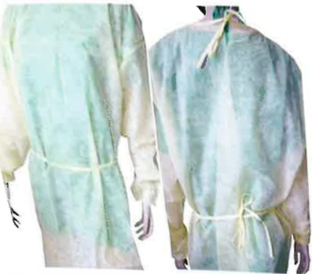
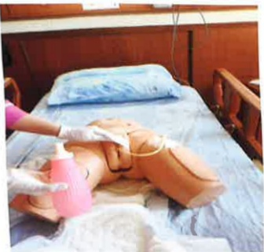

## E-DA HEALTHCARE GROUP - Educational Handbook for Intensive Care Unit

## 我大醫療財團法人 E-DA HEALTHCARE GROUPIntroduce yourself proactively and wear an identification badge, which can be found on the name tag outside the ward to identify the nursing staff responsible for the three shifts.

## 03003 3A03

Day shift:
Late night shift:
Night shift:

## Visiting Principles:

To ensure effective infection control, visiting times will be limited, and the number of visitors per visit will be restricted. Isolation protective measures such as wearing isolation gowns, masks, and handwashing must be strictly implemented to prevent cross-infection. Even if visits are delayed, a total of 30 minutes of visiting time will still be provided.

## Thorough handwashing to prevent infection

Foot movement—

Palms facing each other, rubbing hands together

Backs of both hands, fingers interlaced, rubbing together

Step three:

Hearts of both hands, fingers interlaced, gripping and rubbing

Step four: Fingers of both hands interlocked and rotated to rub

Step five: Thumbs of both hands, rotated to rub against each other

Step six: Palms facing each other, fingers rotated to rub

When entering the intensive care unit, please turn off your mobile phone, as patients have many tubes and devices that are susceptible to electromagnetic interference. Please also ensure that you and your family understand the purpose and importance of post-operative tubes and devices. Do not move the patient on your own, and protective restraints will be applied if necessary.

## Pain Care:

Postoperative wounds and catheter placement may cause pain and discomfort. Medical and nursing staff conduct hourly pain score assessments and appropriately administer analgesics to alleviate pain and discomfort.

Pain Assessment

One

Injections, oral analgesics

## Fall Prevention:

Use bed rails when patients are bedridden. For high-risk fall patients in intensive care units, enhance signage.

## Prevention of Incontinence-Related Skin Inflammation and Pressure Injuries:

Patients with acute critical illnesses and the elderly are prone to incontinence-related skin inflammation and pressure injuries due to their physiological conditions. Proper prevention of incontinence-related skin inflammation and pressure injuries can reduce the incidence of such complications.

Long-lasting skin protectant

Dry-cleaning skin cleanser

Pain-free protective film

Foam dressing## Urinary Care:

Most surgical intensive care unit (ICU) patients require catheters due to surgical needs, the need for close monitoring of urine output, or acute urinary retention. Inappropriate catheter care can lead to infection, so the perineal area and catheter should be cleaned daily.

1. Place the commode or diaper beneath the patient's buttocks and use a water bottle to flush water.

2. Apply soap water or body wash to the patient's urethral opening, perineal area, and upper segment of the catheter, then rinse thoroughly with clean water.

3. Dry the patient's urethral opening, perineal area, and upper catheter segment with a damp wipe.

4. Assist the patient in changing to a clean diaper or clothing.

5. The urine collection bag should be positioned below the bladder, with the bag opening at least 3 cm above the ground. The opening should be kept closed at all times, and the urine in the bag should be emptied when it reaches 1/2 to 2/3 full.
Surgical postoperative catheter placement diagram:

E-DA HEALTHCARE GROUP  
E-DA HOSPITAL  

Hospital Address: No. 1, Yida Road, Zhongzheng District, Kaohsiung City  
Hospital Switchboard: (07) 615-0011  

E-DA ADDICTION TREATMENT HOSPITAL  

Hospital Address: No. 21, Yida Road, Suzhou District, Kaohsiung City  
Hospital Switchboard: (07) 615-0022  

E-DA DA CHANG HOSPITAL  

Hospital Address: No. 305, Da Chang Road, Simei District, Kaohsiung City  
Hospital Switchboard: (07) 559-9123  

This copyright shall not be reproduced, duplicated, or resold without the consent of the copyright holder.  
Copyright Holder: E-DA HEALTHCARE GROUP  
Form Number: HA10185(2)  
Printed in January 2025 | Revised in 2025.01