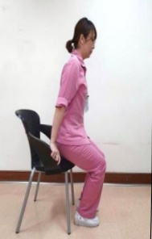
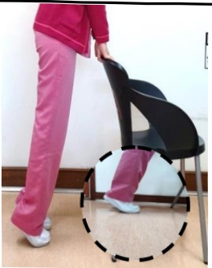

# Sarcopenia - Care Considerations

## ● What is sarcopenia?

Often referred to as the invisible killer of elderly disability, the risk of developing sarcopenia increases with age. It can easily lead to falls, fractures, disability, institutionalization, and even higher mortality rates among older adults.

## ● Characteristics of sarcopenia?

Persistent feeling of weakness, inability to walk or stand for long periods, frequent falls, poor grip strength, and in severe cases, complete disability and inability to perform daily living activities.

## ● How to prevent and manage sarcopenia?

1. Regular exercise and fall prevention: Resistance training is particularly effective, such as using dumbbells, water bottles, or elastic bands for strength training. Other options include brisk walking, jogging, swimming, and tai chi.

Pushing against a wall to perform a push-up  
(Strengthens arms and core muscles)

Standing up from a seated position  
(Strengthens lower limb and arm muscles)

Raising both arms  
(Strengthens arm muscles)

Seated leg lift  
(Strengthens lower limb muscles)

Pointing toes and lifting heels  
(Trains the muscles on the front and back of the lower legs, balance, and coordination)

※ Note: Please use a stable and firm chair. Each movement should be held for 5–10 seconds, performed 10–15 times per set, with 2–4 sets per day. It is recommended to perform these exercises at least 3 days per week.### 2. Nutritional Supplementation:

| Nutrient | Daily intake should be 1–1.5 grams per kilogram of body weight to reduce muscle loss (except for chronic kidney disease patients who need to limit protein intake), and the protein intake should be evenly distributed across three meals (e.g., for a person weighing 60 kg, daily protein intake should be 60–90 grams). ➢ Examples: dairy products, eggs, soy products (soy milk, tofu, soybean paste), meat (fish, chicken, pork, beef). ➢ For elderly individuals with poor dental health, steamed eggs, steamed fish, tofu, ground meat, or meat added to rice dishes are recommended. |
|----------|----------------------------------------------------------------------------------------------------------------------------------------------------------------------------------------------------------------------------------------------------------------------------------------------------------------------------------------------------------------------------------------------------------------------------------------------------------------------------------------------------------------------------------------------------------------------------------------------------------------------------------------------------------------------------------------------------------------------------------------------------------------------------------------------------------------------------------------------------------------------------------------------------------------------------------------------------------------------------------------------------------------------------------------------------------------------------------------------------------------------------------------------------------------------------------------------------------------------------------------------------------------------------------------------------------------------------------------------------------------------------------------------------------------------------------------------------------------------------------------------------------------------------------------------------------------------------------------------------------------------------------------------------------------------------------------------------------------------------------------------------------------------------------------------------------------------------------------------------------------------------------------------------------------------------------------------------------------------------------------------------------------------------------------------------------------