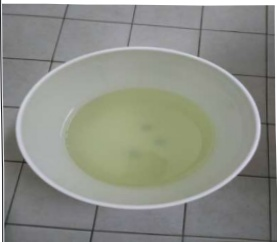

# Notes on the Use of Peritoneal Dialysis Drainage Bucket

I. Handling Procedure When the Dialysis Fluid in the Drainage Bucket Appears Cloudy:

1. First assess whether there is abdominal pain or discomfort.

2. Confirm whether the drainage bucket is cleaned regularly.

3. First drain 200cc of dialysis fluid that has been retained in the abdomen for at least 2 hours to observe. If cloudiness is observed, immediately contact the peritoneal dialysis nurse and go to the hospital for further drainage and examination.

## II. Results of Unwashed and Washed APD Drainage Buckets:

| Condition                  | Result                                                                 |
|---------------------------|------------------------------------------------------------------------|
| Drainage bucket not cleaned |     Dialysis drainage fluid appears cloudy |
| Drainage bucket cleaned   |    Dialysis drainage fluid appears very clear |## Three. Cleaning Methods for Peritoneal Dialysis Drainage Bucket:

| Frequency | Method | Illustration |
|----------|--------|--------------|
| Daily | If the blue sticker on the bottom of the drainage bucket falls off: 1. Obtain a new blue sticker from the peritoneal dialysis room and reattach it. You can use transparent tape to secure it, making it less likely to fall off. 2. You may also attach other patterned stickers or write or draw with oil-based markers. |  |
| Daily | After cleaning, allow the drainage bucket to air-dry naturally. Do not expose it to direct sunlight, as this may cause the bucket to crack.  | Cleaning tools: sponge or soft brush  |
| Weekly | Clean the interior of the drainage bucket at least once a week using dish soap.  |  |
| Monthly | Soak the drainage bucket in bleach solution at a ratio of 1:100. Mix 10 ml of bleach with 1 liter of clean water. Soak for at least 30 minutes. Place the lid into a basin containing the diluted bleach solution, ensuring the entire lid is submerged. |  |

Source: Internal unit decision after review by supervisor

| | | Contact Information |
|---|---|---|
| Yida Hospital: Address: No. 1, Yida Road, Jiaoshu Village, Yancheng District, Kaohsiung City. Phone: 07-6150952 | Yida Cancer Treatment Hospital: Address: No. 21, Yida Road, Jiaoshu Village, Yancheng District, Kaohsiung City. Phone: 07-6150022 | Yida Dachang Hospital: Address: No. 305, Dachang Road, Sancheng District, Kaohsiung City. Phone: 07-6150208 |