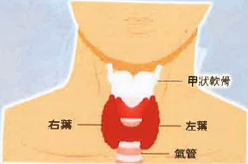

### 4. Voice hoarseness persists without improvement.

## Six. References

Chiang, F. Y. (2018). *Thyroid Surgery ABC – Guidelines for Thyroid and Parathyroid Surgery Patients (1st Edition)*. Jinming Publishing.

Liu, X. E. (2018). *Adult Internal and External Nursing (Volume II) (7th Edition)*. Huaxing Publishing.

Chen, Q. C., & Huang, L. Q. (2008). Common thyroid diseases. *Primary Medical Journal*, 23(3), 70–75. https://doi.org/10.6965/PMCFM.200803.0070

This copyright is not allowed to be reproduced, reprinted, or resold without the permission of the copyright holder.

Copyright Holder: Yida Medical Foundation

Yida Medical Foundation, 21*29.7 cm

Newly established in 2023, printed in March 2024, HA-1-0219(1)

Yida Hospital  
Address: No. 1, Yida Road, Jiaosu Village, Yancheng District, Kaohsiung City  
Phone: 07-6150011  

Yida Cancer Treatment Hospital  
Address: No. 21, Yida Road, Jiaosu Village, Yancheng District, Kaohsiung City  
Phone: 07-6150022  

Yida Da Chang Hospital  
Address: No. 305, Dachang Road, Sancheng District, Kaohsiung City  
Phone: (07)559-9123  

Thyroid Surgery  
Postoperative precautions  

## One. Definition (Location and Function of the Thyroid Gland)

The thyroid gland resembles a butterfly, located in the front of the neck, below the Adam's apple, and encircling the trachea. The two wings of the butterfly represent the left and right lobes of the thyroid gland (as shown in the figure below). The thyroid is one of the body's major endocrine organs and secretes thyroid hormones, which promote metabolism in various tissues throughout the body.

Figure: Location of the Thyroid Gland

Source: https://www.top1health.com/article/88910 (Top1 Health)

## Applicable Population

If nodules or tumors are detected in thyroid tissue, surgical intervention may be required. The following surgical procedures are available:

- Partial thyroidectomy: Only a portion of the thyroid gland is removed.  
- Unilateral thyroidectomy: One entire lobe of the thyroid gland is removed.  
- Near-total thyroidectomy: Most of the thyroid tissue from both lobes is removed.  
- Total thyroidectomy: The entire thyroid gland (including both lobes and the isthmus) is removed. This is commonly used to treat thyroid cancer, as well as a few cases of multinodular goiter and Graves' disease.  
- Neck lymph node dissection: Lymph nodes and surrounding tissues in the neck area are removed, often performed in conjunction with total thyroidectomy to achieve the goal of treating thyroid cancer.

## Three. Postoperative Care Instructions

Hospitalization duration after surgery is approximately 4–5 days. Patients are generally free to resume normal activities, but should be cautious when getting up from bed and watch for signs of dizziness to avoid falls.

## (1) Dietary Guidelines:

After receiving instructions from the nurse, patients should first try drinking water to ensure no nausea or discomfort before beginning to eat. Hot foods should be avoided; cold liquids such as ice cream or cold milk should be consumed initially to reduce pain at the surgical site. Soft foods may be introduced the following day. If vomiting occurs after surgery, the head should be tilted to one side to prevent aspiration and subsequent pneumonia.

## (2) Wound Care:

1. Ice packs may be applied to the wound as directed by the physician to reduce swelling and pain.  
2. After surgery, patients should maintain a semi-Fowler’s position (head of the bed elevated at 45 degrees) to facilitate breathing and reduce laryngeal edema.  
3. A drainage tube may be placed at the surgical site depending on the condition, serving to drain blood from the wound. The drainage system should remain unobstructed and should not be pulled or manipulated.  
4. To prevent pain caused by pulling on the wound during neck movement, avoid excessive neck bending or stretching. When changing positions, use both hands to support the head to reduce discomfort. A pillow may also be used to support the head and prevent pulling on the wound.  
5. The surgical wound is closed with absorbable sutures and covered with cosmetic adhesive, so no suture removal is required.

## Four. Common Complications

If any of the following symptoms occur, patients should immediately inform medical staff:

1. Respiratory difficulty: This may result from postoperative bleeding leading to hematoma, tracheal softening and collapse, laryngeal edema, mucus obstruction, or injury to the recurrent laryngeal nerve. The thyroid has rich blood supply, so although hematoma is rare, it can lead to respiratory distress. Therefore, breathing should be closely monitored within the first 24 hours after surgery.

2. Recurrent laryngeal nerve palsy: This may cause hoarseness and difficulty swallowing liquids, leading to aspiration. Therefore, voice function is checked after surgery to ensure normal speech.

3. Hypocalcemia: This is primarily due to dysfunction of the parathyroid glands after surgery. Patients may feel numbness in their fingers and lips; in severe cases, numbness and muscle twitching may occur in the hands and feet. These symptoms can be improved with calcium supplements and vitamin D.

4. Thyroid storm: Common symptoms include a sudden rise in body temperature above 39°C postoperatively, tachycardia (heart rate >120 beats per minute), arrhythmia, increased blood pressure (systolic pressure rising by more than 40 mmHg compared to preoperative levels), and may be accompanied by seizures, restlessness, delirium, nausea, vomiting, diarrhea, dehydration, respiratory distress, or multi-organ failure. Therefore, patients should be closely monitored for signs of thyroid storm after surgery.

5. Chylothorax: This occurs due to injury to the thoracic duct or lymphatic vessels during neck dissection. Postoperatively, the color of the drainage fluid should be monitored.

## Five. Home Care Guidelines

(1) Diet: A high-protein diet should be adopted, such as eggs, dairy, fish, and meat. Stimulating foods such as coffee, tea, fried foods, and spicy foods should be avoided.

(2) Wound care: Keep the wound clean and dry to prevent infection, and follow the dressing change instructions provided by the nurse.

(3) If any of the following symptoms occur, seek medical attention promptly:

- Fever, redness, swelling, heat, pain, or purulent discharge at the wound site.  
- Neck tightness or difficulty breathing.  
- Numbness or twitching in the limbs.