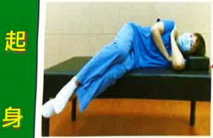
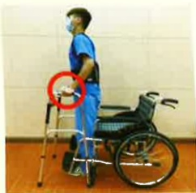
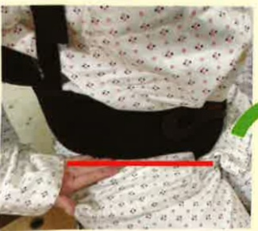
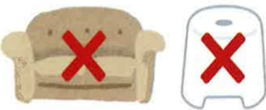
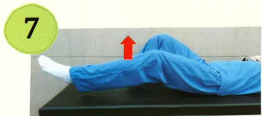

# Postoperative Care for Lumbar Spine - Precautions

## HAI## ~~Table of Contents~~

I. Postoperative Complications...1  
II. Postoperative Care...1  
III. Postoperative Activity...2  
IV. Home Care Precautions...4  
V. Rehabilitation Exercises...7  
Basic Rehabilitation Exercises...8  
Advanced Rehabilitation Exercises...9  
VI. Precautions After Lumbar Surgery...10  
VII. Sample Daily Meal Plan After Lumbar Surgery at Home...11  
VIII. References...13

## I. Postoperative Complications

Patients undergoing lumbar surgery may experience complications such as wound inflammation, infection, or nerve damage.

## II. Postoperative Care

1. After surgery, pay close attention to changes in arm and leg nerve function. If you experience numbness, weakness, or reduced mobility, notify medical staff immediately.

2. Be careful to avoid pulling or tugging at the drainage tubes on your body. Keep the wound dry and closely monitor the dressing for any signs of blood or pale yellow fluid leakage. If leakage is observed, notify medical staff immediately.

3. Nursing staff will assess your urination and defecation every 2–4 hours and monitor for signs of urinary retention.

4. After surgery, pain and discomfort due to swelling at the surgical site pressing on nerve roots are common. Inform the nursing staff so that appropriate pain medication can be administered as needed.

5. The wound is sutured out 7–10 days after surgery. After removal, use cosmetic adhesive tape for protection. Increase intake of high-protein and high-vitamin foods to promote wound healing.

## Three. Postoperative Activities

### 1. Bed Rest Precautions:

(1) Follow the doctor's instructions regarding when to get out of bed. If you are still required to remain in bed for within 48 hours after surgery, change positions at least every 2 hours using the rolling method (Figure 1). If using a commode on the bed, ensure the buttocks are not elevated. When lying flat, place a pillow under the head and another under the knees to maintain spinal alignment. With the doctor's permission and if no discomfort is felt, gradually elevate the head of the bed to prevent orthostatic hypotension, but be cautious not to press on the surgical site.

Step the opposite foot onto the bed, then turn over

Rolling method for position change (maintain spinal alignment in a straight line)

Figure 1. Schematic illustration of the rolling method for position change

(2) Bedside activities: During bed rest, hip and knee joint movements can be gradually increased within the pain tolerance range of the surgical wound. Movements of the upper limbs, feet, and ankles do not affect the affected area and should be performed as much as possible, at least five times per day, to prevent deep vein thrombosis.

### 2. Correct Posture Transitions:

(1) During hospitalization to reduce wound pain:

a. Raise the head of the bed to maintain the stability and alignment of the surgical area.

b. Turn to the side and sit at the edge of the bed, supporting the bed surface with both hands.

c. Family members assist in protecting the patient.

Getting up

After side-lying

Supporting the bed surface with both hands (or ask family members to assist in rising)

Sitting to standing

Put on the back brace and shift the buttocks forward

Support with hands on the handrail

Stand up

Using a walker to walk

No dizziness

Continue walking

Move the walker forward

Take the weaker foot first

Then bring the other foot up## Four. Home Care Precautions

1. Proper wearing of back brace:

(1) The back brace should be worn outside of clothing.

(2) The elastic straps should be tightened to about one finger width.

(3) Do not wear it too low, as this may compress the inguinal region; the upper part of the buttocks should be comfortably supported.

(4) The main steel plates should be symmetrically fixed on both sides of the lower back and lumbar vertebrae.

Wear the back brace before getting out of bed.  
Please follow the doctor's instructions regarding the duration of wearing the back brace.  
No need to wear the back brace while sleeping or bathing.

2. Activity-related precautions:

(1) Avoid sudden or forceful twisting of the waist.  
(2) Take a shower to maintain a straight lumbar spine.  
(3) It is only safe to drive a car or ride a motorcycle after 3 to 4 weeks post-surgery.  
(4) Avoid pushing, pulling, lifting, or carrying heavy objects, as well as long-distance travel or prolonged sitting.

3. Maintain proper posture

(1) Using the two-leg method:

a. When standing, tuck the chin, lift the head, keep the back straight, contract the abdominal muscles, and tighten the pelvis to reduce pressure on the back.  
b. Only after evaluation by a doctor can you determine whether to adopt a squatting posture to pick up items.  
c. When lifting objects, separate your legs, squat down, tighten your glutes and abdominal muscles, bring your body close to the object, keep your lumbar spine straight, and lower your pelvis—let your gluteal and leg muscles bear the weight of the object.  
d. Wear flat shoes, avoid sandals and high heels, to maintain body balance.

## (2) Lying on the bed posture:

a. When lying on the side, bend the knee joints.

b. When lying on the back, place a pillow under the knees, and use a flat pillow under the head to avoid tension in the shoulders, neck, and arms.

c. Avoid the prone position, as this posture causes the back to sink and leads to tension in the shoulders and neck.

d. When getting on or off the bed, maintain a straight line of the lumbar spine, and ensure the back brace is worn before getting off the bed.

(3) Proper sitting posture:

a. The chair should have a solid backrest. The width and height of the chair should be appropriate so that both legs naturally bend and hang freely to the ground, with the knee joints ideally higher than the hip joints.

b. Avoid low and soft chairs, such as soft sofas or low stools.

c. Do not sit abruptly on the chair; avoid prolonged sitting (more than 30 minutes), and contract the abdominal muscles to straighten the back, keeping the neck and back in a straight line as much as possible.

d. When driving, keep the seat backrest at a reasonable distance from the steering wheel, and fasten the seat belt or use a firm backrest.

## Five. Rehabilitation exercises:

1. Begin practicing the basic rehabilitation exercises from the initial stage of the teaching sheet before surgery. Advanced rehabilitation exercises are performed only after being assessed and guided by a therapist during hospitalization, and can be continued after discharge and returning home.

2. When wearing a back brace, if the back panel causes discomfort at the surgical wound, place a towel inside the back panel. The soft towel can reduce wound pain and improve comfort.

3. During exercise, follow the principle of not causing pain at the surgical wound. If pain occurs, consult a physical therapist to adjust the exercise plan.

4. If dizziness or discomfort occurs, pause the exercise to prevent falls. Exercise intensity should be tailored to individual conditions and should not be excessive, as overexertion may cause pain at the surgical wound.

5. Benefits of exercise: After surgery, combining rehabilitation exercises with recovery can improve surgical success rates and reduce the recurrence of back pain.

6. Exercise prescription: Hold each exercise for 10–15 seconds, then relax. Perform 15 repetitions, four times a day.

## Basic Rehabilitation Exercises

Diaphragmatic breathing exercise  
(Inhale with the abdomen slightly protruding)

Knee press on towel

Alternating knee bends and straightens

Ankle dorsiflexion

Heel press on towel

Contract abdomen, press back on towel

Contract abdomen, bend knees slightly, lift gently

Contract abdomen, straighten legs, lift upward

## Advanced Rehabilitation Exercises

Extend legs, pull and press foot sole

In-place marching (alternating thigh lifts)

Lean back against wall, perform slight squat with knees not exceeding toes

Point toes

## Post-surgical nutrition promotes faster wound healing and reduces body aches and pains

The key to diet after spinal surgery lies in bone and muscle recovery.  
Consuming high-quality protein, calcium, iron, zinc, and vitamins helps wound healing and maintains healthy muscles and bones.  
Moreover, due to reduced physical activity post-surgery, adequate dietary fiber intake is essential to promote gut health!

## [Other post-surgical dietary considerations]

~ Developed by the Nutrition Therapy Department and Nursing Department, Tainan Tainan Chang Hospital, Tainan Medical Foundation

## Eight. References

Chen, M. L., & Fang, M. J. (2015). Nursing care for patients with neurological disorders. In H. Y. Hu (Ed.), Internal and surgical nursing (Vol. 5, pp. 677–874). Hua Xing.

Park, D. K. (2022, January). Low Back Surgery Exercise Guide. OrthoInfo. Retrieved January, 2022, from https://orthoinfo.aaos.org/en/recovery/low-back-surgery-exercise-guide/E-DA HEALTHCARE GROUP

Yi Da Hospital

Address: No. 1, Yida Road, Jiaosu Village, Yancheng District, Kaohsiung City  
Phone: 07-6150011

Yi Da Cancer Treatment Hospital

Address: No. 21, Yida Road, Jiaosu Village, Yancheng District, Kaohsiung City  
Phone: 07-6150022

Yi Da Da Chang Hospital

Address: No. 305, Da Chang Road, Simei District, Kaohsiung City  
Phone: 07-5599123

This copyright shall not be reproduced, duplicated, or resold without the consent of the copyright holder.

Copyright Holder: Yi Da Medical Foundation

HA-1-0220(1)

Yi Da Medical Foundation, 21x29.7cm, printed in March 2024, established in December 2023