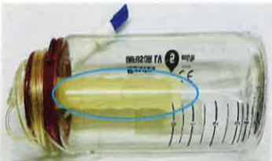

(3) If there is fever, severe vomiting, or altered consciousness, seek immediate emergency treatment.

(4) If the medication has not been completely infused more than 5 hours past the end time, please return to the hospital immediately.

## ▶ References

Huang Chien-Wei, He Qian-yi, Li Zhen-yi, and Cheng Hui-lan (2020). A project improvement on enhancing the completeness of inter-hospital needle removal education guidance by nursing staff in outpatient chemotherapy centers. *Journal of Oncology Nursing*, 20(1), 19–32.

Li Lu, Jiang Meng-guan, Jiang Shao-qing, and Qiu Shi-yi (2020).  
2020 Home Protection Guidelines for Chemotherapeutic Drugs with Cancer Risk.  
*Journal of Oncology Nursing*, 20, 77–84.

| Hospital Consultation Hotline and Needle Removal Locations (Address: No. 1, Yida Road, Jiaosu Village, Yancheng District, Kaohsiung City) |
|--------------------------------------------------------------------------------------------------------------------------------|
| ✿ Outpatient Chemotherapy Room Consultation Hours: Monday to Friday, 08:30 AM – 6:00 PM ✿ If you have any questions, please call the consultation line at (07)615-0011, extension 5620 |
| ✿ Outside working hours, please call (07)615-0011, extensions: • Rectal Surgery / Urology Ward 6A: 3611, 3612 • Otolaryngology Ward 6B: 3621, 3622 • Thoracic Surgery / Chen Zhiyi Doctor's Ward 8A: 3811, 3812 • Hematological Oncology Ward 10A: 3011, 3012 |
| Hospital Consultation Hotline and Needle Removal Locations (Address: No. 21, Yida Road, Jiaosu Village, Yancheng District, Kaohsiung City) |
| ✿ Outpatient Chemotherapy Room Consultation Hours: Monday to Friday, 08:30 AM – 5:30 PM ✿ If you have any questions, please call the consultation line at (07)615-0022, extension 6561 |
| ✿ Outside working hours (night and holidays), please call: (07)615-0022, extension 6365 |
| Yida Da Chang Hospital Consultation Hotline and Needle Removal Locations (Address: No. 305, Dachang 1st Road, Sancheng District, Kaohsiung City) |
| ✿ Outpatient Chemotherapy Room Consultation Hours: Monday to Friday, 09:00 AM – 5:00 PM ✿ If you have any questions, please call the consultation line at (07)559-9123, extension 7314 |
| ✿ Outside working hours (night and holidays), please call: (07)559-9123, extensions 7366, 7367 |

This copyright is not allowed to be reproduced, reprinted, or resold without the consent of the copyright holder.

Copyright Holder: Yida Medical Foundation

Form Number: HA-1-0221 (1)

Yida Medical Foundation, 20X29.7cm, printed in 2024.06, newly established in 2024.02

## Precautions for Portable Home Chemotherapy

## Portable Home Chemotherapy Guidelines

## 1. What is the Portable Infusion Device (Home Chemotherapy Bottle)?

It is a lightweight, single-use home chemotherapy drug infusion device that delivers medication into the body through continuous positive pressure. This method is very safe and allows patients to maintain their daily routines and work schedules, preserving their quality of life. It is a common form of treatment.

## 2. Guidelines for Using the Portable Chemotherapy Infusion Device

(1) You can monitor the infusion process by observing the marked lines on the device's outer shell. (Figure 1)

(Figure 1)

(2) The portable infusion device delivers only 5 to 10 milliliters per hour. Therefore, you do not need to constantly monitor it. It typically takes six to eight hours before noticeable changes are observed in the medication reservoir. (Figure 2)

(Figure 2)

(3) If you observe "floating particles" appearing in the medication reservoir, it indicates that the drug infusion has ended. (Figure 3) Use a lighter or match to test.

(Figure 3)

(4) The actual time when the medication infusion ends may vary by 2.5 to 5 hours from the expected end time — this is within the normal range.

(5) To maintain a stable infusion rate, do not expose the portable infusion device to excessively hot or cold temperatures.

(6) When bathing, avoid very hot water. Do not soak in a bath. You may take a shower or wipe your body. When showering, avoid wetting the site of the implanted vascular access.

(7) The infusion tubing is specially designed and will not interrupt the infusion due to body posture or pressure on the tubing. You do not need to worry about this.

(8) When sleeping, place the infusion device next to your pillow to avoid placing it on a nightstand or bedside table, which could cause the tubing to be pulled and dropped during movement, leading to damage.

(9) When going out, place the portable infusion device in your waist pack and keep it covered to avoid unnecessary collisions or pulling.

## 3. Precautions for the Vascular Access Site Upon Returning Home

(1) Wear comfortable clothing during home chemotherapy and secure the tubing properly. Do not lift heavy objects or perform rotational movements on the limb at the injection site.

(2) Do not pull on the infusion catheter. If pulling is detected, recheck the injection site and the catheter's safety.

(3) When the infusion is complete, do not close the clamp (air should not enter the tubing). If the infusion ends at night, you may return to the hospital the next morning to remove the device. In cases of confusion or drowsiness, seek medical attention immediately.

Do not close the clamp (keep open)

## 4. Situations Requiring Immediate Return to the Hospital

(1) If there are abnormal redness, swelling, heat, or pain at the vascular access site, immediately close the clamp and return to the hospital.

(2) If there is drug leakage or dislodgement of the needle, immediately close the clamp on the vascular access, rinse the affected skin with large amounts of clean water for 15 minutes, change your clothes, and return to the hospital immediately.

Immediately close the clamp
