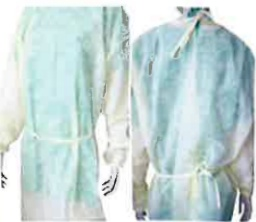
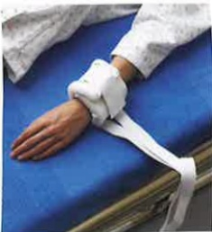
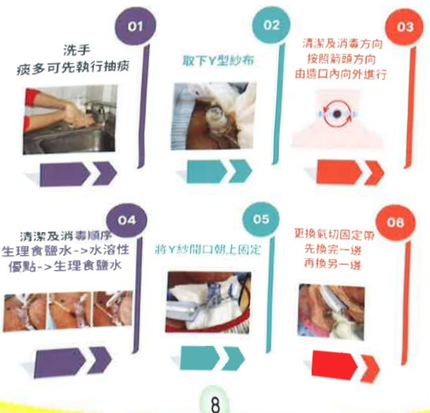
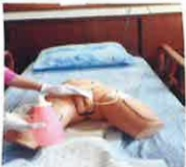
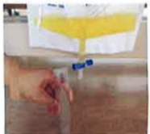

# Subacute Respiratory Care Center Health Education Manual

Ou Medical## Admission Guidelines for the Subacute Respiratory Care Center

## 1. Treatment Plan Explanation

After admission, the attending physician will assess the patient and initiate respiratory training and weaning from the ventilator program.

## 2. Treatment Outcomes and Follow-up Arrangements

1. If the patient successfully completes respiratory training and is weaned off the ventilator, they will be observed for 5 days and then transferred to a general ward for continued care.

2. If it is assessed that the patient cannot be weaned off the ventilator in the short term, discussions will be held with family members regarding transfer to the Chronic Respiratory Care Ward (RCW) or home care arrangements. The hospital's Discharge Preparation Service Team will assist with the development of follow-up care plans and referrals.

## 3. Special Situations During Hospitalization

If the patient's condition is unstable or requires surgical intervention, the physician may arrange for the patient to be returned to the Intensive Care Unit (ICU) for further treatment, depending on the situation.

## 4. Application for Major Illness

Patients who have used a ventilator for more than 21 consecutive days may apply for major illness status due to respiratory failure with continuous ventilator use exceeding 21 days (the hospital can handle this application during the hospital stay). The application review period is approximately 7 to 14 days (the review body is the Central Health Insurance Bureau, not the thoracic surgery physicians at this hospital).## Self-introduction

Proactively introduce yourself and wear an identification badge, which can be seen on the name tag outside the ward to identify the nursing staff responsible for the three-shift care.

03003

## 3 A03

Shift:  
Late night shift:  
Early night shift:  

## Visiting Principles

To effectively control infection, visiting times are limited, and the number of visitors is capped at two. Proper isolation precautions must be followed, including wearing isolation gowns, masks, and practicing hand hygiene to prevent cross-infection. If visits are delayed, the scheduled 30-minute visiting time will still be fulfilled.

## Thorough Handwashing to Prevent Infection

▶ Children under the age of 12 have weaker immune systems and are restricted from entering.  
▶ Visitors with contagious diseases are not allowed to enter. If you have respiratory symptoms, please wear a mask throughout the visit.  
▶ When entering the sub-acute respiratory care unit, please turn off your mobile phone, as patients have many tubes and devices that are susceptible to electromagnetic interference. Please also ensure that you and your family understand the purpose and importance of these tubes and devices, and do not move the patient without permission. Protective restraints may be applied if necessary.

## Pain Care

Postoperative wounds and catheter placement may cause pain and discomfort. Healthcare staff conduct pain assessments every two hours and appropriately administer analgesics, which can alleviate pain and discomfort.

Pain Assessment

Injections and oral analgesics

## Fall Prevention

Use bed rails when patients are bedridden. For high-risk fall patients, enhance signage. Before leaving for visitors, ensure that bed rails on both sides are securely pulled up.

## Prevention of Incontinence-Related Skin Inflammation and Pressure Injuries

Patients on respirators are prone to incontinence-related skin inflammation and pressure injuries due to their underlying physiological conditions. Proper prevention of incontinence-related skin inflammation and pressure injuries can reduce the incidence of these complications.

Long-lasting skin protectant

Dry-cleaning skin cleanser

Pain-free protective film

Foam dressing## E-DA HEALTHCARE GROUP

## Introduction to Tracheostomy

▶ Tracheostomy involves making an opening in the tracheal ring to connect it with the trachea, known as a tracheostomy stoma, commonly referred to as "tracheostomy" in short.

1. Respiratory failure requiring mechanical ventilation  
2. Medical conditions necessitating long-term dependence on a ventilator  
3. Patients at risk of airway obstruction at any time

## Difference between Tracheostomy and Endotracheal Tube

## Tracheostomy Tube

Placement site  
Inserted through the neck tracheostomy stoma, not through the mouth, resulting in better oral hygiene.

Lower risk of tube placement complications  
The tube can be removed by releasing the cuff and reinserted quickly and safely, with a short procedure and low risk.

## Shorter tube length  
The tracheostomy tube is shorter, leading to better sputum clearance, easier breathing, and a higher likelihood of weaning off the ventilator.

Quality of life  
With proper training, patients can speak and eat, enabling better communication.

## Endotracheal Tube

Placement site  
The tube passes through the mouth, throat, and into the trachea, resulting in poorer oral hygiene and increased risk of mucosal damage.

Higher risk of tube placement complications  
The tube is inserted after confirming the tracheal position using a laryngoscope, resulting in a longer procedure and higher risk.

## Longer tube length  
The endotracheal tube is longer, making sputum clearance difficult, breathing more laborious, and reducing the likelihood of weaning off the ventilator.

## Quality of life  
Patients cannot speak or eat, leading to prolonged tube placement, potential swelling of the throat, and damage to the vocal cords.## Tracheostomy Care

▶ Perform tracheostomy care at least once daily. If the gauze or tracheostomy fixation band is wet or dirty, replace it immediately.

When using povidone-iodine to disinfect the tracheostomy site, hold it for 2 minutes to achieve effective disinfection.

The disinfection area should extend beyond the gauze to prevent contamination of the new gauze.

Daily observe the skin around the tracheostomy for signs of inflammation such as redness, swelling, or discharge.

When changing the tracheostomy fixation band, secure the tracheostomy tube to prevent dislodgement.

The tightness of the tracheostomy fixation band should leave about two finger widths of space to avoid being too tight or too loose.

Silicone tracheostomy tubes should be replaced once per month.

Re-establish communication methods, such as using written notes, gestures, or lip reading.

  

## Tracheostomy Care

## Catheter Care

If the patient requires close monitoring of urine output or has acute urinary retention and a catheter is placed, improper catheter care can lead to infection. Therefore, the perineal area and catheter should be cleaned daily.

1. Place the commode or diaper under the patient’s buttocks and flush with a water container.

2. Apply soap or body wash to the urethral meatus, perineum, and upper portion of the catheter, then rinse thoroughly with clean water.

3. Dry the urethral meatus, perineum, and upper portion of the catheter with a damp wipe.

4. Assist the patient in changing into a clean diaper or clothing.

5. The urine collection bag should be positioned below the bladder, with the bag opening at least 3 cm above the ground, and the opening should be kept closed at all times. When the urine volume in the bag reaches 1/2 to 2/3, it should be emptied.Yi Da Hospital Subacute Respiratory Care Center

Address: No. 1, Yida Road, Juxu Village, Yancheng District, Kaohsiung City

Phone: 07-6150011 ext. 3391, 3392

This copyright holder shall not be allowed to reproduce, reprint, or resell without the written consent of the copyright holder.

Copyright Holder: Yi Da Medical Foundation

Printed by Yi Da Medical Foundation in 2025.09, established in 2025.07 HA-1-0224(1)