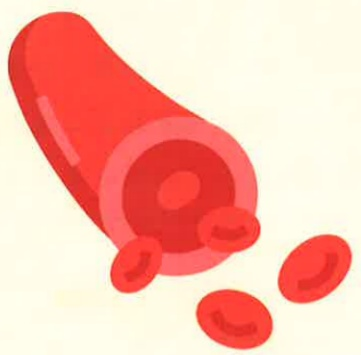

## ※ Common cholesterol content in foods (per 100 grams of food)

| Category | Food Name | Cholesterol (mg) | Food Name | Cholesterol (mg) |
|---------|-----------|------------------|-----------|------------------|
| Dairy | Whole milk | 13 | Medium-fat milk | 10 |
|         | Low-fat milk | 7 | Dehydrated milk powder | 23 |
|         | Whole milk powder | 89 | Cheese powder | 108 |
| Meat | Whole chicken | 60–90 | Chicken liver | 343 |
|         | Chicken breast | 74 | Chicken gizzard | 204 |
|         | Pork loin | 32–97 | Chicken heart | 150 |
|         | Beef | 60–172 | Duck gizzard | 187 |
|         | Lamb | 24–83 | Goose liver | 383 |
| Fish | Sea fish | 50–60 | Tuna | 32 |
|         | Freshwater fish | 60–80 | Salmon | 53 |
|         | Sardines | 60 | Crocodile | 57 |
|         | White bream | 69 | Grass carp | 75 |
| Seafood | Abalone | 127 | Octopus | 183 |
|         | Clams, oysters | 30–70 | Abalone | 53 |
|         | Taiwan clams | 55 | Lobster | 86 |
|         | Shrimp | 175 | Crab | 108 |
| Eggs | Chicken egg | 389 | Duck egg | 219 |
|         | Chicken egg white | 0 | Goose egg | 870 |
|         | Chicken yolk | 1177 | Salted salmon roe | 419 |
| Others | Pork sausage | 32 | Egg dumpling | 246 |
|         | Sausage | 61 | Shrimp dumpling | 72 |
|         | Gongwan | 42 | Fish paste | 100 |

Principles of lifestyle modification therapy for adults with hyperlipidemia

| Treatment Principle | Recommendation |
|--------------------|----------------|
| Reduce intake of saturated fat and cholesterol | Saturated fat < 7% of total energy intake; cholesterol < 200 mg/day |
| Therapeutic dietary approach | Plant sterols 2 g/day; soluble fiber 10–25 g/day |
| Weight reduction | Adjust energy intake to maintain ideal body weight or prevent weight gain |
| Regular physical activity | Engage in moderate-intensity exercise for at least 200 kcal/day |
| Macronutrient balance | Carbohydrates: 50–60%; Protein: 15%; Total fat: 25–35% |

## Yida Hospital

Address: No. 1, Yida Road, Jiaosu Village, Yancheng District, Kaohsiung City  
Phone: 07-6150011  

Yida Cancer Treatment Hospital  
Address: No. 21, Yida Road, Jiaosu Village, Yancheng District, Kaohsiung City  
Phone: 07-6150022  

Yida Dachang Hospital  
Address: No. 305, Dachang Road, Sancheng District, Kaohsiung City  
Phone: 07-5599123  

This copyright is not allowed to be reproduced, copied, or resold without the consent of the copyright holder.  
Copyright Holder: Yida Medical Foundation  
Printed size: 20x20 cm, Revised in February 2025, Printed in May 2025, HA-3-0005(2)

## Diet for Hyperlipidemia

## Hyperlipidemia

Hyperlipidemia refers to increased cholesterol and triglycerides in the blood. Abnormal lipid levels (hypercholesterolemia, hypertriglyceridemia, or both) accelerate atherosclerosis, increasing the risk of stroke, angina, coronary artery disease, myocardial infarction, and cerebrovascular disease.

## $^{*}$ Adult Lipid Standards

| Type of Lipid | General Adults (mg/dL) | Cardiovascular or Diabetes Patients (mg/dL) |
|---------------|------------------------|---------------------------------------------|
| Total Cholesterol (TLC) | < 200 | < 160 |
| Triglycerides (TG) | < 150 | < 150 |
| High-Density Lipoprotein Cholesterol (HDL-C) | Male > 40, Female > 50 | Male > 40, Female > 50 |
| Low-Density Lipoprotein Cholesterol (LDL-C) | < 130 | < 100 |

## $^{*}$ Dietary Recommendations for Hypercholesterolemia

1. Maintain a healthy body weight.

2. Limit intake of foods high in cholesterol, such as internal organs (brain, liver, kidneys), crab roe, shrimp roe, fish roe, etc. It is recommended to consume a variety of proteins and avoid relying solely on meat or legumes. Prefer plant-based proteins to replace some animal-based proteins, such as tofu and bean curd.

3. Limit intake of foods high in saturated and trans fats.

**Saturated fats: Animal foods such as fatty meats, butter, lard, tallow; plant foods such as toasted coconut oil, palm oil.**

**Trans fats: Processed pastries made with hydrogenated fats (cakes, pastries, cookies, etc.).**

4. Use plant oils rich in monounsaturated fats for cooking, such as peanut oil, rapeseed oil, and olive oil.

5. Practice low-fat cooking methods such as steaming, boiling, roasting, stewing, braising, stir-frying, grilling, or cold-pressing. Reduce consumption of meat skin (pork skin, duck skin, chicken skin, fish skin), which are high in fat.

6. Choose fiber-rich foods such as various vegetables and fruits, unprocessed legumes, and whole grains.

7. Moderately consume foods rich in natural antioxidants (such as polyphenols, vitamin C, carotenoids, isoflavones), such as vegetables and green tea, to enhance vascular antioxidant function.

8. Limit alcohol consumption.

9. Adjust lifestyle habits: quit smoking, engage in moderate physical activity, and manage stress.

## $^{*}$ Diet for Hypertriglyceridemia

1. Maintain a healthy body weight, which helps reduce triglyceride levels.

2. Limit intake of refined sweets, fruit juices, beverages, candies, pastries, and other sugar-added products. Instead, consume complex carbohydrates such as root and stem vegetables.

3. Avoid alcohol and alcoholic beverages.

4. Avoid high-fat and high-sugar foods such as fried chicken, french fries, oil cakes, cashews, peanuts, seeds, cakes, Chinese pastries, chocolate, and ice cream.

5. Increase intake of fish rich in omega-3 fatty acids, such as salmon, sardines, and tuna.

6. Other recommendations follow those for hypercholesterolemia.

## References:

1. 2022 Taiwan Lipid Guidelines for Primary Prevention  
2. Adult Preventive Health Handbook / Compiled by the National Health and Welfare Administration. First Edition. Taipei: National Health Agency, December 2019  
3. Food Nutrient Composition Database, 2022 Edition