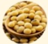

## Three. Dietary Principles & Lifestyle After Treatment

### 1. Balanced Diet, Diverse Foods:

- Main staple should be unrefined whole grains (e.g., sweet potato, oats, pumpkin, brown rice)

· Choose a variety of vegetables and fruits (e.g., tomato, carrot, bell pepper, spinach, blueberries, onion, etc.)

· Select high-quality protein sources, paying attention to origin and selection order:

Soy products

Fish

Seafood

Eggs

Cooking methods

White meat

Red meat

· Avoid processed foods (e.g., sausages, ham, bacon, etc.)

- Use plant-based oils for cooking to increase intake of polyunsaturated fatty acids; reduce the use of animal-based oils (e.g., chicken fat, pork fat)

- Adequately supplement fluids; approximately 25–30 mL of water per kg of body weight is needed. Individuals with kidney or heart disease or those requiring fluid restriction should consult a physician.

### 2. Maintain Ideal Body Weight & Healthy Lifestyle:

· Maintain physical activity and establish a regular exercise routine

· Avoid smoking, alcohol consumption, and chewing betel nut

### 3. Attend Regular Follow-up Appointments as Advised by the Physician

## References:

1. ESPEN practical guideline: Clinical Nutrition in cancer. Clinical Nutrition 2021;40(5):2898-2913.

2. Food Safety During and After Cancer Treatment. Cancer Net. 2021.

3. Healthy Living After Cancer. Cancer Net. 2021.

4. Taiwan Cancer Prevention Network – Cancer New Insights Issue 96. Nutritional Care for Cancer Patients.

5. Taiwan Cancer Foundation. Self-care Management, Cancer Nutrition.

## Four. Common Dietary Myths in Cancer Patients

## Should cancer patients reduce meat intake, even adopting a vegetarian or raw food diet?

Incorrect! During treatment, sufficient calories and protein are needed to support tissue repair, reconstruction, and immune function regulation. Therefore, it is recommended to maintain a balanced diet and choose high-quality proteins such as soy products (tofu, soy milk), eggs, fish, seafood, poultry and red meats, dairy products, and avoid raw foods to prevent infection risks.

## Will consuming too much nutrition cause cancer cells to grow?

Incorrect! Cancer patients have higher caloric needs than the general population. Poor nutritional status may lead to weakened immunity and worse prognosis. Therefore, a balanced diet and maintaining body weight are essential.

## Should we be particularly cautious when supplementing with health products during treatment?

Correct! There are many types of health supplements available in the market, such as traditional Chinese herbs, ginseng, reishi mushroom, probiotics, etc. If supplementation is desired during treatment, it is recommended to seek advice from a physician or a nutritionist. Yida Hospital

Address: No. 1, Yida Road, Jiaoshu Village, Yancheng District, Kaohsiung City  
Phone: 07-6150011

Yida Cancer Treatment Hospital  
Address: No. 21, Yida Road, Jiaoshu Village, Yancheng District, Kaohsiung City  
Phone: 07-6150022

Yida Da Chang Hospital  
Address: No. 305, Da Chang Road, Sanmin District, Kaohsiung City  
Phone: 07-5599123

## Cancer Diet

※ More tips on managing side effects please refer to the QR code in the top-right corner

## Cancer Diet – Introduction

During the journey of cancer treatment, diet is one of the most important aspects. Proper and safe nutritional care helps maintain physical health, prevents weight loss, reduces treatment-related side effects, improves treatment tolerance, and ensures smooth completion of therapy.

## I. Pre-treatment Nutritional Assessment & Dietary Principles

Assess your nutritional status using BMI (Body Mass Index), weight loss condition, and blood albumin concentration. If any of the following conditions are present, you may be at risk of malnutrition:

1. BMI < 18.5 kg/m²  
• Ideal BMI range is 18.5–24 kg/m²  
For example, a person with a height of 160 cm and a weight of 50 kg  

2. Weight loss > 5% over one month  

3. Blood albumin < 3.0 g/dL  

Adjust nutritional intake based on current nutritional status  

※ Maintain weight and prevent muscle loss ※  

1. Maintain a balanced diet.  
2. Establish regular physical activity habits.  

※ Increase body weight and muscle mass ※  

1. Supplement with high-calorie, high-quality protein foods, such as seafood tofu porridge, chicken and cauliflower stewed rice, sesame milk, etc.  
2. Supplement with immune-regulating nutrients: fish oil, glutamine, nucleotides to reduce inflammatory substances and enhance immunity, such as deep-sea fish and meat products.  
3. When appetite is poor, eat small meals frequently and supplement with snacks between meals.  
4. Increase physical activity to prevent muscle loss; moderate to high-intensity resistance training (e.g., brisk walking, climbing stairs) is recommended.  

## II. Dietary Principles During Treatment  

1. Balanced diet with natural foods: Include six major food groups and consume them in balance daily. Avoid processed and preserved foods.  

  

2. Strengthen the body with high-quality protein: Protein requirements increase during treatment. High-quality protein sources include soybeans, edamame, tofu, fish, shrimp, crab, eggs, poultry, red meat, and dairy products.  

3. Prevent infection and ensure food safety: Avoid raw foods (including raw diets), such as raw lettuce, raw fish slices, and honey. Pay attention to drinking water (must be boiled) and ice source. Choose fruits with skin on to reduce the risk of bacterial and microbial infections.  

4. Assess eating ability and choose appropriate texture: Based on dental condition and swallowing ability, select soft, mashed, or liquid textures. Avoid rough or hard-to-digest foods such as fried foods and glutinous rice products.  

※ For liquid food preparation, please refer to the QR code for natural blending examples  

  

  

(Snacks)  

5. Supplement with appropriate nutritional products: Seek advice from your doctor or nutritionist to choose suitable nutritional supplements.  

Balanced or concentrated formulas  
• Tumor-specific formulas  
• Special nutrients: Fish oil, glutamine  

$^{※}$ Please refer to the QR code for nutritional product information  

  

Nutritional Product Information  

6. Eat small meals frequently and supplement with snacks between meals: When appetite is poor, eat small meals frequently and consume small-volume, high-calorie snacks such as ice cream, pudding, cheese, or soy milk.  

7. Common treatment side effects and management tips  

☐ Common side effects
  

  

  

A. Loss of appetite  
Side effect  
Management tips  

B. Altered taste perception  

  

  

  

C. Dry mouth  

  

  

D. Nausea/vomiting  
E. Diarrhea/abdominal bloating  
F. Oral ulcers  

| Symptom | Dietary Principles and Improvement Methods |
|---------|--------------------------------------------|
| A. Loss of appetite | · Eat small meals frequently and choose high-calorie, high-protein foods · Frequently vary cooking methods and forms · Choose favorite foods and enjoy them with a relaxed mindset |
| B. Altered taste perception | · Use aromatic spices to reduce the bitterness of meat · Supplement with foods containing fish (oysters, mussels), eggs, etc., to improve taste perception |
| C. Dry mouth | · Chew ice, drink plain water or sugar-free drinks · Choose moist foods (steamed egg, milkshake, etc.) · Avoid spicy foods and alcohol |
| D. Nausea/vomiting | · Rest after meals, eat small meals frequently · Avoid eating near oil fumes or strong odors |
| E. Diarrhea/abdominal bloating | · Pay attention to fluid and electrolyte intake · Avoid gas-producing and coarse foods such as onions, soy products, sweet potatoes, etc. |
| F. Oral ulcers | · Avoid irritating (spicy, acidic) foods · Choose liquid foods or commercially available nutritional products · Supplement with glutamine at a dose of 10–30 grams per day |