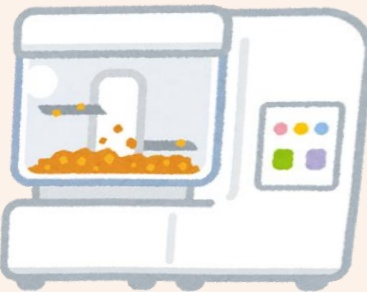

| 食物類別 |  | 可食 | 忌食 |
|----------|---|------|------|
| 乳品類 | 鮮奶、全脂奶粉(一天量以不超过二杯為宜)。 | 若有乳糖不耐症,則須採用不含乳糖之食物。 |
| 蛋類 | 煮熟之各種蛋類 | 生蛋、鹹蛋、皮蛋。 |
| 肉類 | 豬、牛、雞、魚等新鮮嫩而無筋的瘦肉。 | 多筋的肉、肥肉、皮等。 |
| 豆類 | 黃豆粉、豆漿、豆花、豆腐等。 | 各種堅硬豆類。 |
| 全穀雜糧類 | 精細的全穀雜糧類如參片、糙米粉、馬鈴薯、南瓜、芋頭、番薯等。 | 粗糙、纖維含量高的全穀雜糧類,如糙米、玉米等。 |
| 蔬菜類 | 各種過濾的菜汁、菜湯、菜泥等。 | 攪打後未經過濾的蔬菜汁。 |
| 水果類 | 各種過濾果汁。 | 未經過濾的果汁及水果。 |
| 油脂類 | 各種植物油,如大豆油、玉米油、橄欖油等。 | 動物性油脂、瑪琪琳(因常溫時易凝集造成管路阻塞)。 |
| 其他 | 酵母粉、糖、鹽、糖飴、粉飴等。 | 有刺激性的調味品,如辣椒粉、胡椒粉等。 |

## Five. Other Notes

1. Nutritional consultants can design appropriate food selections based on individual needs to achieve suitable nutrient composition.

2. During preparation, ensure the hygiene of the preparer and cleanliness of feeding utensils. Before feeding, thoroughly wash hands and feeding equipment, and disinfect all feeding tools. Freshly prepared and portioned meals should be stored in the refrigerator and consumed within 24 hours to avoid contamination.

3. Before each feeding, take out an appropriate amount and warm it to body temperature (approximately 37°C), stir evenly, and then administer.

4. The formula should not be left at room temperature for more than 30 minutes. If feeding cannot be immediately administered, store it in the refrigerator. Medications should not be directly added to the formula, as this may cause spoilage or affect the efficacy of the medication.

5. Before each feeding, check the residual volume in the stomach to assess digestion. If the residual volume is large (>60ml), pause feeding for 1–2 hours and then recheck the residual volume to evaluate digestive status.

6. Avoid using pork fat or beef fat to prevent solidification upon cooling, which could block the feeding tube.

## References:

Hsieh Shu-Ling, Shu Yi-Fang, Chen Xin-Hong, Chen Yan-Hua, Liao Shu-Fen, Yang Hui-Ting, Lin Jin-Hua (2018). Experimental Nutrition and Diet Therapy. Taichung: Tsai Xiao-Ping.

Yi Da Hospital  
Address: No. 1, Yida Road, Jiaoshu Village, Yancheng District, Kaohsiung City  
Phone: 07-6150011  

Yi Da Cancer Treatment Hospital  
Address: No. 21, Yida Road, Jiaoshu Village, Yancheng District, Kaohsiung City  
Phone: 07-6150022  

Yi Da Dachang Hospital  
Address: No. 305, Dachang Road, Sanyin District, Kaohsiung City  
Phone: 07-5599123  

This copyright holder shall not reproduce, reprint, or resell without the written consent of the copyright holder.

Copyright Holder: Yi Da Medical Foundation  
19.8×21cm Printed in April 2025, Revised in February 2025 HA-3-0017(2)

## Natural Tube Feeding Diet 1800 kcal

## I. Equipment Preparation

| | |
|---|---|
| Standard bowl | Standard measuring spoon |
| | |
| Plastic spoon | Strainer |
| | |
| Food processor | Electric pot |
| | |
| Food scale | Measuring cup |

## II. Preparation Method (First clean the equipment and ingredients, then pour hot water into the food processor to cover the blades for cleaning, then discard it)

### 1. Preparation for breakfast or dinner:

1) Weigh the ingredients according to portion size and add them to the food processor. Add water to a fixed volume of 250 ml (per meal) and blend until a smooth liquid consistency is achieved.

2. Preparation for four main meals (breakfast + lunch + afternoon snack + dinner):

1) Weigh natural ingredients and powdered ingredients according to the required portion sizes.

2) Cut natural ingredients into small pieces and steam them together (green vegetables should be blanched separately until tender).

3) After steaming, add the ingredients to the food processor and mix in 200 ml of warm boiled water to create a smooth liquid consistency.

4) Add the powdered ingredients and oil gradually to the food processor, and add water to a total volume of 1200 ml. Blend again until a uniform liquid consistency is achieved.

5) Filter out the residue using the strainer and divide the mixture into four equal portions (approximately 300 ml each). Cover and place in the refrigerator for cold storage.

### 3. Preparation of snacks or fruit juice:

1) Remove the skin (and seeds) from the fruit and add 150 ml of cold boiled water (room temperature water) to the food processor. Blend thoroughly and then filter.

| Meal Time | Ingredients | Protein 40g | Protein 50g | Protein 60g | Protein 70g |
|---|---|---|---|---|---|
| Breakfast + Dinner | Whole milk powder | 1 spoon (15g) | 2 spoons (30g) | 3 spoons (45g) | 3 spoons (45g) |
| | Brown rice flour | 4 spoons (60g) | 4 spoons (60g) | 4 spoons (60g) | 4 spoons (60g) |
| | Sugar paste | 8 teaspoons (40g) | 8 teaspoons (40g) | 4 teaspoons (20g) | 4 teaspoons (20g) |
| Breakfast + Lunch + Afternoon Snack + Dinner | Potato | 0.5 bowl (90g) | 0.5 bowl (90g) | 0.5 bowl (90g) | 0.8 bowl (135g) |
| | Egg | 1 piece (55g) | 1 piece (55g) | 1 piece (55g) | 1 piece (55g) |
| | Leafy greens | 1.5 bowl (300g) | 1.5 bowl (300g) | 1.5 bowl (300g) | 1.5 bowl (300g) |
| | Lean meat (fish meat) | - | 3 finger-width (35g) | 1 palm (70g) | 1 palm (105g) |
| | Pumpkin | 1.5 bowl (255g) | 1.5 bowl (255g) | 1.5 bowl (255g) | 1.5 bowl (255g) |
| | Powdered sugar | 3 spoons (45g) | 2 spoons (30g) | 2 spoons (30g) | 1.5 spoons (22.5g) |
| | Plant oil | 10 teaspoons (50g) | 9 teaspoons (45g) | 8 teaspoons (40g) | 7 teaspoons (35g) |
| | Salt | 1 teaspoon (5g) | 1 teaspoon (5g) | 1 teaspoon (5g) | 1 teaspoon (5g) |
| | Yeast powder | 2 teaspoons (10g) | 2 teaspoons (10g) | 2 teaspoons (10g) | 2 teaspoons (10g) |
| | Fruit (snack) | Pomegranate juice (filtered) | 2 pieces (300g) | 2 pieces (300g) | 2 pieces (300g) | 2 pieces (300g) |