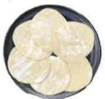
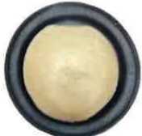
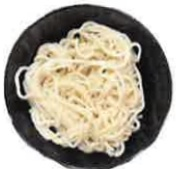
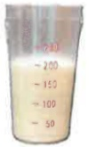
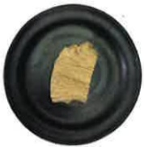
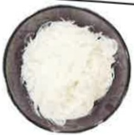
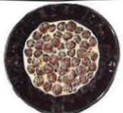
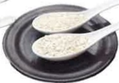
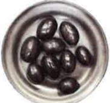

## Dietary Recommendations for Chronic Kidney Disease

## Dietary Substitution Chart and Intake Recommendations

(Calories: ___ kcal/day | Protein: ___ g/day)

| Category | Recommended Portions/Day | Food Substitution Chart |
|---------|--------------------------|--------------------------|
| Staple Foods | Morning:   bowl | Afternoon:   bowl | Evening:   bowl |
| | |  |  |  |  |
| | | 1 bowl of rice = 2 bowls of porridge | = 4 pieces of carrot cake | = 2 slices of toast |
| | |  |  |  |  |
| | | = 1 bowl of rice cake | = 2 bowls of sweet potato | = 12 pieces of rice paper | = 1 bun |
| | |  |  |  |  |
| | | = 1 bowl of rice cake | = 2 bowls of sweet potato | = 12 pieces of rice paper | = 1 bun |
| | |  |  | ※ Items marked with * have low biological value protein and are high in protein; reduce consumption. Prefer rice-based products over wheat-based products. ※ Avoid mixed grains such as millet, brown rice, oatmeal, purple rice, and millet. |
| Vegetables | ___ servings |  |  |  | 100g fresh leafy vegetables (by weight) |
| Soy, Fish, Egg, Meat | Morning:   portions | Afternoon:   portions | Evening:   portions |
| | |  |  |  |  |
| | | 1 egg = 1 cup of soy milk | = 2 tablespoons of minced meat | = 3 shrimp |
| | |  |  |  |  |
| | | = 2 pieces of small soybean tofu | = half a steamed soy bun | = 2 tablespoons of oyster | = 3 fingers of fish, chicken, or pork (size) |

Made by Mei Da Jujube Circle, 21x29.7cm, printed in 2024.06  
Revised in 2024.03, HA-3-0036(2)## E-DA HEALTHCARE GROUP

| Low-nitrogen starch | Breakfast: __ bowl | Lunch: __ bowl | Dinner: __ bowl | 
| :--- | :--- | :--- | :--- |
|       1/2 bowl of rice vermicelli = 1/2 bowl of winter noodles = 1/2 bowl of rice noodles = 1/2 bowl of bean thread (raw weight 15g)         2 spoons of taro starch = 2 spoons of lotus root starch = 1.5 spoons of tapioca starch = 1/2 bowl of seki rice (raw weight 15g)   *Dialysis patients may select according to advice, to replace one meal or serve as a snack supplement* |  |  |  |

| Fruit | —— portion | 
| :--- | :--- |
|       2 lychee fruits, 9 grapes, 5 small pineapples, 3 water plums       1 apple, 1 orange |  |  |
| *Avoid frequent consumption of high-potassium fruits (such as water peach, strawberry, kiwi, Meichong melon, honeydew melon, small tomatoes, banana, cantaloupe, etc.)* |  |  |  |

| Nutritional supplement | —— pack / can | 
| :--- | :--- |
|       |  |  | 

Source: Food substitution table, Ministry of Health and Welfare, National Health Agency, Version 5, 2019  
This copyright is not allowed to be reproduced, printed, or resold without the consent of the copyright holder.

|  |  |  |
| :--- | :--- | :--- |
| **E-DA Hospital Address:** No. 1, Yida Road, Jiaoshu Village, Yancheng District, Kaohsiung City   Phone: 07-6150011 | **E-DA Cancer Treatment Hospital Address:** No. 21, Yida Road, Jiaoshu Village, Yancheng District, Kaohsiung City   Phone: 07-6150022 | **E-DA Dachang Hospital Address:** No. 305, Dachang Road, Sanmin District, Kaohsiung City   Phone: 07-5599123 |

E-DA Healthcare Foundation 21x29.7cm Printed in 2024.06  
Revised in 2024.03 HA-3-0036(2)