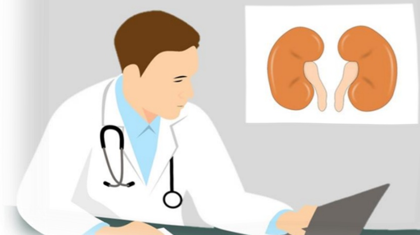
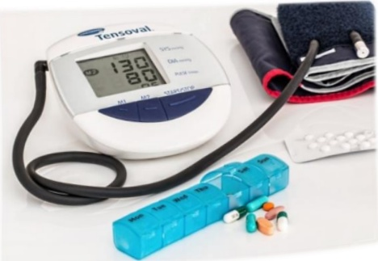

# Chronic Kidney Disease Patient Education Manual EDH E-DA HEALTHCARE GROUP Yida Hospital Yida Cancer Treatment Hospital Yida Da Chang Hospital

## + Preface +

With the trend of population aging, chronic kidney disease has become a significant challenge to human health. The number of patients with end-stage renal disease worldwide continues to rise, leading to increasingly high medical care costs. In Taiwan, the prevalence and incidence of patients with uremia requiring long-term dialysis have consistently ranked first globally. The enormous consumption of medical resources is self-evident. Public awareness of kidney health, prevention of kidney diseases, and control of chronic kidney disease are issues that all citizens must seriously address.

In March 2005, the Nephrology Department team at Yida Healthcare System began actively promoting public education on chronic kidney disease, and in June of the same year, was officially recognized by the Taiwan Nephrology Society as a "Chronic Kidney Disease Health Promotion Institution." In June 2006, the "Chronic Kidney Disease Health Education Room" was formally established, simultaneously launching active initiatives in patient education, individual case management, and continuing education for medical and nursing staff. Subsequently, the institution was recognized by the National Health Bureau as a "Level 1 Chronic Kidney Disease Health Promotion Institution" and was selected among the top five hospitals for excellence. In January 2017, the Yida Healthcare System's nephrology care team, driven by its consistent dedication and commitment to patient service, passed the Clinical Care Program Certification (CCPC) by the Joint Commission International (JCI), becoming the first hospital in Taiwan to have a "End-Stage Renal Disease Care Program" as its focus. Subsequent evaluations, including the second JCI-CCPC assessment and the Chronic Kidney Disease Care Certification by the Medical Council in November 2021, further demonstrate Yida Healthcare System's firm determination and sustained efforts in renal disease care.

To expand its services in chronic kidney disease prevention and management, the Yida Healthcare System has established "Chronic Kidney Disease Health Education Rooms" at Yida Hospital, Yida Cancer Treatment Hospital, and Dachang Hospital. This "Chronic Kidney Disease Health Education Handbook" is the result of collaborative efforts by the Nephrology Department, the Chronic Kidney Disease Health Education Rooms, and the Nutrition Team within the Yida Healthcare System. The content is comprehensive and concise, covering topics such as kidney physiology, causes of kidney disease, related symptoms, laboratory test explanations, treatment principles for medications and diet, and an understanding of renal replacement therapies—including hemodialysis, peritoneal dialysis, and kidney transplantation. Through this handbook, the Yida Healthcare Team sincerely hopes to help patients and their families gain a deeper understanding of kidney disease and to serve as a solid support during their journey in fighting kidney disease.

Dr. Hung Shi-yuan, Deputy Director of Internal Medicine, Yida Hospital  
March 2022## Kidney Location

Normal humans have two kidneys located beneath the rib cage in the posterior abdominal cavity.

The kidneys have an appearance similar to broad beans, with each kidney roughly the size of a fist.

## Kidney Structure

The basic structural unit of kidney tissue is the nephron, which consists of a glomerulus and a renal tubule. Each kidney contains approximately one million nephrons.

The function of the nephron is to filter blood delivered to the kidney, removing excess water, toxins, and electrolytes, thereby forming urine.

## Kidney Functions

## Excretion of metabolic waste

Waste products generated from the digestion and absorption of food, or from metabolic activities of internal organs and muscles, are excreted from the body through the kidneys.

## Regulation of water balance

Excess water in the body is processed by the kidneys into urine and excreted. The more water you consume, the greater the urine output.

## Maintenance of electrolyte balance

The kidneys can excrete excess or reabsorb deficient electrolytes such as sodium (salt), potassium, calcium, and phosphorus, thus regulating the balance of electrolytes in the body.

## Regulation of acid-base balance

The kidneys have the ability to excrete or reabsorb acidic or alkaline substances, preventing acid or alkaline poisoning.

## Secretion of hormones

1. Secretion of renin — regulates blood pressure.  
2. Secretion of erythropoietin (EPO) — promotes red blood cell production.  
3. Activation of vitamin D — helps in the absorption of calcium and phosphorus, maintaining strong bones.## ☑ High-risk groups for chronic kidney disease

· Diabetes  
· Hypertension  
· Gout  
· Family history of kidney disease  
· Advanced age: individuals over 65 years old experience organ degeneration  
· Drug abusers: long-term use of anti-inflammatory pain relievers (non-steroidal anti-inflammatory drugs), unverified herbal remedies, and folk cures  

## Chronic kidney disease is classified into 5 stages based on disease progression  

(Chronic kidney disease in stages 1 and 2 has relatively normal kidney function, so proteinuria must be present for diagnosis!)

| Stage | Disease Progression | eGFR (normal range: 100–125 cc/min) |
|-------|----------------------|-------------------------------------|
| Stage 1 | Normal kidney function Presence of proteinuria | ≥90 |
| Stage 2 | Mild chronic kidney failure Presence of proteinuria | 60–89 |
| Stage 3 | Moderate chronic kidney failure | 30–59 |
| Stage 4 | Severe chronic kidney failure | 15–29 |
| Stage 5 | End-stage kidney disease | <15 |## What is chronic kidney disease?

When kidney function is impaired and remains abnormal for more than three months without recovery, it indicates that one has entered the stage of chronic kidney disease. This signifies irreversible damage to the kidneys. If this condition is ignored or if inappropriate dietary habits, unverified folk remedies, or medications with nephrotoxicity are continued, the already damaged kidneys may suffer further deterioration and quickly progress to end-stage kidney disease (uremia). At this stage, dialysis or kidney transplantation will be required to replace the damaged kidneys.

If you understand your kidneys and take steps to protect them through proper diet and medication, you can delay the progression to end-stage kidney disease and reduce the risk of complications and uncomfortable symptoms.

In the early stages of kidney disease, there are usually no obvious symptoms, making it difficult to detect. By the time symptoms become noticeable, the condition may have already progressed to stages 4 or 5. In end-stage kidney disease, symptoms of general discomfort are more common.

## Symptoms of Chronic Kidney Disease

## Urinary symptoms:

In the early stage, symptoms include nocturia, polyuria, and proteinuria; in the late stage, there is usually decreased urine output.

## Neurological symptoms:

Fatigue, dizziness, headache, weakness, drowsiness, confusion, and coma.

## Cardiovascular and pulmonary symptoms:

Shortness of breath, edema, pulmonary congestion, heart failure, hypertension, pericarditis, etc.

## Gastrointestinal symptoms:

Nausea, vomiting, loss of appetite, oral odor of urine, gastrointestinal bleeding, constipation, and diarrhea.

## Hematological symptoms:

Anemia, easy bleeding (such as nosebleeds, gingival bleeding, skin bruising), weakened immunity, and increased susceptibility to infection.

## Endocrine and metabolic symptoms:

Decreased sexual function, elevated lipid levels, hyperparathyroidism, and impaired glucose tolerance.

## Skin, muscle, and skeletal symptoms:

Skin appears pale, itchy, with urea crystals on the skin, and darkened color.

Muscle and skeletal symptoms—muscle cramps, lower back and shoulder pain, bone pain.

When these symptoms appear, one should be alert that the kidneys can no longer meet the body's needs. Especially when dangerous signs such as shortness of breath, chest tightness, or changes in consciousness occur, medical attention should be sought immediately to avoid life-threatening complications.## Chronic Kidney Disease: Testing and Clinical Significance

## Urine Protein (normal value < 150 mg/day):

Physiological proteinuria may occur in healthy individuals after exercise, before menstruation in women, or during fever. However, persistent proteinuria is often indicative of kidney disease.

## Glucosuria (normal is negative):

Glucosuria can occur in kidney disease, even when blood glucose levels remain normal—this is known as renal glucosuria. However, if blood glucose levels are elevated as well, diabetes may be suspected.

## Blood Urea Nitrogen (BUN) (normal value: 6–20 mg/dL):

BUN is a byproduct of protein metabolism. When kidney function is impaired, the excretion of urea nitrogen is affected, leading to elevated serum BUN levels. However, BUN levels are easily influenced by diet and medications, so diagnosis should be made in conjunction with creatinine test results.

## Creatinine

###### (men: 0.72–1.18 mg/dL, women: 0.55–1.02 mg/dL):

Creatinine is a byproduct formed from the breakdown of creatine in muscle tissue. It is not affected by food or medication, making it a more accurate marker for kidney function than BUN. However, creatinine levels vary depending on body size and muscle mass. Generally, men with more muscular build have higher creatinine values than women with smaller body frames.

#### Hemoglobin (Hb) (men: 13.5–17.5 g/dL, women: 12–16 g/dL):

Hemoglobin refers to the ratio of red blood cells in the blood. Patients with chronic kidney failure often lack erythropoietin (EPO), and the accumulation of urinary toxins accelerates red blood cell destruction, leading to anemia. Hemoglobin levels can be used to assess the severity of anemia and to guide treatment with EPO injections.

#### Albumin (normal value: 3.8–5.3 g/dL):

Albumin is a key substance that maintains plasma osmotic pressure. Renal patients often develop hypoalbuminemia due to poor appetite and low-protein diets.## Fasting Blood Glucose Glucose AC (normal range: 70–100 mg/dl):

It is the glucose concentration in the blood after an 8-hour fast, and can serve as the most basic screening method for diabetes.

## Sodium Na (normal range: 136–145 mEq/L):

Sodium ions are essential for maintaining the stability of body fluids (water balance). Severe dehydration or excessive sodium intake can lead to elevated blood sodium levels; conversely, in patients with renal failure who suffer from diarrhea or vomiting, blood sodium levels may decrease. Both excessively high and low sodium levels can disrupt the accumulation and distribution of body fluids.

#### Potassium K (normal range: 3.5–5.1 mEq/L):

Potassium ions play a role in stimulating nerve and muscle activity. Low blood potassium can cause generalized weakness and fatigue, while high blood potassium may lead to arrhythmias, even cardiac arrest. In patients with renal disease, as kidney function declines, potassium excretion decreases, increasing the risk of hyperkalemia. However, in cases of severe vomiting, diarrhea, overly restrictive diet, or use of diuretics, hypokalemia may occur.

#### Calcium Ca (normal range: 8.8–10.2 mg/dl):

In the human body, 99% of calcium is stored in bones in the form of calcium phosphate, with only 1% present in the blood. However, this 1% of blood calcium is crucial for maintaining stable nerve and muscle function. Patients with chronic renal failure are prone to hypocalcemia due to deficiency of active vitamin D, hyperphosphatemia, and malnutrition.

#### Phosphorus P (normal range: 2.7–4.5 mg/dl):

Phosphorus and calcium exist in the body in a balanced state. When renal function declines, phosphorus cannot be fully excreted by the kidneys and accumulates in the body, leading to calcium-phosphorus imbalance. Over time, this stimulates the secretion of parathyroid hormone, creating a vicious cycle that may eventually result in secondary hyperparathyroidism.## Dietary Principles for Chronic Kidney Disease

## Objective:

When the kidneys become diseased, they are unable to excrete nitrogenous waste from the body, leading to an accumulation of nitrogenous waste in the blood. In severe cases, this can cause imbalances in body electrolytes. Therefore, dietary treatment for kidney disease must be adjusted according to the progression of the condition to correct imbalances in body water, acid-base balance, and electrolytes, maintain appropriate nutritional status, and reduce the risk of complications.

## Dietary Principles:

### 1. Maintain Adequate Caloric Intake

The principle should be to maintain ideal body weight. While controlling protein intake, sufficient caloric intake must also be ensured.

- When caloric intake is adequate, ingested protein can be utilized most efficiently, resulting in minimal production of uremic toxins.
- Inadequate caloric intake often leads to tissue breakdown, increasing the production of nitrogenous waste.

### 2. Limit Protein Intake

Excessive protein intake in the diet increases renal blood flow, leading to hypertension within the glomeruli and placing additional stress on the kidneys, thereby damaging kidney function.

It is recommended that 1/2 to 2/3 of the protein intake should come from high biological value protein sources, such as eggs, pork, chicken, duck, fish, beef, and soy-based foods like tofu, soybean curd, and bean buns. High biological value proteins are efficiently utilized in the body, produce fewer uremic toxins, and help prevent muscle wasting.

· Protein restriction guidelines:

(1) For patients in the early stages of chronic kidney disease, the recommended protein intake is the same as that for healthy individuals—0.8 to 1.0 grams per kilogram of body weight.

(2) For patients in stage three or later of chronic kidney disease, protein intake should be limited to 0.6 to 0.8 grams per kilogram of body weight. If blood glucose levels are stable and nutritional status is good, and if further dietary control is desired, protein intake can be reduced to 0.6 grams per kilogram under the guidance of a dietitian.Under restricted protein intake, the following low-protein foods can provide caloric supplementation:

| Low-protein starches | Winter noodles, rice noodles, noodle sheets, lotus root starch, tai bai starch, corn starch, cassava starch, bean paste, xigui rice, sweet potatoes; 1–2 bowls per day are sufficient. |
|----------------------|---------------------------------------------------------------------------------------------|
| Sugars | White sugar, fructose, rock sugar, honey, candies, etc. These sugars can be added to the aforementioned low-protein starches to increase caloric intake. However, in cases of poor blood glucose control, the use of pure sugars should be discussed with relevant healthcare professionals. |
| Fats | Adequate fat intake is essential to meet caloric needs. Suitable oils such as vegetable oils or blended oils (e.g., olive oil, salad oil) can be used for cooking. |
| Glucose polymers | Glucose paste, powdered glucose paste, ginseng sprout dextrin, etc. These can be consumed daily with drinking water to increase caloric intake. |

## · The portion size of low-protein starch is as follows (see table below):

= 1/2 bowl of cooked winter noodles  
= 20 grams of dried noodle sheets  
Low-protein starch  
= Raw xigui rice, raw bean paste, lotus root starch, clear starch  
Tai bai starch, corn starch, cassava starch, each 2 tablespoons## Dietary Principles for Chronic Kidney Disease

· The following plant-based proteins have lower biological value and should be consumed in limited amounts under protein restriction:

Legumes  
soybeans, red beans, lentils, broad beans, mung beans, green bean meal  

Nuts  
peanuts, sunflower seeds, cashews, walnuts, almonds, pistachios, macadamia nuts, sesame seeds  

Gluten-based foods  
gluten, instant noodles, baked gluten, noodle wheels  

### 3. Principle of Phosphorus Restriction

Abnormal blood phosphorus levels can lead to bone and vascular lesions and may also damage kidney function. Therefore, reducing dietary phosphorus intake and decreasing phosphorus absorption are key aspects of dietary management for patients with chronic kidney disease.

For patients with high blood phosphorus levels, even reducing the intake of high-phosphorus foods may not be sufficient to maintain normal blood phosphorus levels. Thus, phosphorus binders (calcium supplements) should be taken during meals to reduce phosphorus absorption from food and help lower blood phosphorus levels.

For patients with low blood phosphorus, which may be related to malnutrition or treatment, consultation with a physician and a dietitian is recommended.• Foods high in phosphorus (to be consumed in limited amounts):

| Category       | Examples                                                                 |
|----------------|--------------------------------------------------------------------------|
| Dairy products | Fresh milk, goat milk, colostrum, yogurt, cheese, kefir, lactose drinks, bread and cookies containing cheese or cheese products |
| Whole grains   | Rice, brown rice, millet, eight-ingredient porridge, mixed grain powder, corn, yam, lotus seed |
| Dry beans      | Red bean, green bean, soybean, black bean, broad bean, mung bean, fava bean, green bean |
| Nuts           | Peanut, sesame seed, cashew, walnut, almond, pistachio, hazelnut, and other nuts, as well as their products such as peanut soup, peanut candy, gongtang, sesame porridge, sesame powder, rice milk, and sesame paste |
| Stewed nourishing foods | Lamb stew, ginger mother duck, sesame chicken, meat paste, beef broth, beef soup, chicken soup, hot pot broth, chicken seasoning |
| Organs         | Animal organs, egg yolk, black fish eggs, crab roe |
| Others         | Carbonated drinks such as cola and soda, chocolate, meat products (fish paste, pork paste, sausage, ham, smoked meat, dried meat), bone-containing fish (winki fish, shrimp, small fish dried, katsuobushi), various soups (stewed noodles/rice, meat soup noodles, squid soup noodles, spicy and sour soup, curry rice, ready-to-eat meal packs), spaghetti, salad dressing, cheese burger, pizza |## ☑ Dietary Principles for Chronic Kidney Disease

### 4. Principle of Limiting "Potassium" Intake

Chronic kidney disease patients are more prone to hyperkalemia when their urine output is less than 1000 ml. If blood tests show elevated potassium levels during the progression of kidney disease, dietary potassium intake should be restricted according to the advice of a doctor or nutritionist.

· When blood potassium levels are high, the following dietary practices can be adopted to reduce potassium intake.

| Food Category | Dietary Recommendations |
|--------------|-------------------------|
| Vegetables | · Boil for 3–5 minutes, then drain and cook or stir-fry with oil · Avoid vegetable soups, meat broths, and raw lettuce |
| Fruits | · Do not exceed 2 servings per day (approximately the size of two baseballs) · Avoid high-potassium fruits (refer to potassium content table for fruits) |
| Soups | · Both vegetable and meat soups contain high levels of potassium · Avoid concentrated soups, thickened dishes, and meals seasoned with meat broth |
| Beverages | · Avoid fruit juices, coffee, monosodium glutamate (MSG), ginseng extract, and sports drinks · Plain boiled water is the best choice |
| Seasoning | · Do not use low-sodium salts, health-enhancing salts, light salts, or salt-free soy sauce that replace sodium with potassium · Use regular table salt instead |
| Other Foods | · Nuts, chocolate, plum juice, tomato sauce, golden citron sauce, dried fruits, and traditional Chinese herbal soups all have high potassium content and should be consumed with caution |

Fruit Restrictions: Avoid consuming bitter melon and its products, as they contain an unidentified neurotoxin. Many chronic kidney disease patients who consume them may experience severe symptoms such as excessive belching, numbness in limbs, and mental disturbances, and in severe cases, death may occur.## · Potassium content in fruits:

## Serving size of 1 fruit (in grams)

| Potassium content per serving (< 200 mg) | Potassium content per serving (> 200–300 mg) | Potassium content per serving (> 300 mg) |
|-----------------------------------------|---------------------------------------------|------------------------------------------|
| As recommended by nutritionists        | As recommended by nutritionists            | Avoid consumption                       |
| = 1 apple (small, 165g) = 1 water pear (small, 200g) = 1 slice of pineapple (peeled, 130g) = 1 citrus fruit (small, 190g) = 1 mandarin (170g) = 3/4 of a grapefruit (250g) = 1 small slice of watermelon (320g) = 2 loquats (180g) = 10 grapes (120g) = 1 Fuji apple (small, 160g) = 9 cherries (85g) | = 1 small slice of red watermelon (peeled, 250g) = 1/4 of a papaya (190g) = 1/3 of a papaya (large, 160g) = 2 slices of white tangerine (peeled, 165g) = 1 rose peach (120g) = 1/2 of a rambutan (105g) = 2 chestnuts (140g) | = 1 slice of honeydew melon (220g) = 2/3 of a mikan (peeled, 165g) = 20 cherry tomatoes (175g) = 3/2 of a kiwi (120g) = 1 peach (220g) = 13 strawberries (small, 160g) = 330ml coconut water |## Dietary Principles for Chronic Kidney Disease

### 5. Principle of Limiting "Sodium" Intake

When edema, hypertension, or congestive heart disease is present, sodium restriction is required.

· Foods high in salt or sodium include:

| Category       | Examples |
|---------------|---------|
| Grains        | Noodles, oil noodles, bread, toast, snacks such as soda crackers, shrimp sticks, potato chips, dried fish threads, salty/sweet biscuits, etc. |
| Fruits        | Honey jam, fruit canned goods and juices such as tomato juice, loquat juice, etc. |
| Vegetables    | Pickles, salted vegetables, preserved vegetables, kelp, fermented vegetables, purple laver, dried bamboo shoots, salted frozen vegetables such as soybeans, green beans, and vegetable corn cans, etc. |
| Eggs and Dairy | Salted eggs, preserved eggs, cheese, etc. |
| Meat and Fish | Cured meats, ham, sausages, salted fish, salted pork, canned foods, fish balls, goan balls, dried meat, etc. |
| Fats          | Cream, mayonnaise, salad dressing, mayonnaise, roasted peanuts, etc. |
| Seasonings    | Monosodium glutamate (MSG), black vinegar, miso, bean paste, tomato sauce, oyster sauce, shrimp paste, tofu paste, pineapple bean paste, wasabi paste, Korean seasonings, pao pu zi, wasabi paste, nori paste, satay sauce, sweet soy sauce, etc. |
| Others        | Chicken seasoning, beef seasoning, nori paste, instant soups, instant noodles, etc. |

You may use seasonings such as scallions, ginger, garlic, five-spice powder, cinnamon, Sichuan pepper, cilantro, star anise, white vinegar, alcohol, lemon juice, etc., to enhance the flavor of food.

Check food labels: Foods with a sodium-to-calorie ratio less than 0.5 are considered low-sodium.

Avoid overly restricting sodium intake to prevent hypotonic sodium levels.### 6. Principles of Water Restriction Diet

- For chronic kidney disease patients who exhibit severe edema and are advised by their doctor to limit fluid intake, daily fluid intake should be estimated as the previous day's urine output plus 500 to 700 milliliters of water, or based on the principle of avoiding edema.

(Daily body weight change should not exceed 0.5 kilograms)

· Tips for fluid control:

(1) Monitor daily body weight changes.

(2) Avoid consuming soups and broths.

For example, during strict fluid restriction, avoid soups, vegetable broth, meat broth, and drinks.

(3) Prefer solid foods over liquid foods.

For example, dry rice is better than thin rice porridge.

(4) Techniques to keep the mouth moist.

For example, you can rinse your mouth or chew on small ice cubes, cool chewing gum, or lemon slices to quench thirst.

(5) Place the daily fluid intake in a bottle to effectively manage fluid consumption.

(6) Drink warm plain water, in doses of 15–30 c.c. at a time.

· Be mindful of hidden water content in foods, such as lotus root, aiyu, and jelly, which have high water content and should be consumed in moderation.7. Do not arbitrarily use folk remedies or herbal medicines, as this may increase the kidneys' burden.

8. Follow medical advice to supplement appropriate amounts of vitamins and minerals.

### 9. Other Notes:

Patients with cardiovascular diseases should reduce their intake of fats and choose plant-based healthy fats, which can help control blood cholesterol levels, reduce the risk of atherosclerosis, and lower the likelihood of blood clots.

(1) Choose oils with higher unsaturated fat content during cooking, such as: canola oil, soybean salad oil, olive oil, sunflower oil, corn oil, safflower oil, bitter tea oil, flaxseed oil, etc.

(2) Reduce intake of foods high in saturated fats and trans fats, such as: fatty meats, fatty skin, fried foods, oily pastries, lard, ghee, full-fat dairy, cream, coconut oil, and lactose-based products like lactose.

Since each patient's condition is different, for more detailed information, please contact a dietitian for personalized dietary guidance.

10. Snack Choices:

| Salty Foods | Stir-fried rice noodles, stir-fried winter noodles, stir-fried rice vermicelli, bowl rice cake, crystal dumplings, oyster omelet (without egg), rice roll |
| Sweet Foods | Rice cake, bean paste, sweet rice, cold cake, taro cake, jelly, ice cream, sesame cake, sweet potato chips, tea jelly, osmanthus, lotus root soup, etc. |

### 11. Example of Low-Protein Snacks: (Serves 1)

## Preparation:

1. Mix the lotus root flour and sugar with cold water until well combined. Cook over low heat while continuously stirring until it reaches a semi-transparent paste consistency.

2. After removing from heat, add the powdered sweetener and stir until fully blended.

### 12. Selection of Commercial Formulas

| Name                     | Specification       | Energy (kcal) | Protein (g) |
|-------------------------|---------------------|---------------|-------------|
| Bei Su Li                | 200 ml per can      | 400           | 6           |
| Li Zeng Yin 10%         | 237 ml per can      | 425           | 10.6        |
| Ya Pei Ren Bu Na        | 237 ml per can      | 425           | 10.6        |
| San Tuo Bu Ti Kang LPF Nutritional Formula | 240 ml per can | 425           | 8.5         |
| Senyong Low Phosphorus and Potassium Milk Powder (LPK) | 20 g per pack | 91.8          | 3           |
| Yi Fu Yi Neng Chong     | 50 g per pack       | 201           | 0.8         |
| San Tuo Low-Protein Milk Powder (LPF) | 50 g per pack | 242           | 3.9         |## Treatment Principles of Chronic Kidney Disease

## Adhering to Medication Prescriptions:

It is very important to understand and strictly follow the medication prescriptions prescribed by a nephrologist. Especially, avoid taking unverified medications or folk remedies, as this may further damage the kidneys. Generally, for chronic kidney disease, physicians will prescribe the following medications:

· Hypertension medications: When hypertension symptoms are present, the high vascular pressure can cause ongoing kidney damage. Therefore, antihypertensive drugs are needed to treat hypertension.

Glucose-lowering medications: Diabetic patients need to maintain their blood glucose levels within a normal range to prevent deterioration of kidney function.

· Phosphate binders: Calcium or aluminum supplements are commonly used as phosphate binders. When kidney function drops to 30–35%, the body's ability to excrete phosphate decreases, leading to phosphate accumulation in the body. Since phosphorus is ubiquitous in our daily diet, in addition to dietary control, phosphate binders are necessary to coat dietary phosphorus and expel it directly from the gastrointestinal tract, preventing the body from absorbing phosphate ions.

Iron supplements: Iron is a raw material for blood production. Patients with chronic kidney disease may suffer from iron deficiency due to long-term dietary imbalance and may need to take iron supplements as prescribed by their doctor.

Erythropoietin (EPO): This hormone injection helps stimulate blood cell production and is most effective in improving anemia.## Moderate exercise:

Developing the habit of moderate physical activity—such as walking, cycling, or practicing stretching exercises—for 10 to 15 minutes each day can not only improve anemia but also help in managing body weight and blood pressure.

## Proper kidney care:

· Maintain a regular sleep schedule, avoid smoking and alcohol consumption.

Do not take unverified folk remedies or traditional Chinese or herbal medicines without guidance.

When visiting a doctor, inform the physician of your chronic kidney disease and avoid self-medicating with painkillers, antibiotics, or over-the-counter medications.

Follow the recommendations of a nephrologist for regular follow-up visits, and discuss treatment plans with your doctor, nurse educator, and dietitian.

• For diabetic patients, keep fasting blood glucose levels below 125 mg/dl. HbA1C should be below 7%.

• Measure blood pressure and body weight at fixed times daily. Blood pressure should be kept below 130/80 mmHg.

## ☑ Kidney Replacement Therapy: Shared Decision-Making, Kidney "Strike," What Should I Do?

When the course of kidney disease has progressed to the end-stage of chronic renal failure, it means the kidneys' function has gradually become unable to meet the body's demands. Toxins, electrolytes, and even fluids begin to accumulate in the body and are no longer effectively excreted (some patients may have frequent urination, but because most toxins remain in the body and are not excreted, their urine appears pale and watery). Especially when kidney function (eGFR) drops to just 5–10 ml/min, medication and dietary management are typically no longer effective in controlling the condition. At this stage, kidney replacement therapy must be chosen to take over the functions of severely damaged kidneys, thereby extending your life and enabling you to maintain a certain quality of life.

When a patient reaches stage 5 of chronic kidney disease, they can begin considering and preparing for kidney replacement therapy (dialysis). To ensure that you and your family fully understand kidney replacement therapy, or if you and your family are unclear about how to choose the appropriate form of therapy, it is recommended that you seek professional medical and nursing advice and work together with healthcare providers to discuss your options. This shared decision-making process will enhance your understanding and awareness of kidney replacement therapy and help you select the most suitable treatment for your individual needs.

Kidney replacement therapy includes hemodialysis, peritoneal dialysis, and kidney transplantation. Each of these treatment methods has its own advantages and disadvantages. With current medical technology, all three options offer high-quality care. Below, we will introduce each method in detail, aiming to help you establish a correct understanding of uremic treatment and serve as a reference for your future treatment decisions.

## Hemodialysis

Hemodialysis involves using an extracorporeal circulation to purify the blood. First, a surgical procedure is performed to establish a venous-arterial shunt, after which dialysis treatment can begin one to three months later. During treatment, two needles are inserted into the shunt. Blood flows out through one needle into the outside environment, where it passes through an artificial kidney to remove toxins and excess water. The purified blood is then returned to the body through the other needle.

Patients attend the hemodialysis center three times per week, with each session lasting approximately four hours. Since hemodialysis cannot continuously remove waste substances from the blood like a normal kidney does, patients must strictly limit their diet, especially restricting salt, water, and potassium intake.

## Peritoneal Dialysis

Commonly known as "washing the abdomen," peritoneal dialysis involves injecting dialysis fluid into the peritoneal cavity (without directly contacting abdominal organs). Waste products and excess fluids in the small blood vessels within the peritoneal cavity are removed through the peritoneal membrane and transferred into the dialysis fluid, which is then expelled from the body.

To undergo peritoneal dialysis, a surgical procedure is required to place a peritoneal dialysis catheter into the abdominal cavity. After approximately 7–10 days of wound healing, peritoneal dialysis treatment can begin.

The amount of dialysis fluid to be injected during peritoneal dialysis is determined based on body size and the patient's uremic clearance status. For adults, the typical volume injected per session is about 1500–2000 cc.

The peritoneal dialysis process involves first draining the dialysis fluid that has accumulated waste and excess fluid from the abdomen, then injecting fresh dialysis fluid. After separating the tubing, patients can resume normal activities. Each fluid exchange takes about 30 minutes, with approximately 4–5 exchanges performed per day.

Peritoneal dialysis is divided into two types: continuous peritoneal dialysis (requiring about 4–5 exchanges daily) and automated peritoneal dialysis (where the machine automatically performs fluid exchanges overnight, and exchanges are not required during the day).

Continuous Peritoneal Dialysis  
Automated Peritoneal Dialysis## Comparison of Dialysis Methods

## Comparison between Peritoneal Dialysis and Hemodialysis

| Property | Continuous Ambulatory Peritoneal Dialysis (CAPD) | Automated Peritoneal Dialysis (APD) | Hemodialysis (HD) |
|---------|--------------------------------------------------|--------------------------------------|-------------------|
| Treatment Provider | Patient or family member | Patient or family member | Medical personnel |
| Dialysis Access | Peritoneal dialysis catheter | Peritoneal dialysis catheter | Arteriovenous fistula |
| Dialysis Method | Insert needle, inject dialysate through catheter, leave dialysate in peritoneal cavity for 4–6 hours to purify blood, then drain the dialysate and inject fresh dialysate. This is known as one exchange. | Insert needle, connect and disconnect once daily, with automated peritoneal dialysis machine (APD) performing the injection and drainage of dialysate to complete treatment. | Each session requires inserting two needles into the arteriovenous fistula: one end draws blood out of the body for purification, and the other returns the purified blood back into the body. |
| Duration of Treatment | Perform 4–5 exchanges daily, each exchange takes about 20–30 minutes; continuous dialysis throughout 24 hours | Exchange performed by automated peritoneal dialysis machine (APD) during nighttime sleep/rest periods | Three sessions per week, each session lasting 4–5 hours |
| Treatment Schedule | Flexible, adjustable according to personal routine | Performed during nighttime sleep/rest periods | Follows fixed schedule arranged by the hospital |
| Treatment Location | At home, workplace, or any clean place | At home, workplace, or any clean place | Hospital hemodialysis room |
| Maintenance of Residual Kidney Function | Residual kidney function maintained for a longer period | Residual kidney function maintained for a longer period | Residual kidney function lost more quickly |
| Rate of Fluid and Toxin Clearance and Changes in Blood Biochemistry | Slower clearance rate, stable changes in blood biochemistry | Slower clearance rate, stable changes in blood biochemistry | Faster clearance rate, but significant fluctuations in blood biochemistry |
| Diet | No restrictions on potassium or fluid (except in severe hypertension and edema), moderate salt intake recommended, encourage high protein intake (1–1.2 gm/kg) | No restrictions on potassium or fluid (except in severe hypertension and edema), moderate salt intake recommended, encourage high protein intake (1–1.2 gm/kg) | Limited in potassium, fluid, and protein (0.8–1.0 gm/kg), no special restriction on salt intake (except for diabetics) |
| Blood Pressure Control | Continuous fluid removal, blood pressure easier to control | Continuous fluid removal, blood pressure easier to control | Limited in potassium, fluid, and protein (0.8–1.0 gm/kg), no special restriction on salt intake (except for diabetics) |
| Anemia Level | No blood loss, milder anemia | No blood loss, milder anemia | Only dialyzed every two days; blood pressure is high before dialysis but drops after dialysis |
| Complications During Treatment | No needle insertion required; due to steady removal of fluid and toxins, no dialysis disequilibrium syndrome occurs | No needle insertion required; due to steady removal of fluid and toxins, no dialysis disequilibrium syndrome occurs | Due to potential blood loss, complications are more severe |
| Quality of Life During Treatment (Impact of dialysis on daily life) | Patient performs peritoneal dialysis independently, adjusts schedule according to personal routine, helps maintain original quality of life | Nighttime APD performs peritoneal dialysis, minimal impact on daily life, helps maintain original quality of life | Painful needle insertion; due to rapid removal of fluid and toxins, more prone to dialysis disequilibrium syndrome (headache, nausea, vomiting, hearing disturbances, hypertension or hypotension) |## Kidney Transplantation

Commonly known as "kidney exchange," kidney transplantation involves implanting a donor's kidney into a recipient to replace the damaged kidney and continue normal function.

The procedure is performed through surgery, during which the donor's kidney and ureter are implanted into the recipient's pelvis and connected to the bladder wall. In Taiwan, sources of donated kidneys are divided into living donor transplantation and deceased donor transplantation.

• Living donor transplantation: Limited to first-degree relatives (five-degree relatives) of the recipient. In addition to verifying tissue compatibility between donor and recipient, the donor's kidney function and renal vascular function must also be evaluated. Generally, the survival rate of kidneys from living donors is higher than that from deceased donors.

• Deceased donor transplantation: Recipients who wish to undergo deceased donor transplantation must first complete kidney transplantation registration at a hospital and submit various medical reports. When a suitable kidney becomes available, the recipient who meets the criteria and has the best tissue match will undergo transplantation at the registered hospital.## Yida Medical Nephrology Service Team

## Yida Hospital:
Hung Shi-yuan MD, Chang Min-yu MD, Wang Xi-hao MD  
Li Yi-zhe MD, He Li-jun MD, Chen Qing-ying MD  
Chen Yan-bo MD

## Yida Cancer Treatment Hospital:
• Wu Qing-fang MD • Lin Yi-cheng MD

## Yida Da Chang Hospital:
• Ji Bo-wei MD • Zheng Kai-ren MD • Zhang Zhen-zhong MD

| Department           | Roles                                                                 |
|----------------------|------------------------------------------------------------------------|
| Yida Hospital        | Chronic Kidney Disease Case Manager: Li Zi-rong, Kang Jia-qi, Xie Hui-jun |
|                      | Hemodialysis Department Head Nurse: Wang Jia-yan, Liang Jia-fen         |
|                      | Peritoneal Dialysis Technical Team Leader: Lin Shu-lin                  |
| Yida Cancer Treatment Hospital | Chronic Kidney Disease Case Manager: Gao Cai-you                     |
|                      | Hemodialysis Department Head Nurse: Chen Shu-qin                        |
| Yida Da Chang Hospital | Chronic Kidney Disease Case Manager: Yan Miao-fang                     |
|                      | Hemodialysis Department Head Nurse: Zhong Mei-ting                     |
|                      | Peritoneal Dialysis Technical Team Leader: Lin Yin-jin                 |

## Welcome to call for inquiries regarding kidney-related issues,

## The Yida Hospital Nephrology Service Team is ready to serve you.

Yida Hospital Nephrology Clinic: (07)615-0011 ext. 5133 or 5135  
Yida Da Chang Hospital Nephrology Clinic: (07)559-9123 ext. 7292  
Yida Cancer Treatment Hospital Nephrology Clinic: (07)615-0022 ext. 6430## Kidney Disease Health Passport

Name: ___ Gender: ☐ Male ☐ Female

Date of Birth: ___ year ___ month ___ day

Phone: ___

Address: ___

Date of Passport Issuance: ___ year ___ month ___ day

Height: ___ Weight: ___ Ideal Weight: ___

Allergies to Medications: ___

Other Related Diseases: ☐ Diabetes ☐ Hypertension ☐ Hyperlipidemia ☐ Cardiovascular Disease ☐ Liver Disease

Emergency Contact: ___

Phone: ___Hospital: Yida Medical Foundation ____

Doctor: ____

Personal Health Manager: ____

Dietitian: ____

Yida Hospital: (07)615-0011

Nephrology Health Education Office: please transfer to 5133 or 5135

Yida Cancer Treatment Hospital: (07)615-0022

Nephrology Health Education Office: please transfer to 6430

Yida Da Chang Hospital: (07)559-9123

Nephrology Health Education Office: please transfer to 7292
Standard Values for Various Indicators

| Test Item | Standard Value |
|----------|----------------|
| Hemoglobin (Hb) | Men: 13.5~17.5 g/dl; Women: 12~16 g/dl |
| Blood Urea Nitrogen (BUN) | 6~20 mg/dl |
| Creatinine | Men: 0.72~1.18 mg/dl; Women: 0.55~1.02 mg/dl |
| Uric Acid | <7 mg/dl |
| Sodium (Na) | 136~145 mEq/L |
| Potassium (K) | 3.5~5.1 mEq/L |
| Calcium (Ca) | 8.8~10.2 mg/dl |
| Phosphorus (P) | 2.7~4.5 mg/dl |
| Albumin | 3.8~5.3 g/dl |
| Cholesterol | <200 mg/dl |
| Triglyceride | <150 mg/dl |
| High-Density Lipoprotein (HDL) | >40 mg/dl |
| Low-Density Lipoprotein (LDL) | <140 mg/dl |
| Blood Glucose | Fasting: 70~100 mg/dl; 2 hours post-meal: <140 mg/dl |
| Hemoglobin A1c (HbA1c) | Non-diabetic: <5.7%; Diabetic: <7.0% |
| Urine Protein | UPCR <150 mg/g; UACR <30 mg/g |
| Liver Function (GPT) | 4~44 U/L |## Visit Record Check

| Item                  |  |  |  |  |
|-----------------------|---|---|---|---|
| Body Weight           |   |   |   |   |
| Hb                    |   |   |   |   |
| BUN                   |   |   |   |   |
| Creatinine            |   |   |   |   |
| Uric acid             |   |   |   |   |
| Na                    |   |   |   |   |
| K                     |   |   |   |   |
| Ca                    |   |   |   |   |
| P                     |   |   |   |   |
| Albumin               |   |   |   |   |
| Cholesterol           |   |   |   |   |
| Triglyceride          |   |   |   |   |
| HDL                   |   |   |   |   |
| LDL                   |   |   |   |   |
| Blood Sugar           |   |   |   |   |
| HbA1c                 |   |   |   |   |
| Urine Protein (UPCR)  |   |   |   |   |
| Microalbuminuria (UACR) |   |   |   |   |
| Liver Function (GPT)  |   |   |   |   |
| HCO3-                 |   |   |   |   |
| eGFR                  |   |   |   |   |## Visit Record Review

| Date |  |  |  |  |
| --- | --- | --- | --- | --- |
| Body Weight |  |  |  |  |
| Hb |  |  |  |  |
| BUN |  |  |  |  |
| Creatinine |  |  |  |  |
| Uric acid |  |  |  |  |
| Na |  |  |  |  |
| K |  |  |  |  |
| Ca |  |  |  |  |
| P |  |  |  |  |
| Albumin |  |  |  |  |
| Cholesterol |  |  |  |  |
| Triglyceride |  |  |  |  |
| HDL |  |  |  |  |
| LDL |  |  |  |  |
| Blood Sugar |  |  |  |  |
| HbA1c |  |  |  |  |
| Urine Protein (UPCR) |  |  |  |  |
| Microalbuminuria (UACR) |  |  |  |  |
| Liver Function GPT |  |  |  |  |
| HCO3- |  |  |  |  |
| eGFR (Renal Sodium Glomerular Filtration Rate) |  |  |  |  |

## Yida Medical Neurology## Visit Record Check

| Item                  |  |  |  |  |
|-----------------------|---|---|---|---|
| Body Weight           |   |   |   |   |
| Hb                    |   |   |   |   |
| BUN                   |   |   |   |   |
| Creatinine            |   |   |   |   |
| Uric acid             |   |   |   |   |
| Na                    |   |   |   |   |
| K                     |   |   |   |   |
| Ca                    |   |   |   |   |
| P                     |   |   |   |   |
| Albumin               |   |   |   |   |
| Cholesterol           |   |   |   |   |
| Triglyceride          |   |   |   |   |
| HDL                   |   |   |   |   |
| LDL                   |   |   |   |   |
| Blood Sugar           |   |   |   |   |
| HbA1c                 |   |   |   |   |
| Urine Protein (UPCR)  |   |   |   |   |
| Microalbuminuria (UACR) |   |   |   |   |
| Liver Function (GPT)  |   |   |   |   |
| HCO3-                 |   |   |   |   |
| eGFR                  |   |   |   |   |## Visit Record Review

| Date |  |  |  |  |
| --- | --- | --- | --- | --- |
| Body Weight |  |  |  |  |
| Hb |  |  |  |  |
| BUN |  |  |  |  |
| Creatinine |  |  |  |  |
| Uric acid |  |  |  |  |
| Na |  |  |  |  |
| K |  |  |  |  |
| Ca |  |  |  |  |
| P |  |  |  |  |
| Albumin |  |  |  |  |
| Cholesterol |  |  |  |  |
| Triglyceride |  |  |  |  |
| HDL |  |  |  |  |
| LDL |  |  |  |  |
| Blood Sugar |  |  |  |  |
| HbA1c |  |  |  |  |
| Urine Protein (UPCR) |  |  |  |  |
| Microalbuminuria (UACR) |  |  |  |  |
| Liver Function GPT |  |  |  |  |
| HCO3- |  |  |  |  |
| eGFR (Renal Sodium Glomerular Filtration Rate) |  |  |  |  |

## Yida Medical Neurology## Visit Record Check

| Item                  |  |  |  |  |
|-----------------------|---|---|---|---|
| Body Weight           |   |   |   |   |
| Hb                    |   |   |   |   |
| BUN                   |   |   |   |   |
| Creatinine            |   |   |   |   |
| Uric acid             |   |   |   |   |
| Na                    |   |   |   |   |
| K                     |   |   |   |   |
| Ca                    |   |   |   |   |
| P                     |   |   |   |   |
| Albumin               |   |   |   |   |
| Cholesterol           |   |   |   |   |
| Triglyceride          |   |   |   |   |
| HDL                   |   |   |   |   |
| LDL                   |   |   |   |   |
| Blood Sugar           |   |   |   |   |
| HbA1c                 |   |   |   |   |
| Urine Protein (UPCR)  |   |   |   |   |
| Microalbuminuria (UACR) |   |   |   |   |
| Liver Function (GPT)  |   |   |   |   |
| HCO3-                 |   |   |   |   |
| eGFR                  |   |   |   |   |## Visit Record Review

| Date |  |  |  |  |
| --- | --- | --- | --- | --- |
| Body Weight |  |  |  |  |
| Hb |  |  |  |  |
| BUN |  |  |  |  |
| Creatinine |  |  |  |  |
| Uric acid |  |  |  |  |
| Na |  |  |  |  |
| K |  |  |  |  |
| Ca |  |  |  |  |
| P |  |  |  |  |
| Albumin |  |  |  |  |
| Cholesterol |  |  |  |  |
| Triglyceride |  |  |  |  |
| HDL |  |  |  |  |
| LDL |  |  |  |  |
| Blood Sugar |  |  |  |  |
| HbA1c |  |  |  |  |
| Urine Protein (UPCR) |  |  |  |  |
| Microalbuminuria (UACR) |  |  |  |  |
| Liver Function GPT |  |  |  |  |
| HCO3- |  |  |  |  |
| eGFR (Renal Sodium Glomerular Filtration Rate) |  |  |  |  |

## Yida Medical Neurology## Visit Record Check

| Item                  |  |  |  |  |
|-----------------------|---|---|---|---|
| Body Weight           |   |   |   |   |
| Hb                    |   |   |   |   |
| BUN                   |   |   |   |   |
| Creatinine            |   |   |   |   |
| Uric acid             |   |   |   |   |
| Na                    |   |   |   |   |
| K                     |   |   |   |   |
| Ca                    |   |   |   |   |
| P                     |   |   |   |   |
| Albumin               |   |   |   |   |
| Cholesterol           |   |   |   |   |
| Triglyceride          |   |   |   |   |
| HDL                   |   |   |   |   |
| LDL                   |   |   |   |   |
| Blood Sugar           |   |   |   |   |
| HbA1c                 |   |   |   |   |
| Urine Protein (UPCR)  |   |   |   |   |
| Microalbuminuria (UACR) |   |   |   |   |
| Liver Function (GPT)  |   |   |   |   |
| HCO3-                 |   |   |   |   |
| eGFR                  |   |   |   |   |## Visit Record Review

| Date |  |  |  |  |
| --- | --- | --- | --- | --- |
| Body Weight |  |  |  |  |
| Hb |  |  |  |  |
| BUN |  |  |  |  |
| Creatinine |  |  |  |  |
| Uric acid |  |  |  |  |
| Na |  |  |  |  |
| K |  |  |  |  |
| Ca |  |  |  |  |
| P |  |  |  |  |
| Albumin |  |  |  |  |
| Cholesterol |  |  |  |  |
| Triglyceride |  |  |  |  |
| HDL |  |  |  |  |
| LDL |  |  |  |  |
| Blood Sugar |  |  |  |  |
| HbA1c |  |  |  |  |
| Urine Protein (UPCR) |  |  |  |  |
| Microalbuminuria (UACR) |  |  |  |  |
| Liver Function GPT |  |  |  |  |
| HCO3- |  |  |  |  |
| eGFR (Renal Sodium Glomerular Filtration Rate) |  |  |  |  |

## Yida Medical Neurology## Visit Record Check

| Item                  |  |  |  |  |
|-----------------------|---|---|---|---|
| Body Weight           |   |   |   |   |
| Hb (Hemoglobin)       |   |   |   |   |
| BUN (Blood Urea Nitrogen) |   |   |   |   |
| Creatinine            |   |   |   |   |
| Uric Acid             |   |   |   |   |
| Na (Sodium)           |   |   |   |   |
| K (Potassium)         |   |   |   |   |
| Ca (Calcium)          |   |   |   |   |
| P (Phosphorus)        |   |   |   |   |
| Albumin               |   |   |   |   |
| Cholesterol           |   |   |   |   |
| Triglyceride          |   |   |   |   |
| HDL (High-Density Lipoprotein) |   |   |   |   |
| LDL (Low-Density Lipoprotein) |   |   |   |   |
| Blood Sugar           |   |   |   |   |
| HbA1c (Glycated Hemoglobin) |   |   |   |   |
| Urine Protein (UPCR)  |   |   |   |   |
| Microalbuminuria (UACR) |   |   |   |   |
| Liver Function (GPT)  |   |   |   |   |
| HCO3- (Bicarbonate)   |   |   |   |   |
| eGFR (Estimated Glomerular Filtration Rate) |   |   |   |   |
Medical Record Review

| Item |  |  |  |  |
| --- | --- | --- | --- | --- |
| Date |  |  |  |  |
| Body Weight |  |  |  |  |
| Hb (Hemoglobin) |  |  |  |  |
| BUN (Blood Urea Nitrogen) |  |  |  |  |
| Creatinine |  |  |  |  |
| Uric Acid |  |  |  |  |
| Na (Sodium) |  |  |  |  |
| K (Potassium) |  |  |  |  |
| Ca (Calcium) |  |  |  |  |
| P (Phosphorus) |  |  |  |  |
| Albumin |  |  |  |  |
| Cholesterol |  |  |  |  |
| Triglyceride |  |  |  |  |
| HDL (High-Density Lipoprotein) |  |  |  |  |
| LDL (Low-Density Lipoprotein) |  |  |  |  |
| Blood Sugar |  |  |  |  |
| HbA1c (Glycated Hemoglobin) |  |  |  |  |
| Urine Protein (UPCR) |  |  |  |  |
| Microalbuminuria (UACR) |  |  |  |  |
| Liver Function (GPT) |  |  |  |  |
| HCO3- (Bicarbonate) |  |  |  |  |
| eGFR (Estimated Glomerular Filtration Rate) |  |  |  |  |

## Taipei Medical Brain & Neurology Center## Visit Record Check

| Item                  |  |  |  |  |
|-----------------------|---|---|---|---|
| Body Weight           |   |   |   |   |
| Hb                    |   |   |   |   |
| BUN                   |   |   |   |   |
| Creatinine            |   |   |   |   |
| Uric acid             |   |   |   |   |
| Na                    |   |   |   |   |
| K                     |   |   |   |   |
| Ca                    |   |   |   |   |
| P                     |   |   |   |   |
| Albumin               |   |   |   |   |
| Cholesterol           |   |   |   |   |
| Triglyceride          |   |   |   |   |
| HDL                   |   |   |   |   |
| LDL                   |   |   |   |   |
| Blood Sugar           |   |   |   |   |
| HbA1c                 |   |   |   |   |
| Urine Protein (UPCR)  |   |   |   |   |
| Microalbuminuria (UACR) |   |   |   |   |
| Liver Function (GPT)  |   |   |   |   |
| HCO3-                 |   |   |   |   |
| eGFR                  |   |   |   |   |
Medical Record Review

| Item |  |  |  |  |
| --- | --- | --- | --- | --- |
| Date |  |  |  |  |
| Body Weight |  |  |  |  |
| Hb (Hemoglobin) |  |  |  |  |
| BUN (Blood Urea Nitrogen) |  |  |  |  |
| Creatinine |  |  |  |  |
| Uric Acid |  |  |  |  |
| Na (Sodium) |  |  |  |  |
| K (Potassium) |  |  |  |  |
| Ca (Calcium) |  |  |  |  |
| P (Phosphorus) |  |  |  |  |
| Albumin |  |  |  |  |
| Cholesterol |  |  |  |  |
| Triglyceride |  |  |  |  |
| HDL (High-Density Lipoprotein) |  |  |  |  |
| LDL (Low-Density Lipoprotein) |  |  |  |  |
| Blood Sugar |  |  |  |  |
| HbA1c (Glycated Hemoglobin) |  |  |  |  |
| Urine Protein (UPCR) |  |  |  |  |
| Microalbuminuria (UACR) |  |  |  |  |
| Liver Function (GPT) |  |  |  |  |
| HCO3- (Bicarbonate) |  |  |  |  |
| eGFR (Estimated Glomerular Filtration Rate) |  |  |  |  |

## Taipei Medical Brain & Neurology Center
Social Welfare Resources for Dialysis Patients

| Application Item | Content and Procedures |
|------------------|------------------------|
| Major Illness Card | ※ Exemption from certain out-of-pocket costs during consultations. ※ After starting long-term dialysis, patients must obtain a Major Illness Application Form and diagnosis certificate from their physician, along with copies of both sides of their ID card, and apply at the local health insurance office in each district. |
| Disability Handbook | ※ Submit diagnosis certificate, ID card, official seal, photograph, and disability assessment form to the social affairs department of the local township or city government where household registration is held. ※ Exemption from labor insurance premiums. ※ Living allowance. ※ Medical and nursing expense subsidies. ※ Exemption of tuition and miscellaneous fees for children. ※ Vocational training and living allowance during training period. ※ Business startup loans. ※ Right to sell public welfare lottery tickets. ※ Self-reliance assistance fund. ※ Tax exemptions (e.g., vehicle license tax and comprehensive income tax). ※ Half-price or free transportation. ※ Priority in applying for retail shops or stalls in public venues and national housing projects. ※ Half-price or free access to public parking lots. |

The above social welfare benefits may vary according to regulations set by each county or city government. For detailed information, please contact the respective county or city government's social welfare bureau.Name

Gender

Date of Birth

Medical Record Number

Identity Number

Phone

Address

Contact Person

Phone

Doctor

First CKD Enrollment Date at This Hospital

Yi Da Hospital

Address: No. 1, Yida Road, Jiaosu Village, Yancheng District, Kaohsiung City

Phone: 07-6150011 ext. 5133 or 5135

Yi Da Cancer Treatment Hospital

Address: No. 21, Yida Road, Jiaosu Village, Yancheng District, Kaohsiung City

Phone: 07-6150022 ext. 6430

Yi Da Da Chang Hospital

Address: No. 305, Da Chang Road, Simei District, Kaohsiung City

Phone: 07-5599123 ext. 7292

Yi Da Medical Foundation

148×21cm Printed in 2022