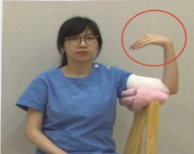

## Post-Mastectomy Stage 2 Rehabilitation Exercises

Indications: Week 2 after mastectomy (after removal of drainage tubes) to 4–6 weeks post-surgery

Video

Instruction

Objectives:  
1. For patients who have undergone mastectomy, achieve pre-surgical range of motion by week 4 post-surgery.  
2. For patients who have undergone breast reconstruction, achieve pre-surgical range of motion by week 6 post-surgery.

Exercises:  
1. Continue lifting the affected limb.  

2. Movements of the distal limb on the surgical side:  
- Hold for 5 seconds, then relax  
- Repeat 10 times  
- Perform at least 5 sessions per day  
Remember to move slowly and carefully  

1. Alternate clenched fist and open hand movements  

2. Alternate wrist movements

### 3. Alternate elbow movements  

3. Gradually increase the range of motion of the surgical-side shoulder joint to pre-surgical levels:  

Warm-up exercises  

- Hold for 5 seconds, then relax  
- Repeat 10 times  
- Perform at least 5 sessions per day  

1. Shoulder abduction  

### 2. Shoulder internal rotation  

### 3. Forward rotation  

### 4. Backward rotation  

1. Wall climbing exercise (front)

Shoulder exercises

2. Wall climbing exercise (side)

3. Internal adduction stretch

4. Itch-scratching exercise

5. Chest expansion exercise

Relaxation exercises

1. Shoulder elevation

Reminder:

2. Shoulder depression

3. Forward rotation

4. Backward rotation

(1) You may begin light self-care activities such as combing your hair, etc., involving movements above shoulder level.

(2) Avoid swelling on the surgical side: avoid excessive use of movements on the surgical side (e.g., lifting heavy objects).

Do not wear any clothing that restricts the arm or trunk.

Keep bath water at a moderate temperature.

Maintain skin cleanliness and wear long sleeves and long pants to reduce the risk of insect bites.

(3) If you experience restricted movement, swelling, or any other issues, please seek assistance from a rehabilitation physician!

| Contact Information |  |  | Download Educational Sheet |
|---------------------|---|---|-----------------------------|
| Yida Hospital: Address: No. 1, Yida Road, Jiaoshu Village, Yancheng District, Kaohsiung City; Phone: 07-6150011#2330 | Yida Cancer Treatment Hospital: Address: No. 21, Yida Road, Jiaoshu Village, Yancheng District, Kaohsiung City; Phone: 07-6150022#2340 | Yida Dachang Hospital: Address: No. 305, Dachang Road, Sancheng District, Kaohsiung City; Phone: 07-5599123#7531 |  |