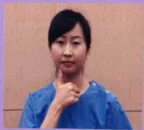
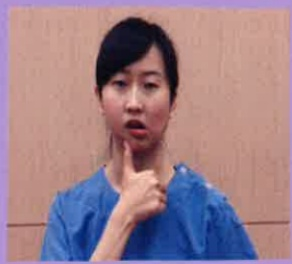
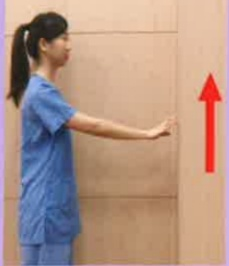

## Postoperative Rehabilitation Exercises for Head and Neck Tumors – Oral and Neck Exercises

One. Purpose of Exercises: After surgery, perform exercises according to the recovery status of the wound, following the guidance of the physician and physical therapist.

Two. Exercise Prescription: Perform 3–5 times daily, with each exercise repeated 20 times, holding the end position for 5–10 seconds.

Three. Precautions:

1. Exercises should be performed gently and without pain, avoiding tissue injury.

2. Avoid excessive stretching or exercise when the wound has not fully healed or when pain is present.

Video

Instruction

## One. Oral Exercises

<table border=1 style='margin: auto; width: max-content;'>
<tr>
<td style='text-align: center;'> (1) Forward neck movement</td>
<td style='text-align: center;'> (2) Left and right neck movement</td>
<td style='text-align: center;'> (3) Lip pressing exercise</td>
</tr>
<tr>
<td style='text-align: center;'></td>
<td style='text-align: center;'></td>
<td style='text-align: center;'></td>
</tr>
<tr>
<td style='text-align: center;'></td>
<td style='text-align: center;'></td>
<td style='text-align: center;'>● For individuals with difficulty closing their lips, protrude the mouth and maintain a whistling mouth shape for 5–10 seconds ● For individuals who can close their lips, inhale and puff out the cheeks on both sides</td>
</tr>
</table>

## Two. Neck Stretching Exercises

Three, Neck Lateral Bending and Shoulder Joint Movements

| (1) Neck Lateral Bending Movement | (2) Shrugging Movement | (3) Shoulder Circles Movement |
|-----------------------------------|-------------------------|-------------------------------|
|  |  |   |
| (1) Shoulder Internal Rotation Movement | (2) Finger Wall Crawl Movement (Side View) | (3) Finger Wall Crawl Movement (Side View) |
|  |  |  |
|  |  |  |

## References:

1. Pérez IMM, et al. Exercise-based rehabilitation on functionality and quality of life in head and neck cancer survivors. A systematic review and meta-analysis. Sci Rep. 2023 May 26;13(1):8523.

|  |  |  |
|---|---|---|
| Contact Information |  |  |
| Yida Hospital Address: No. 1, Yida Road, Jiaoshu Village, Yancheng District, Kaohsiung City. Phone: 07-6150011 | Yida Cancer Treatment Hospital Address: No. 21, Yida Road, Jiaoshu Village, Yancheng District, Kaohsiung City. Phone: 07-6150022 | Yida Dachang Hospital Address: No. 305, Dachang Road, Sanyin District, Kaohsiung City. Phone: 07-5599123 |